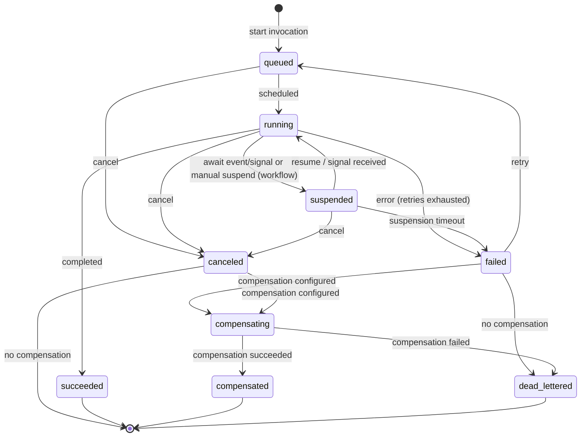
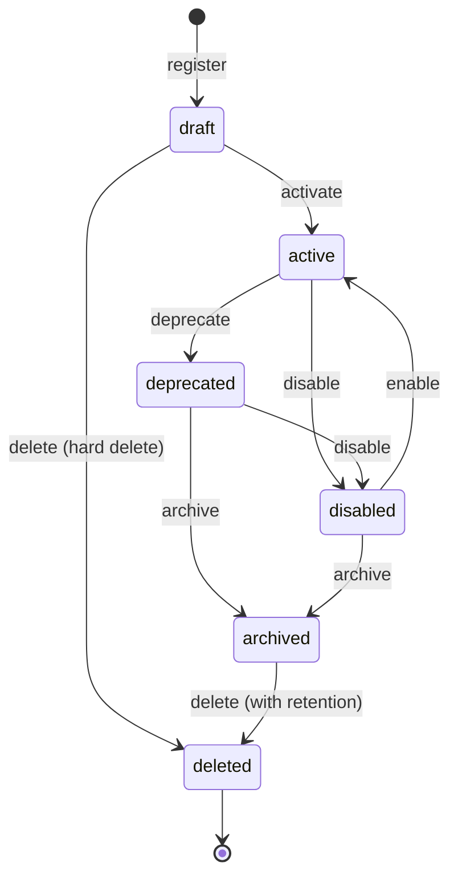

# Technical Design — Serverless Runtime

<!--
=============================================================================
TECHNICAL DESIGN DOCUMENT
=============================================================================
PURPOSE: Define HOW the system is built — architecture, components, APIs,
data models, and technical decisions that realize the requirements.

DESIGN IS PRIMARY: DESIGN defines the "what" (architecture and behavior).
ADRs record the "why" (rationale and trade-offs) for selected design
decisions; ADRs are not a parallel spec, it's a traceability artifact.

SCOPE:
  ✓ Architecture overview and vision
  ✓ Design principles and constraints
  ✓ Component model and interactions
  ✓ API contracts and interfaces
  ✓ Data models and database schemas
  ✓ Technology stack choices

NOT IN THIS DOCUMENT (see other templates):
  ✗ Requirements → PRD.md
  ✗ Detailed rationale for decisions → ADR/
  ✗ Step-by-step implementation flows → features/

STANDARDS ALIGNMENT:
  - IEEE 1016-2009 (Software Design Description)
  - IEEE 42010 (Architecture Description — viewpoints, views, concerns)
  - ISO/IEC 15288 / 12207 (Architecture & Design Definition processes)

ARCHITECTURE VIEWS (per IEEE 42010):
  - Context view: system boundaries and external actors
  - Functional view: components and their responsibilities
  - Information view: data models and flows
  - Deployment view: infrastructure topology

DESIGN LANGUAGE:
  - Be specific and clear; no fluff, bloat, or emoji
  - Reference PRD requirements using `cpt-cf-serverless-runtime-fr-{slug}`, `cpt-cf-serverless-runtime-nfr-{slug}`, and `cpt-cf-serverless-runtime-usecase-{slug}` IDs
  - Reference ADR documents using `cpt-cf-serverless-runtime-adr-{slug}` IDs
=============================================================================
-->

## 1. Architecture Overview

### 1.1 Architectural Vision

The Serverless Runtime module provides a stable, implementation-agnostic domain model and API contract for runtime creation, registration, and invocation of functions and workflows. Functions and workflows are unified as **functions** — registered definitions that can be invoked via the runtime API. This unification enables a single invocation surface, consistent response shapes, and shared lifecycle management regardless of the underlying execution technology.

The architecture is designed to support multiple implementation technologies (Temporal, Starlark, cloud-native FaaS) through a pluggable adapter model. Each adapter registers itself as a GTS type and implements the abstract `ServerlessRuntime` trait. The platform validates adapter-specific limits, traits, and implementation payloads against the adapter's registered schemas, ensuring type safety without coupling the core model to any specific runtime.

The domain model uses the Global Type System (GTS) for identity, schema validation, and type inheritance. All entities carry GTS identifiers, enabling schema-first validation, version resolution, and consistent cross-module references. Security context propagation, tenant isolation, and governance are built into the API contract layer, ensuring that every operation is scoped, auditable, and policy-compliant.

### 1.2 Architecture Drivers

Requirements that significantly influence architecture decisions.

#### Functional Drivers

| PRD Requirement | Design Response |
|-------------|-----------------|
| `cpt-cf-serverless-runtime-fr-tenant-registry` (BR-002) | `OwnerRef` schema with `owner_type` determining default access scope (user/tenant/system) |
| `cpt-cf-serverless-runtime-fr-execution-lifecycle` (BR-005, BR-012, BR-028) | Base `Limits` schema with adapter-derived extensions; tenant quota enforcement |
| `cpt-cf-serverless-runtime-fr-trigger-schedule` (BR-007) | Schedule, Event Trigger, and Webhook Trigger entities with dedicated APIs |
| `cpt-cf-serverless-runtime-fr-execution-engine` (BR-009) | `WorkflowTraits` with configurable checkpointing strategy and suspension limits |
| `cpt-cf-serverless-runtime-fr-runtime-authoring` (BR-011) | `ValidationError` schema with per-issue location and suggested corrections |
| `cpt-cf-serverless-runtime-fr-execution-lifecycle` (BR-014), `cpt-cf-serverless-runtime-fr-execution-visibility` (BR-015) | `InvocationStatus` state machine with full transition table and timeline events |
| `cpt-cf-serverless-runtime-fr-execution-lifecycle` (BR-019) | `RetryPolicy` schema with exponential backoff and non-retryable error overrides |
| `cpt-cf-serverless-runtime-fr-tenant-registry` (BR-020), `cpt-cf-serverless-runtime-nfr-resource-governance` (BR-106), `cpt-cf-serverless-runtime-nfr-retention` (BR-107) | `TenantRuntimePolicy` with quotas, retention, allowed runtimes, and approval policies |
| `cpt-cf-serverless-runtime-nfr-ops-traceability` (BR-021), `cpt-cf-serverless-runtime-nfr-security` (BR-034) | `InvocationRecord` with correlation ID, trace ID, and tenant context |
| `cpt-cf-serverless-runtime-fr-trigger-schedule` (BR-022) | `Schedule` entity with cron/interval expressions, missed policies, and concurrency control |
| `cpt-cf-serverless-runtime-fr-execution-lifecycle` (BR-027) | Dead letter queue configuration on triggers; `dead_lettered` invocation status |
| `cpt-cf-serverless-runtime-fr-execution-lifecycle` (BR-029) | In-flight executions pinned to exact function version at start time |
| `cpt-cf-serverless-runtime-fr-runtime-authoring` (BR-032), `cpt-cf-serverless-runtime-fr-input-security` (BR-037) | `IOSchema` with JSON Schema or GTS reference validation before invocation |
| `cpt-cf-serverless-runtime-fr-runtime-capabilities` (BR-035) | `adapter_ref` implementation kind for adapter-provided definitions |
| `cpt-cf-serverless-runtime-fr-debugging` (BR-103) | Dry-run invocation mode with synthetic response and no side effects |
| `cpt-cf-serverless-runtime-nfr-performance` (BR-118, BR-132) | Response caching policy with TTL, idempotency key, and owner-scoped cache keys |
| `cpt-cf-serverless-runtime-fr-governance-sharing` (BR-123) | Extended sharing beyond default visibility via access control integration |
| `cpt-cf-serverless-runtime-fr-debugging` (BR-129) | Standardized error types with GTS-identified derived errors and RFC 9457 responses |
| `cpt-cf-serverless-runtime-fr-debugging` (BR-130) | `InvocationTimelineEvent` for debugging, auditing, and execution visualization |
| `cpt-cf-serverless-runtime-fr-advanced-patterns` (BR-133) | Two-layer compensation model: function-level (platform) and step-level (executor) |
| `cpt-cf-serverless-runtime-fr-advanced-patterns` (BR-134) | `Idempotency-Key` header with configurable tenant deduplication window |
| `cpt-cf-serverless-runtime-fr-replay-visualization` (BR-124, BR-125) | `InvocationRecord` replay from recorded history; timeline visualization of workflow structure and execution path |
| `cpt-cf-serverless-runtime-fr-advanced-deployment` (BR-201, BR-202, BR-203, BR-204, BR-205) | Import/export of definitions; execution time travel; A/B testing and canary release via function versioning and traffic splitting; long-term archival via `TenantRuntimePolicy` retention settings |
| `cpt-cf-serverless-runtime-fr-deployment-safety` (BR-121) | Blue-green deployment via function version pinning and controlled traffic routing between active versions |

#### NFR Allocation

| NFR ID | NFR Summary | Allocated To | Design Response | Verification Approach |
|--------|-------------|--------------|-----------------|----------------------|
| `cpt-cf-serverless-runtime-nfr-tenant-isolation` | Tenant isolation | All components | Tenant-scoped queries, isolated execution environments, secret isolation | Integration tests with multi-tenant scenarios |
| `cpt-cf-serverless-runtime-nfr-observability` | Observability | InvocationRecord, Timeline API | Correlation IDs, trace IDs, execution metrics, timeline events | Verify trace propagation in integration tests |
| `cpt-cf-serverless-runtime-nfr-resource-governance` | Pluggability | Executor, Adapter model | Abstract `ServerlessRuntime` trait; adapter-derived GTS types for limits | Adapter conformance test suite |
| `cpt-cf-serverless-runtime-nfr-reliability` | State consistency, availability ≥99.95%, RTO ≤30s, RPO ≤1min | Invocation Engine, Executor, State Machine | `InvocationStatus` state machine with atomic transitions; `RetryPolicy` with compensation; version-pinned executions; durable snapshots for workflow resume | Chaos tests for state consistency; availability monitoring; recovery time measurement |
| `cpt-cf-serverless-runtime-nfr-composition-deps` | Dependency management between functions/workflows | Registry, Invocation Engine | Function definitions reference dependencies via GTS type IDs; registry validates dependency availability at publish time | Dependency resolution integration tests |
| `cpt-cf-serverless-runtime-nfr-scalability` | ≥10K concurrent executions, ≥1K starts/sec, ≥1K tenants | All components | Stateless API layer; tenant-partitioned persistence; adapter-level horizontal scaling; per-tenant quota enforcement via `TenantRuntimePolicy` | Load tests against scalability targets |

#### Key ADRs

| ADR ID | Decision Summary |
|--------|-----------------|
| `cpt-cf-serverless-runtime-adr-callable-type-hierarchy` | Unified callable type hierarchy: Function as base type, Workflow as derived specialization |

### 1.3 Architecture Layers

| Layer | Responsibility | Technology |
|-------|---------------|------------|
| API | REST endpoints for function management, invocation, scheduling, triggers, tenant policy, observability | REST / JSON, RFC 9457 Problem Details |
| Domain | Core entities, state machines, validation rules, GTS type resolution | Rust, GTS type system |
| Runtime | Pluggable execution adapters, invocation engine, scheduler, event processing | Rust async traits, adapter plugins |
| Infrastructure | Persistence, caching, event broker integration, secret management | TBD per deployment |

## 2. Principles & Constraints

### 2.1 Design Principles

#### Implementation-Agnostic Runtime

- [ ] `p1` - **ID**: `cpt-cf-serverless-runtime-principle-impl-agnostic`

The domain model and API contracts are intentionally decoupled from any specific runtime technology. The same function definitions, invocation APIs, and lifecycle management work identically whether the underlying executor is Starlark, Temporal, WASM, or a cloud-native FaaS provider. This enables technology selection to be deferred to deployment time and allows multiple executors to coexist within the same platform instance.

#### GTS-Based Identity

- [ ] `p1` - **ID**: `cpt-cf-serverless-runtime-principle-gts-identity`

All domain entities use Global Type System (GTS) identifiers following the [GTS specification](https://github.com/globaltypesystem/gts-spec). GTS provides hierarchical type inheritance, schema-first validation, and stable cross-module references. Entity identity is the GTS instance address, not an internal database key, ensuring that types are portable and self-describing.

#### Unified Function Model

- [ ] `p1` - **ID**: `cpt-cf-serverless-runtime-principle-unified-function`

Functions and workflows are unified under a single **function** abstraction. Both share the same definition schema, the same registration and lifecycle APIs, and the same invocation surface. The distinction is expressed via GTS type inheritance (function vs. workflow base types) and behavioral traits (workflow-specific compensation, checkpointing, suspension). This eliminates the split-product complexity seen in public cloud platforms.

#### Pluggable Adapter Architecture

- [ ] `p1` - **ID**: `cpt-cf-serverless-runtime-principle-pluggable-adapters`

Execution adapters are pluggable native modules that implement the abstract `ServerlessRuntime` trait. Each adapter registers its own GTS type and may extend the base schemas (e.g., adapter-specific limits). The platform validates adapter-specific fields at registration time by deriving the adapter's schema from the `implementation.adapter` field. This enables new execution technologies to be added without modifying the core domain model.

### 2.2 Constraints

#### No Runtime Technology Selection

- [ ] `p2` - **ID**: `cpt-cf-serverless-runtime-constraint-no-runtime-selection`

This design intentionally does not select a specific runtime technology. The choice of executor (Starlark, Temporal, cloud FaaS, etc.) is deferred to implementation and deployment.

#### No Workflow DSL Specification

- [ ] `p2` - **ID**: `cpt-cf-serverless-runtime-constraint-no-workflow-dsl`

Workflow DSL syntax details are implementation-specific and defined per executor. This design specifies the workflow traits and lifecycle but not the authoring language.

#### No UI/UX Definition

- [ ] `p2` - **ID**: `cpt-cf-serverless-runtime-constraint-no-ui-ux`

UI/UX for authoring or debugging workflows is out of scope for this design document.

## 3. Technical Architecture

### 3.1 Domain Model

**Technology**: GTS (Global Type System), JSON Schema, Rust structs

**Location**: Domain model is defined inline in this document. Rust types are intended for SDK and core runtime crates.

#### Entity Summary

| Entity | GTS Type ID | Description |
|--------|-------------|-------------|
| Function | `gts.x.core.serverless.function.v1~` | Base callable — stateless, short-lived function or workflow base type |
| Workflow | `gts.x.core.serverless.function.v1~x.core.serverless.workflow.v1~` | Durable, multi-step orchestration extending Function |
| InvocationRecord | `gts.x.core.serverless.invocation.v1~` | Tracks lifecycle of a single execution |
| Schedule | `gts.x.core.serverless.schedule.v1~` | Recurring trigger for a function |
| Trigger | `gts.x.core.serverless.trigger.v1~` | Event-driven invocation binding |
| Webhook Trigger | `gts.x.core.serverless.webhook_trigger.v1~` | HTTP endpoint trigger for external systems |
| TenantRuntimePolicy | `gts.x.core.serverless.tenant_policy.v1~` | Tenant-level governance settings |

#### Supporting Types

| GTS Type | Description |
|----------|-------------|
| `gts.x.core.serverless.owner_ref.v1~` | Ownership reference with visibility semantics |
| `gts.x.core.serverless.io_schema.v1~` | Input/output contract (GTS ref, schema, void) |
| `gts.x.core.serverless.limits.v1~` | Base limits (adapters derive specific types) |
| `gts.x.core.serverless.rate_limit.v1~` | Rate limiting configuration (plugin-based) |
| `gts.x.core.serverless.retry_policy.v1~` | Retry behavior configuration |
| `gts.x.core.serverless.implementation.v1~` | Code, spec, or adapter reference |
| `gts.x.core.serverless.workflow_traits.v1~` | Workflow-specific execution traits |
| `gts.x.core.serverless.compensation_context.v1~` | Input envelope passed to compensation functions |
| `gts.x.core.serverless.status.v1~` | Invocation status (derived types per state) |
| `gts.x.core.serverless.err.v1~` | Error types (derived types per error kind) |
| `gts.x.core.serverless.timeline_event.v1~` | Invocation timeline event for execution history |

#### Executor

An executor is a native module that executes functions and/or workflows. The pluggable executor architecture allows any native module to adapt the generic function and workflow mechanisms for a specific language or declaration format (e.g., a Starlark executor and a Serverless Workflow executor). Executors must support basic function execution and may support additional workflow features as relevant.

#### Functions

Functions and workflows are unified as **functions** — registered definitions that can be invoked via the runtime API.
They are distinguished via GTS type inheritance:

| Function Type | Description |
|-----------------|-------------|
| gts.x.core.serverless.function.v1~ | Base function type (any callable) |
| gts.x.core.serverless.function.v1~x.core.serverless.workflow.v1~ | Workflow type (extends function) |
| gts.x.core.serverless.function.v1~vendor.app.my_func.v1~ | Custom function |
| gts.x.core.serverless.function.v1~x.core.serverless.workflow.v1~vendor.app.my_workflow.v1~ | Custom workflow |

##### Invocation modes

- **sync** — caller waits for completion and receives the result in the response. Best for short runs.
- **async** — caller receives an `invocation_id` immediately and polls for status/results later.

---

#### OwnerRef

**GTS ID:** `gts.x.core.serverless.owner_ref.v1~`

Defines ownership and default visibility for a function. Per PRD BR-002, the `owner_type` determines
the default access scope:

- `user` — private to the owning user by default
- `tenant` — visible to authorized users within the tenant
- `system` — platform-provided, managed by the system

Extended sharing beyond default visibility is managed through access control integration (PRD BR-123).

> Schema: [`gts.x.core.serverless.owner_ref.v1~`](DESIGN_GTS_SCHEMAS.md#ownerref)

#### IOSchema

**GTS ID:** `gts.x.core.serverless.io_schema.v1~`

Defines the input/output contract for a function. Per PRD BR-032 and BR-037, inputs and outputs
are validated before invocation.

Each of `params` and `returns` accepts:

- **Inline JSON Schema** — any valid JSON Schema object
- **GTS reference** — `{ "$ref": "gts://gts.x.some.type.v1~" }` for reusable types
- **Void** — `null` or absent indicates no input/output

> Schema: [`gts.x.core.serverless.io_schema.v1~`](DESIGN_GTS_SCHEMAS.md#ioschema)

#### Limits

**GTS ID:** `gts.x.core.serverless.limits.v1~`

Base resource limits schema. Per PRD BR-005, BR-012, and BR-028, the runtime enforces limits to
prevent resource exhaustion and runaway executions.

The base schema defines only universal limits. Adapters register derived GTS types
with adapter-specific fields. The runtime validates limits against the adapter's schema based
on the `implementation.adapter` field.

##### Base fields

- `timeout_seconds` — maximum execution duration before termination (BR-028)
- `max_concurrent` — maximum concurrent invocations of this function (BR-012)

> Schema: [`gts.x.core.serverless.limits.v1~`](DESIGN_GTS_SCHEMAS.md#limits-base)

##### Adapter-Derived Limits (Examples)

Adapters register their own GTS types extending the base:

| GTS Type | Adapter | Additional Fields |
|----------|---------|-------------------|
| `gts.x.core.serverless.limits.v1~x.core.serverless.adapter.starlark.limits.v1~` | Starlark | `memory_mb`, `cpu` |
| `gts.x.core.serverless.limits.v1~x.core.serverless.adapter.lambda.limits.v1~` | AWS Lambda | `memory_mb`, `ephemeral_storage_mb` |
| `gts.x.core.serverless.limits.v1~x.core.serverless.adapter.temporal.limits.v1~` | Temporal | (worker-based, no per-execution limits) |

##### Example: Starlark Adapter Limits

> Schema: [`gts.x.core.serverless.limits.v1~x.core.serverless.adapter.starlark.limits.v1~`](DESIGN_GTS_SCHEMAS.md#starlark-adapter-limits)

##### Example: Lambda Adapter Limits

> Schema: [`gts.x.core.serverless.limits.v1~x.core.serverless.adapter.lambda.limits.v1~`](DESIGN_GTS_SCHEMAS.md#lambda-adapter-limits)

#### RetryPolicy

**GTS ID:** `gts.x.core.serverless.retry_policy.v1~`

Configures retry behavior for failed invocations. Per PRD BR-019, supports exponential backoff
with configurable limits:

- `max_attempts` — total attempts including the initial invocation (0 = no retries)
- `initial_delay_ms` — delay before the first retry
- `max_delay_ms` — maximum delay between retries
- `backoff_multiplier` — multiplier applied to delay after each retry
- `non_retryable_errors` — GTS error type IDs that must never be retried, regardless of their
  `RuntimeErrorCategory`

##### Retry Precedence

The runtime evaluates whether a failed invocation should be retried by combining two inputs:
the error's `category` field (from `RuntimeErrorCategory` in the `RuntimeErrorPayload` struct)
and the `non_retryable_errors` list in this `RetryPolicy` schema.

An invocation is retried **only when all** of the following conditions hold:

1. `max_attempts` has not been exhausted.
2. The error's `RuntimeErrorCategory` is `Retryable`.
3. The error's GTS type ID is **not** present in `RetryPolicy.non_retryable_errors`.

`non_retryable_errors` takes precedence over the error category: even if an error carries
`RuntimeErrorCategory::Retryable`, listing its GTS type ID in `non_retryable_errors` opts it
out of retries. This allows function authors to suppress retries for specific error types
(e.g., a retryable upstream timeout that is known to be unrecoverable in a particular context)
without changing the error's category at the source.

Errors with any other `RuntimeErrorCategory` (`NonRetryable`, `ResourceLimit`, `Timeout`,
`Canceled`) are never retried, irrespective of their presence in `non_retryable_errors`.

> Schema: [`gts.x.core.serverless.retry_policy.v1~`](DESIGN_GTS_SCHEMAS.md#retrypolicy)

#### RateLimit

**GTS ID:** `gts.x.core.serverless.rate_limit.v1~`

Configures rate limiting for a function. Rate limiting is implemented as a **plugin** — the
platform provides a default rate limiter, but operators can register custom rate limiter
implementations via the plugin system with their own configuration schemas.

##### Scope and Isolation

Rate limits are enforced **per-function per-owner**:

- **Isolated across tenants** — tenant A's traffic never counts toward tenant B's limits.
- **Applies to both sync and async invocation modes** — the limit is checked at invocation
  acceptance time, before the request is queued or dispatched.

##### Base Schema

The base rate limit type is an empty marker — it carries no fields. It exists solely as the GTS
root for the rate-limiting type family. Each rate limiter plugin registers a derived GTS type that
defines the strategy-specific configuration schema.

The function's `rate_limit` field uses a `strategy` + `config` structure to reference a rate
limiter: `strategy` is the GTS type ID of the plugin, `config` is an opaque object validated by
that plugin. This structure is defined inline in the function schema, not in the base type.

> Schema: [`gts.x.core.serverless.rate_limit.v1~`](DESIGN_GTS_SCHEMAS.md#ratelimit-base)

##### Plugin-Derived Config Schemas

Each rate limiter plugin registers a derived GTS type that defines the schema for the `config`
object in the function's `rate_limit` field:

| `strategy` GTS Type | Strategy | `config` Fields |
|----------------------|----------|-----------------|
| `...rate_limit.token_bucket.v1~` | Token bucket (system default) | `max_requests_per_second`, `max_requests_per_minute`, `burst_size` |
| `...rate_limit.sliding_window.v1~` | Sliding window (example) | `window_size_seconds`, `max_requests_per_window` |

##### Default: Token Bucket Rate Limiter

The system-provided rate limiter uses the **token bucket** algorithm. Both per-second and per-minute
limits are enforced independently — an invocation must pass both limits to be accepted.

- `max_requests_per_second` — sustained per-second rate. `0` means no per-second limit.
- `max_requests_per_minute` — sustained per-minute rate. `0` means no per-minute limit.
- `burst_size` — maximum instantaneous burst allowed by the per-second bucket. Permits short
  traffic spikes up to `burst_size` requests before the per-second rate takes effect. Does not
  apply to the per-minute limit.

If both `max_requests_per_second` and `max_requests_per_minute` are `0`, rate limiting is disabled
for this function.

###### Config Schema

> Schema: [`gts.x.core.serverless.rate_limit.v1~x.core.serverless.rate_limit.token_bucket.v1~`](DESIGN_GTS_SCHEMAS.md#token-bucket-rate-limit-config)

##### Instance Example (Token Bucket)

```json
{
  "strategy": "gts.x.core.serverless.rate_limit.v1~x.core.serverless.rate_limit.token_bucket.v1~",
  "config": {
    "max_requests_per_second": 50,
    "max_requests_per_minute": 1000,
    "burst_size": 20
  }
}
```

##### Plugin Model

The rate limiter is registered as a plugin implementing the `RateLimiter` trait. Each plugin
handles exactly one strategy GTS type (1:1 mapping). The runtime resolves the plugin based on
`rate_limit.strategy`.

- The **default** system-provided plugin handles `token_bucket.v1~` and uses an in-process token
  bucket.
- Custom plugins may implement distributed rate limiting (e.g., Redis-backed), sliding window
  algorithms, or tenant-aware adaptive throttling — each with its own derived GTS configuration
  schema.
- The plugin receives `rate_limit.config` as opaque JSON (`serde_json::Value`) and is responsible
  for deserializing it into its own config type.

##### Validation

When registering a function with a `rate_limit` configuration, the runtime:

1. Reads `rate_limit.strategy` to identify the rate limiter plugin.
2. Looks up the registered `RateLimiter` plugin that handles that strategy GTS type.
3. Validates `rate_limit.config` against the plugin's config schema.
4. Rejects registration if no plugin handles the strategy or config validation fails.

##### Error Behavior

When an invocation is rejected due to rate limiting:

- The HTTP API returns **`429 Too Many Requests`** with a `Retry-After` header indicating when the
  caller may retry (in seconds).
- The response body is an RFC 9457 Problem Details JSON with error type
  `gts.x.core.serverless.err.v1~x.core.serverless.err.rate_limited.v1~`.
- The invocation is **not** created — no `InvocationRecord` is persisted and no retries are
  attempted by the runtime. The caller is responsible for respecting `Retry-After` and retrying.

##### Example: 429 Error Response

```http
HTTP/1.1 429 Too Many Requests
Content-Type: application/problem+json
Retry-After: 2
```

```json
{
  "type": "gts://gts.x.core.serverless.err.v1~x.core.serverless.err.rate_limited.v1~",
  "title": "Rate Limit Exceeded",
  "status": 429,
  "detail": "Function rate limit exceeded for tenant t_123. Retry after 2 seconds.",
  "instance": "/api/serverless-runtime/v1/invocations",
  "retry_after_seconds": 2
}
```

#### Implementation

**GTS ID:** `gts.x.core.serverless.implementation.v1~`

Defines how a function is implemented. The `adapter` field explicitly identifies the runtime
adapter, enabling validation of adapter-specific limits and traits.

##### Fields

- `adapter` — GTS type ID of the adapter (e.g., `gts.x.core.serverless.adapter.starlark.v1~`). Required for limits
  validation.
- `kind` — implementation kind: `code`, `workflow_spec`, or `adapter_ref`
- Kind-specific payload with implementation details

##### Kinds

- `code` — inline source code for embedded runtimes (Starlark, WASM, etc.)
- `workflow_spec` — declarative workflow definition (Serverless Workflow DSL, Temporal, etc.)
- `adapter_ref` — reference to an adapter-provided definition for hot-plug registration (PRD BR-035)

> Schema: [`gts.x.core.serverless.implementation.v1~`](DESIGN_GTS_SCHEMAS.md#implementation)

##### Validation Flow

1. Parse `implementation.adapter` to get the adapter GTS type (e.g., `gts.x.core.serverless.adapter.starlark.v1~`)
2. Derive the adapter's limits schema: `gts.x.core.serverless.limits.v1~x.core.serverless.adapter.starlark.limits.v1~`
3. Validate `traits.limits` against the derived limits schema
4. Reject function if limits contain fields not supported by the adapter

#### WorkflowTraits

**GTS ID:** `gts.x.core.serverless.workflow_traits.v1~`

Workflow-specific execution traits required for durable orchestrations. Includes:

- `compensation` — saga pattern support (PRD BR-133): function references for compensation on failure/cancel
- `checkpointing` — durability strategy: `automatic`, `manual`, or `disabled` (PRD BR-009)
- `max_suspension_days` — maximum time a workflow can remain suspended waiting for events (PRD BR-009)

##### Compensation Design — Two-Layer Model

The Serverless Runtime supports two complementary layers of compensation:

- **Function-level compensation** (defined here) — platform-managed, universal across all executors. The workflow author defines a separate function invoked by the platform when the workflow fails or is canceled. This is the coarse-grained fallback that any executor can rely on.
- **Step-level compensation** — executor-specific, fine-grained. For example, an executor may support per-step compensation functions (e.g., `step(name, fn, compensate_fn)`) executed in reverse order on failure. Specific step-level APIs are defined by each adapter's documentation.

If step-level compensation handles the failure, the function-level handler is not invoked. Function-level compensation serves as a safety net for executors that do not support step-level compensation or when step-level compensation is not configured.

##### Function-Level Compensation

Since all possible runtimes cannot generically implement compensation logic (e.g., "compensate all completed steps")
compensation handlers are explicit function references. The workflow author defines a separate function or workflow
that implements the compensation logic:

- `on_failure` — GTS ID of function to invoke when workflow fails, or `null` for no compensation
- `on_cancel` — GTS ID of function to invoke when workflow is canceled, or `null` for no compensation

The referenced compensation function is invoked as a standard function with a single JSON body
conforming to the `CompensationContext` schema (`gts.x.core.serverless.compensation_context.v1~`).
This context carries the original invocation identity, failure details, and a workflow state snapshot
so the handler has everything it needs to perform rollback operations. See the
[CompensationContext](#compensationcontext) section below for the full schema, field descriptions,
and usage examples.

> Schema: [`gts.x.core.serverless.workflow_traits.v1~`](DESIGN_GTS_SCHEMAS.md#workflowtraits)

#### CompensationContext

**GTS ID:** `gts.x.core.serverless.compensation_context.v1~`

Defines the input envelope passed to compensation functions referenced by
`traits.workflow.compensation.on_failure` and `traits.workflow.compensation.on_cancel`.

When the runtime transitions an invocation to the `compensating` status, it constructs a
`CompensationContext` and invokes the referenced compensation function through the standard
invocation flow, passing the context as the **single JSON body** (i.e., the `params` field of
the invocation request). The compensation function is a regular function — no special
runtime path is needed.

##### Design

The platform owns the envelope structure and guarantees the required fields are always present.
The `workflow_state_snapshot` is populated by the adapter from its own checkpoint format and is
opaque to the platform. This split keeps the contract explicit for handler authors while
allowing adapters full flexibility in their state representation.

##### Required Fields

| Field | Type | Required | Description |
|-------|------|----------|-------------|
| `trigger` | string | Yes | What caused compensation: `"failure"` or `"cancellation"`. Maps to `on_failure` or `on_cancel`. |
| `original_workflow_invocation_id` | string | Yes | Invocation ID of the workflow run being compensated. Primary correlation key. |
| `failed_step_id` | string | Yes | Identifier of the step that failed or was active at cancellation time. Adapter-specific granularity. Set to `"unknown"` when the adapter does not track step-level state. |
| `failed_step_error` | object | No | Error details for the failed step. Present when `trigger` is `"failure"`. |
| `workflow_state_snapshot` | object | Yes | Last checkpointed workflow state. Empty object `{}` if failure occurred before the first checkpoint. |
| `timestamp` | string | Yes | ISO 8601 timestamp of when compensation was triggered. |
| `invocation_metadata` | object | Yes | Metadata from the original invocation: function ID, original input, tenant, observability IDs. |

##### GTS Schema

> Schema: [`gts.x.core.serverless.compensation_context.v1~`](DESIGN_GTS_SCHEMAS.md#compensationcontext)

##### Example Payload

An order-processing workflow fails on step `create_shipping_label` after successfully completing
`reserve_inventory` and `charge_payment`. The runtime constructs the following `CompensationContext`
and invokes the `on_failure` function:

```json
{
  "trigger": "failure",
  "original_workflow_invocation_id": "inv_a1b2c3d4",
  "failed_step_id": "create_shipping_label",
  "failed_step_error": {
    "error_type": "runtime_error",
    "message": "Shipping provider returned 503: service unavailable",
    "error_metadata": { "retries_exhausted": true, "last_attempt": 5 }
  },
  "workflow_state_snapshot": {
    "reservation_id": "RSV-7712",
    "payment_transaction_id": "TXN-33401",
    "shipping_label": null,
    "completed_steps": [
      "reserve_inventory",
      "charge_payment"
    ]
  },
  "timestamp": "2026-02-08T10:00:47Z",
  "invocation_metadata": {
    "function_id": "gts.x.core.serverless.function.v1~x.core.serverless.workflow.v1~vendor.app.orders.process_order.v1~",
    "original_input": {
      "order_id": "ORD-9182",
      "items": [
        {
          "sku": "WIDGET-01",
          "qty": 3
        },
        {
          "sku": "GADGET-05",
          "qty": 1
        }
      ],
      "payment": {
        "method": "card",
        "token": "tok_abc123"
      }
    },
    "tenant_id": "t_123",
    "correlation_id": "corr_789",
    "started_at": "2026-02-08T10:00:00Z"
  }
}
```

##### How Compensation Handlers Use the Context

The compensation function receives the `CompensationContext` as its `params` input. Handler
authors should:

1. **Read `original_workflow_invocation_id`** to correlate compensation actions with the
   original workflow run. This is essential for idempotent rollback — the handler can check
   whether compensation for this invocation has already been performed.

2. **Read `failed_step_id`** to determine how far the workflow progressed. The handler
   iterates backward from the failed step through the `workflow_state_snapshot` to decide which
   forward actions need reversal. For example, if `failed_step_id` is `"create_shipping_label"`,
   the handler knows `reserve_inventory` and `charge_payment` completed and need rollback.

3. **Read `workflow_state_snapshot`** to obtain the forward-step outputs required for
   reversal (e.g., `reservation_id` to release inventory, `payment_transaction_id` to issue a
   refund).

4. **Inspect `failed_step_error`** (when `trigger` is `"failure"`) to adjust compensation
   strategy — e.g., a timeout error may warrant different handling than a validation error.

5. **Use `invocation_metadata.original_input`** when the original request parameters are
   needed for rollback (e.g., re-reading the order details to construct a cancellation notice).

##### Registration Validation

When registering or updating a workflow with `traits.workflow.compensation.on_failure` or `on_cancel`:

1. The referenced function **must** exist and be in `active` status.
2. The referenced function's `schema.params` **must** accept `CompensationContext`
   (`$ref: "gts://gts.x.core.serverless.compensation_context.v1~"` or a compatible superset).
3. The platform rejects registration if either condition is not met.

#### InvocationStatus

**GTS ID:** `gts.x.core.serverless.status.v1~`

Invocation lifecycle states. Each state is a derived GTS type extending the base status type.
Per PRD BR-015 and BR-014, invocations transition through these states during their lifecycle.

##### GTS Schema

> Schema: [`gts.x.core.serverless.status.v1~`](DESIGN_GTS_SCHEMAS.md#invocationstatus)

##### Derived Status Types

| GTS Type | Description |
|----------|-------------|
| `gts.x.core.serverless.status.v1~x.core.serverless.status.queued.v1~` | Waiting to be scheduled |
| `gts.x.core.serverless.status.v1~x.core.serverless.status.running.v1~` | Currently executing |
| `gts.x.core.serverless.status.v1~x.core.serverless.status.suspended.v1~` | Paused, waiting for event or signal |
| `gts.x.core.serverless.status.v1~x.core.serverless.status.succeeded.v1~` | Completed successfully |
| `gts.x.core.serverless.status.v1~x.core.serverless.status.failed.v1~` | Failed after retries exhausted |
| `gts.x.core.serverless.status.v1~x.core.serverless.status.canceled.v1~` | Canceled by user or system |
| `gts.x.core.serverless.status.v1~x.core.serverless.status.compensating.v1~` | Running compensation logic |
| `gts.x.core.serverless.status.v1~x.core.serverless.status.compensated.v1~` | Compensation completed successfully (rollback done) |
| `gts.x.core.serverless.status.v1~x.core.serverless.status.dead_lettered.v1~` | Moved to dead letter queue (BR-027) |

##### Invocation Status State Machine



**Note on `replay`:** The `replay` control action creates a **new** invocation (new `invocation_id`, starts at
`queued`) using the same parameters as the original. It does not transition the original invocation's state.
Replay is valid from `succeeded` or `failed` terminal states.

##### Allowed Transitions

| From | To | Trigger |
|------|-----|---------|
| (start) | queued | `start_invocation` API call |
| queued | running | Scheduler picks up invocation |
| queued | canceled | `control_invocation(Cancel)` before start |
| running | succeeded | Execution completes successfully |
| running | failed | Execution fails after retry exhaustion |
| running | suspended | Workflow awaits event/signal or `control_invocation(Suspend)` (workflow only) |
| running | canceled | `control_invocation(Cancel)` during run |
| suspended | running | `control_invocation(Resume)` or signal |
| suspended | canceled | `control_invocation(Cancel)` while suspended |
| suspended | failed | Suspension timeout exceeded |
| failed | queued | `control_invocation(Retry)` — re-queues with same params |
| failed | compensating | Compensation handler configured |
| failed | dead_lettered | No compensation, moved to DLQ |
| canceled | compensating | Compensation handler configured |
| compensating | compensated | Compensation completed successfully |
| compensating | dead_lettered | Compensation failed, moved to DLQ |

#### Error

**GTS ID:** `gts.x.core.serverless.err.v1~`

Standardized error types for invocation failures. Per PRD BR-129, errors include a stable identifier,
human-readable message, and structured details.

##### GTS Schema

> Schema: [`gts.x.core.serverless.err.v1~`](DESIGN_GTS_SCHEMAS.md#error)

##### Derived Error Types

| GTS Type | HTTP | Description |
|----------|------|-------------|
| `gts.x.core.serverless.err.v1~x.core.serverless.err.validation.v1~` | 422 | Input or definition validation failure |
| `gts.x.core.serverless.err.v1~x.core.serverless.err.rate_limited.v1~` | 429 | Per-function rate limit exceeded |
| `gts.x.core.serverless.err.v1~x.core.serverless.err.not_found.v1~` | 404 | Referenced entity does not exist |
| `gts.x.core.serverless.err.v1~x.core.serverless.err.not_active.v1~` | 409 | Function exists but is not in active state |
| `gts.x.core.serverless.err.v1~x.core.serverless.err.quota_exceeded.v1~` | 429 | Tenant quota capacity reached |
| `gts.x.core.serverless.err.v1~x.core.serverless.err.runtime_timeout.v1~` | 504 | Execution exceeded its configured timeout |
| `gts.x.core.serverless.err.v1~x.core.serverless.err.sync_suspension.v1~` | 409 | Workflow reached a suspension point during synchronous invocation |

#### ValidationError

**GTS ID:** `gts.x.core.serverless.err.v1~x.core.serverless.err.validation.v1~`

Validation error for definition and input validation failures. Per PRD BR-011, validation errors
include the location in the definition and suggested corrections. Returned only when validation fails;
success returns the validated definition. A single validation error can contain multiple issues,
each with its own error type and location.

##### GTS Schema

> Schema: [`gts.x.core.serverless.err.v1~x.core.serverless.err.validation.v1~`](DESIGN_GTS_SCHEMAS.md#validationerror)

#### InvocationTimelineEvent

**GTS ID:** `gts.x.core.serverless.timeline_event.v1~`

Represents a single event in the invocation execution timeline. Used for debugging, auditing,
and execution history visualization per PRD BR-015 and BR-130.

##### GTS Schema

> Schema: [`gts.x.core.serverless.timeline_event.v1~`](DESIGN_GTS_SCHEMAS.md#invocationtimelineevent)

#### Function (Base Type)

**GTS ID:** `gts.x.core.serverless.function.v1~`

The base function schema defines common fields for all callable entities (functions and workflows). Functions are the default — stateless, short-lived callables designed for request/response invocation:

- Stateless with respect to the runtime (durable state lives externally)
- Typically short-lived and bounded by platform timeout limits
- Commonly used as building blocks for APIs, event handlers, and single-step jobs
- Authors are encouraged to design for idempotency when side effects are possible
- Wait states are supported via execution suspension and later resumption, triggered by events, timers, or API callbacks; for functions this is an advanced capability available only for asynchronous execution
- Functions may have a long-running **streaming** mode where information is streamed to/from a client or another service; these are a category of asynchronous execution and receive an `invocation_id` that enables checkpointing and restart via durable streams

Workflows extend this base type with additional traits (compensation, checkpointing, suspension) — see the [Workflow](#workflow) section.

##### Function Status State Machine



- **`archived`** = soft-delete: the function is no longer callable but remains queryable for historical reference and audit.
- **`deleted`** = hard-delete: the function is removed after a configurable retention period (`retention_until`). During the retention window it may still appear in audit queries but is not restorable.

##### Allowed Transitions

| From | To | Action | Description |
|------|-----|--------|-------------|
| (start) | draft | register | New function registered |
| draft | active | activate | Function ready for invocation |
| draft | deleted | delete | Hard delete (only in draft status, immediate) |
| active | deprecated | deprecate | Mark as deprecated (still callable, discouraged) |
| active | disabled | disable | Disable invocation (not callable) |
| deprecated | disabled | disable | Disable deprecated function |
| deprecated | archived | archive | Archive for historical reference |
| disabled | active | enable | Re-enable for invocation |
| disabled | archived | archive | Archive disabled function |
| archived | deleted | delete | Hard-delete with configurable retention (`retention_until`) |

##### Status Behavior

| Status | Callable | Editable | Visible in Registry | Notes |
|--------|----------|----------|---------------------|-------|
| draft | No | Yes | Yes | Work in progress |
| active | Yes | No | Yes | Production-ready, immutable |
| deprecated | Yes | No | Yes | Callable but discouraged |
| disabled | No | No | Yes | Temporarily unavailable |
| archived | No | No | Optional | Historical reference, soft-deleted |
| deleted | No | No | Audit only | Gone after retention period, retained for audit only |

##### Versioning Model

Functions follow semantic versioning aligned with GTS conventions:

- **Major version** (v1, v2, ...): Breaking changes to `params`, `returns`, or `errors` schemas
- **Minor version** (v1.1, v1.2, ...): Backward-compatible changes (implementation updates, new optional fields)

**Version Resolution:**
- Invocations specify at least the major version
- If only the major version is specified, the runtime resolves to the latest active minor version
- In-flight executions are pinned to the exact version at start time (BR-029)

**Example:**
```
gts.x.core.serverless.function.v1~vendor.app.billing.calculate_tax.v2~      # Latest v2.x
gts.x.core.serverless.function.v1~vendor.app.billing.calculate_tax.v2.3~    # Exact v2.3
```

##### GTS Schema

> Schema: [`gts.x.core.serverless.function.v1~`](DESIGN_GTS_SCHEMAS.md#function-base-type)

##### Instance Example (Function)

GTS Address: `gts.x.core.serverless.function.v1~vendor.app.billing.calculate_tax.v1~`

```json
{
  "version": "1.0.0",
  "tenant_id": "t_123",
  "owner": {
    "owner_type": "user",
    "id": "u_456",
    "tenant_id": "t_123"
  },
  "status": "active",
  "tags": [
    "billing",
    "tax"
  ],
  "title": "Calculate Tax",
  "description": "Calculate tax for invoice.",
  "schema": {
    "params": {
      "type": "object",
      "properties": {
        "invoice_id": {
          "type": "string"
        },
        "amount": {
          "type": "number"
        }
      },
      "required": [
        "invoice_id",
        "amount"
      ]
    },
    "returns": {
      "type": "object",
      "properties": {
        "tax": {
          "type": "number"
        },
        "total": {
          "type": "number"
        }
      }
    },
    "errors": [
      "gts.x.core.serverless.err.v1~x.core.serverless.err.validation.v1~"
    ]
  },
  "traits": {
    "invocation": {
      "supported": [
        "sync",
        "async"
      ],
      "default": "async"
    },
    "is_idempotent": true,
    "caching": {
      "max_age_seconds": 0
    },
    "rate_limit": {
      "strategy": "gts.x.core.serverless.rate_limit.v1~x.core.serverless.rate_limit.token_bucket.v1~",
      "config": {
        "max_requests_per_second": 50,
        "max_requests_per_minute": 1000,
        "burst_size": 20
      }
    },
    "limits": {
      "timeout_seconds": 30,
      "memory_mb": 128,
      "cpu": 0.2,
      "max_concurrent": 100
    },
    "retry": {
      "max_attempts": 3,
      "initial_delay_ms": 200,
      "max_delay_ms": 10000,
      "backoff_multiplier": 2.0
    }
  },
  "implementation": {
    "adapter": "gts.x.core.serverless.adapter.starlark.v1~",
    "kind": "code",
    "code": {
      "language": "starlark",
      "source": "def main(ctx, input):\n  return {\"tax\": input.amount * 0.1, \"total\": input.amount * 1.1}\n"
    }
  },
  "created_at": "2026-01-01T00:00:00.000Z",
  "updated_at": "2026-01-01T00:00:00.000Z"
}
```

#### Workflow

**GTS ID:** `gts.x.core.serverless.function.v1~x.core.serverless.workflow.v1~`

Workflows are durable, multi-step orchestrations that coordinate actions over time:

- Persisted invocation state (durable progress across restarts)
- Supports long-running behavior (timers, waiting on external events, human-in-the-loop)
- Encodes orchestration logic (fan-out/fan-in, branching, retries, compensation)
- Steps are typically function calls but may also invoke other workflows (sub-orchestration)
- Waiting for events, timers, or callbacks is implemented via suspension and trigger registration

The runtime is responsible for:

- Step identification and retry scheduling
- Compensation orchestration
- Checkpointing and suspend/resume
- Event subscription and event-driven continuation

The common Serverless Runtime provides reusable mechanisms such as an HTTP client with built-in retry mechanisms, registering triggers, subscribing to and emitting events, publishing statuses and checkpoints. The executor for a specific language is responsible for exposing these capabilities in an appropriate way.

##### Functions vs. Workflows

The function/workflow distinction is **structural**, not modal: a workflow is a function whose definition includes `workflow_traits` (compensation, checkpointing, event waiting). Execution mode (sync vs async) is orthogonal to type — both functions and workflows can be invoked in either mode. See [ADR — Function as Base Callable Type](ADR/0001-cpt-cf-serverless-runtime-adr-callable-type-hierarchy.md) for the full rationale.

Functions and workflows share the same definition schema and the same implementation language constructs. The distinguishing characteristics of a workflow are:

- **Durable state**: checkpointing and suspend/resume across restarts
- **Compensation**: registered rollback handlers for saga-style recovery
- **Event waiting**: suspension until an external event, timer, or callback arrives

A function that does not declare `workflow_traits` has none of these capabilities. A function that declares `workflow_traits` is a workflow regardless of how it is invoked.

**Sync invocation of a workflow:** durable execution semantics (checkpointing, compensation registration) add overhead that provides no client benefit in a synchronous request — the client holds an open connection and has no handle to reconnect to a resumed execution if the request times out. Therefore, when a workflow is invoked synchronously, the runtime MUST apply one of these two behaviors:

1. **Execute without durable overhead** — if the workflow can complete within the sync timeout without requiring suspension or event waiting, the runtime executes it as a plain function call. Checkpointing is skipped (not silently — the invocation record explicitly notes `mode: sync`), and the result is returned directly. This is appropriate for short-lived workflows where durability adds cost without value.
2. **Reject the request** — if the workflow requires capabilities that are incompatible with synchronous execution (suspension, event waiting, long-running steps that exceed the sync timeout), the runtime MUST return an explicit error directing the client to use asynchronous invocation. The runtime MUST NOT silently degrade behavior.

A workflow's `workflow_traits` SHOULD declare whether it is async-only. Workflows that require suspension or event waiting MUST be marked async-only and will be rejected on sync invocation. Workflows that do not require these capabilities may be invoked in either mode. If a workflow does not declare async-only but reaches a suspension point during synchronous execution, the runtime MUST fail the request with error type `gts.x.core.serverless.err.v1~x.core.serverless.err.sync_suspension.v1~` (409) rather than blocking indefinitely or silently dropping the suspension.

**Short-timeout guidance:** synchronous operations should have short timeouts. Clients requiring long-running or durable execution should use asynchronous invocation (jobs), which returns an invocation ID that can be used to poll status, receive callbacks, or reconnect to a resumed execution.

##### GTS Schema

> Schema: [`gts.x.core.serverless.function.v1~x.core.serverless.workflow.v1~`](DESIGN_GTS_SCHEMAS.md#workflow)

##### Instance Example

GTS Address: `gts.x.core.serverless.function.v1~x.core.serverless.workflow.v1~vendor.app.orders.process_order.v1~`

```json
{
  "version": "1.0.0",
  "tenant_id": "t_123",
  "owner": {
    "owner_type": "tenant",
    "id": "t_123",
    "tenant_id": "t_123"
  },
  "status": "active",
  "tags": [
    "orders",
    "processing"
  ],
  "title": "Process Order Workflow",
  "description": "Multi-step order processing with payment and fulfillment.",
  "schema": {
    "params": {
      "type": "object",
      "properties": {
        "order_id": {
          "type": "string"
        },
        "customer_id": {
          "type": "string"
        }
      },
      "required": [
        "order_id",
        "customer_id"
      ]
    },
    "returns": {
      "type": "object",
      "properties": {
        "status": {
          "type": "string"
        },
        "tracking_id": {
          "type": "string"
        }
      }
    },
    "errors": []
  },
  "traits": {
    "invocation": {
      "supported": [
        "async"
      ],
      "default": "async"
    },
    "is_idempotent": false,
    "caching": {
      "max_age_seconds": 0
    },
    "limits": {
      "timeout_seconds": 86400,
      "memory_mb": 256,
      "cpu": 0.5,
      "max_concurrent": 50
    },
    "retry": {
      "max_attempts": 5,
      "initial_delay_ms": 1000,
      "max_delay_ms": 60000,
      "backoff_multiplier": 2.0
    },
    "workflow": {
      "compensation": {
        "on_failure": "gts.x.core.serverless.function.v1~vendor.app.orders.rollback_order.v1~",
        "on_cancel": null
      },
      "checkpointing": {
        "strategy": "automatic"
      },
      "max_suspension_days": 30
    }
  },
  "implementation": {
    "adapter": "gts.x.core.serverless.adapter.starlark.v1~",
    "kind": "code",
    "code": {
      "language": "starlark",
      "source": "def main(ctx, input):\n  # workflow steps...\n  return {\"status\": \"completed\"}\n"
    }
  },
  "created_at": "2026-01-01T00:00:00.000Z",
  "updated_at": "2026-01-01T00:00:00.000Z"
}
```

#### InvocationRecord

**GTS ID:** `gts.x.core.serverless.invocation.v1~`

An invocation record tracks the lifecycle of a single function execution, including status, parameters,
results, timing, and observability data. Per PRD BR-015, BR-021, and BR-034, invocations are queryable
with tenant and correlation identifiers for traceability.

##### GTS Schema

> Schema: [`gts.x.core.serverless.invocation.v1~`](DESIGN_GTS_SCHEMAS.md#invocationrecord)

##### Instance Example

```json
{
  "invocation_id": "inv_abc",
  "function_id": "gts.x.core.serverless.function.v1~vendor.app.namespace.calculate_tax.v1~",
  "function_version": "1.0.0",
  "tenant_id": "t_123",
  "status": "running",
  "mode": "async",
  "params": {
    "invoice_id": "inv_001",
    "amount": 100.0
  },
  "result": null,
  "error": null,
  "timestamps": {
    "created_at": "2026-01-01T00:00:00.000Z",
    "started_at": "2026-01-01T00:00:00.010Z",
    "suspended_at": null,
    "finished_at": null
  },
  "observability": {
    "correlation_id": "corr_789",
    "trace_id": "trace_123",
    "span_id": "span_456",
    "metrics": {
      "duration_ms": null,
      "billed_duration_ms": null,
      "cpu_time_ms": null,
      "memory_limit_mb": 128,
      "max_memory_used_mb": null,
      "step_count": null
    }
  }
}
```

#### Schedule

**GTS ID:** `gts.x.core.serverless.schedule.v1~`

A schedule defines a recurring trigger for a function based on cron expressions or intervals.
Per PRD BR-007 and BR-022, schedules support lifecycle management and configurable missed schedule policies.

##### GTS Schema

> Schema: [`gts.x.core.serverless.schedule.v1~`](DESIGN_GTS_SCHEMAS.md#schedule)

##### Instance Example

```json
{
  "schedule_id": "sch_001",
  "tenant_id": "t_123",
  "function_id": "gts.x.core.serverless.function.v1~vendor.app.billing.calculate_tax.v1~",
  "name": "Daily Tax Calculation",
  "timezone": "UTC",
  "expression": {
    "kind": "cron",
    "value": "0 * * * *"
  },
  "input_overrides": {
    "region": "EU"
  },
  "missed_policy": "skip",
  "max_catch_up_runs": 1,
  "execution_context": "system",
  "concurrency_policy": "allow",
  "enabled": true,
  "next_run_at": "2026-01-01T01:00:00.000Z",
  "last_run_at": "2026-01-01T00:00:00.000Z",
  "created_at": "2026-01-01T00:00:00.000Z",
  "updated_at": "2026-01-01T00:00:00.000Z"
}
```

##### Cron Expression Format

Schedules use standard cron expressions:

```
+-------------------  minute (0-59)
| +---------------  hour (0-23)
| | +-----------  day of month (1-31)
| | | +-------  month (1-12 or JAN-DEC)
| | | | +---  day of week (0-6 or SUN-SAT)
| | | | |
* * * * *
```

**Examples:**

| Expression | Description |
|------------|-------------|
| `0 2 * * *` | Every day at 2:00 AM |
| `*/15 * * * *` | Every 15 minutes |
| `0 9 * * MON-FRI` | Weekdays at 9:00 AM |
| `0 0 1 * *` | First day of every month at midnight |
| `0 */4 * * *` | Every 4 hours |

##### Concurrency Policies

| Policy | Behavior |
|--------|----------|
| `allow` | Start new execution even if previous is running |
| `forbid` | Skip this scheduled run if previous is still running |
| `replace` | Cancel previous execution and start new one |

##### Missed Schedule Handling

When the scheduler is unavailable (maintenance, outage), schedules may be missed.

| Policy | Behavior |
|--------|----------|
| `skip` | Ignore missed schedules; resume from next scheduled time |
| `catch_up` | Execute once to catch up, then resume normal schedule |
| `backfill` | Execute each missed instance individually up to `max_catch_up_runs` limit |

**Example:** A daily schedule at 2 AM with `backfill` policy and `max_catch_up_runs: 3`:
- If scheduler is down for 5 days, only 3 catch-up executions occur
- Executions run sequentially with a brief delay between each

#### Trigger

**GTS ID:** `gts.x.core.serverless.trigger.v1~`

A trigger binds an event type to a function, enabling event-driven invocation.
Per PRD BR-007, triggers are one of three supported trigger mechanisms (schedule, API, event).

##### GTS Schema

> Schema: [`gts.x.core.serverless.trigger.v1~`](DESIGN_GTS_SCHEMAS.md#trigger)

##### Instance Example

```json
{
  "trigger_id": "trg_001",
  "tenant_id": "t_123",
  "event_type_id": "gts.x.core.events.event.v1~vendor.app.orders.approved.v1~",
  "event_filter_query": "payload.order_id != null",
  "function_id": "gts.x.core.serverless.function.v1~x.core.serverless.workflow.v1~vendor.app.orders.process_approval.v1~",
  "dead_letter_queue": {
    "enabled": true,
    "retry_policy": {
      "max_attempts": 3,
      "initial_delay_ms": 1000,
      "max_delay_ms": 30000,
      "backoff_multiplier": 2.0
    },
    "dlq_topic": null
  },
  "batch": {
    "enabled": false
  },
  "execution_context": "system",
  "enabled": true,
  "created_at": "2026-01-01T00:00:00.000Z",
  "updated_at": "2026-01-01T00:00:00.000Z"
}
```

##### Event Filter Syntax

Trigger filters use a subset of CEL (Common Expression Language):

```
# Match orders over $100
payload.total > 100

# Match specific customer
payload.customer_id == "cust_123"

# Match orders from specific region
payload.shipping.region in ["US-CA", "US-NY"]

# Compound conditions
payload.total > 100 && payload.priority == "high"
```

##### Event Batching

For high-volume events, batching groups multiple events into a single function invocation:

```json
{
  "batch": {
    "enabled": true,
    "max_size": 100,
    "max_wait_ms": 5000
  }
}
```

When batching is enabled, the function receives an array of events in `input.events` instead of a single event.

##### Connection Status

Triggers report connection status for operational monitoring:

```json
{
  "trigger_id": "order-placed-handler",
  "enabled": true,
  "connection_status": "degraded",
  "connection_details": {
    "event_broker": "disconnected",
    "last_connected_at": "2026-01-27T09:55:00.000Z",
    "reconnect_attempts": 3,
    "next_reconnect_at": "2026-01-27T10:05:00.000Z"
  }
}
```

| Status | Description |
|--------|-------------|
| `active` | Fully operational |
| `degraded` | Partial connectivity issues |
| `disconnected` | Cannot receive events/webhooks |
| `paused` | Manually paused by user |

When an external dependency is disconnected:
1. **New executions rejected:** Trigger returns an error for new invocations
2. **In-flight executions:** Allowed to complete or fail gracefully
3. **Reconnection:** Automatic retry with exponential backoff

#### Webhook Trigger

**GTS ID:** `gts.x.core.serverless.webhook_trigger.v1~`

Webhook triggers expose HTTP endpoints that external systems can call to trigger function executions.

##### Webhook Schema

> Schema: [`gts.x.core.serverless.webhook_trigger.v1~`](DESIGN_GTS_SCHEMAS.md#webhook-trigger)

##### Webhook Authentication Types

| Type | Description |
|------|-------------|
| `none` | No authentication (not recommended) |
| `hmac_sha256` | HMAC-SHA256 signature verification |
| `hmac_sha1` | HMAC-SHA1 signature verification (legacy) |
| `basic` | HTTP Basic authentication |
| `bearer` | Bearer token authentication |
| `api_key` | API key in header or query parameter |

#### TenantRuntimePolicy

**GTS ID:** `gts.x.core.serverless.tenant_policy.v1~`

Tenant-level governance settings including quotas, retention policies, and defaults.
Per PRD BR-020, BR-106, and BR-107, tenants are provisioned with isolation and governance settings.

##### GTS Schema

> Schema: [`gts.x.core.serverless.tenant_policy.v1~`](DESIGN_GTS_SCHEMAS.md#tenantruntimepolicy)

##### Instance Example

```json
{
  "tenant_id": "t_123",
  "enabled": true,
  "quotas": {
    "max_concurrent_executions": 200,
    "max_definitions": 500,
    "max_schedules": 50,
    "max_triggers": 100,
    "max_execution_history_mb": 10240,
    "max_memory_per_execution_mb": 512,
    "max_cpu_per_execution": 2.0,
    "max_execution_duration_seconds": 86400
  },
  "retention": {
    "execution_history_days": 7,
    "audit_log_days": 90
  },
  "policies": {
    "allowed_runtimes": [
      "gts.x.core.serverless.adapter.starlark.v1~",
      "gts.x.core.serverless.adapter.temporal.v1~"
    ],
    "require_approval_for_publish": false,
    "allowed_outbound_domains": ["*.example.com", "api.stripe.com"]
  },
  "idempotency": {
    "deduplication_window_seconds": 86400
  },
  "defaults": {
    "timeout_seconds": 30,
    "memory_mb": 128,
    "cpu": 0.2
  },
  "created_at": "2026-01-01T00:00:00.000Z",
  "updated_at": "2026-01-01T00:00:00.000Z"
}
```

#### Rust Domain Types and Runtime Traits

The complete Rust type definitions and abstract `ServerlessRuntime` trait interface for this
domain model have been extracted to a companion file for readability. The companion file contains
all core domain types, enums, error types, the async `ServerlessRuntime` trait with full CRUD
operations for functions, invocations, schedules, triggers, and tenant policies, plus supporting
filter/patch types. These types are transport-agnostic and intended for SDK or core runtime crates;
adapters (Temporal, Starlark, cloud FaaS) implement the `ServerlessRuntime` trait.

See **[DESIGN_RUST_TYPES.md](./DESIGN_RUST_TYPES.md)** for the full Rust source.

| Type / Trait | Kind | Purpose |
|---|---|---|
| `FunctionDefinition` | struct | Core function/workflow definition with schema, traits, implementation, and owner |
| `InvocationRecord` | struct | Immutable record of a single function invocation with status, result, and observability |
| `Schedule` | struct | Cron/interval schedule binding a function to time-based execution |
| `Trigger` | struct | Event-driven trigger binding a GTS event type to a function with optional batching and DLQ |
| `TenantRuntimePolicy` | struct | Per-tenant quotas, retention, allowed runtimes, and default limits |
| `ServerlessRuntime` | trait | Abstract async interface for all runtime operations (register, invoke, schedule, trigger, policy) |
| `RuntimeErrorPayload` | struct | Structured error with GTS error type ID, category, message, and details |

### 3.2 Component Model

The Serverless Runtime is composed of the following logical components. Each component has a defined responsibility scope and interacts with other components through the domain model types defined in section 3.1.

#### Function Registry

- [ ] `p1` - **ID**: `cpt-cf-serverless-runtime-component-function-registry`

##### Why this component exists

Manages the lifecycle of function definitions (functions and workflows), including registration, validation, versioning, and status transitions.

##### Responsibility scope

- CRUD operations for function definitions
- GTS schema validation and adapter-specific validation
- Function status state machine enforcement (draft -> active -> deprecated -> disabled -> archived -> deleted)
- Version management (major/minor, resolution to latest active minor)
- Code scanning and policy checks at registration time

##### Responsibility boundaries

- Does NOT execute function code -- that is the Invocation Engine's responsibility
- Does NOT manage schedules or triggers -- those are separate components
- Does NOT enforce rate limits -- that is handled at invocation time

#### Invocation Engine

- [ ] `p1` - **ID**: `cpt-cf-serverless-runtime-component-invocation-engine`

##### Why this component exists

Handles the invocation lifecycle: accepting invocation requests, dispatching to executors, managing status transitions, and returning results.

##### Responsibility scope

- Invocation request validation (function exists, is callable, params match schema)
- Invocation mode handling (sync/async)
- Dry-run validation
- Response caching (cache lookup, cache population on success)
- Idempotency deduplication
- Rate limit enforcement (delegates to RateLimiter plugins)
- Invocation status state machine enforcement
- Control actions (cancel, suspend, resume, retry, replay)
- Retry orchestration with exponential backoff
- Compensation triggering (constructing CompensationContext, invoking compensation functions)

##### Responsibility boundaries

- Does NOT manage function definitions -- that is the Registry
- Does NOT execute code directly -- delegates to Executor adapters
- Does NOT manage schedules or triggers

#### Executor (Adapter)

- [ ] `p1` - **ID**: `cpt-cf-serverless-runtime-component-executor`

##### Why this component exists

Provides the pluggable execution backend. Each executor adapter implements the abstract `ServerlessRuntime` trait for a specific runtime technology.

##### Responsibility scope

- Code execution for a specific language/runtime (Starlark, WASM, Temporal, etc.)
- Adapter-specific validation (code syntax, forbidden builtins, resource analysis)
- Adapter-specific limits enforcement (memory, CPU, ephemeral storage)
- Step-level compensation (executor-specific, e.g., Starlark `r_step_v1`)
- Checkpointing and state persistence (adapter-specific format)
- Runtime helper exposure (HTTP client, event subscription, status reporting)

##### Responsibility boundaries

- Does NOT manage the invocation lifecycle -- that is the Invocation Engine
- Does NOT manage function definitions -- that is the Registry
- Does NOT handle cross-cutting concerns (rate limiting, tenant policy, audit)

#### Scheduler

- [ ] `p2` - **ID**: `cpt-cf-serverless-runtime-component-scheduler`

##### Why this component exists

Manages cron-based and interval-based recurring execution of functions.

##### Responsibility scope

- Schedule CRUD operations
- Cron expression evaluation and next-run computation
- Missed schedule detection and policy enforcement (skip, catch_up, backfill)
- Concurrency policy enforcement (allow, forbid, replace)
- Schedule run history tracking
- Manual trigger execution

##### Responsibility boundaries

- Does NOT execute functions directly -- creates invocations through the Invocation Engine
- Does NOT manage event-driven triggers

#### Event Trigger Engine

- [ ] `p2` - **ID**: `cpt-cf-serverless-runtime-component-event-trigger-engine`

##### Why this component exists

Manages event-driven invocation by binding event types to functions and processing incoming events.

##### Responsibility scope

- Event trigger CRUD operations
- Event filter evaluation (CEL subset)
- Event batching
- Dead letter queue management for failed event processing
- Connection status monitoring and reconnection
- Webhook trigger management (URL generation, authentication, IP allowlisting)

##### Responsibility boundaries

- Does NOT own the event broker -- integrates with an external EventBroker
- Does NOT execute functions directly -- creates invocations through the Invocation Engine

#### Tenant Policy Manager

- [ ] `p2` - **ID**: `cpt-cf-serverless-runtime-component-tenant-policy-manager`

##### Why this component exists

Manages tenant-level governance, quotas, and configuration for the serverless runtime.

##### Responsibility scope

- Tenant enablement/disablement
- Quota management and enforcement
- Retention policy configuration
- Runtime allowlist management
- Usage tracking and reporting
- Default limits for new functions

##### Responsibility boundaries

- Does NOT enforce quotas at invocation time directly -- provides quota data to the Invocation Engine
- Does NOT manage individual functions or schedules

### 3.3 API Contracts

**Technology**: REST / JSON
**Base URL**: `/api/serverless-runtime/v1`

All management APIs require authentication. Authorization is enforced based on tenant context, user context, and required permissions per operation.

Follows [DNA (Development Norms & Architecture)](https://github.com/hypernetix/DNA) guidelines.

#### Response Conventions

**Single Resource Response**

```json
{
  "id": "sch_001",
  "name": "Daily Tax Calculation",
  "status": "active",
  "created_at": "2026-01-20T10:30:15.123Z"
}
```

**List Response** (cursor-based pagination)

```json
{
  "items": [
    {
      "id": "inv_001",
      "status": "running"
    },
    {
      "id": "inv_002",
      "status": "succeeded"
    }
  ],
  "page_info": {
    "next_cursor": "eyJpZCI6Imludl8wMDIifQ",
    "prev_cursor": null,
    "has_more": true
  }
}
```

**Error Response** (RFC 9457 Problem Details)

Content-Type: `application/problem+json`

```json
{
  "type": "gts://gts.x.core.serverless.err.v1~x.core.serverless.err.validation.v1~",
  "title": "Validation Error",
  "status": 422,
  "detail": "Input validation failed for field 'params.amount'",
  "instance": "/api/serverless-runtime/v1/invocations",
  "code": "gts.x.core.serverless.err.v1~x.core.serverless.err.validation.v1~",
  "trace_id": "abc123",
  "errors": [
    {
      "path": "$.params.amount",
      "message": "Must be a positive number"
    }
  ]
}
```

**Pagination Parameters**

| Parameter | Default | Max | Description |
|-----------|---------|-----|-------------|
| `limit` | 25 | 200 | Items per page |
| `cursor` | -- | -- | Opaque cursor from `page_info` |

**Filtering** (OData-style `$filter`)

```text
GET /api/serverless-runtime/v1/invocations?$filter=status eq 'running' and created_at ge 2026-01-01T00:00:00.000Z
```

Operators: `eq`, `ne`, `lt`, `le`, `gt`, `ge`, `in`, `and`, `or`, `not`

**Sorting** (OData-style `$orderby`)

```text
GET /api/serverless-runtime/v1/invocations?$orderby=created_at desc,status asc
```

---

#### Function Registry API

Base URL: `/api/serverless-runtime/v1`

##### 1) Register Function (Create Draft)

`POST /functions`

Creates a new function in `draft` state.

**Request:**
```json
{
  "definition": {
    "$schema": "https://json-schema.org/draft/2020-12/schema",
    "$id": "gts://gts.x.core.serverless.function.v1~vendor.app.billing.calculate_tax.v1~",
    "allOf": [{"$ref": "gts://gts.x.core.serverless.function.v1~"}],
    "type": "object",
    "properties": {
      "id": {"const": "gts.x.core.serverless.function.v1~vendor.app.billing.calculate_tax.v1~"},
      "params": {"const": {"type": "object", "properties": {"invoice_total": {"type": "number"}, "region": {"type": "string"}}, "required": ["invoice_total", "region"]}},
      "returns": {"const": {"type": "object", "properties": {"tax": {"type": "number"}}, "required": ["tax"]}},
      "traits": {"type": "object", "properties": {"runtime": {"const": "starlark"}}},
      "implementation": {"type": "object", "properties": {"code": {"type": "object", "properties": {"language": {"const": "starlark"}, "source": {"const": "def main(ctx, input):\n  return {\"tax\": input.invoice_total * 0.0725}\n"}}}}}
    }
  },
  "scope": "tenant",
  "shared": false
}
```

| Field | Type | Required | Description |
|-------|------|----------|-------------|
| `definition` | object | Yes | The GTS-compliant function/workflow definition |
| `scope` | string | No | `"platform"`, `"tenant"`, or `"user"` (default: `"user"`). Maps to `owner.owner_type`: `"platform"` → `system`, `"tenant"` → `tenant`, `"user"` → `user`. |
| `shared` | boolean | No | If `true`, other users in the tenant can invoke this function (default: `false`). Extends the default visibility determined by `owner.owner_type` per the `OwnerRef` model (see BR-123). |

**Response:** `201 Created`
```json
{
  "function_id": "gts.x.core.serverless.function.v1~vendor.app.billing.calculate_tax.v1~",
  "status": "draft",
  "version": "v1",
  "scope": "tenant",
  "tenant_id": "tenant_abc",
  "owner_id": "user_123",
  "shared": false,
  "created_at": "2026-01-27T10:00:00.000Z",
  "updated_at": "2026-01-27T10:00:00.000Z",
  "validation": {"status": "pending"}
}
```

**Error Responses:**

`400 Bad Request` -- Invalid definition schema
```json
{
  "error": "validation_failed",
  "message": "Definition schema validation failed",
  "details": {"errors": [{"path": "$.properties.params", "message": "params schema is required"}]}
}
```

`409 Conflict` -- Function already exists
```json
{
  "error": "function_exists",
  "message": "A function with this ID already exists",
  "function_id": "gts.x.core.serverless.function.v1~vendor.app.billing.calculate_tax.v1~"
}
```

---

##### 2) Validate Function

`POST /functions/{id}:validate`

Validates a draft function without publishing. Performs JSON Schema validation, code syntax validation (parse AST), runtime helper usage validation, policy checks, and system-aware validation.

**Response:** `200 OK`
```json
{
  "function_id": "gts.x.core.serverless.function.v1~vendor.app.billing.calculate_tax.v1~",
  "valid": true,
  "warnings": [],
  "info": {
    "detected_features": ["sync_invocation", "http_client"],
    "estimated_memory_mb": 64,
    "uses_workflow_primitives": false
  }
}
```

`200 OK` -- Validation failed (not an HTTP error)
```json
{
  "function_id": "gts.x.core.serverless.function.v1~vendor.app.billing.calculate_tax.v1~",
  "valid": false,
  "errors": [
    {"code": "SYNTAX_ERROR", "message": "Starlark syntax error: unexpected token", "location": {"line": 5, "column": 12}, "source_snippet": "  return {\"tax\": input.invoice_total * }"},
    {"code": "FORBIDDEN_BUILTIN", "message": "Built-in 'exec' is not allowed", "location": {"line": 3, "column": 3}}
  ],
  "warnings": [{"code": "MISSING_TIMEOUT", "message": "HTTP call at line 7 has no explicit timeout; default (30s) will be used"}]
}
```

---

##### 3) Publish Function

`POST /functions/{id}:publish`

Validates and transitions a draft function to `active` state.

**Request (optional):**
```json
{"release_notes": "Initial release of tax calculation function"}
```

**Response:** `200 OK`
```json
{
  "function_id": "gts.x.core.serverless.function.v1~vendor.app.billing.calculate_tax.v1~",
  "status": "active",
  "version": "v1",
  "published_at": "2026-01-27T10:05:00.000Z",
  "release_notes": "Initial release of tax calculation function"
}
```

---

##### 4) Update Function (Create New Version)

`POST /functions/{id}:update`

Creates a new version of an existing function. The new version starts in `draft` state.

**Request:**
```json
{
  "definition": {"...updated definition..."},
  "version_bump": "minor"
}
```

| Field | Type | Required | Description |
|-------|------|----------|-------------|
| `definition` | object | Yes | The updated definition |
| `version_bump` | string | No | `"major"` or `"minor"` (default: auto-detect based on schema changes) |

**Response:** `201 Created`
```json
{
  "function_id": "gts.x.core.serverless.function.v1~vendor.app.billing.calculate_tax.v1.1~",
  "previous_version": "gts.x.core.serverless.function.v1~vendor.app.billing.calculate_tax.v1~",
  "status": "draft",
  "version": "v1.1",
  "version_bump": "minor",
  "created_at": "2026-01-27T11:00:00.000Z"
}
```

---

##### 5) Get Function

`GET /functions/{id}`

**Query Parameters:**

| Parameter | Type | Description |
|-----------|------|-------------|
| `include_source` | boolean | Include implementation source code (default: `false`) |
| `version` | string | Specific version to retrieve (default: latest) |

**Response:** `200 OK`
```json
{
  "function_id": "gts.x.core.serverless.function.v1~vendor.app.billing.calculate_tax.v1~",
  "status": "active",
  "version": "v1",
  "scope": "tenant",
  "tenant_id": "tenant_abc",
  "owner_id": "user_123",
  "shared": false,
  "created_at": "2026-01-27T10:00:00.000Z",
  "published_at": "2026-01-27T10:05:00.000Z",
  "traits_summary": {
    "runtime": "starlark",
    "invocation_modes": ["sync", "async"],
    "default_invocation": "sync",
    "is_idempotent": true,
    "caching_max_age_seconds": 60
  }
}
```

---

##### 6) List Functions

`GET /functions`

**Query Parameters:**

| Parameter | Type | Description |
|-----------|------|-------------|
| `scope` | string | Filter by scope: `"platform"`, `"tenant"`, `"user"`, `"all"` (default: `"all"`) |
| `status` | string | Filter by status (comma-separated): `"draft"`, `"active"`, `"disabled"`, `"deprecated"` |
| `runtime` | string | Filter by runtime: `"starlark"`, `"wasm"`, etc. |
| `tag` | string | Filter by tag (repeatable) |
| `search` | string | Search in title, description, and ID |
| `limit` | integer | Maximum results (default: 25, max: 100) |
| `cursor` | string | Pagination cursor |

**Response:** `200 OK`
```json
{
  "items": [
    {
      "function_id": "gts.x.core.serverless.function.v1~vendor.app.billing.calculate_tax.v1~",
      "title": "Calculate Tax",
      "status": "active",
      "version": "v1",
      "scope": "tenant",
      "runtime": "starlark",
      "invocation_modes": ["sync", "async"],
      "tags": ["billing", "tax"],
      "owner_id": "user_123",
      "published_at": "2026-01-27T10:05:00.000Z"
    }
  ],
  "page_info": {"next_cursor": "<opaque>", "limit": 25, "total_count": 42}
}
```

---

##### 7) List Function Versions

`GET /functions/{id}/versions`

Lists all versions of a function.

**Response:** `200 OK`
```json
{
  "function_id": "gts.x.core.serverless.function.v1~vendor.app.billing.calculate_tax",
  "versions": [
    {"version": "v1", "full_id": "gts.x.core.serverless.function.v1~vendor.app.billing.calculate_tax.v1~", "status": "deprecated", "published_at": "2026-01-01T10:00:00.000Z"},
    {"version": "v2", "full_id": "gts.x.core.serverless.function.v1~vendor.app.billing.calculate_tax.v2~", "status": "active", "published_at": "2026-01-15T10:00:00.000Z"},
    {"version": "v2.1", "full_id": "gts.x.core.serverless.function.v1~vendor.app.billing.calculate_tax.v2.1~", "status": "draft", "created_at": "2026-01-27T10:00:00.000Z"}
  ]
}
```

---

##### 8) Disable/Enable Function

`POST /functions/{id}:disable`
`POST /functions/{id}:enable`

**Response:** `200 OK`
```json
{
  "function_id": "gts.x.core.serverless.function.v1~vendor.app.billing.calculate_tax.v1~",
  "status": "disabled",
  "disabled_at": "2026-01-27T12:00:00.000Z",
  "disabled_by": "user_123"
}
```

---

##### 9) Deprecate Function

`POST /functions/{id}:deprecate`

**Request:**
```json
{
  "reason": "Replaced by v2 with improved tax calculation",
  "successor_id": "gts.x.core.serverless.function.v1~vendor.app.billing.calculate_tax.v2~",
  "sunset_date": "2026-03-01T00:00:00.000Z"
}
```

**Response:** `200 OK`
```json
{
  "function_id": "gts.x.core.serverless.function.v1~vendor.app.billing.calculate_tax.v1~",
  "status": "deprecated",
  "deprecated_at": "2026-01-27T12:00:00.000Z",
  "deprecation": {
    "reason": "Replaced by v2 with improved tax calculation",
    "successor_id": "gts.x.core.serverless.function.v1~vendor.app.billing.calculate_tax.v2~",
    "sunset_date": "2026-03-01T00:00:00.000Z"
  }
}
```

---

##### 10) Delete Function

`DELETE /functions/{id}`

Soft-deletes a function. Retained for audit purposes.

**Query Parameters:**

| Parameter | Type | Description |
|-----------|------|-------------|
| `force` | boolean | Delete even if there are in-flight executions (default: `false`) |

**Response:** `200 OK`
```json
{
  "function_id": "gts.x.core.serverless.function.v1~vendor.app.billing.calculate_tax.v1~",
  "status": "deleted",
  "deleted_at": "2026-01-27T12:00:00.000Z",
  "deleted_by": "user_123",
  "retention_until": "2026-04-27T12:00:00.000Z"
}
```

`409 Conflict` -- In-flight executions exist
```json
{
  "error": "in_flight_executions",
  "message": "Cannot delete: 3 executions are currently in progress",
  "execution_count": 3,
  "hint": "Use ?force=true to delete anyway, or wait for executions to complete"
}
```

---

#### Invocation API

| Method | Endpoint | Description |
|--------|----------|-------------|
| `POST` | `/api/serverless-runtime/v1/invocations` | Start invocation |
| `GET` | `/api/serverless-runtime/v1/invocations` | List invocations |
| `GET` | `/api/serverless-runtime/v1/invocations/{invocation_id}` | Get status |
| `POST` | `/api/serverless-runtime/v1/invocations/{invocation_id}:control` | Control invocation lifecycle |

##### Invocation Control Actions

The `:control` endpoint accepts a JSON body with `action` field:

```json
{
  "action": "cancel"
}
```

Valid actions and state requirements:

| Action | Description | Valid From States |
|--------|-------------|-------------------|
| `cancel` | Cancel a running or queued invocation | `queued`, `running` |
| `suspend` | Suspend a running workflow | `running` (workflow only) |
| `resume` | Resume a suspended invocation | `suspended` |
| `retry` | Retry a failed invocation with same parameters | `failed` |
| `replay` | Create new invocation from completed one's params | `succeeded`, `failed` |

##### Start Invocation Request

```json
{
  "function_id": "gts.x.core.serverless.function.v1~...",
  "mode": "async",
  "params": {
    "invoice_id": "inv_001",
    "amount": 100.0
  },
  "dry_run": false
}
```

- `dry_run`: When `true`, validates invocation readiness without executing. See [Dry-Run Behavior](#dry-run-behavior) below.
- `Idempotency-Key` header prevents duplicate starts. Retention is configurable per tenant via `TenantRuntimePolicy.idempotency.deduplication_window_seconds` (default: 24 hours, per BR-134).
- When the `Idempotency-Key` header is present and the function enables response caching (`traits.is_idempotent: true` and `traits.caching.max_age_seconds > 0`), the runtime may return a cached successful result instead of re-executing. See [Response Caching](#response-caching).

##### Dry-Run Behavior

When `dry_run: true`, the `POST /invocations` endpoint performs **validation only** and returns
a synthetic `InvocationResult` without producing any durable state or side effects (BR-103).

**Validations Performed**

The following checks run in order; the first failure short-circuits and returns an
RFC 9457 Problem Details response (`application/problem+json`):

1. **Function exists** -- resolve `function_id` to an `FunctionDefinition`. Return `404 Not Found` with error type `gts.x.core.serverless.err.v1~x.core.serverless.err.not_found.v1~` if missing.
2. **Function is callable** -- verify `status` is `active` or `deprecated`. Return `409 Conflict` with error type `gts.x.core.serverless.err.v1~x.core.serverless.err.not_active.v1~` if the function is in `draft`, `disabled`, or `archived` state.
3. **Input params match schema** -- validate `params` against `function.schema.params` JSON Schema. Return `422 Unprocessable Entity` with error type `gts.x.core.serverless.err.v1~x.core.serverless.err.validation.v1~` and per-field `errors` array on mismatch.
4. **Tenant quota** -- verify the tenant has not exhausted `max_concurrent_executions` from `TenantQuotas`. Return `429 Too Many Requests` with error type `gts.x.core.serverless.err.v1~x.core.serverless.err.quota_exceeded.v1~` if at capacity.

**What Dry-Run Does NOT Do**

- Does **not** create an `InvocationRecord` in the persistence layer.
- Does **not** execute any user code (function body or workflow steps).
- Does **not** consume quota -- the check is read-only.
- Does **not** count against per-function rate limits.
- Does **not** generate observability traces or billing events.
- Does **not** evaluate or enforce the `Idempotency-Key` header.

**Successful Response**

On validation success the endpoint returns `200 OK` (not `201 Created`) with the same `InvocationResult` structure. The embedded `InvocationRecord` is **synthetic**:

| Field | Value |
|-------|-------|
| `invocation_id` | Synthetic, prefixed `dryrun_` (e.g. `dryrun_a1b2c3d4-...`). Not queryable via GET. |
| `function_id` | Echoed from request. |
| `function_version` | Current version of the resolved function. |
| `tenant_id` | Caller's tenant from `SecurityContext`. |
| `status` | `queued` -- indicates validation passed and the invocation *would* be queued. |
| `mode` | Echoed from request. |
| `params` | Echoed from request. |
| `result` | `null` |
| `error` | `null` |
| `timestamps` | `created_at` set to current time; all others `null`. |
| `observability` | `correlation_id` generated; `trace_id`, `span_id`, metrics all `null`/zero. |

The `InvocationResult.dry_run` flag is set to `true` so callers can programmatically distinguish synthetic results from real invocations.

**Error Response**

Validation failures return an RFC 9457 Problem Details body (`application/problem+json`) with the `type` set to the GTS error URI, an appropriate HTTP status code (see table above), and a human-readable `detail` message. For schema validation failures (`422`), the `errors` array contains per-field violations. The error shape is identical to a normal invocation error -- no special dry-run error format exists.

**Example: Dry-Run Success Response (200 OK)**

```json
{
  "record": {
    "invocation_id": "dryrun_a1b2c3d4-e5f6-7890-abcd-ef1234567890",
    "function_id": "gts.x.core.serverless.function.v1~vendor.app.namespace.calculate_tax.v1~",
    "function_version": "1.0.0",
    "tenant_id": "t_123",
    "status": "queued",
    "mode": "async",
    "params": {
      "invoice_id": "inv_001",
      "amount": 100.0
    },
    "result": null,
    "error": null,
    "timestamps": {
      "created_at": "2026-01-21T10:00:00.000Z",
      "started_at": null,
      "suspended_at": null,
      "finished_at": null
    },
    "observability": {
      "correlation_id": "corr_dry_xyz",
      "trace_id": null,
      "span_id": null,
      "metrics": {
        "duration_ms": null,
        "billed_duration_ms": null,
        "cpu_time_ms": null,
        "memory_limit_mb": 256,
        "max_memory_used_mb": null,
        "step_count": null
      }
    }
  },
  "dry_run": true,
  "cached": false
}
```

##### Response Caching

Response caching allows the runtime to return a previously computed successful result for an
function invocation without re-executing the function (BR-118, BR-132). This reduces
redundant processing for idempotent operations and improves latency for repeated calls.

**Activation Conditions**

Response caching is active for a given invocation **only** when **all** of the following conditions are met:

1. The caller provides an `Idempotency-Key` header in the invocation request.
2. The function's `traits.caching.max_age_seconds` is greater than `0`.
3. The function's `traits.is_idempotent` is `true`.

If any condition is not met, the invocation always executes normally -- no cache lookup or storage occurs.

**Cache Key**

The cache key depends on the function's **owner type** (from `owner.owner_type`):

| Owner Type | Cache Key Tuple |
|------------|-----------------|
| `user` | `(subject_id, function_id, function_version, idempotency_key)` |
| `tenant` / `system` | `(tenant_id, function_id, function_version, idempotency_key)` |

- **`subject_id`** -- the authenticated user's identity from `SecurityContext`. Used for user-owned functions so that each user's cached results are private and isolated.
- **`tenant_id`** -- the caller's tenant from `SecurityContext`. Used for tenant-owned and system-owned functions where the cache is shared among all authorized callers within the same tenant.
- **`function_id`** -- the full GTS type ID of the invoked function.
- **`function_version`** -- the semantic version of the function definition at invocation time. A new version produces a different cache key, so cached results from a previous version are never served for a new version.
- **`idempotency_key`** -- the value of the `Idempotency-Key` header provided by the caller.

**Cache Scope and Tenant Isolation**

Cache scope is **per function owner** and **never shared across tenants**:

- **User-owned functions** (`owner_type: user`) -- cache is scoped to the individual `subject_id`. Different users invoking the same user-owned function with the same idempotency key get independent cache entries.
- **Tenant-owned functions** (`owner_type: tenant`) -- cache is scoped to the `tenant_id`. All authorized callers within the same tenant share cache entries for the same function, version, and idempotency key.
- **System-owned functions** (`owner_type: system`) -- cache is scoped to the `tenant_id` of the caller. Even though the function definition is platform-provided, cached results are tenant-isolated.

Cached results are **never** shared across tenants regardless of owner type.

**Cacheable Results**

Only invocations that complete with a `succeeded` status are eligible for caching. Invocations that fail, are canceled, or produce any non-success terminal status are **not** cached and do **not** invalidate existing cache entries for the same key.

**TTL and Expiration**

Cached results expire after the number of seconds specified by `traits.caching.max_age_seconds`. After expiration, the next matching invocation executes normally and, if successful, repopulates the cache.

**Cache Hit Behavior**

When a cache hit occurs:

- The runtime returns the previously stored `InvocationResult` with `cached: true`.
- The embedded `InvocationRecord` is the **original** record from the execution that produced the cached result (including original `invocation_id`, `timestamps`, and `observability`).
- **No** new `InvocationRecord` is created or persisted.
- **No** user code is executed.
- **No** quota is consumed and no rate-limit counters are incremented.
- **No** new observability traces or billing events are generated.

**Cache Invalidation**

Cache entries are implicitly invalidated when:

- The TTL (`max_age_seconds`) expires.
- The function version changes (the version is part of the cache key).

There is no explicit cache purge API. Authors who need to force re-execution should use a different `Idempotency-Key` value or wait for TTL expiration.

**Interaction with Other Features**

| Feature | Interaction |
|---------|-------------|
| Dry-run | Caching does **not** apply. Dry-run never reads from or writes to the cache. |
| Idempotency | Idempotency deduplication (BR-134) and response caching are complementary. Deduplication prevents duplicate *starts* within the deduplication window; caching returns stored *results* for completed invocations within the TTL. |
| Rate limiting | Cache hits bypass rate limiting -- the function is not re-executed. |
| Retry / Replay | `retry` and `replay` control actions always execute fresh and do **not** consult the cache. |

---

#### Schedule Management API

##### 1) Create Schedule

`POST /schedules`

**Request:**
```json
{
  "schedule_id": "daily-tax-report",
  "function_id": "gts.x.core.serverless.function.v1~vendor.app.billing.generate_tax_report.v1~",
  "expression": {"kind": "cron", "value": "0 2 * * *"},
  "timezone": "America/Los_Angeles",
  "input_overrides": {"report_type": "daily", "format": "pdf"},
  "execution_context": "system",
  "enabled": true,
  "missed_policy": "skip",
  "max_catch_up_runs": 3,
  "concurrency_policy": "forbid"
}
```

**Response:** `201 Created`
```json
{
  "schedule_id": "daily-tax-report",
  "tenant_id": "tenant_abc",
  "function_id": "gts.x.core.serverless.function.v1~vendor.app.billing.generate_tax_report.v1~",
  "expression": {"kind": "cron", "value": "0 2 * * *"},
  "timezone": "America/Los_Angeles",
  "enabled": true,
  "next_run_at": "2026-01-28T10:00:00.000Z",
  "created_at": "2026-01-27T10:00:00.000Z"
}
```

**Error Responses:**

`400 Bad Request` -- Invalid cron expression
```json
{"error": "invalid_cron", "message": "Invalid cron expression: '0 25 * * *' - hour must be 0-23", "field": "expression.value"}
```

`404 Not Found` -- Function not found
```json
{"error": "function_not_found", "message": "Function not found or not accessible"}
```

`409 Conflict` -- Schedule already exists

---

##### 2) Get Schedule

`GET /schedules/{schedule_id}`

**Response:** `200 OK`
```json
{
  "schedule_id": "daily-tax-report",
  "tenant_id": "tenant_abc",
  "function_id": "gts.x.core.serverless.function.v1~vendor.app.billing.generate_tax_report.v1~",
  "expression": {"kind": "cron", "value": "0 2 * * *"},
  "timezone": "America/Los_Angeles",
  "input_overrides": {"report_type": "daily", "format": "pdf"},
  "execution_context": "system",
  "enabled": true,
  "missed_policy": "skip",
  "max_catch_up_runs": 3,
  "concurrency_policy": "forbid",
  "next_run_at": "2026-01-28T10:00:00.000Z",
  "last_run_at": "2026-01-27T10:00:00.000Z",
  "last_run_status": "succeeded",
  "created_at": "2026-01-20T10:00:00.000Z",
  "updated_at": "2026-01-27T10:00:00.000Z"
}
```

---

##### 3) Update Schedule

`PATCH /schedules/{schedule_id}`

Updates schedule configuration. Changes take effect from the next scheduled run.

**Request:**
```json
{"expression": {"kind": "cron", "value": "0 3 * * *"}, "input_overrides": {"report_type": "daily", "format": "csv"}}
```

**Response:** `200 OK`
```json
{"schedule_id": "daily-tax-report", "updated_fields": ["expression", "input_overrides"], "next_run_at": "2026-01-28T11:00:00.000Z", "updated_at": "2026-01-27T12:00:00.000Z"}
```

---

##### 4) Pause Schedule

`POST /schedules/{schedule_id}:pause`

Sets `enabled: false`. No new executions will be triggered until resumed.

**Response:** `200 OK`
```json
{"schedule_id": "daily-tax-report", "enabled": false, "paused_at": "2026-01-27T12:00:00.000Z", "paused_by": "user_123"}
```

---

##### 5) Resume Schedule

`POST /schedules/{schedule_id}:resume`

**Request (optional):**
```json
{"catch_up_missed": true}
```

**Response:** `200 OK`
```json
{"schedule_id": "daily-tax-report", "enabled": true, "resumed_at": "2026-01-27T14:00:00.000Z", "resumed_by": "user_123", "next_run_at": "2026-01-28T10:00:00.000Z", "catch_up_runs_queued": 0}
```

---

##### 6) Delete Schedule

`DELETE /schedules/{schedule_id}`

| Parameter | Type | Description |
|-----------|------|-------------|
| `cancel_in_flight` | boolean | Cancel any in-flight executions triggered by this schedule (default: `false`) |

**Response:** `200 OK`
```json
{"schedule_id": "daily-tax-report", "deleted_at": "2026-01-27T12:00:00.000Z", "deleted_by": "user_123"}
```

---

##### 7) List Schedules

`GET /schedules`

| Parameter | Type | Description |
|-----------|------|-------------|
| `function_id` | string | Filter by function |
| `enabled` | boolean | Filter by enabled state |
| `search` | string | Search in schedule_id |
| `limit` | integer | Maximum results (default: 25, max: 100) |
| `cursor` | string | Pagination cursor |

---

##### 8) Get Schedule Run History

`GET /schedules/{schedule_id}/runs`

| Parameter | Type | Description |
|-----------|------|-------------|
| `status` | string | Filter by: `succeeded`, `failed`, `skipped`, `running` |
| `since` | string | ISO 8601 -- return runs after this time |
| `until` | string | ISO 8601 -- return runs before this time |
| `limit` | integer | Maximum results (default: 25, max: 100) |
| `cursor` | string | Pagination cursor |

**Response:** `200 OK`
```json
{
  "schedule_id": "daily-tax-report",
  "runs": [
    {"run_id": "run_001", "scheduled_at": "2026-01-27T10:00:00.000Z", "status": "succeeded", "job_id": "job_abc123", "started_at": "2026-01-27T10:00:01.000Z", "completed_at": "2026-01-27T10:00:15.000Z", "duration_ms": 14000},
    {"run_id": "run_002", "scheduled_at": "2026-01-26T10:00:00.000Z", "status": "skipped", "skip_reason": "concurrency_policy_forbid"},
    {"run_id": "run_003", "scheduled_at": "2026-01-25T10:00:00.000Z", "status": "failed", "job_id": "job_def456", "error": {"id": "gts.x.core.serverless.err.v1~x.core.serverless.err.runtime_timeout.v1~", "message": "Execution timed out"}}
  ],
  "next_runs": [{"scheduled_at": "2026-01-28T10:00:00.000Z"}, {"scheduled_at": "2026-01-29T10:00:00.000Z"}],
  "page_info": {"next_cursor": "<opaque>", "limit": 25}
}
```

---

##### 9) Trigger Schedule Now

`POST /schedules/{schedule_id}:trigger`

Manually triggers an immediate execution independent of the cron schedule.

**Request (optional):**
```json
{"params_override": {"format": "xlsx"}}
```

**Response:** `202 Accepted`
```json
{"schedule_id": "daily-tax-report", "job_id": "job_manual_001", "triggered_at": "2026-01-27T15:30:00.000Z", "triggered_by": "user_123", "params": {"report_type": "daily", "format": "xlsx"}}
```

---

#### Event Trigger Management API

##### 1) Create Event Trigger

`POST /event-triggers`

**Request:**
```json
{
  "trigger_id": "order-placed-handler",
  "function_id": "gts.x.core.serverless.function.v1~vendor.app.orders.process_order.v1~",
  "event_type_id": "gts.x.core.events.event.v1~vendor.app.commerce.order_placed.v1~",
  "event_filter_query": "payload.total > 100",
  "execution_context": "system",
  "enabled": true,
  "dead_letter_queue": {"enabled": true, "retry_policy": {"max_attempts": 3, "initial_delay_ms": 1000, "backoff_multiplier": 2.0}}
}
```

**Response:** `201 Created`
```json
{
  "trigger_id": "order-placed-handler",
  "tenant_id": "tenant_abc",
  "function_id": "gts.x.core.serverless.function.v1~vendor.app.orders.process_order.v1~",
  "event_type_id": "gts.x.core.events.event.v1~vendor.app.commerce.order_placed.v1~",
  "event_filter_query": "payload.total > 100",
  "enabled": true,
  "connection_status": "active",
  "created_at": "2026-01-27T10:00:00.000Z"
}
```

---

##### 2) Get Event Trigger

`GET /event-triggers/{trigger_id}`

---

##### 3) Update Event Trigger

`PATCH /event-triggers/{trigger_id}`

---

##### 4) Enable/Disable Event Trigger

`POST /event-triggers/{trigger_id}:enable`
`POST /event-triggers/{trigger_id}:disable`

---

##### 5) Delete Event Trigger

`DELETE /event-triggers/{trigger_id}`

---

##### 6) List Event Triggers

`GET /event-triggers`

| Parameter | Type | Description |
|-----------|------|-------------|
| `function_id` | string | Filter by function |
| `event_type_id` | string | Filter by event type |
| `enabled` | boolean | Filter by enabled state |
| `limit` | integer | Maximum results (default: 25, max: 100) |
| `cursor` | string | Pagination cursor |

---

##### 7) Get Event Trigger Metrics

`GET /event-triggers/{trigger_id}/metrics`

**Response:** `200 OK`
```json
{
  "trigger_id": "order-placed-handler",
  "period": "24h",
  "metrics": {"events_received": 1542, "events_filtered_out": 342, "executions_triggered": 1200, "executions_succeeded": 1180, "executions_failed": 20, "avg_latency_ms": 45, "p99_latency_ms": 120}
}
```

---

#### Webhook Trigger Management API

##### 1) Create Webhook Trigger

`POST /webhook-triggers`

**Request:**
```json
{
  "trigger_id": "github-push-handler",
  "function_id": "gts.x.core.serverless.function.v1~vendor.app.ci.handle_push.v1~",
  "authentication": {"type": "hmac_sha256", "secret_ref": "github_webhook_secret"},
  "allowed_sources": ["192.30.252.0/22", "185.199.108.0/22"],
  "enabled": true
}
```

**Response:** `201 Created`
```json
{
  "trigger_id": "github-push-handler",
  "tenant_id": "tenant_abc",
  "webhook_url": "https://api.example.com/webhooks/tenant_abc/github-push-handler",
  "authentication": {"type": "hmac_sha256", "header": "X-Hub-Signature-256"},
  "enabled": true,
  "created_at": "2026-01-27T10:00:00.000Z"
}
```

---

##### 2) Get Webhook Trigger

`GET /webhook-triggers/{trigger_id}`

---

##### 3) Regenerate Webhook Secret

`POST /webhook-triggers/{trigger_id}:regenerate-secret`

---

##### 4) List Webhook Triggers

`GET /webhook-triggers`

---

##### 5) Delete Webhook Trigger

`DELETE /webhook-triggers/{trigger_id}`

---

#### Tenant Enablement API

##### Enable Serverless Runtime for Tenant

`POST /tenants/{tenant_id}/serverless-runtime:enable`

Provisions the Serverless Runtime capability for a tenant with initial quotas and governance settings.

**Request:**
```json
{
  "quotas": {
    "max_definitions": 100,
    "max_concurrent_executions": 50,
    "max_execution_duration_seconds": 86400,
    "max_memory_mb_per_execution": 512,
    "max_cpu_per_execution": 1.0,
    "execution_history_retention_days": 30
  },
  "governance": {
    "allowed_runtimes": ["starlark"],
    "require_approval_for_publish": false,
    "allowed_outbound_domains": ["*.example.com", "api.stripe.com"]
  }
}
```

**Response:** `200 OK`
```json
{"tenant_id": "tenant_abc", "enabled": true, "enabled_at": "2026-01-27T10:00:00.000Z", "quotas": {"..."}, "governance": {"..."}}
```

##### Get Tenant Configuration

`GET /tenants/{tenant_id}/serverless-runtime`

**Response:** `200 OK`
```json
{
  "tenant_id": "tenant_abc",
  "enabled": true,
  "enabled_at": "2026-01-27T10:00:00.000Z",
  "quotas": {"max_definitions": 100, "max_concurrent_executions": 50},
  "usage": {"current_definitions": 12, "current_concurrent_executions": 3, "executions_today": 1542},
  "governance": {"allowed_runtimes": ["starlark"], "require_approval_for_publish": false}
}
```

##### Update Tenant Quotas

`PATCH /tenants/{tenant_id}/serverless-runtime`

##### Disable Serverless Runtime for Tenant

`POST /tenants/{tenant_id}/serverless-runtime:disable`

Disables the capability. Existing functions are retained but cannot be invoked.

---

#### Tenant Runtime Policy API

| Method | Endpoint | Description |
|--------|----------|-------------|
| `GET` | `/api/serverless-runtime/v1/tenants/{tenant_id}/runtime-policy` | Get policy |
| `PUT` | `/api/serverless-runtime/v1/tenants/{tenant_id}/runtime-policy` | Update policy |

---

#### Quota Usage API

| Method | Endpoint | Description |
|--------|----------|-------------|
| `GET` | `/api/serverless-runtime/v1/tenants/{tenant_id}/usage` | Get current usage vs. quotas |
| `GET` | `/api/serverless-runtime/v1/tenants/{tenant_id}/usage/history` | Get usage history over time |

##### Usage Response

```json
{
  "tenant_id": "t_123",
  "timestamp": "2026-01-21T12:00:00.000Z",
  "current": {
    "concurrent_executions": 45,
    "total_definitions": 120,
    "total_schedules": 15,
    "total_triggers": 8,
    "execution_history_mb": 2048
  },
  "quotas": {
    "max_concurrent_executions": 200,
    "max_definitions": 500,
    "max_schedules": 50,
    "max_triggers": 100,
    "max_execution_history_mb": 10240
  },
  "utilization_percent": {
    "concurrent_executions": 22.5,
    "definitions": 24.0,
    "schedules": 30.0,
    "triggers": 8.0,
    "execution_history": 20.0
  }
}
```

---

#### Executions API (Observability)

Every invocation produces an **execution record** identified by the `invocation_id`. This ID can be used to retrieve observability data after execution completes or while it is in progress.

The Executions API provides read-only access to execution history, debugging information, and execution traces.

| Method | Endpoint | Description |
|--------|----------|-------------|
| `GET` | `/api/serverless-runtime/v1/invocations/{invocation_id}/timeline` | Get execution timeline/steps |
| `GET` | `/api/serverless-runtime/v1/invocations/{invocation_id}/debug` | Get debug information |
| `GET` | `/api/serverless-runtime/v1/invocations/{invocation_id}/trace` | Get execution trace (calls) |

##### Timeline / Step History

`GET /api/serverless-runtime/v1/invocations/{invocation_id}/timeline`

Query params:
- `limit` (optional) - maximum items to return
- `cursor` (optional) - pagination cursor

Response:
```json
{
  "invocation_id": "<opaque-id>",
  "items": [
    {"at": "2026-01-01T00:00:00Z", "event_type": "started", "status": "running"},
    {"at": "2026-01-01T00:00:01Z", "event_type": "step_started", "step_name": "validate_input"},
    {"at": "2026-01-01T00:00:02Z", "event_type": "step_completed", "step_name": "validate_input", "duration_ms": 1000}
  ],
  "page_info": {
    "next_cursor": "<opaque-cursor>",
    "prev_cursor": null,
    "limit": 25
  }
}
```

##### Debug Execution

`GET /api/serverless-runtime/v1/invocations/{invocation_id}/debug`

Returns execution record with debug information including current location and stack trace (for running executions).

Response:
```json
{
  "invocation_id": "<opaque-id>",
  "function_id": "gts.x.core.serverless.function.v1~vendor.app.namespace.func_name.v1~",
  "status": "running",
  "timestamps": {
    "created_at": "2026-01-01T00:00:00.000Z",
    "started_at": "2026-01-01T00:00:00.010Z",
    "finished_at": null
  },
  "result": null,
  "error": null,
  "observability": {
    "correlation_id": "<id>",
    "trace_id": "<trace>",
    "metrics": {
      "duration_ms": null,
      "billed_duration_ms": null,
      "cpu_time_ms": null,
      "memory_limit_mb": 128,
      "max_memory_used_mb": null
    }
  },
  "debug": {
    "location": {
      "line": 12,
      "code": "resp = http_get(url)"
    },
    "stack": {
      "frames": [
        {"function": "main", "file": "inline", "line": 1},
        {"function": "calculate", "file": "inline", "line": 12}
      ]
    }
  }
}
```

##### Execution Trace

`GET /api/serverless-runtime/v1/invocations/{invocation_id}/trace`

Returns paginated list of calls made during execution, including parameters, duration, and responses.

Query params:
- `limit` (optional) - maximum items to return
- `cursor` (optional) - pagination cursor

Response:
```json
{
  "invocation_id": "<opaque-id>",
  "function_id": "gts.x.core.serverless.function.v1~...",
  "calls": {
    "items": [
      {
        "call_invocation_id": "<opaque-id>",
        "function_id": "gts.x.core.serverless.function.v1~vendor.app.crm.lookup_customer.v1~",
        "params": {"customer_id": "c_123"},
        "duration_ms": 42,
        "response": {
          "result": {"customer": {"id": "c_123", "name": "Jane"}},
          "error": null
        }
      }
    ],
    "page_info": {
      "next_cursor": "<opaque-cursor>",
      "prev_cursor": null,
      "limit": 25
    }
  }
}
```

### 3.4 Internal Dependencies

| Dependency Module | Interface Used | Purpose |
|-------------------|----------------|---------|
| `modkit_security` | `SecurityContext` | Authentication and authorization context propagation across all API calls and in-process invocations |
| GTS Type System | GTS specification | Entity identity, type inheritance, schema validation, and cross-module references |

**Dependency Rules**:
- `SecurityContext` must be propagated across all in-process calls
- All entity identity uses GTS addresses, not internal database keys
- No circular dependencies between runtime components

### 3.5 External Dependencies

No external dependencies are defined at this time. External system integrations (event brokers, persistence backends, cache stores) are determined per adapter and per deployment.

**TBD per adapter:**
- Starlark adapter: embedded, no external runtime dependency
- Temporal adapter: Temporal server cluster
- Cloud FaaS adapter: cloud provider APIs (AWS Lambda, Google Cloud Functions, Azure Functions)

### 3.6 Interactions & Sequences

#### Invocation Flow

**ID**: `cpt-cf-serverless-runtime-seq-invocation-flow`

The invocation flow follows the state machine defined in the InvocationStatus section (3.1). The key sequence is:

1. Caller sends `POST /invocations` with function ID, mode, and params
2. Invocation Engine validates: function exists, is callable, params match schema, tenant quota available, rate limit passes
3. If `dry_run: true`, return synthetic result without persisting
4. If response caching is active and cache hit, return cached result
5. Create `InvocationRecord` in `queued` status
6. For `sync` mode: dispatch to executor, wait for result, return in response
7. For `async` mode: return `invocation_id` immediately, dispatch to executor asynchronously
8. Executor runs function code, reports status transitions
9. On success: transition to `succeeded`, populate result
10. On failure: evaluate retry policy, retry or transition to `failed`
11. On failure with compensation configured: transition to `compensating`, construct `CompensationContext`, invoke compensation function

#### Compensation Flow

**ID**: `cpt-cf-serverless-runtime-seq-compensation-flow`

When a workflow fails or is canceled and has compensation configured:

1. Invocation Engine detects terminal failure/cancellation with compensation handler configured
2. Transition invocation status to `compensating`
3. Construct `CompensationContext` with trigger, original invocation ID, failed step, state snapshot, and metadata
4. Invoke the referenced compensation function as a standard invocation (new `invocation_id`)
5. If compensation succeeds: transition original invocation to `compensated`
6. If compensation fails: transition original invocation to `dead_lettered`

The state machines for both invocation status and function status are defined in section 3.1 with full Mermaid diagrams.

### 3.7 Database schemas & tables

The persistence layer maps directly from the domain model entities defined in section 3.1. Physical schema details (indexes, partitioning, engine-specific types) depend on the deployment target and are deferred to implementation. The logical tables below capture the primary storage entities and their key columns.

#### Logical Tables

| Table | Primary Key | Tenant-Scoped | Description |
|-------|-------------|---------------|-------------|
| `functions` | `(tenant_id, function_id, version)` | Yes | Function/workflow definitions with GTS schema, implementation payload, status, and traits |
| `invocations` | `(tenant_id, invocation_id)` | Yes | Invocation records: status, input/output, timing, correlation/trace IDs, retry count |
| `invocation_timeline` | `(tenant_id, invocation_id, seq)` | Yes | Ordered timeline events per invocation for debugging and audit |
| `schedules` | `(tenant_id, schedule_id)` | Yes | Recurring trigger definitions: cron/interval, concurrency policy, missed-schedule policy |
| `event_triggers` | `(tenant_id, trigger_id)` | Yes | Event-driven trigger bindings: event type, filter, batching config |
| `webhook_triggers` | `(tenant_id, trigger_id)` | Yes | Webhook trigger endpoints: path, auth type, secret hash, allowed sources |
| `tenant_policies` | `(tenant_id)` | Yes | Tenant-level governance: quotas, retention, allowed runtimes, approval policies |

#### Key Relationships

- `invocations.function_id` → `functions.function_id` (version pinned at invocation start per BR-029)
- `schedules.function_id` → `functions.function_id`
- `event_triggers.function_id` → `functions.function_id`
- `webhook_triggers.function_id` → `functions.function_id`
- `invocation_timeline.invocation_id` → `invocations.invocation_id`

#### Tenant Isolation

All tables are scoped by `tenant_id`. Queries are filtered by tenant context at the repository layer to enforce isolation (section 4, Security Considerations).

## 4. Additional Context

### Security Considerations

#### Tenant Isolation

1. **Registry isolation:** Each tenant has a logically separate namespace. Queries are automatically filtered by tenant context.
2. **Execution isolation:** Functions from different tenants execute in isolated runtime environments with no shared state.
3. **Secret isolation:** Secrets are scoped to tenant and never exposed to other tenants' code.

#### Definition Validation Security

1. **Code scanning:** Starlark code is statically analyzed for forbidden constructs before registration.
2. **URL allowlisting:** Outbound HTTP calls are validated against tenant-configured domain allowlists (`policies.allowed_outbound_domains`).
3. **Resource limits:** Definitions cannot request resources exceeding tenant quotas.

#### Schedule Security

1. **Execution context:** Scheduled executions run with configured identity (system, user, or API client).
2. **Least privilege:** System context should have minimal required permissions.
3. **Audit trail:** All scheduled executions are logged with trigger correlation.

#### Event Trigger Security

1. **Tenant isolation:** Event subscriptions are scoped to tenant's accessible events.
2. **Filter validation:** CEL filters are validated and sandboxed.
3. **Rate limiting:** Per-trigger rate limits prevent event storms.

#### Webhook Security

1. **Authentication required:** Production webhooks should use signature verification.
2. **IP allowlisting:** Optional source IP restrictions via `allowed_sources`.
3. **Secret rotation:** Support for secret regeneration without downtime.
4. **Payload validation:** Incoming payloads validated against expected schema.

### Audit Events

All registry and trigger operations emit audit events for traceability and compliance.

#### Registry Audit Events

| Event Type | Description |
|------------|-------------|
| `gts.x.core.serverless.audit.v1~x.core.registry.definition_created.v1~` | Function created |
| `gts.x.core.serverless.audit.v1~x.core.registry.definition_published.v1~` | Function published |
| `gts.x.core.serverless.audit.v1~x.core.registry.definition_updated.v1~` | Function updated |
| `gts.x.core.serverless.audit.v1~x.core.registry.definition_disabled.v1~` | Function disabled |
| `gts.x.core.serverless.audit.v1~x.core.registry.definition_enabled.v1~` | Function enabled |
| `gts.x.core.serverless.audit.v1~x.core.registry.definition_deprecated.v1~` | Function deprecated |
| `gts.x.core.serverless.audit.v1~x.core.registry.definition_deleted.v1~` | Function deleted |
| `gts.x.core.serverless.audit.v1~x.core.registry.tenant_enabled.v1~` | Tenant enabled for serverless runtime |
| `gts.x.core.serverless.audit.v1~x.core.registry.tenant_disabled.v1~` | Tenant disabled |

#### Trigger Audit Events

| Event Type | Description |
|------------|-------------|
| `gts.x.core.serverless.audit.v1~x.core.triggers.schedule_created.v1~` | Schedule created |
| `gts.x.core.serverless.audit.v1~x.core.triggers.schedule_updated.v1~` | Schedule updated |
| `gts.x.core.serverless.audit.v1~x.core.triggers.schedule_paused.v1~` | Schedule paused |
| `gts.x.core.serverless.audit.v1~x.core.triggers.schedule_resumed.v1~` | Schedule resumed |
| `gts.x.core.serverless.audit.v1~x.core.triggers.schedule_deleted.v1~` | Schedule deleted |
| `gts.x.core.serverless.audit.v1~x.core.triggers.schedule_triggered.v1~` | Schedule manually triggered |
| `gts.x.core.serverless.audit.v1~x.core.triggers.event_trigger_created.v1~` | Event trigger created |
| `gts.x.core.serverless.audit.v1~x.core.triggers.event_trigger_updated.v1~` | Event trigger updated |
| `gts.x.core.serverless.audit.v1~x.core.triggers.event_trigger_deleted.v1~` | Event trigger deleted |
| `gts.x.core.serverless.audit.v1~x.core.triggers.webhook_created.v1~` | Webhook trigger created |
| `gts.x.core.serverless.audit.v1~x.core.triggers.webhook_deleted.v1~` | Webhook trigger deleted |
| `gts.x.core.serverless.audit.v1~x.core.triggers.webhook_secret_regenerated.v1~` | Webhook secret regenerated |

#### Common Audit Event Envelope

All audit events include:
- `tenant_id` -- tenant that owns the resource
- `actor_id` -- user or system identity that performed the action
- `correlation_id` -- request correlation identifier
- `timestamp` -- ISO 8601 timestamp of the event
- `details` -- operation-specific payload

### Comparison with Similar Solutions

This section compares the Serverless Runtime function model and invocation APIs with similar capabilities in:
- AWS (Lambda + Step Functions)
- Google Cloud (Cloud Functions + Workflows)
- Azure (Azure Functions + Durable Functions)

Notes:
- Public clouds generally split "function" and "workflow/orchestration" into different products.
- Hyperspot deliberately exposes a unified function definition schema and a single invocation surface, with consistent response shapes.

#### Category: Definition Model and Versioning

| Capability | Hyperspot Serverless Runtime | AWS | Google Cloud | Azure |
|---|---|---|---|---|
| Definition type model | Unified function definition schema (function/workflow) via GTS-identified JSON Schemas | Split: Lambda functions vs Step Functions state machines | Split: Cloud Functions vs Workflows | Split: Functions vs Durable orchestrations |
| Type system / schema IDs | GTS identifiers for base + derived definition types | No first-class type IDs; resource ARNs + service-specific specs | No first-class type IDs; resource names + service-specific specs | No first-class type IDs; resource IDs + service-specific specs |
| Versioning concept | Definitions are versioned types; executions reference an explicit definition ID | Lambda versions/aliases; Step Functions revisions via updates | Function revisions; workflow updates | Function versions; durable orchestration code deployments |

#### Category: Invocation Semantics and Lifecycle

| Capability | Hyperspot Serverless Runtime | AWS | Google Cloud | Azure |
|---|---|---|---|---|
| Sync invocation | Supported via Invocation API (when `traits.invocation.supported` includes `sync`) | Lambda: `RequestResponse` | HTTP-triggered functions are synchronous by default | HTTP-triggered functions are synchronous by default |
| Async invocation | Supported via Invocation API (when `traits.invocation.supported` includes `async`) + poll status | Lambda: `Event`; Step Functions: start execution then poll/described execution | Workflows: start execution then poll; Functions: async via events/pubsub | Durable: start orchestration then query status |
| Dry-run | Supported (`dry_run: true`) without durable record | Lambda: `DryRun` (permission check) | Generally via validation/testing tools rather than a single universal API | Generally via validation/testing tools rather than a single universal API |
| Durable execution record shape | Unified invocation record structure for start, status, and debug | Different response shapes per service | Different response shapes per service | Different response shapes per service |
| Cancel | Supported via `:control` with `cancel` action | Step Functions: stop execution; Lambda: no "cancel running invocation" | Workflows: cancel execution; Functions: stop depends on trigger/runtime | Durable: terminate instance |
| Replay | Supported via `:control` with `replay` action creates new invocation from original params | Step Functions: redrive or re-execute manually | Workflows: re-execute manually | Durable: rewind or restart orchestration |
| Suspend/resume | Supported via `:control` with `suspend`/`resume` actions for waiting on timers/external events | Step Functions: wait states + event-driven patterns; Lambda: event-driven via triggers | Workflows support waiting; functions are event-triggered or use separate services | Durable: timers + external events |
| Idempotency | Supported via `Idempotency-Key` header on start | Step Functions supports idempotency via execution name constraints; Lambda typically handled externally | Typically handled externally per trigger/service | Typically handled externally per trigger/service |

#### Category: Observability and Timeline

| Capability | Hyperspot Serverless Runtime | AWS | Google Cloud | Azure |
|---|---|---|---|---|
| Timeline / step history | Dedicated timeline endpoint (`/timeline`) | Step Functions execution history | Workflows execution history | Durable Functions history/events |
| Correlation and tracing | `observability.correlation_id` + `trace_id` fields | CloudWatch + X-Ray trace IDs (service-dependent) | Cloud Logging + Trace IDs | Application Insights correlation/tracing |
| Compute/memory metrics | Returned in `observability.metrics` (duration, billed duration, CPU time, memory limit/usage) | Lambda reports duration/billed duration/max memory used; CPU time not universally exposed | Execution metrics available via monitoring; CPU time not always directly exposed | Metrics via App Insights/monitoring; CPU time not always directly exposed |

#### Category: Debugging and Call Trace

| Capability | Hyperspot Serverless Runtime | AWS | Google Cloud | Azure |
|---|---|---|---|---|
| Debug endpoint | `GET /invocations/{id}/debug` returns execution record + `debug` section (`location`, `stack`) | No single universal debug endpoint; relies on logs, traces, and per-service UIs | No single universal debug endpoint; relies on logs/traces/UIs | No single universal debug endpoint; relies on logs/App Insights/Durable history |
| Execution trace | `GET /invocations/{id}/trace` returns paginated ordered call list including params, duration, and exact response | Achievable via X-Ray subsegments/instrumentation; not a standard structured API output | Achievable via tracing/instrumentation; not a standard structured API output | Achievable via Durable history/instrumentation; not a standard structured API output |
| Completed-execution debug | Supported (`GET /debug` with `location`/`stack` null; `GET /trace` for full trace) | Historical logs/traces; UI varies by service | Historical logs/traces; UI varies by service | Historical logs/traces; durable history |

#### Category: Error Taxonomy

| Capability | Hyperspot Serverless Runtime | AWS | Google Cloud | Azure |
|---|---|---|---|---|
| Standard error envelope | Base error type `gts.x.core.serverless.err.v1~` with `message`, `category`, `details` | Service-specific error payloads (varies) | Service-specific error payloads (varies) | Service-specific error payloads (varies) |
| Structured error classes | Derived errors: upstream HTTP, runtime limits/timeouts, code errors, validation | Often string-based error+cause (Step Functions) and runtime-specific error types/statuses | Runtime-specific error types/statuses | Runtime-specific error types/statuses |

#### Category: Caching and Client Behavior

| Capability | Hyperspot Serverless Runtime | AWS | Google Cloud | Azure |
|---|---|---|---|---|
| Result caching (TTL) | `traits.caching.max_age_seconds` defines client caching TTL for successful results | No first-class "function result cache TTL"; caching typically external (API gateway/CDN/app cache) | No first-class "function result cache TTL"; caching typically external | No first-class "function result cache TTL"; caching typically external |

#### Open-Source Landscape (Context)

Open-source systems that overlap with parts of this design:
- **Temporal**: strong durable workflow orchestration, rich history and retries; different model (SDK-first, not GTS-schema-first) and not a unified "function+workflow definition schema".
- **Apache Airflow**: batch/workflow scheduling with strong DAG semantics; less aligned with request/response serverless invocation and per-invocation records.
- **Knative / OpenFaaS**: function execution and autoscaling; workflows/orchestration typically handled by separate systems.

### Implementation Considerations

- Authorization checks are enforced on all operations (definition management, invocation lifecycle, schedules, debug, tenant policy).
- In-flight invocations continue with their original definition version.
- Audit events include `tenant_id`, `actor`, and `correlation_id`.
- Observability includes correlation and trace identifiers, and metrics segmented by tenant and function.

### Non-Applicable Domains

- **Privacy Architecture (COMPL-DESIGN-002)**: Not applicable — this module does not process personal data or PII directly. Functions receive opaque tenant payloads; data classification and privacy controls are the responsibility of the calling services and the platform's data governance layer.
- **Compliance Architecture (COMPL-DESIGN-001)**: Not applicable — the Serverless Runtime is an internal platform module, not a regulated product boundary. Compliance controls (SOC 2, ISO 27001) are enforced at the platform level; this module contributes audit events (see Audit Events above) but does not implement compliance architecture independently.
- **User-Facing / Frontend Architecture (UX-DESIGN-001)**: Not applicable — this module is a backend runtime library with REST APIs. It has no direct user-facing UI; UI/UX for function authoring or debugging is out of scope (see Constraints, section 2.2).
- **Complete API Specifications (INT-DESIGN-NO-001)**: Inline JSON request/response examples are retained in the API contract sections (section 3.2) because no OpenAPI spec exists yet for this module. These examples serve as the interim contract reference and will be replaced with links once the OpenAPI spec is generated during implementation.

## 5. Traceability

- **PRD**: [PRD.md](./PRD.md)
- **ADRs**: [Callable Type Hierarchy](./ADR/0001-cpt-cf-serverless-runtime-adr-callable-type-hierarchy.md)
- **Features**: TBD
