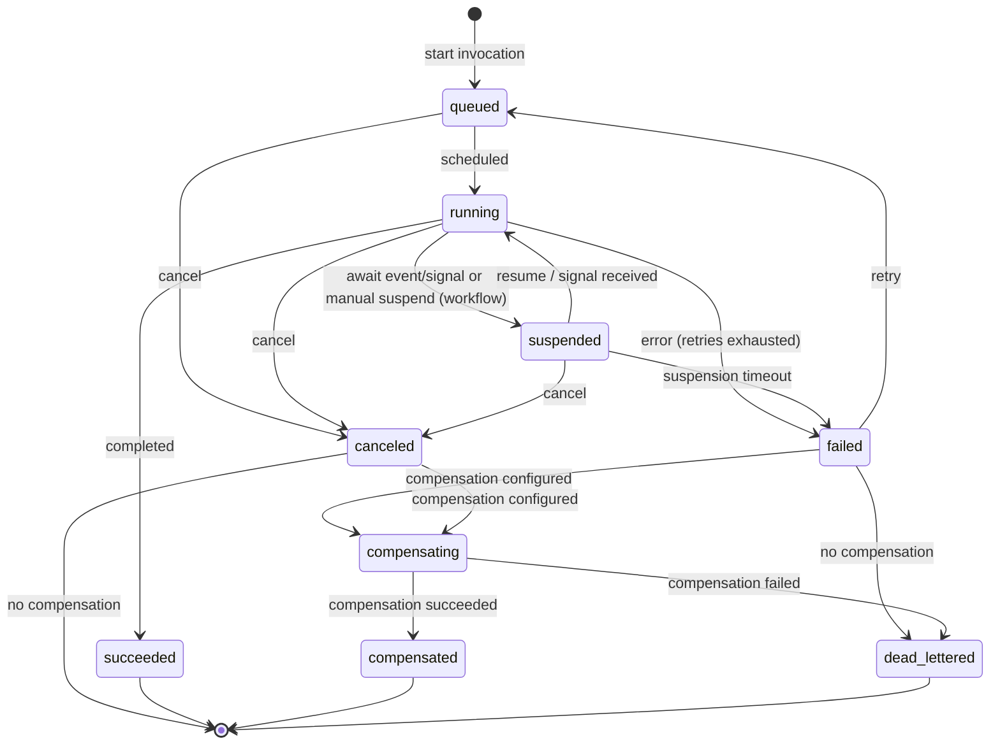
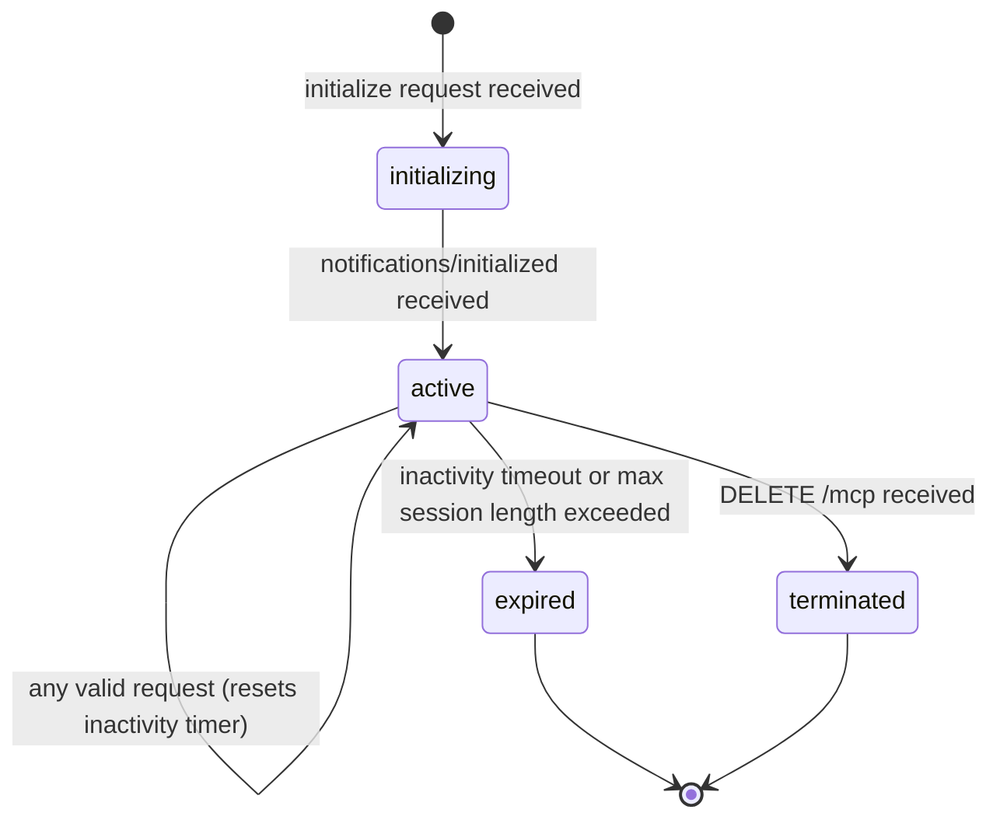
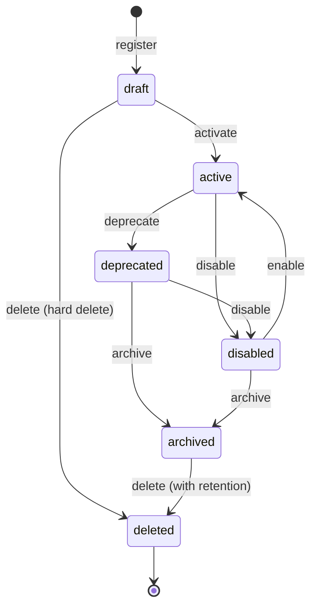

# Technical Design — Serverless Runtime

<!-- toc -->

- [1. Architecture Overview](#1-architecture-overview)
  - [1.1 Architectural Vision](#11-architectural-vision)
  - [1.2 Architecture Drivers](#12-architecture-drivers)
  - [1.3 Architecture Layers](#13-architecture-layers)
  - [1.4 ModKit Integration](#14-modkit-integration)
- [2. Principles & Constraints](#2-principles--constraints)
  - [2.1 Design Principles](#21-design-principles)
  - [2.2 Constraints](#22-constraints)
  - [2.3 Industry Comparison and Capability Allocation](#23-industry-comparison-and-capability-allocation)
- [3. Technical Architecture](#3-technical-architecture)
  - [3.1 Domain Model](#31-domain-model)
  - [3.1.1 Complete Entity Examples](#311-complete-entity-examples)
  - [3.2 Component Model](#32-component-model)
  - [3.3 API Contracts](#33-api-contracts)
  - [3.4 Internal Dependencies](#34-internal-dependencies)
  - [3.5 External Dependencies](#35-external-dependencies)
  - [3.6 Interactions & Sequences](#36-interactions--sequences)
  - [3.7 Database schemas & tables](#37-database-schemas--tables)
- [4. Additional Context](#4-additional-context)
  - [Security Considerations](#security-considerations)
  - [Audit Events](#audit-events)
  - [Comparison with Similar Solutions](#comparison-with-similar-solutions)
  - [Implementation Considerations](#implementation-considerations)
  - [Non-Applicable Domains](#non-applicable-domains)
- [5. Traceability](#5-traceability)

<!-- /toc -->

<!--
=============================================================================
TECHNICAL DESIGN DOCUMENT
=============================================================================
PURPOSE: Define HOW the system is built — architecture, components, APIs,
data models, and technical decisions that realize the requirements.

DESIGN IS PRIMARY: DESIGN defines the "what" (architecture and behavior).
ADRs record the "why" (rationale and trade-offs) for selected design
decisions; ADRs are not a parallel spec, it's a traceability artifact.

SCOPE:
  ✓ Architecture overview and vision
  ✓ Design principles and constraints
  ✓ Component model and interactions
  ✓ API contracts and interfaces
  ✓ Data models and database schemas
  ✓ Technology stack choices

NOT IN THIS DOCUMENT (see other templates):
  ✗ Requirements → PRD.md
  ✗ Detailed rationale for decisions → ADR/
  ✗ Step-by-step implementation flows → features/

STANDARDS ALIGNMENT:
  - IEEE 1016-2009 (Software Design Description)
  - IEEE 42010 (Architecture Description — viewpoints, views, concerns)
  - ISO/IEC 15288 / 12207 (Architecture & Design Definition processes)

ARCHITECTURE VIEWS (per IEEE 42010):
  - Context view: system boundaries and external actors
  - Functional view: components and their responsibilities
  - Information view: data models and flows
  - Deployment view: infrastructure topology

DESIGN LANGUAGE:
  - Be specific and clear; no fluff, bloat, or emoji
  - Reference PRD requirements using `cpt-cf-serverless-runtime-fr-{slug}`, `cpt-cf-serverless-runtime-nfr-{slug}`, and `cpt-cf-serverless-runtime-usecase-{slug}` IDs
  - Reference ADR documents using `cpt-cf-serverless-runtime-adr-{slug}` IDs
=============================================================================
-->

## 1. Architecture Overview

### 1.1 Architectural Vision

The Serverless Runtime module provides a stable, implementation-agnostic domain model and API contract for runtime creation, registration, and invocation of functions and workflows. Functions and workflows are unified as **functions** — registered definitions that can be invoked via the runtime API. This unification enables a single invocation surface, consistent response shapes, and shared lifecycle management regardless of the underlying execution technology.

The architecture is designed to support multiple implementation technologies (Temporal, Starlark, cloud-native FaaS) through a pluggable adapter model. Each adapter registers itself as a GTS type and implements the `RuntimeAdapter` trait. The platform validates adapter-specific limits, traits, and implementation payloads against the adapter's registered schemas, ensuring type safety without coupling the core model to any specific runtime.

**Scope note — orchestrator core vs. adapter-provided workflow features:** The orchestrator core provides the durable state machine (job lifecycle, retry, compensation, checkpoint persistence, timeout enforcement, scheduling, and tenant isolation). Workflow orchestration features — parallel execution, event waiting, per-step timeouts, deterministic replay, and conditional branching — are delegated to runtime adapters via the `ExecutionContext` host callback API. The platform ships with a Starlark adapter for sequential function chains; full workflow orchestration capabilities are unlocked by plugging in a capable adapter (Temporal, Serverless Workflow 1.0, etc.). This is intentional: the core remains independent of execution engine specifics, and adapters can leverage their native strengths without being constrained by a lowest-common-denominator abstraction. See [section 2.3](#23-industry-comparison-and-capability-allocation) for the detailed capability allocation.

The domain model uses the Global Type System (GTS) for identity, schema validation, and type inheritance. All entities carry GTS identifiers, enabling schema-first validation, version resolution, and consistent cross-module references. Security context propagation, tenant isolation, and governance are built into the API contract layer, ensuring that every operation is scoped, auditable, and policy-compliant.

### 1.2 Architecture Drivers

Requirements that significantly influence architecture decisions.

#### Functional Drivers

| PRD Requirement | Design Response |
|-------------|-----------------|
| `cpt-cf-serverless-runtime-fr-tenant-registry` (BR-002) | `OwnerRef` schema with `owner_type` determining default access scope (user/tenant/system) |
| `cpt-cf-serverless-runtime-fr-execution-lifecycle` (BR-005, BR-012, BR-028) | Base `Limits` schema with adapter-derived extensions; tenant quota enforcement |
| `cpt-cf-serverless-runtime-fr-trigger-schedule` (BR-007) | Schedule, Event Trigger, and Webhook Trigger entities with dedicated APIs |
| `cpt-cf-serverless-runtime-fr-execution-engine` (BR-009) | `WorkflowTraits` with configurable checkpointing strategy and suspension limits |
| `cpt-cf-serverless-runtime-fr-runtime-authoring` (BR-011) | `ValidationError` schema with per-issue location and suggested corrections |
| `cpt-cf-serverless-runtime-fr-execution-lifecycle` (BR-014), `cpt-cf-serverless-runtime-fr-execution-visibility` (BR-015) | `InvocationStatus` state machine with full transition table and timeline events |
| `cpt-cf-serverless-runtime-fr-execution-lifecycle` (BR-019) | `RetryPolicy` schema with exponential backoff and non-retryable error overrides |
| `cpt-cf-serverless-runtime-fr-tenant-registry` (BR-020), `cpt-cf-serverless-runtime-nfr-resource-governance` (BR-106), `cpt-cf-serverless-runtime-nfr-retention` (BR-107) | `TenantRuntimePolicy` with quotas, retention, allowed runtimes, and approval policies |
| `cpt-cf-serverless-runtime-nfr-ops-traceability` (BR-021), `cpt-cf-serverless-runtime-nfr-security` (BR-034) | `InvocationRecord` with correlation ID, trace ID, and tenant context |
| `cpt-cf-serverless-runtime-fr-trigger-schedule` (BR-022) | `Schedule` entity with cron/interval expressions, missed policies, and concurrency control |
| `cpt-cf-serverless-runtime-fr-execution-lifecycle` (BR-027) | Dead letter queue configuration on triggers; `dead_lettered` invocation status |
| `cpt-cf-serverless-runtime-fr-execution-lifecycle` (BR-029) | In-flight executions pinned to exact function version at start time |
| `cpt-cf-serverless-runtime-fr-runtime-authoring` (BR-032), `cpt-cf-serverless-runtime-fr-input-security` (BR-037) | `IOSchema` with JSON Schema or GTS reference validation before invocation |
| `cpt-cf-serverless-runtime-fr-runtime-capabilities` (BR-035) | `adapter_ref` implementation kind for adapter-provided definitions |
| `cpt-cf-serverless-runtime-fr-debugging` (BR-103) | Dry-run invocation mode with synthetic response and no side effects |
| `cpt-cf-serverless-runtime-nfr-performance` (BR-118, BR-132) | Response caching policy with TTL, idempotency key, and owner-scoped cache keys |
| `cpt-cf-serverless-runtime-fr-governance-sharing` (BR-123) | Extended sharing beyond default visibility via access control integration |
| `cpt-cf-serverless-runtime-fr-debugging` (BR-129) | Standardized error types with GTS-identified derived errors and RFC 9457 responses |
| `cpt-cf-serverless-runtime-fr-debugging` (BR-130) | `InvocationTimelineEvent` for debugging, auditing, and execution visualization |
| `cpt-cf-serverless-runtime-fr-advanced-patterns` (BR-133) | Two-layer compensation model: function-level (platform) and step-level (executor) |
| `cpt-cf-serverless-runtime-fr-advanced-patterns` (BR-134) | `Idempotency-Key` header with configurable tenant deduplication window |
| `cpt-cf-serverless-runtime-fr-replay-visualization` (BR-124, BR-125) | `InvocationRecord` replay from recorded history; timeline visualization of workflow structure and execution path |
| `cpt-cf-serverless-runtime-fr-advanced-deployment` (BR-201, BR-202, BR-203, BR-204, BR-205) | Import/export of definitions; execution time travel; A/B testing and canary release via function versioning and traffic splitting; long-term archival via `TenantRuntimePolicy` retention settings |
| `cpt-cf-serverless-runtime-fr-deployment-safety` (BR-121) | Blue-green deployment via function version pinning and controlled traffic routing between active versions |

#### NFR Allocation

| NFR ID | NFR Summary | Allocated To | Design Response | Verification Approach |
|--------|-------------|--------------|-----------------|----------------------|
| `cpt-cf-serverless-runtime-nfr-tenant-isolation` | Tenant isolation | All components | Tenant-scoped queries, isolated execution environments, secret isolation | Integration tests with multi-tenant scenarios |
| `cpt-cf-serverless-runtime-nfr-observability` | Observability | InvocationRecord, Timeline API | Correlation IDs, trace IDs, execution metrics, timeline events | Verify trace propagation in integration tests |
| `cpt-cf-serverless-runtime-nfr-resource-governance` | Pluggability | Executor, Adapter model | Abstract `ServerlessRuntime` trait; adapter-derived GTS types for limits | Adapter conformance test suite |
| `cpt-cf-serverless-runtime-nfr-reliability` | State consistency, availability ≥99.95%, RTO ≤30s, RPO ≤1min | Invocation Engine, Executor, State Machine | `InvocationStatus` state machine with atomic transitions; `RetryPolicy` with compensation; version-pinned executions; durable snapshots for workflow resume | Chaos tests for state consistency; availability monitoring; recovery time measurement |
| `cpt-cf-serverless-runtime-nfr-composition-deps` | Dependency management between functions/workflows | Registry, Invocation Engine | Function definitions reference dependencies via GTS type IDs; registry validates dependency availability at publish time | Dependency resolution integration tests |
| `cpt-cf-serverless-runtime-nfr-scalability` | ≥10K concurrent executions, ≥1K starts/sec, ≥1K tenants | All components | Stateless API layer; tenant-partitioned persistence; adapter-level horizontal scaling; per-tenant quota enforcement via `TenantRuntimePolicy` | Load tests against scalability targets |

#### Key ADRs

| ADR ID | Decision Summary |
|--------|-----------------|
| `cpt-cf-serverless-runtime-adr-callable-type-hierarchy` | Unified callable type hierarchy: Function as base type, Workflow as derived specialization |
| `cpt-cf-serverless-runtime-adr-jsonrpc-mcp-protocol-surfaces` | JSON-RPC 2.0 and MCP protocol surfaces for direct function invocation and AI agent tool integration |

### 1.3 Architecture Layers

| Layer | Responsibility | Technology |
|-------|---------------|------------|
| API | REST endpoints for function management, invocation, scheduling, triggers, tenant policy, observability; JSON-RPC 2.0 endpoint for direct function invocation; MCP server endpoint for AI agent tool integration | REST / JSON, JSON-RPC 2.0, MCP (Streamable HTTP), RFC 9457 Problem Details |
| Domain | Core entities, state machines, validation rules, GTS type resolution | Rust, GTS type system |
| Runtime | Pluggable execution adapters, invocation engine, scheduler, event processing | Rust async traits, adapter plugins |
| Infrastructure | Persistence, caching, event broker integration, secret management | TBD per deployment |

### 1.4 ModKit Integration

The serverless-runtime capability is implemented as **two ModKit modules** — an **orchestrator** and a **runtime** — following the canonical DDD-light layout defined in [Module Layout and SDK Pattern](../../../docs/modkit_unified_system/02_module_layout_and_sdk_pattern.md). This split mirrors the existing platform architecture where dispatch (stateful, DB-backed, guarantees) and toolboxes (stateless execution) are separate microservices.

**Rationale for the two-module split:**

| Concern | `sless-orchestrator` | `sless-runtime` |
|---|---|---|
| **Responsibility** | Job lifecycle, scheduling, triggers, retries, compensation, checkpoint storage | Stateless function/workflow execution |
| **State** | Stateful — DB-backed (jobs, invocations, checkpoints, schedules) | Stateless — receives work, executes, returns results |
| **Scaling** | Few instances, distributed locking for job polling | Many instances, scale-to-zero per adapter |
| **DB** | Yes — `SecureConn`, tenant isolation, advisory locks | No — no database dependency |
| **Guarantees** | At-least-once delivery, status machine, compensation orchestration | Best-effort execution, timeout enforcement |
| **ModKit capabilities** | `[db, rest, stateful]` | `[rest]` (or `[grpc]` for internal-only) |

#### 1.4.1 Module Structure

```
modules/
  sless-orchestrator/
    ├─ sless-orchestrator-sdk/            # SDK crate (public API surface)
    │  ├─ Cargo.toml
    │  └─ src/
    │     ├─ lib.rs
    │     ├─ api.rs                       # SlessOrchestratorClient trait (ClientHub path)
    │     ├─ models.rs                    # Transport-agnostic domain models
    │     └─ errors.rs                    # SlessOrchestratorError enum
    └─ sless-orchestrator/                # Module implementation crate
       ├─ Cargo.toml
       └─ src/
          ├─ lib.rs
          ├─ module.rs                    # SlessOrchestratorModule + Module/Db/Rest/Stateful impls
          ├─ config.rs                    # Typed module configuration
          ├─ api/
          │  └─ rest/
          │     ├─ dto.rs                 # HTTP DTOs (serde/utoipa)
          │     ├─ handlers.rs            # Axum handlers — error→Problem mapping
          │     └─ routes.rs              # Route & OpenAPI registration
          ├─ domain/
          │  ├─ error.rs                  # DomainError (no HTTP concepts)
          │  ├─ service.rs                # FunctionRegistry, InvocationEngine orchestration
          │  ├─ scheduler.rs              # SchedulerService — cron evaluation, job creation
          │  ├─ trigger.rs                # TriggerService — event matching, job creation
          │  └─ job_worker.rs             # Job polling loop with distributed advisory lock
          └─ infra/
             ├─ storage/
             │  ├─ entity/                # SeaORM entities with #[derive(Scopable)]
             │  │  ├─ function.rs
             │  │  ├─ workflow.rs
             │  │  ├─ invocation.rs
             │  │  ├─ checkpoint.rs
             │  │  ├─ schedule.rs
             │  │  ├─ trigger.rs
             │  │  ├─ webhook_trigger.rs
             │  │  └─ tenant_policy.rs
             │  ├─ repo/                  # Repository implementations using SecureConn
             │  ├─ mapper.rs              # Entity <-> SDK model conversions
             │  └─ migrations/
             └─ plugins/                  # Trigger plugins (webhook, schedule, event)

  sless-runtime/
    ├─ sless-runtime-sdk/                 # SDK crate
    │  ├─ Cargo.toml
    │  └─ src/
    │     ├─ lib.rs
    │     ├─ api.rs                       # SlessRuntimeClient trait
    │     ├─ models.rs                    # ExecuteRequest, ExecuteResult, HealthStatus
    │     └─ errors.rs                    # SlessRuntimeError enum
    └─ sless-runtime/                     # Module implementation crate
       ├─ Cargo.toml
       └─ src/
          ├─ lib.rs
          ├─ module.rs                    # SlessRuntimeModule + Module/Rest impls
          ├─ domain/
          │  ├─ executor.rs              # Executor trait — adapter-agnostic execution contract
          │  └─ context.rs               # Runtime context (host callbacks for checkpoint, status)
          └─ infra/
             └─ plugins/                  # Runtime adapter plugins
```

**Component-to-ModKit mapping:**

| Design Component | Module | ModKit Location | Notes |
|---|---|---|---|
| Function Registry | `sless-orchestrator` | `domain/service.rs` | CRUD + status machine + GTS validation |
| Invocation Engine | `sless-orchestrator` | `domain/service.rs` | Orchestrates invocation lifecycle; creates jobs, tracks status |
| Job Worker | `sless-orchestrator` | `domain/job_worker.rs` | Polls queued jobs with distributed advisory lock (single-leader) |
| Scheduler | `sless-orchestrator` | `domain/scheduler.rs` | Background task — evaluates cron schedules, creates invocation jobs |
| Event Trigger Engine | `sless-orchestrator` | `domain/trigger.rs` | Background task — matches events to triggers, creates invocation jobs |
| Tenant Policy Manager | `sless-orchestrator` | `domain/service.rs` | Thin service layer for policy CRUD |
| Persistence layer | `sless-orchestrator` | `infra/storage/` | SeaORM entities + `SecureConn` repositories |
| Executor (Adapter) | `sless-runtime` | Plugin crates | Each adapter is a ModKit plugin (see 1.4.2) |
| Executor Pool | `sless-runtime` | `domain/executor.rs` | Manages concurrent execution slots, timeout enforcement |
| Host Callbacks | `sless-runtime` | `domain/context.rs` | Checkpoint/status reporting back to orchestrator |

**Cross-module communication:** The orchestrator dispatches work to runtime instances through an abstracted `JobTransport` trait (see [1.4.5](#145-job-transport-abstraction)). The runtime calls back to the orchestrator via `SlessOrchestratorClient` for checkpoint persistence and status updates.

#### 1.4.2 Runtime Adapters as ModKit Plugins

Each executor adapter (Starlark, Temporal, Lambda, etc.) is a **ModKit plugin crate** within the `sless-runtime` module, not a compile-time dependency. This follows the same pattern used by `authn-resolver` and `mini-chat` for their plugins (e.g., `choose_plugin_instance` in `modkit::plugins`).

**Constraints:**
- The `sless-runtime` module crate **must not** depend on any adapter plugin crate. Plugin isolation is enforced at the crate dependency level.
- Each adapter registers a GTS type (e.g., `gts.x.core.sless.runtime.starlark.v1~`) and a plugin spec trait (e.g., `SlessAdapterPluginSpecV1`).
- At execution time, the runtime module resolves the adapter using `choose_plugin_instance`:

```rust
use modkit::plugins::{GtsPluginSelector, choose_plugin_instance};

let adapter_gts_id = choose_plugin_instance::<SlessAdapterPluginSpecV1>(
    &vendor_selector,
    instances.iter().map(|e| (e.gts_id.as_str(), &e.content)),
)?;
let adapter = hub.get_scoped::<dyn SlessAdapterClientV1>(
    &ClientScope::ByGtsId(adapter_gts_id),
)?;
```

- Plugin selection is based on the `implementation.adapter` GTS type ID from the function definition, passed by the orchestrator in the `ExecuteRequest`.

**Plugin spec type** (defined in `sless-runtime-sdk`):

```rust
use modkit_macros::struct_to_gts_schema;

/// GTS schema type for runtime adapter plugin instances.
/// Each adapter registers an instance of this type in the types-registry.
#[struct_to_gts_schema(
    base = "gts.x.core.modkit.plugin.v1~",
    id = "gts.x.core.sless.adapter_plugin.v1~",
    description = "Serverless runtime adapter plugin specification",
    properties = ""
)]
pub struct SlessAdapterPluginSpecV1;
```

Each adapter plugin module registers itself during `init()`:

```rust
// In plugins/starlark-adapter/src/module.rs
#[async_trait]
impl Module for StarlarkAdapterPlugin {
    async fn init(&self, ctx: &ModuleCtx) -> anyhow::Result<()> {
        let instance_id = SlessAdapterPluginSpecV1::gts_make_instance_id(
            "x.core.sless.runtime.starlark.v1"
        );

        // Register instance in types-registry
        let registry = ctx.client_hub().get::<dyn TypesRegistryClient>()?;
        let instance = BaseModkitPluginV1::<SlessAdapterPluginSpecV1> {
            id: instance_id.clone(),
            vendor: "core".into(),
            priority: 0,
            properties: SlessAdapterPluginSpecV1,
        };
        registry.register(vec![serde_json::to_value(&instance)?]).await?;

        // Register scoped adapter client
        let adapter: Arc<dyn RuntimeAdapter> = Arc::new(StarlarkAdapter::new());
        ctx.client_hub().register_scoped::<dyn RuntimeAdapter>(
            ClientScope::gts_id(&instance_id),
            adapter,
        );

        Ok(())
    }
}
```

#### 1.4.3 SDK Crates

Each module has its own SDK crate following the standard pattern.

**`sless-orchestrator-sdk`** — the primary API surface for external consumers:

```rust
#[async_trait]
pub trait SlessOrchestratorClient: Send + Sync {
    /// Invoke a callable (function or workflow) by GTS ID.
    async fn invoke(
        &self,
        ctx: &SecurityContext,
        req: InvokeRequest,
    ) -> Result<InvocationRecord, SlessOrchestratorError>;

    async fn get_function(
        &self,
        ctx: &SecurityContext,
        id: &str,
    ) -> Result<FunctionDefinition, SlessOrchestratorError>;

    async fn get_invocation(
        &self,
        ctx: &SecurityContext,
        id: &str,
    ) -> Result<InvocationRecord, SlessOrchestratorError>;

    /// Called by sless-runtime to persist checkpoint data.
    async fn publish_checkpoint(
        &self,
        ctx: &SecurityContext,
        invocation_id: &str,
        checkpoint: CheckpointData,
    ) -> Result<(), SlessOrchestratorError>;

    /// Called by sless-runtime to update invocation status.
    async fn publish_status(
        &self,
        ctx: &SecurityContext,
        invocation_id: &str,
        status: InvocationStatus,
    ) -> Result<(), SlessOrchestratorError>;

    // ... additional CRUD operations for functions, schedules, triggers
}
```

**`sless-runtime-sdk`** — consumed by the orchestrator to dispatch execution:

```rust
#[async_trait]
pub trait SlessRuntimeClient: Send + Sync {
    /// Execute a callable. The runtime is stateless — all state
    /// persistence flows back through SlessOrchestratorClient.
    async fn execute(
        &self,
        ctx: &SecurityContext,
        req: ExecuteRequest,
    ) -> Result<ExecuteResult, SlessRuntimeError>;

    /// Health/readiness check for the runtime instance.
    async fn health(&self) -> Result<HealthStatus, SlessRuntimeError>;
}
```

Other modules obtain the orchestrator client via `ClientHub`:

```rust
let orchestrator = hub.get::<dyn SlessOrchestratorClient>()?;
let result = orchestrator.invoke(&ctx, req).await?;
```

**Models**: Each SDK has transport-agnostic structs. Shared types (e.g., `FunctionDefinition`, `InvocationRecord`) live in `sless-orchestrator-sdk` since the orchestrator owns these entities. `sless-runtime-sdk` depends on `sless-orchestrator-sdk` for shared model types.

#### 1.4.4 Error Mapping Layers

ModKit requires three layers of error types with clear separation of concerns. Each module has its own error hierarchy.

**`sless-orchestrator` errors:**

Layer 1 — `DomainError` (`domain/error.rs`):
Domain-internal errors with no HTTP or transport concepts. Annotated with `#[domain_model]`.

```rust
#[domain_model]
pub enum DomainError {
    FunctionNotFound { id: String },
    FunctionNotActive { id: String, status: String },
    ValidationFailed { issues: Vec<ValidationIssue> },
    QuotaExceeded { tenant_id: String, limit: String },
    RateLimited { function_id: String, retry_after_seconds: u64 },
    RuntimeUnavailable { runtime_id: String },
    InvocationFailed { invocation_id: String, reason: String },
    Internal { message: String },
}
```

Layer 2 — `SlessOrchestratorError` (SDK `errors.rs`):
Transport-agnostic errors exposed to consumers via the SDK. These map 1:1 to the GTS error type hierarchy defined in section 3.1.

```rust
#[derive(Error, Debug, Clone)]
pub enum SlessOrchestratorError {
    #[error("Function not found: {id}")]
    NotFound { id: String },

    #[error("Function not active: {id} (status: {status})")]
    NotActive { id: String, status: String },

    #[error("Validation failed")]
    Validation { issues: Vec<ValidationIssue> },

    #[error("Quota exceeded for tenant {tenant_id}")]
    QuotaExceeded { tenant_id: String },

    #[error("Rate limited: retry after {retry_after_seconds}s")]
    RateLimited { function_id: String, retry_after_seconds: u64 },

    #[error("Execution timed out: {invocation_id}")]
    RuntimeTimeout { invocation_id: String },

    #[error("Sync invocation reached suspension point")]
    SyncSuspension { invocation_id: String },

    #[error("Internal error")]
    Internal,
}
```

Layer 3 — `Problem` (in `api/rest/error.rs`):
HTTP-specific error responses using RFC 9457 Problem Details. Converted from `SlessOrchestratorError`:

```rust
impl From<SlessOrchestratorError> for Problem {
    fn from(e: SlessOrchestratorError) -> Self {
        match e {
            SlessOrchestratorError::NotFound { id } => Problem::not_found()
                .with_type_uri("gts://gts.x.core.sless.err.v1~x.core.sless.err.not_found.v1~")
                .with_detail(format!("Function not found: {id}")),
            SlessOrchestratorError::RateLimited { retry_after_seconds, .. } => Problem::too_many_requests()
                .with_type_uri("gts://gts.x.core.sless.err.v1~x.core.sless.err.rate_limited.v1~")
                .with_header("Retry-After", retry_after_seconds),
            // ... remaining variants
        }
    }
}
```

**`sless-runtime` errors:**

The runtime module has a simpler error hierarchy since it has no DB or complex domain logic:

```rust
#[derive(Error, Debug, Clone)]
pub enum SlessRuntimeError {
    #[error("Execution failed: {reason}")]
    ExecutionFailed { reason: String },

    #[error("Execution timed out after {timeout_seconds}s")]
    Timeout { timeout_seconds: u64 },

    #[error("Adapter not found: {adapter_id}")]
    AdapterNotFound { adapter_id: String },

    #[error("Adapter unavailable: {adapter_id}")]
    AdapterUnavailable { adapter_id: String },

    #[error("Internal error")]
    Internal,
}
```

The domain service converts `DomainError` to the SDK error at the domain boundary. Handlers convert SDK errors to `Problem` at the API boundary. This follows the same pattern as `mini-chat` (see `modules/mini-chat/mini-chat/src/api/rest/error.rs`).

#### 1.4.5 Job Transport Abstraction

The orchestrator does not call `SlessRuntimeClient` directly. Instead, the domain layer codes against a **`JobTransport`** trait that abstracts how jobs are dispatched to runtime instances. This allows the transport mechanism to be swapped without changing orchestration logic.

**Trait definition** (`domain/transport.rs`):

```rust
/// Outcome of dispatching a job to a runtime instance.
pub enum DispatchOutcome {
    /// The runtime executed the job synchronously and returned a result.
    Completed(ExecuteResult),
    /// The runtime accepted the job for async execution.
    /// The orchestrator will receive status/checkpoint callbacks
    /// via SlessOrchestratorClient.
    Accepted {
        runtime_instance_id: String,
    },
}

/// Abstraction over how the orchestrator sends jobs to runtime instances.
/// Implementations handle instance selection, load balancing, and transport.
#[async_trait]
pub trait JobTransport: Send + Sync {
    /// Dispatch a job for synchronous execution.
    /// Blocks until the runtime returns a result or times out.
    async fn dispatch_sync(
        &self,
        ctx: &SecurityContext,
        job: &Job,
        req: ExecuteRequest,
    ) -> Result<DispatchOutcome, TransportError>;

    /// Dispatch a job for asynchronous execution.
    /// Returns immediately once the runtime acknowledges receipt.
    async fn dispatch_async(
        &self,
        ctx: &SecurityContext,
        job: &Job,
        req: ExecuteRequest,
    ) -> Result<DispatchOutcome, TransportError>;

    /// Cancel an in-flight job on the runtime.
    async fn cancel(
        &self,
        ctx: &SecurityContext,
        job: &Job,
    ) -> Result<(), TransportError>;

    /// List available runtime instances and their health status.
    async fn available_instances(&self) -> Result<Vec<RuntimeInstance>, TransportError>;
}

#[derive(Error, Debug)]
pub enum TransportError {
    #[error("No runtime instances available")]
    NoInstancesAvailable,

    #[error("Runtime instance {instance_id} unreachable")]
    InstanceUnreachable { instance_id: String },

    #[error("Dispatch timed out after {timeout_seconds}s")]
    Timeout { timeout_seconds: u64 },

    #[error("Runtime rejected job: {reason}")]
    Rejected { reason: String },

    #[error("Transport error: {0}")]
    Internal(#[from] anyhow::Error),
}
```

**v1 implementation — `DirectClientTransport`** (`infra/transport/direct.rs`):

The initial implementation dispatches jobs via direct REST/gRPC calls using `SlessRuntimeClient` through `ClientHub`, with instance selection via `DirectoryService`:

```rust
pub struct DirectClientTransport {
    hub: Arc<ClientHub>,
    directory: Arc<dyn DirectoryClient>,
    strategy: SelectionStrategy,
}

pub enum SelectionStrategy {
    RoundRobin,
    LeastLoaded,
}

#[async_trait]
impl JobTransport for DirectClientTransport {
    async fn dispatch_sync(
        &self,
        ctx: &SecurityContext,
        job: &Job,
        req: ExecuteRequest,
    ) -> Result<DispatchOutcome, TransportError> {
        let instance = self.select_instance().await?;
        let client = self.hub.get_scoped::<dyn SlessRuntimeClient>(
            &ClientScope::ByEndpoint(&instance.endpoint_uri),
        )?;

        let result = client.execute(ctx, req).await
            .map_err(|e| TransportError::InstanceUnreachable {
                instance_id: instance.instance_id.clone(),
            })?;

        Ok(DispatchOutcome::Completed(result))
    }

    async fn dispatch_async(
        &self,
        ctx: &SecurityContext,
        job: &Job,
        req: ExecuteRequest,
    ) -> Result<DispatchOutcome, TransportError> {
        let instance = self.select_instance().await?;
        let client = self.hub.get_scoped::<dyn SlessRuntimeClient>(
            &ClientScope::ByEndpoint(&instance.endpoint_uri),
        )?;

        // Fire-and-forget — runtime will callback via SlessOrchestratorClient
        tokio::spawn({
            let ctx = ctx.clone();
            async move { client.execute(&ctx, req).await }
        });

        Ok(DispatchOutcome::Accepted {
            runtime_instance_id: instance.instance_id,
        })
    }

    async fn cancel(&self, ctx: &SecurityContext, job: &Job) -> Result<(), TransportError> {
        // Resolve the instance that is running this job (stored on the invocation record)
        // and call SlessRuntimeClient::cancel()
        todo!()
    }

    async fn available_instances(&self) -> Result<Vec<RuntimeInstance>, TransportError> {
        let instances = self.directory
            .list_instances("sless-runtime").await
            .map_err(|e| TransportError::Internal(e.into()))?;
        Ok(instances.into_iter().map(RuntimeInstance::from).collect())
    }
}
```

**Instance selection** uses `DirectoryService::ListInstances("sless-runtime")` to discover available runtime instances, then applies the configured `SelectionStrategy`. The orchestrator stores the selected `runtime_instance_id` on the invocation record so that cancellation and status correlation can target the correct instance.

**Failure handling:** If `dispatch_sync` or `dispatch_async` returns `TransportError::InstanceUnreachable`, the job worker marks the job for retry and selects a different instance on the next attempt. The orchestrator's timeout reaper catches jobs where the runtime accepted work but never called back (runtime crash mid-execution).

**Error mapping:** `TransportError` is converted to `DomainError` at the domain service boundary:

| `TransportError` | `DomainError` | Retryable? |
|---|---|---|
| `NoInstancesAvailable` | `RuntimeUnavailable` | Yes — job stays `queued`, retried on next poll |
| `InstanceUnreachable { instance_id }` | `RuntimeUnavailable` | Yes — retry with different instance |
| `Timeout { .. }` | `InvocationFailed { reason: "transport timeout" }` | Depends on `RetryPolicy` |
| `Rejected { reason }` | `InvocationFailed { reason }` | No — permanent failure |
| `Internal(..)` | `Internal` | No |

**Future transport implementations:**

| Implementation | Transport | When to adopt |
|---|---|---|
| `DirectClientTransport` (v1) | REST/gRPC via ClientHub | Default — works with current ModKit |
| `NatsJobTransport` | NATS pub/sub with competing consumers | When throughput requires work distribution queues |
| `StreamingGrpcTransport` | Bidirectional gRPC streaming (runtime pulls work) | When backpressure and connection-level flow control are needed |

New transport implementations are wired via module configuration — no changes to the orchestrator's domain layer:

```rust
// In module.rs, during initialization:
let transport: Arc<dyn JobTransport> = match config.transport.kind.as_str() {
    "direct" => Arc::new(DirectClientTransport::new(hub, directory, config.transport.strategy)),
    // Future:
    // "nats" => Arc::new(NatsJobTransport::new(nats_conn, config.transport.nats)),
    // "grpc-stream" => Arc::new(StreamingGrpcTransport::new(hub, config.transport.stream)),
    other => anyhow::bail!("Unknown transport kind: {other}"),
};
```

#### 1.4.6 Module Lifecycle

**`sless-orchestrator`** — stateful, with background workers:

```rust
#[modkit::module(
    name = "sless-orchestrator",
    deps = ["types-registry", "authz-resolver", "sless-runtime"],
    capabilities = [db, rest, stateful],
    lifecycle(entry = "serve", stop_timeout = "30s", await_ready)
)]
pub struct SlessOrchestratorModule {
    service: OnceLock<Arc<AppServices>>,
    worker_cancel: Mutex<Option<CancellationToken>>,
    worker_handles: Mutex<Option<WorkerHandles>>,
}
```

Lifecycle integration:
- The `serve` entry task runs the **Job Worker** polling loop — acquiring a distributed advisory lock, polling queued invocations, dispatching to runtime instances via the `JobTransport` trait (see [1.4.5](#145-job-transport-abstraction)), processing status transitions, and running the Scheduler and Event Trigger Engine as background workers.
- `CancellationToken` is propagated to all background workers (job worker, scheduler, trigger engine). When the module receives a stop signal, the token is canceled, which:
  1. Stops accepting new invocations.
  2. Signals in-flight sync invocations to return a cancellation error.
  3. Allows in-flight async invocations a grace period (`stop_timeout = "30s"`) to checkpoint and transition to `suspended` status before forced termination.
- `await_ready` ensures the module's REST routes are not registered until the orchestrator is initialized and runtime connectivity is confirmed.

**`sless-runtime`** — stateless, no background workers:

```rust
#[modkit::module(
    name = "sless-runtime",
    deps = ["types-registry"],
    capabilities = [rest],
    lifecycle(entry = "serve", stop_timeout = "10s")
)]
pub struct SlessRuntimeModule {
    executor_pool: OnceLock<Arc<ExecutorPool>>,
}
```

The runtime's `serve` entry initializes the executor pool and adapter plugins. On shutdown, `stop_timeout = "10s"` gives in-flight executions time to return partial results. The runtime has no DB, no advisory locks, and no background polling — it is purely reactive.

#### 1.4.7 Database Access and Tenant Isolation

All database access in `sless-orchestrator` goes through `SecureConn` with `AccessScope::for_tenant(tenant_id)`. This enforces row-level tenant isolation at the ORM layer, consistent with the platform security model. (`sless-runtime` has no database.)

**Entity requirements:**
All SeaORM entities must derive `Scopable` with `#[secure(tenant_col = "tenant_id")]`:

```rust
#[derive(Clone, Debug, PartialEq, DeriveEntityModel, Scopable)]
#[sea_orm(table_name = "functions")]
#[secure(
    tenant_col = "tenant_id",
    resource_col = "function_id",
    no_owner,
    no_type
)]
pub struct Model {
    #[sea_orm(primary_key, auto_increment = false)]
    pub function_id: String,
    pub tenant_id: String,
    pub version: String,
    pub status: String,
    // ...
}
```

This applies to all entities in `sless-orchestrator`: `functions`, `workflows`, `invocations`, `invocation_timeline`, `checkpoints`, `schedules`, `event_triggers`, `webhook_triggers`, and `tenant_policies`.

**Cross-tenant sharing** (e.g., system-scoped functions visible to all tenants) must use `AccessScope` elevation, not raw queries that bypass `SecureConn`. The `OwnerRef.owner_type = "system"` case is handled via an elevated `AccessScope` that includes the system tenant scope alongside the requesting tenant's scope.

## 2. Principles & Constraints

### 2.1 Design Principles

#### Implementation-Agnostic Runtime

- [ ] `p1` - **ID**: `cpt-cf-serverless-runtime-principle-impl-agnostic`

The domain model and API contracts are intentionally decoupled from any specific runtime technology. The same function definitions, invocation APIs, and lifecycle management work identically whether the underlying executor is Starlark, Temporal, WASM, or a cloud-native FaaS provider. This enables technology selection to be deferred to deployment time and allows multiple executors to coexist within the same platform instance.

#### GTS-Based Identity

- [ ] `p1` - **ID**: `cpt-cf-serverless-runtime-principle-gts-identity`

All domain entities use Global Type System (GTS) identifiers following the [GTS specification](https://github.com/globaltypesystem/gts-spec). GTS provides hierarchical type inheritance, schema-first validation, and stable cross-module references. Entity identity is the GTS instance address, not an internal database key, ensuring that types are portable and self-describing.

#### Unified Function Model

- [ ] `p1` - **ID**: `cpt-cf-serverless-runtime-principle-unified-function`

Functions and workflows are unified under a single **function** abstraction. Both share the same definition schema, the same registration and lifecycle APIs, and the same invocation surface. The distinction is expressed via GTS type inheritance (function vs. workflow base types) and behavioral traits (workflow-specific compensation, checkpointing, suspension). This eliminates the split-product complexity seen in public cloud platforms.

#### Pluggable Adapter Architecture

- [ ] `p1` - **ID**: `cpt-cf-serverless-runtime-principle-pluggable-adapters`

Execution adapters are pluggable native modules that implement the abstract `ServerlessRuntime` trait. Each adapter registers its own GTS type and may extend the base schemas (e.g., adapter-specific limits). The platform validates adapter-specific fields at registration time by deriving the adapter's schema from the `implementation.adapter` field. This enables new execution technologies to be added without modifying the core domain model.

### 2.2 Constraints

#### No Runtime Technology Selection

- [ ] `p2` - **ID**: `cpt-cf-serverless-runtime-constraint-no-runtime-selection`

This design intentionally does not select a specific runtime technology. The choice of executor (Starlark, Temporal, cloud FaaS, etc.) is deferred to implementation and deployment.

#### No Workflow DSL Specification

- [ ] `p2` - **ID**: `cpt-cf-serverless-runtime-constraint-no-workflow-dsl`

Workflow DSL syntax details are implementation-specific and defined per executor. This design specifies the workflow traits and lifecycle but not the authoring language.

#### No UI/UX Definition

- [ ] `p2` - **ID**: `cpt-cf-serverless-runtime-constraint-no-ui-ux`

UI/UX for authoring or debugging workflows is out of scope for this design document.

### 2.3 Industry Comparison and Capability Allocation

This design draws from several industry workflow/serverless platforms. This section maps their capabilities to our architecture and clarifies what the **orchestrator core** provides vs what is delegated to **runtime adapters**.

#### Industry Reference Points

| Platform | Architecture Model | Key Insight for This Design |
|---|---|---|
| **Temporal** | Workflows + Activities as peers; deterministic replay; task queues with competing workers | Validates sibling type hierarchy. Replay, step model, and task queues are Temporal-specific — a Temporal adapter would expose these natively. |
| **Azure Durable Functions** | Orchestrator functions + activity functions; replay-based; built on Azure Storage queues | Replay is runtime-specific. The "orchestrator function" pattern maps to our workflow type. |
| **AWS Step Functions** | State machine DSL (ASL); states = steps; parallel/choice/wait built into DSL | Step/state model is DSL-specific. Parallel, choice, and wait are all expressible within the adapter's workflow spec. |
| **AWS Lambda** | Stateless functions; event-driven; no built-in orchestration | Maps directly to our function type with a Lambda adapter. |

#### What the Orchestrator Core Provides

The orchestrator owns capabilities that must be **consistent across all adapters** — the "platform guarantees" that hold regardless of which runtime executes the work:

| Capability | Orchestrator Responsibility | PRD Reference |
|---|---|---|
| **Job lifecycle** | Queued → running → completed/failed/canceled state machine, atomic transitions | BR-005, BR-014 |
| **Retry policy** | Exponential backoff, max attempts, non-retryable error classification | BR-019 |
| **Function-level compensation** | Invoke `on_failure`/`on_cancel` handlers when a workflow fails or is canceled | BR-133 |
| **Checkpoint persistence** | Store checkpoint data reported by the runtime; resume from last checkpoint on retry | BR-009 |
| **Timeout enforcement** | Kill invocations exceeding `timeout_seconds`; timeout reaper for silent runtime failures | BR-028 |
| **Scheduling & triggers** | Cron/interval schedules, event triggers, webhook triggers — all create invocation jobs | BR-007, BR-022 |
| **Invocation history & timeline** | Record timeline events for every state transition and step boundary | BR-015, BR-130 |
| **Tenant isolation & quotas** | Per-tenant concurrency limits, rate limiting, policy enforcement | BR-012, BR-106 |
| **Idempotency** | Deduplication via `Idempotency-Key` header and tenant-scoped deduplication window | BR-134 |
| **Version pinning** | In-flight executions pinned to exact function version at start time | BR-029 |

#### What Runtime Adapters Provide

Adapters own capabilities that are **inherently runtime-specific** — different execution engines express these differently or not at all:

| Capability | Adapter Responsibility | Industry Precedent | PRD Reference |
|---|---|---|---|
| **Step/activity abstraction** | Define what a "step" is and how steps compose. Temporal has Activities; Step Functions has States; Starlark has function calls. | Temporal Activities, ASL States | BR-104 |
| **Parallel execution** | Fan-out/fan-in within a workflow. Temporal uses `workflow.Go()`; Step Functions uses `Parallel` state. Adapters that support parallelism spawn multiple `ctx.invoke()` calls concurrently. Starlark v1 is sequential only. | Temporal goroutines, ASL Parallel | BR-105 |
| **Event waiting / signals** | Suspend execution waiting for an external event. Temporal uses Signals; Step Functions uses `.waitForTaskToken`; a Starlark adapter could expose `ctx.wait_for_event()`. | Temporal Signals, ASL WaitForTaskToken | BR-108 |
| **Deterministic replay** | Replay execution from event history for fault tolerance. This is a Temporal/Durable Functions concept — not all runtimes need or support it. | Temporal, Azure Durable Functions | — |
| **Step-level compensation** | Per-step rollback in reverse order. Adapter-specific; the orchestrator provides function-level compensation as a universal safety net. | Temporal Saga, custom | BR-133 |
| **Sub-workflow invocation** | Calling a child workflow from a parent. The adapter invokes child callables via `SlessOrchestratorClient::invoke()`, which routes through the full orchestrator lifecycle. | Temporal Child Workflows, ASL nested state machines | BR-104 |
| **Per-step timeouts** | Timeout individual steps within a workflow. The orchestrator enforces the overall `timeout_seconds` (BR-028); adapters enforce step-level timeouts internally. For managed adapters, each `ctx.invoke()` call creates a child invocation with its own `timeout_seconds` from the child function's definition — so per-step timeout is achieved via per-callable timeout. Adapters with native step models (Temporal activities, ASL states) use their own timeout machinery. | Temporal Activity timeouts, ASL TimeoutSeconds per state | BR-028 (overall) |
| **Conditional branching** | If/else, switch, choice within a workflow. Imperative runtimes (Starlark, Temporal) use native language `if/else`; declarative runtimes define choice states in their workflow spec (e.g., Serverless Workflow `switch` state). No core abstraction needed — this is inherently part of the adapter's execution model and workflow DSL. | ASL Choice, native code | — |
| **Task queue / worker model** | Work distribution to adapter-specific worker pools. Temporal has task queues; a Starlark adapter uses the `sless-runtime` executor pool directly. | Temporal Task Queues | — |
| **Workflow DSL** | The authoring language and format. Starlark scripts, YAML specs, Temporal Go/Python SDK, etc. | Per-runtime | Constraint 2.2 |

#### The Adapter Contract

The runtime adapter contract has two parts: the **`RuntimeAdapter` trait** that the adapter implements, and the **`ExecutionContext`** that the orchestrator provides to the adapter during execution.

##### RuntimeAdapter Trait

Every adapter implements this trait:

```rust
#[async_trait]
pub trait RuntimeAdapter: Send + Sync {
    /// Execute a callable with access to host context for orchestrator callbacks.
    async fn execute(
        &self,
        ctx: &dyn ExecutionContext,
        req: ExecuteRequest,
    ) -> Result<ExecuteResult, SlessRuntimeError>;

    /// Cancel an in-flight execution.
    async fn cancel(&self, execution_id: &str) -> Result<(), SlessRuntimeError>;

    /// Handle an adapter-specific control action (via :adapter-control endpoint).
    /// Only called for actions listed in capabilities().control_actions.
    async fn handle_control_action(
        &self,
        execution_id: &str,
        action: &str,
        payload: serde_json::Value,
    ) -> Result<serde_json::Value, SlessRuntimeError>;

    /// Declare what this adapter supports.
    fn capabilities(&self) -> AdapterCapabilities;
}
```

##### ExecutionContext — Host Callbacks

The orchestrator provides this context to adapters during execution. Adapters call these methods to interact with the orchestrator for side effects that require durability or cross-invocation coordination. Simple adapters (Starlark, Lambda) may ignore the context entirely. Workflow adapters (Serverless Workflow, custom engines) lean on it heavily. Autonomous adapters (Temporal) may bypass it in favor of their own infrastructure.

```rust
#[async_trait]
pub trait ExecutionContext: Send + Sync {
    /// Invoke a child callable through the full orchestrator lifecycle.
    /// `callable_id` can reference either a Function or a Workflow —
    /// both resolve through the orchestrator's invocation stack with
    /// their own retry, timeout, and compensation.
    /// Blocks until child completes.
    ///
    /// For parallel execution, adapters spawn multiple invoke() calls
    /// concurrently using standard async patterns:
    ///
    ///   let (a, b) = tokio::join!(
    ///       ctx.invoke("fn_a", params_a),
    ///       ctx.invoke("fn_b", params_b),
    ///   );
    ///
    async fn invoke(
        &self,
        callable_id: &str,
        params: serde_json::Value,
    ) -> Result<InvocationResult, ContextError>;

    /// Persist a checkpoint. On retry/recovery, the adapter receives the
    /// last checkpoint in ExecuteRequest.last_checkpoint.
    async fn checkpoint(
        &self,
        state: serde_json::Value,
    ) -> Result<(), ContextError>;

    /// Suspend execution waiting for an external event matching the filter.
    /// The orchestrator persists the suspended state and resumes the adapter
    /// (by re-calling execute with the event data in last_checkpoint) when
    /// a matching event arrives via :adapter-control or trigger.
    async fn wait_for_event(
        &self,
        filter: EventFilter,
    ) -> Result<serde_json::Value, ContextError>;

    /// Suspend execution for a duration (durable timer).
    /// The orchestrator persists the timer and resumes after expiry.
    async fn sleep(&self, duration: Duration) -> Result<(), ContextError>;

    /// Report a timeline event for observability. The orchestrator stores
    /// these in the invocation timeline and serves them via the timeline API.
    async fn report_event(
        &self,
        event: TimelineEvent,
    ) -> Result<(), ContextError>;
}
```

**Usage by adapter type:**

| Adapter Type | `invoke` | `checkpoint` | `wait_for_event` | `sleep` | `report_event` | `handle_control_action` |
|---|---|---|---|---|---|---|
| **Starlark** (simple function) | — | — | — | — | — | — |
| **Serverless Workflow 1.0** (declarative engine) | child function/workflow calls | after each state transition | event-waiting states | sleep states | state entry/exit events | `send-event`, `get-state` |
| **Custom Rust workflow engine** | composition calls | after each step | signal/event waiting | timers | step-level tracing | engine-specific actions |
| **Temporal** (autonomous) | — (uses own SDK) | — (own event sourcing) | — (own signals) | — (own timers) | step boundaries for timeline | `signal`, `query`, `reset` |

##### Capability Declaration

Adapters declare their capabilities via `AdapterCapabilities`. The orchestrator uses this for:
- **Registration-time validation** — reject workflows that require capabilities the adapter doesn't support
- **API discovery** — populate `adapter_capabilities` in the invocation response so clients know what actions are available
- **`:adapter-control` validation** — reject unsupported actions before forwarding to the adapter

```rust
pub struct AdapterCapabilities {
    /// Adapter-specific control actions (e.g., "signal", "query").
    pub control_actions: Vec<ControlActionSpec>,
    /// Whether the adapter supports parallel execution within workflows.
    pub parallel: bool,
    /// Whether the adapter supports event waiting / signals.
    pub event_waiting: bool,
    /// Whether the adapter supports deterministic replay.
    pub replay: bool,
    /// Whether the adapter supports step-level compensation.
    pub step_compensation: bool,
    /// Whether the adapter manages its own execution lifecycle (autonomous).
    /// When true, the orchestrator acts as a thin proxy and does not manage
    /// retry, timeout, or checkpoint storage for this adapter.
    pub autonomous: bool,
}

pub struct ControlActionSpec {
    /// Action name (used in the :adapter-control request body).
    pub name: String,
    /// Human-readable description.
    pub description: String,
    /// JSON Schema for the expected payload (for client-side validation/discovery).
    pub payload_schema: Option<serde_json::Value>,
    /// Valid invocation states from which this action can be called.
    pub valid_from_states: Vec<InvocationStatus>,
}
```

The `autonomous` flag is the key differentiator: when `true`, the orchestrator delegates the full execution lifecycle to the adapter and only mirrors status. When `false`, the orchestrator manages retry, timeout, and checkpoint storage using the `ExecutionContext` callbacks.

#### Implications for PRD Feature Coverage

| PRD Feature | Covered By | Notes |
|---|---|---|
| Parallel execution (BR-105) | Runtime adapter | Adapter uses `ctx.invoke()` concurrently or manages parallelism internally. Orchestrator validates adapter declares `parallel: true` at registration time. |
| Event waiting (BR-108) | Runtime adapter via `ctx.wait_for_event()` + orchestrator `suspended` state + `:adapter-control` for event delivery | Adapter suspends; orchestrator persists state; external events arrive via `:adapter-control` `send-event` action or trigger, and orchestrator resumes the adapter. |
| Sub-workflow (BR-104) | Runtime adapter via `ctx.invoke()` | Child invocations are full orchestrator-managed jobs with their own lifecycle, retry, and compensation. |
| Per-step timeout (BR-028) | Both — overall timeout (orchestrator), step-level (adapter) | Orchestrator enforces `timeout_seconds` on the invocation. For managed adapters, each `ctx.invoke()` child has its own timeout from its function definition. Autonomous adapters (Temporal) use native activity/step timeouts. |
| Compensation (BR-133) | Both — function-level (orchestrator), step-level (adapter) | Two-layer model already documented in section 3.1. |
| Replay (BR-124) | Runtime adapter + orchestrator timeline | Orchestrator provides timeline event history via `report_event()`; adapter implements deterministic replay if supported (declared via `replay: true`). |
| Visualization (BR-125) | Orchestrator timeline API | Timeline events are adapter-reported via `ctx.report_event()` but stored and served by the orchestrator. Works for all adapters. |

This allocation means the orchestrator can ship with a simple adapter (e.g., Starlark for sequential function chains) while the full workflow orchestration feature set (parallel, signals, replay) is unlocked by plugging in a capable adapter like Temporal or a Serverless Workflow 1.0 engine. The PRD features are achievable — they are allocated to the right layer rather than forced into the core.

## 3. Technical Architecture

### 3.1 Domain Model

**Technology**: GTS (Global Type System), JSON Schema, Rust structs

**Location**: Domain model is defined inline in this document. Rust types are intended for SDK and core runtime crates.

#### Entity Summary

| Entity | GTS Type ID | Description |
|--------|-------------|-------------|
| Function | `gts.x.core.sless.function.v1~` | Base callable — stateless, short-lived function base type |
| Workflow | `gts.x.core.sless.workflow.v1~` | Durable, multi-step orchestration — sibling type to Function, not derived from it |
| InvocationRecord | `gts.x.core.sless.invocation.v1~` | Tracks lifecycle of a single execution |
| Schedule | `gts.x.core.sless.schedule.v1~` | Recurring trigger for a function |
| Trigger | `gts.x.core.sless.trigger.v1~` | Event-driven invocation binding |
| Webhook Trigger | `gts.x.core.sless.webhook_trigger.v1~` | HTTP endpoint trigger for external systems |
| TenantRuntimePolicy | `gts.x.core.sless.tenant_policy.v1~` | Tenant-level governance settings |
| McpSession | `gts.x.core.sless.mcp_session.v1~` | MCP protocol session state for AI agent interactions |

#### Supporting Types

| GTS Type | Description |
|----------|-------------|
| `gts.x.core.sless.owner_ref.v1~` | Ownership reference with visibility semantics |
| `gts.x.core.sless.io_schema.v1~` | Input/output contract (GTS ref, schema, void) |
| `gts.x.core.sless.limits.v1~` | Base limits (adapters derive specific types) |
| `gts.x.core.sless.rate_limit.v1~` | Rate limiting configuration (plugin-based) |
| `gts.x.core.sless.retry_policy.v1~` | Retry behavior configuration |
| `gts.x.core.sless.implementation.v1~` | Code, spec, or adapter reference |
| `gts.x.core.sless.workflow_traits.v1~` | Workflow-specific execution traits |
| `gts.x.core.sless.compensation_context.v1~` | Input envelope passed to compensation functions |
| `gts.x.core.sless.status.v1~` | Invocation status (derived types per state) |
| `gts.x.core.sless.err.v1~` | Error types (derived types per error kind) |
| `gts.x.core.sless.timeline_event.v1~` | Invocation timeline event for execution history |
| `gts.x.core.sless.jsonrpc_traits.v1~` | JSON-RPC protocol exposure configuration for a function |
| `gts.x.core.sless.mcp_traits.v1~` | MCP protocol exposure and tool configuration for a function |
| `gts.x.core.sless.mcp_tool_annotations.v1~` | MCP tool annotation hints (read-only, destructive, idempotent, open-world) |
| `gts.x.core.sless.mcp_elicitation_context.v1~` | Elicitation request parameters passed from executor to MCP server layer |
| `gts.x.core.sless.mcp_sampling_context.v1~` | Sampling request parameters passed from executor to MCP server layer |

#### Executor

An executor is a native module that executes functions and/or workflows. The pluggable executor architecture allows any native module to adapt the generic function and workflow mechanisms for a specific language or declaration format (e.g., a Starlark executor and a Serverless Workflow executor). Executors must support basic function execution and may support additional workflow features as relevant.

#### Functions

Functions and workflows are unified as **functions** — registered definitions that can be invoked via the runtime API.
They are distinguished via their GTS base types, which are siblings — neither derives from the other:

| GTS Type | Description |
|-----------------|-------------|
| `gts.x.core.sless.function.v1~` | Function base type (stateless, short-lived callable) |
| `gts.x.core.sless.workflow.v1~` | Workflow base type (durable, multi-step callable) — sibling to function, not derived |
| `gts.x.core.sless.function.v1~vendor.app.my_func.v1~` | Custom function (derived from function base) |
| `gts.x.core.sless.workflow.v1~vendor.app.my_workflow.v1~` | Custom workflow (derived from workflow base) |

##### Invocation modes

- **sync** — caller waits for completion and receives the result in the response. Best for short runs.
- **async** — caller receives an `invocation_id` immediately and polls for status/results later.
- **stream** — caller receives an SSE (Server-Sent Events) stream that delivers progress notifications, intermediate events (elicitation requests, sampling requests), and the final result. This mode is used by the MCP server for streaming tool calls and by the JSON-RPC endpoint for streaming function invocations. Stream mode is a form of asynchronous execution with real-time push delivery instead of polling.

##### Protocol surfaces

Functions can be invoked through multiple protocol surfaces. Each surface translates its wire protocol into the Invocation Engine's domain model:

| Protocol Surface | Endpoint | Function Identity | Streaming | Session |
|------------------|----------|-------------------|-----------|---------|
| REST API | `POST /api/serverless-runtime/v1/invocations` | `function_id` in request body | No (poll-based async) | No |
| JSON-RPC 2.0 | `POST /api/serverless-runtime/v1/json-rpc` | `method` field = GTS function ID | Optional (SSE response + input stream) | No |
| MCP Server | `POST /api/serverless-runtime/v1/mcp` | `tools/call` `name` = GTS function ID | Yes (SSE with progress, elicitation, sampling) | Yes (MCP session) |

All protocol surfaces delegate to the same Invocation Engine for validation, execution, and lifecycle management. The function definition's `traits.json_rpc` and `traits.mcp` fields control exposure on each surface — functions without these fields are not accessible through the respective protocol.

---

#### OwnerRef

**GTS ID:** `gts.x.core.sless.owner_ref.v1~`

Defines ownership and default visibility for a function. Per PRD BR-002, the `owner_type` determines
the default access scope:

- `user` — private to the owning user by default
- `tenant` — visible to authorized users within the tenant
- `system` — platform-provided, managed by the system

Extended sharing beyond default visibility is managed through access control integration (PRD BR-123).

> Schema: [`gts.x.core.sless.owner_ref.v1~`](DESIGN_GTS_SCHEMAS.md#ownerref)

#### IOSchema

**GTS ID:** `gts.x.core.sless.io_schema.v1~`

Defines the input/output contract for a function. Per PRD BR-032 and BR-037, inputs and outputs
are validated before invocation.

Each of `params` and `returns` accepts:

- **Inline JSON Schema** — any valid JSON Schema object
- **GTS reference** — `{ "$ref": "gts://gts.x.some.type.v1~" }` for reusable types
- **Void** — `null` or absent indicates no input/output

> Schema: [`gts.x.core.sless.io_schema.v1~`](DESIGN_GTS_SCHEMAS.md#ioschema)

#### Limits

**GTS ID:** `gts.x.core.sless.limits.v1~`

Base resource limits schema. Per PRD BR-005, BR-012, and BR-028, the runtime enforces limits to
prevent resource exhaustion and runaway executions.

The base schema defines only universal limits. Adapters register derived GTS types
with adapter-specific fields. The runtime validates limits against the adapter's schema based
on the `implementation.adapter` field.

##### Base fields

- `timeout_seconds` — maximum execution duration before termination (BR-028)
- `max_concurrent` — maximum concurrent invocations of this function (BR-012)

> Schema: [`gts.x.core.sless.limits.v1~`](DESIGN_GTS_SCHEMAS.md#limits-base)

##### Adapter-Derived Limits (Examples)

Adapters register their own GTS types extending the base:

| GTS Type | Adapter | Additional Fields |
|----------|---------|-------------------|
| `gts.x.core.sless.limits.v1~x.core.sless.runtime.starlark.limits.v1~` | Starlark | `memory_mb`, `cpu` |
| `gts.x.core.sless.limits.v1~x.core.sless.runtime.lambda.limits.v1~` | AWS Lambda | `memory_mb`, `ephemeral_storage_mb` |
| `gts.x.core.sless.limits.v1~x.core.sless.runtime.temporal.limits.v1~` | Temporal | (worker-based, no per-execution limits) |

##### Example: Starlark Adapter Limits

> Schema: [`gts.x.core.sless.limits.v1~x.core.sless.runtime.starlark.limits.v1~`](DESIGN_GTS_SCHEMAS.md#starlark-adapter-limits)

##### Example: Lambda Adapter Limits

> Schema: [`gts.x.core.sless.limits.v1~x.core.sless.runtime.lambda.limits.v1~`](DESIGN_GTS_SCHEMAS.md#lambda-adapter-limits)

#### RetryPolicy

**GTS ID:** `gts.x.core.sless.retry_policy.v1~`

Configures retry behavior for failed invocations. Per PRD BR-019, supports exponential backoff
with configurable limits:

- `max_attempts` — total attempts including the initial invocation (0 = no retries)
- `initial_delay_ms` — delay before the first retry
- `max_delay_ms` — maximum delay between retries
- `backoff_multiplier` — multiplier applied to delay after each retry
- `non_retryable_errors` — GTS error type IDs that must never be retried, regardless of their
  `RuntimeErrorCategory`

##### Retry Precedence

The runtime evaluates whether a failed invocation should be retried by combining two inputs:
the error's `category` field (from `RuntimeErrorCategory` in the `RuntimeErrorPayload` struct)
and the `non_retryable_errors` list in this `RetryPolicy` schema.

An invocation is retried **only when all** of the following conditions hold:

1. `max_attempts` has not been exhausted.
2. The error's `RuntimeErrorCategory` is `Retryable`.
3. The error's GTS type ID is **not** present in `RetryPolicy.non_retryable_errors`.

`non_retryable_errors` takes precedence over the error category: even if an error carries
`RuntimeErrorCategory::Retryable`, listing its GTS type ID in `non_retryable_errors` opts it
out of retries. This allows function authors to suppress retries for specific error types
(e.g., a retryable upstream timeout that is known to be unrecoverable in a particular context)
without changing the error's category at the source.

Errors with any other `RuntimeErrorCategory` (`NonRetryable`, `ResourceLimit`, `Timeout`,
`Canceled`) are never retried, irrespective of their presence in `non_retryable_errors`.

> Schema: [`gts.x.core.sless.retry_policy.v1~`](DESIGN_GTS_SCHEMAS.md#retrypolicy)

#### RateLimit

**GTS ID:** `gts.x.core.sless.rate_limit.v1~`

Configures rate limiting for a function. Rate limiting is implemented as a **plugin** — the
platform provides a default rate limiter, but operators can register custom rate limiter
implementations via the plugin system with their own configuration schemas.

##### Scope and Isolation

Rate limits are enforced **per-function per-owner**:

- **Isolated across tenants** — tenant A's traffic never counts toward tenant B's limits.
- **Applies to both sync and async invocation modes** — the limit is checked at invocation
  acceptance time, before the request is queued or dispatched.

##### Base Schema

The base rate limit type is an empty marker — it carries no fields. It exists solely as the GTS
root for the rate-limiting type family. Each rate limiter plugin registers a derived GTS type that
defines the strategy-specific configuration schema.

The function's `rate_limit` field uses a `strategy` + `config` structure to reference a rate
limiter: `strategy` is the GTS type ID of the plugin, `config` is an opaque object validated by
that plugin. This structure is defined inline in the function schema, not in the base type.

> Schema: [`gts.x.core.sless.rate_limit.v1~`](DESIGN_GTS_SCHEMAS.md#ratelimit-base)

##### Plugin-Derived Config Schemas

Each rate limiter plugin registers a derived GTS type that defines the schema for the `config`
object in the function's `rate_limit` field:

| `strategy` GTS Type | Strategy | `config` Fields |
|----------------------|----------|-----------------|
| `gts.x.core.sless.rate_limit.v1~x.core.sless.rate_limit.token_bucket.v1~` | Token bucket (system default) | `max_requests_per_second`, `max_requests_per_minute`, `burst_size` |
| `gts.x.core.sless.rate_limit.v1~x.core.sless.rate_limit.sliding_window.v1~` | Sliding window (example) | `window_size_seconds`, `max_requests_per_window` |

##### Default: Token Bucket Rate Limiter

The system-provided rate limiter uses the **token bucket** algorithm. Both per-second and per-minute
limits are enforced independently — an invocation must pass both limits to be accepted.

- `max_requests_per_second` — sustained per-second rate. `0` means no per-second limit.
- `max_requests_per_minute` — sustained per-minute rate. `0` means no per-minute limit.
- `burst_size` — maximum instantaneous burst allowed by the per-second bucket. Permits short
  traffic spikes up to `burst_size` requests before the per-second rate takes effect. Does not
  apply to the per-minute limit.

If both `max_requests_per_second` and `max_requests_per_minute` are `0`, rate limiting is disabled
for this function.

###### Config Schema

> Schema: [`gts.x.core.sless.rate_limit.v1~x.core.sless.rate_limit.token_bucket.v1~`](DESIGN_GTS_SCHEMAS.md#token-bucket-rate-limit-config)

##### Instance Example (Token Bucket)

```json
{
  "strategy": "gts.x.core.sless.rate_limit.v1~x.core.sless.rate_limit.token_bucket.v1~",
  "config": {
    "max_requests_per_second": 50,
    "max_requests_per_minute": 1000,
    "burst_size": 20
  }
}
```

##### Plugin Model

The rate limiter is registered as a plugin implementing the `RateLimiter` trait. Each plugin
handles exactly one strategy GTS type (1:1 mapping). The runtime resolves the plugin based on
`rate_limit.strategy`.

- The **default** system-provided plugin handles `token_bucket.v1~` and uses an in-process token
  bucket.
- Custom plugins may implement distributed rate limiting (e.g., Redis-backed), sliding window
  algorithms, or tenant-aware adaptive throttling — each with its own derived GTS configuration
  schema.
- The plugin receives `rate_limit.config` as opaque JSON (`serde_json::Value`) and is responsible
  for deserializing it into its own config type.

##### Validation

When registering a function with a `rate_limit` configuration, the runtime:

1. Reads `rate_limit.strategy` to identify the rate limiter plugin.
2. Looks up the registered `RateLimiter` plugin that handles that strategy GTS type.
3. Validates `rate_limit.config` against the plugin's config schema.
4. Rejects registration if no plugin handles the strategy or config validation fails.

##### Error Behavior

When an invocation is rejected due to rate limiting:

- The HTTP API returns **`429 Too Many Requests`** with a `Retry-After` header indicating when the
  caller may retry (in seconds).
- The response body is an RFC 9457 Problem Details JSON with error type
  `gts.x.core.sless.err.v1~x.core.sless.err.rate_limited.v1~`.
- The invocation is **not** created — no `InvocationRecord` is persisted and no retries are
  attempted by the runtime. The caller is responsible for respecting `Retry-After` and retrying.

##### Example: 429 Error Response

```http
HTTP/1.1 429 Too Many Requests
Content-Type: application/problem+json
Retry-After: 2
```

```json
{
  "type": "gts://gts.x.core.sless.err.v1~x.core.sless.err.rate_limited.v1~",
  "title": "Rate Limit Exceeded",
  "status": 429,
  "detail": "Function rate limit exceeded for tenant t_123. Retry after 2 seconds.",
  "instance": "/api/serverless-runtime/v1/invocations",
  "retry_after_seconds": 2
}
```

#### Implementation

**GTS ID:** `gts.x.core.sless.implementation.v1~`

Defines how a function is implemented. The `adapter` field explicitly identifies the runtime
adapter, enabling validation of adapter-specific limits and traits.

##### Fields

- `adapter` — GTS type ID of the adapter (e.g., `gts.x.core.sless.runtime.starlark.v1~`). Required for limits
  validation.
- `kind` — implementation kind: `code`, `workflow_spec`, or `adapter_ref`
- Kind-specific payload with implementation details

##### Kinds

- `code` — inline source code for embedded runtimes (Starlark, WASM, etc.)
- `workflow_spec` — declarative workflow definition (Serverless Workflow DSL, Temporal, etc.)
- `adapter_ref` — reference to an adapter-provided definition for hot-plug registration (PRD BR-035)

> Schema: [`gts.x.core.sless.implementation.v1~`](DESIGN_GTS_SCHEMAS.md#implementation)

##### Validation Flow

1. Parse `implementation.adapter` to get the adapter GTS type (e.g., `gts.x.core.sless.runtime.starlark.v1~`)
2. Derive the adapter's limits schema: `gts.x.core.sless.limits.v1~x.core.sless.runtime.starlark.limits.v1~`
3. Validate `traits.limits` against the derived limits schema
4. Reject function if limits contain fields not supported by the adapter

#### WorkflowTraits

**GTS ID:** `gts.x.core.sless.workflow_traits.v1~`

Workflow-specific execution traits required for durable orchestrations. Includes:

- `compensation` — saga pattern support (PRD BR-133): function references for compensation on failure/cancel
- `checkpointing` — durability strategy: `automatic`, `manual`, or `disabled` (PRD BR-009)
- `max_suspension_days` — maximum time a workflow can remain suspended waiting for events (PRD BR-009)

##### Compensation Design — Two-Layer Model

The Serverless Runtime supports two complementary layers of compensation:

- **Function-level compensation** (defined here) — platform-managed, universal across all executors. The workflow author defines a separate function invoked by the platform when the workflow fails or is canceled. This is the coarse-grained fallback that any executor can rely on.
- **Step-level compensation** — executor-specific, fine-grained. For example, an executor may support per-step compensation functions (e.g., `step(name, fn, compensate_fn)`) executed in reverse order on failure. Specific step-level APIs are defined by each adapter's documentation.

If step-level compensation handles the failure, the function-level handler is not invoked. Function-level compensation serves as a safety net for executors that do not support step-level compensation or when step-level compensation is not configured.

##### Function-Level Compensation

Since all possible runtimes cannot generically implement compensation logic (e.g., "compensate all completed steps")
compensation handlers are explicit function references. The workflow author defines a separate function or workflow
that implements the compensation logic:

- `on_failure` — GTS ID of function to invoke when workflow fails, or `null` for no compensation
- `on_cancel` — GTS ID of function to invoke when workflow is canceled, or `null` for no compensation

The referenced compensation function is invoked as a standard function with a single JSON body
conforming to the `CompensationContext` schema (`gts.x.core.sless.compensation_context.v1~`).
This context carries the original invocation identity, failure details, and a workflow state snapshot
so the handler has everything it needs to perform rollback operations. See the
[CompensationContext](#compensationcontext) section below for the full schema, field descriptions,
and usage examples.

> Schema: [`gts.x.core.sless.workflow_traits.v1~`](DESIGN_GTS_SCHEMAS.md#workflowtraits)

#### CompensationContext

**GTS ID:** `gts.x.core.sless.compensation_context.v1~`

Defines the input envelope passed to compensation functions referenced by
`traits.workflow.compensation.on_failure` and `traits.workflow.compensation.on_cancel`.

When the runtime transitions an invocation to the `compensating` status, it constructs a
`CompensationContext` and invokes the referenced compensation function through the standard
invocation flow, passing the context as the **single JSON body** (i.e., the `params` field of
the invocation request). The compensation function is a regular function — no special
runtime path is needed.

##### Design

The platform owns the envelope structure and guarantees the required fields are always present.
The `workflow_state_snapshot` is populated by the adapter from its own checkpoint format and is
opaque to the platform. This split keeps the contract explicit for handler authors while
allowing adapters full flexibility in their state representation.

##### Required Fields

| Field | Type | Required | Description |
|-------|------|----------|-------------|
| `trigger` | string | Yes | What caused compensation: `"failure"` or `"cancellation"`. Maps to `on_failure` or `on_cancel`. |
| `original_workflow_invocation_id` | string | Yes | Invocation ID of the workflow run being compensated. Primary correlation key. |
| `failed_step_id` | string | Yes | Identifier of the step that failed or was active at cancellation time. Adapter-specific granularity. Set to `"unknown"` when the adapter does not track step-level state. |
| `failed_step_error` | object | No | Error details for the failed step. Present when `trigger` is `"failure"`. |
| `workflow_state_snapshot` | object | Yes | Last checkpointed workflow state. Empty object `{}` if failure occurred before the first checkpoint. |
| `timestamp` | string | Yes | ISO 8601 timestamp of when compensation was triggered. |
| `invocation_metadata` | object | Yes | Metadata from the original invocation: function ID, original input, tenant, observability IDs. |

##### GTS Schema

> Schema: [`gts.x.core.sless.compensation_context.v1~`](DESIGN_GTS_SCHEMAS.md#compensationcontext)

##### Example Payload

An order-processing workflow fails on step `create_shipping_label` after successfully completing
`reserve_inventory` and `charge_payment`. The runtime constructs the following `CompensationContext`
and invokes the `on_failure` function:

```json
{
  "trigger": "failure",
  "original_workflow_invocation_id": "inv_a1b2c3d4",
  "failed_step_id": "create_shipping_label",
  "failed_step_error": {
    "error_type": "runtime_error",
    "message": "Shipping provider returned 503: service unavailable",
    "error_metadata": { "retries_exhausted": true, "last_attempt": 5 }
  },
  "workflow_state_snapshot": {
    "reservation_id": "RSV-7712",
    "payment_transaction_id": "TXN-33401",
    "shipping_label": null,
    "completed_steps": [
      "reserve_inventory",
      "charge_payment"
    ]
  },
  "timestamp": "2026-02-08T10:00:47Z",
  "invocation_metadata": {
    "function_id": "gts.x.core.sless.workflow.v1~vendor.app.orders.process_order.v1~",
    "original_input": {
      "order_id": "ORD-9182",
      "items": [
        {
          "sku": "WIDGET-01",
          "qty": 3
        },
        {
          "sku": "GADGET-05",
          "qty": 1
        }
      ],
      "payment": {
        "method": "card",
        "token": "tok_abc123"
      }
    },
    "tenant_id": "t_123",
    "correlation_id": "corr_789",
    "started_at": "2026-02-08T10:00:00Z"
  }
}
```

##### How Compensation Handlers Use the Context

The compensation function receives the `CompensationContext` as its `params` input. Handler
authors should:

1. **Read `original_workflow_invocation_id`** to correlate compensation actions with the
   original workflow run. This is essential for idempotent rollback — the handler can check
   whether compensation for this invocation has already been performed.

2. **Read `failed_step_id`** to determine how far the workflow progressed. The handler
   iterates backward from the failed step through the `workflow_state_snapshot` to decide which
   forward actions need reversal. For example, if `failed_step_id` is `"create_shipping_label"`,
   the handler knows `reserve_inventory` and `charge_payment` completed and need rollback.

3. **Read `workflow_state_snapshot`** to obtain the forward-step outputs required for
   reversal (e.g., `reservation_id` to release inventory, `payment_transaction_id` to issue a
   refund).

4. **Inspect `failed_step_error`** (when `trigger` is `"failure"`) to adjust compensation
   strategy — e.g., a timeout error may warrant different handling than a validation error.

5. **Use `invocation_metadata.original_input`** when the original request parameters are
   needed for rollback (e.g., re-reading the order details to construct a cancellation notice).

##### Registration Validation

When registering or updating a workflow with `traits.workflow.compensation.on_failure` or `on_cancel`:

1. The referenced function **must** exist and be in `active` status.
2. The referenced function's `schema.params` **must** accept `CompensationContext`
   (`$ref: "gts://gts.x.core.sless.compensation_context.v1~"` or a compatible superset).
3. The platform rejects registration if either condition is not met.

#### InvocationStatus

**GTS ID:** `gts.x.core.sless.status.v1~`

Invocation lifecycle states. Each state is a derived GTS type extending the base status type.
Per PRD BR-015 and BR-014, invocations transition through these states during their lifecycle.

##### GTS Schema

> Schema: [`gts.x.core.sless.status.v1~`](DESIGN_GTS_SCHEMAS.md#invocationstatus)

##### Derived Status Types

| GTS Type | Description |
|----------|-------------|
| `gts.x.core.sless.status.v1~x.core.sless.status.queued.v1~` | Waiting to be scheduled |
| `gts.x.core.sless.status.v1~x.core.sless.status.running.v1~` | Currently executing |
| `gts.x.core.sless.status.v1~x.core.sless.status.suspended.v1~` | Paused, waiting for event or signal |
| `gts.x.core.sless.status.v1~x.core.sless.status.succeeded.v1~` | Completed successfully |
| `gts.x.core.sless.status.v1~x.core.sless.status.failed.v1~` | Failed after retries exhausted |
| `gts.x.core.sless.status.v1~x.core.sless.status.canceled.v1~` | Canceled by user or system |
| `gts.x.core.sless.status.v1~x.core.sless.status.compensating.v1~` | Running compensation logic |
| `gts.x.core.sless.status.v1~x.core.sless.status.compensated.v1~` | Compensation completed successfully (rollback done) |
| `gts.x.core.sless.status.v1~x.core.sless.status.dead_lettered.v1~` | Moved to dead letter queue (BR-027) |

##### Invocation Status State Machine



**Note on `replay`:** The `replay` control action creates a **new** invocation (new `invocation_id`, starts at
`queued`) using the same parameters as the original. It does not transition the original invocation's state.
Replay is valid from `succeeded` or `failed` terminal states.

##### Allowed Transitions

| From | To | Trigger |
|------|-----|---------|
| (start) | queued | `start_invocation` API call |
| queued | running | Scheduler picks up invocation |
| queued | canceled | `control_invocation(Cancel)` before start |
| running | succeeded | Execution completes successfully |
| running | failed | Execution fails after retry exhaustion |
| running | suspended | Workflow awaits event/signal or `control_invocation(Suspend)` (workflow only) |
| running | canceled | `control_invocation(Cancel)` during run |
| suspended | running | `control_invocation(Resume)` or signal |
| suspended | canceled | `control_invocation(Cancel)` while suspended |
| suspended | failed | Suspension timeout exceeded |
| failed | queued | `control_invocation(Retry)` — re-queues with same params |
| failed | compensating | Compensation handler configured |
| failed | dead_lettered | No compensation, moved to DLQ |
| canceled | compensating | Compensation handler configured |
| compensating | compensated | Compensation completed successfully |
| compensating | dead_lettered | Compensation failed, moved to DLQ |

#### Error

**GTS ID:** `gts.x.core.sless.err.v1~`

Standardized error types for invocation failures. Per PRD BR-129, errors include a stable identifier,
human-readable message, and structured details.

##### GTS Schema

> Schema: [`gts.x.core.sless.err.v1~`](DESIGN_GTS_SCHEMAS.md#error)

##### Derived Error Types

| GTS Type | HTTP | Description |
|----------|------|-------------|
| `gts.x.core.sless.err.v1~x.core.sless.err.validation.v1~` | 422 | Input or definition validation failure |
| `gts.x.core.sless.err.v1~x.core.sless.err.rate_limited.v1~` | 429 | Per-function rate limit exceeded |
| `gts.x.core.sless.err.v1~x.core.sless.err.not_found.v1~` | 404 | Referenced entity does not exist |
| `gts.x.core.sless.err.v1~x.core.sless.err.not_active.v1~` | 409 | Function exists but is not in active state |
| `gts.x.core.sless.err.v1~x.core.sless.err.quota_exceeded.v1~` | 429 | Tenant quota capacity reached |
| `gts.x.core.sless.err.v1~x.core.sless.err.runtime_timeout.v1~` | 504 | Execution exceeded its configured timeout |
| `gts.x.core.sless.err.v1~x.core.sless.err.sync_suspension.v1~` | 409 | Workflow reached a suspension point during synchronous invocation |

#### ValidationError

**GTS ID:** `gts.x.core.sless.err.v1~x.core.sless.err.validation.v1~`

Validation error for definition and input validation failures. Per PRD BR-011, validation errors
include the location in the definition and suggested corrections. Returned only when validation fails;
success returns the validated definition. A single validation error can contain multiple issues,
each with its own error type and location.

##### GTS Schema

> Schema: [`gts.x.core.sless.err.v1~x.core.sless.err.validation.v1~`](DESIGN_GTS_SCHEMAS.md#validationerror)

#### InvocationTimelineEvent

**GTS ID:** `gts.x.core.sless.timeline_event.v1~`

Represents a single event in the invocation execution timeline. Used for debugging, auditing,
and execution history visualization per PRD BR-015 and BR-130.

##### GTS Schema

> Schema: [`gts.x.core.sless.timeline_event.v1~`](DESIGN_GTS_SCHEMAS.md#invocationtimelineevent)

#### JsonRpcTraits

**GTS ID:** `gts.x.core.sless.jsonrpc_traits.v1~`

Controls whether and how a function is exposed on the JSON-RPC 2.0 endpoint. Functions without
`traits.json_rpc` are not accessible via JSON-RPC.

##### Fields

| Field | Type | Required | Default | Description |
|-------|------|----------|---------|-------------|
| `enabled` | boolean | No | `false` | Whether the function is exposed on the JSON-RPC endpoint |
| `stream_response` | boolean | No | `false` | When `true`, the JSON-RPC endpoint returns an SSE stream (`Content-Type: text/event-stream`) with progress notifications and the final result. When `false`, returns a single JSON-RPC response (`Content-Type: application/json`). |
| `stream_input` | boolean | No | `false` | When `true`, the function accepts input streaming — the client can POST additional input messages to a correlation endpoint during execution. Requires `stream_response: true`. |

> Schema: [`gts.x.core.sless.jsonrpc_traits.v1~`](DESIGN_GTS_SCHEMAS.md#jsonrpctraits)

#### McpTraits

**GTS ID:** `gts.x.core.sless.mcp_traits.v1~`

Controls whether and how a function is exposed as an MCP tool on the MCP server endpoint.
Functions without `traits.mcp` are not visible to MCP clients. This field is analogous to
Cyberville's `cti-traits.mcp` reference but uses GTS-native configuration within the function
definition's `traits` object.

##### Fields

| Field | Type | Required | Default | Description |
|-------|------|----------|---------|-------------|
| `enabled` | boolean | No | `false` | Whether the function is exposed as an MCP tool |
| `stream_response` | boolean | No | `false` | When `true`, `tools/call` returns an SSE stream with progress, elicitation, sampling, and the final result. When `false`, returns a single JSON response. Determines sync vs. async execution path. |
| `tool_annotations` | McpToolAnnotations | No | (defaults) | MCP tool annotation hints per MCP spec |
| `elicitation_capable` | boolean | No | `false` | Whether the function may request human input during execution via MCP `elicitation/create`. Requires `stream_response: true`. |
| `sampling_capable` | boolean | No | `false` | Whether the function may request LLM completions during execution via MCP `sampling/createMessage`. Requires `stream_response: true`. |

> Schema: [`gts.x.core.sless.mcp_traits.v1~`](DESIGN_GTS_SCHEMAS.md#mcptraits)

#### McpToolAnnotations

**GTS ID:** `gts.x.core.sless.mcp_tool_annotations.v1~`

MCP tool annotation hints included in `tools/list` responses. Per the MCP specification, these
are hints — clients must not rely on them for correctness or security.

##### Fields

| Field | Type | Default | Description |
|-------|------|---------|-------------|
| `title` | string | (function title) | Human-readable display name for the tool |
| `read_only_hint` | boolean | `false` | If `true`, the tool does not modify its environment |
| `destructive_hint` | boolean | `true` | Meaningful only when `read_only_hint` is `false`. If `true`, the tool may perform destructive updates. |
| `idempotent_hint` | boolean | `false` | Meaningful only when `read_only_hint` is `false`. If `true`, repeated calls with same arguments have no additional effect. |
| `open_world_hint` | boolean | `true` | If `true`, the tool interacts with external entities beyond its local environment |

> Schema: [`gts.x.core.sless.mcp_tool_annotations.v1~`](DESIGN_GTS_SCHEMAS.md#mcptoolannotations)

#### McpSession

**GTS ID:** `gts.x.core.sless.mcp_session.v1~`

Represents an MCP protocol session. Each session is scoped to a single client connection (e.g.,
one AI agent chat conversation). Session state is persisted to the database so any platform
instance can serve any session, enabling failover and horizontal scaling.

Sessions follow the MCP 2025-03-26 lifecycle: `initialize` → operation → `DELETE`. Session
state tracks the negotiated protocol version, client capabilities, active SSE streams, and
expiry. The `Mcp-Session-Id` header is used for session affinity at the ingress layer.

##### Fields

| Field | Type | Required | Description |
|-------|------|----------|-------------|
| `session_id` | string | Yes | Cryptographically-secure random identifier, returned in `Mcp-Session-Id` response header. Visible ASCII only (0x21–0x7E). |
| `tenant_id` | string | Yes | Extracted from the JWT on `initialize`. All subsequent requests must carry a JWT for the same tenant. |
| `protocol_version` | string | Yes | Negotiated MCP protocol version (e.g., `"2025-03-26"`). |
| `client_capabilities` | object | Yes | Capabilities declared by the client during `initialize` (e.g., `sampling`, `elicitation`, `roots`). |
| `server_capabilities` | object | Yes | Capabilities declared by the server in the `initialize` response (e.g., `tools`). |
| `status` | string | Yes | One of `initializing`, `active`, `expired`, `terminated`. |
| `last_activity_at` | string | Yes | ISO 8601 timestamp of last client activity. Used for inactivity-based expiry. |
| `created_at` | string | Yes | ISO 8601 timestamp of session creation. |
| `expires_at` | string | Yes | ISO 8601 timestamp of absolute session expiry. |

##### Session Lifecycle



##### Session Expiry

Sessions expire after a configurable inactivity timeout (default: 30 minutes). Each request
resets the inactivity timer. Sessions also have a configurable maximum length (default: 24
hours). On expiry or termination, the session is soft-deleted and all associated SSE streams
and event logs are cleaned up. In-flight invocations continue independently — their results
are stored in the `invocations` table and persist beyond session lifetime.

##### Session Affinity

Session state is persisted to the database, so any platform instance can serve requests for
any session. However, the ingress should be configured for header-based session affinity
using the `Mcp-Session-Id` header to keep active SSE streams on the same instance and avoid
unnecessary database lookups.

> Schema: [`gts.x.core.sless.mcp_session.v1~`](DESIGN_GTS_SCHEMAS.md#mcpsession)

#### McpElicitationContext

**GTS ID:** `gts.x.core.sless.mcp_elicitation_context.v1~`

Defines the parameters passed from the executor to the MCP server layer when a function requests
human input during execution. The executor transitions the invocation to `suspended` status and
provides the elicitation context. The MCP server layer uses these parameters to construct an
MCP `elicitation/create` request and send it to the client inline on the active SSE stream.

##### Fields

| Field | Type | Required | Description |
|-------|------|----------|-------------|
| `message` | string | Yes | Prompt text displayed to the human user |
| `requested_schema` | object | Yes | JSON Schema describing the expected input structure |
| `timeout_seconds` | integer | No | Maximum time to wait for human input before timing out the elicitation. Default from tenant policy. |

> Schema: [`gts.x.core.sless.mcp_elicitation_context.v1~`](DESIGN_GTS_SCHEMAS.md#mcpelicitationcontext)

#### McpSamplingContext

**GTS ID:** `gts.x.core.sless.mcp_sampling_context.v1~`

Defines the parameters passed from the executor to the MCP server layer when a function requests
an LLM completion during execution. The MCP server layer constructs an MCP
`sampling/createMessage` request and sends it to the client inline on the active SSE stream.
Unlike elicitation, the executor may remain actively waiting (holding its execution slot) for
the typically fast LLM response rather than entering a suspended state.

##### Fields

| Field | Type | Required | Description |
|-------|------|----------|-------------|
| `messages` | array | Yes | Array of message objects (`{role, content}`) forming the conversation context for the LLM |
| `model_preferences` | object | No | Hints about which model to use (e.g., preferred providers, cost/speed/intelligence priorities) |
| `system_prompt` | string | No | System prompt for the LLM |
| `max_tokens` | integer | No | Maximum tokens in the LLM response |
| `temperature` | number | No | Sampling temperature |
| `stop_sequences` | array | No | Stop sequences for the LLM |
| `include_context` | string | No | Whether to include MCP server context: `"none"`, `"thisServer"`, `"allServers"` |

> Schema: [`gts.x.core.sless.mcp_sampling_context.v1~`](DESIGN_GTS_SCHEMAS.md#mcpsamplingcontext)

#### Function (Base Type)

**GTS ID:** `gts.x.core.sless.function.v1~`

The base function schema defines common fields for all callable entities (functions and workflows). Functions are the default — stateless, short-lived callables designed for request/response invocation:

- Stateless with respect to the runtime (durable state lives externally)
- Typically short-lived and bounded by platform timeout limits
- Commonly used as building blocks for APIs, event handlers, and single-step jobs
- Authors are encouraged to design for idempotency when side effects are possible
- Wait states are supported via execution suspension and later resumption, triggered by events, timers, or API callbacks; for functions this is an advanced capability available only for asynchronous execution
- Functions may have a long-running **streaming** mode where information is streamed to/from a client or another service; these are a category of asynchronous execution and receive an `invocation_id` that enables checkpointing and restart via durable streams

Workflows share the same base schema fields but are a sibling GTS type — see the [Workflow](#workflow) section.

##### Function Status State Machine



- **`archived`** = soft-delete: the function is no longer callable but remains queryable for historical reference and audit.
- **`deleted`** = hard-delete: the function is removed after a configurable retention period (`retention_until`). During the retention window it may still appear in audit queries but is not restorable.

##### Allowed Transitions

| From | To | Action | Description |
|------|-----|--------|-------------|
| (start) | draft | register | New function registered |
| draft | active | activate | Function ready for invocation |
| draft | deleted | delete | Hard delete (only in draft status, immediate) |
| active | deprecated | deprecate | Mark as deprecated (still callable, discouraged) |
| active | disabled | disable | Disable invocation (not callable) |
| deprecated | disabled | disable | Disable deprecated function |
| deprecated | archived | archive | Archive for historical reference |
| disabled | active | enable | Re-enable for invocation |
| disabled | archived | archive | Archive disabled function |
| archived | deleted | delete | Hard-delete with configurable retention (`retention_until`) |

##### Status Behavior

| Status | Callable | Editable | Visible in Registry | Notes |
|--------|----------|----------|---------------------|-------|
| draft | No | Yes | Yes | Work in progress |
| active | Yes | No | Yes | Production-ready, immutable |
| deprecated | Yes | No | Yes | Callable but discouraged |
| disabled | No | No | Yes | Temporarily unavailable |
| archived | No | No | Optional | Historical reference, soft-deleted |
| deleted | No | No | Audit only | Gone after retention period, retained for audit only |

##### Versioning Model

Functions follow semantic versioning aligned with GTS conventions:

- **Major version** (v1, v2, ...): Breaking changes to `params`, `returns`, or `errors` schemas
- **Minor version** (v1.1, v1.2, ...): Backward-compatible changes (implementation updates, new optional fields)

**Version Resolution:**
- Invocations specify at least the major version
- If only the major version is specified, the runtime resolves to the latest active minor version
- In-flight executions are pinned to the exact version at start time (BR-029)

**Example:**
```
gts.x.core.sless.function.v1~vendor.app.billing.calculate_tax.v2~      # Latest v2.x
gts.x.core.sless.function.v1~vendor.app.billing.calculate_tax.v2.3~    # Exact v2.3
```

##### GTS Schema

> Schema: [`gts.x.core.sless.function.v1~`](DESIGN_GTS_SCHEMAS.md#function-base-type)

##### Instance Example (Function)

GTS Address: `gts.x.core.sless.function.v1~vendor.app.billing.calculate_tax.v1~`

```json
{
  "version": "1.0.0",
  "tenant_id": "t_123",
  "owner": {
    "owner_type": "user",
    "id": "u_456",
    "tenant_id": "t_123"
  },
  "status": "active",
  "tags": [
    "billing",
    "tax"
  ],
  "title": "Calculate Tax",
  "description": "Calculate tax for invoice.",
  "schema": {
    "params": {
      "type": "object",
      "properties": {
        "invoice_id": {
          "type": "string"
        },
        "amount": {
          "type": "number"
        }
      },
      "required": [
        "invoice_id",
        "amount"
      ]
    },
    "returns": {
      "type": "object",
      "properties": {
        "tax": {
          "type": "number"
        },
        "total": {
          "type": "number"
        }
      }
    },
    "errors": [
      "gts.x.core.sless.err.v1~x.core.sless.err.validation.v1~"
    ]
  },
  "traits": {
    "invocation": {
      "supported": [
        "sync",
        "async"
      ],
      "default": "async"
    },
    "is_idempotent": true,
    "caching": {
      "max_age_seconds": 0
    },
    "rate_limit": {
      "strategy": "gts.x.core.sless.rate_limit.v1~x.core.sless.rate_limit.token_bucket.v1~",
      "config": {
        "max_requests_per_second": 50,
        "max_requests_per_minute": 1000,
        "burst_size": 20
      }
    },
    "limits": {
      "timeout_seconds": 30,
      "memory_mb": 128,
      "cpu": 0.2,
      "max_concurrent": 100
    },
    "retry": {
      "max_attempts": 3,
      "initial_delay_ms": 200,
      "max_delay_ms": 10000,
      "backoff_multiplier": 2.0
    },
    "json_rpc": {
      "enabled": true,
      "stream_response": false,
      "stream_input": false
    },
    "mcp": {
      "enabled": true,
      "stream_response": false,
      "tool_annotations": {
        "read_only_hint": true,
        "destructive_hint": false,
        "idempotent_hint": true,
        "open_world_hint": false
      },
      "elicitation_capable": false,
      "sampling_capable": false
    }
  },
  "implementation": {
    "adapter": "gts.x.core.sless.runtime.starlark.v1~",
    "kind": "code",
    "code": {
      "language": "starlark",
      "source": "def main(ctx, input):\n  return {\"tax\": input.amount * 0.1, \"total\": input.amount * 1.1}\n"
    }
  },
  "created_at": "2026-01-01T00:00:00.000Z",
  "updated_at": "2026-01-01T00:00:00.000Z"
}
```

#### Workflow

**GTS ID:** `gts.x.core.sless.workflow.v1~`

Workflows are durable, multi-step orchestrations that coordinate actions over time:

- Persisted invocation state (durable progress across restarts)
- Supports long-running behavior (timers, waiting on external events, human-in-the-loop)
- Encodes orchestration logic (fan-out/fan-in, branching, retries, compensation)
- Steps are typically function calls but may also invoke other workflows (sub-orchestration)
- Waiting for events, timers, or callbacks is implemented via suspension and trigger registration

The runtime is responsible for:

- Step identification and retry scheduling
- Compensation orchestration
- Checkpointing and suspend/resume
- Event subscription and event-driven continuation

The common Serverless Runtime provides reusable mechanisms such as an HTTP client with built-in retry mechanisms, registering triggers, subscribing to and emitting events, publishing statuses and checkpoints. The executor for a specific language is responsible for exposing these capabilities in an appropriate way.

##### Functions vs. Workflows

The function/workflow distinction is **structural**, not modal: a workflow is a callable registered under the `gts.x.core.sless.workflow.v1~` base type and carries `workflow_traits` (compensation, checkpointing, event waiting). Function and Workflow are sibling GTS base types — Workflow is not derived from Function. Execution mode (sync vs async) is orthogonal to type — both functions and workflows can be invoked in either mode. See [ADR — Function | Workflow as Sibling Peer Base Types](ADR/0001-cpt-cf-serverless-runtime-adr-callable-type-hierarchy.md) for the full rationale.

Functions and workflows share the same definition schema and the same implementation language constructs. The distinguishing characteristics of a workflow are:

- **Durable state**: checkpointing and suspend/resume across restarts
- **Compensation**: registered rollback handlers for saga-style recovery
- **Event waiting**: suspension until an external event, timer, or callback arrives

A function that does not declare `workflow_traits` has none of these capabilities. A function that declares `workflow_traits` is a workflow regardless of how it is invoked.

**Sync invocation of a workflow:** durable execution semantics (checkpointing, compensation registration) add overhead that provides no client benefit in a synchronous request — the client holds an open connection and has no handle to reconnect to a resumed execution if the request times out. Therefore, when a workflow is invoked synchronously, the runtime MUST apply one of these two behaviors:

1. **Execute without durable overhead** — if the workflow can complete within the sync timeout without requiring suspension or event waiting, the runtime executes it as a plain function call. Checkpointing is skipped (not silently — the invocation record explicitly notes `mode: sync`), and the result is returned directly. This is appropriate for short-lived workflows where durability adds cost without value.
2. **Reject the request** — if the workflow requires capabilities that are incompatible with synchronous execution (suspension, event waiting, long-running steps that exceed the sync timeout), the runtime MUST return an explicit error directing the client to use asynchronous invocation. The runtime MUST NOT silently degrade behavior.

A workflow's `workflow_traits` SHOULD declare whether it is async-only. Workflows that require suspension or event waiting MUST be marked async-only and will be rejected on sync invocation. Workflows that do not require these capabilities may be invoked in either mode. If a workflow does not declare async-only but reaches a suspension point during synchronous execution, the runtime MUST fail the request with error type `gts.x.core.sless.err.v1~x.core.sless.err.sync_suspension.v1~` (409) rather than blocking indefinitely or silently dropping the suspension.

**Short-timeout guidance:** synchronous operations should have short timeouts. Clients requiring long-running or durable execution should use asynchronous invocation (jobs), which returns an invocation ID that can be used to poll status, receive callbacks, or reconnect to a resumed execution.

##### GTS Schema

> Schema: [`gts.x.core.sless.workflow.v1~`](DESIGN_GTS_SCHEMAS.md#workflow)

##### Instance Example

GTS Address: `gts.x.core.sless.workflow.v1~vendor.app.orders.process_order.v1~`

```json
{
  "version": "1.0.0",
  "tenant_id": "t_123",
  "owner": {
    "owner_type": "tenant",
    "id": "t_123",
    "tenant_id": "t_123"
  },
  "status": "active",
  "tags": [
    "orders",
    "processing"
  ],
  "title": "Process Order Workflow",
  "description": "Multi-step order processing with payment and fulfillment.",
  "schema": {
    "params": {
      "type": "object",
      "properties": {
        "order_id": {
          "type": "string"
        },
        "customer_id": {
          "type": "string"
        }
      },
      "required": [
        "order_id",
        "customer_id"
      ]
    },
    "returns": {
      "type": "object",
      "properties": {
        "status": {
          "type": "string"
        },
        "tracking_id": {
          "type": "string"
        }
      }
    },
    "errors": []
  },
  "traits": {
    "invocation": {
      "supported": [
        "async"
      ],
      "default": "async"
    },
    "is_idempotent": false,
    "caching": {
      "max_age_seconds": 0
    },
    "limits": {
      "timeout_seconds": 86400,
      "memory_mb": 256,
      "cpu": 0.5,
      "max_concurrent": 50
    },
    "retry": {
      "max_attempts": 5,
      "initial_delay_ms": 1000,
      "max_delay_ms": 60000,
      "backoff_multiplier": 2.0
    },
    "workflow": {
      "compensation": {
        "on_failure": "gts.x.core.sless.function.v1~vendor.app.orders.rollback_order.v1~",
        "on_cancel": null
      },
      "checkpointing": {
        "strategy": "automatic"
      },
      "max_suspension_days": 30
    }
  },
  "implementation": {
    "adapter": "gts.x.core.sless.runtime.starlark.v1~",
    "kind": "code",
    "code": {
      "language": "starlark",
      "source": "def main(ctx, input):\n  # workflow steps...\n  return {\"status\": \"completed\"}\n"
    }
  },
  "created_at": "2026-01-01T00:00:00.000Z",
  "updated_at": "2026-01-01T00:00:00.000Z"
}
```

#### InvocationRecord

**GTS ID:** `gts.x.core.sless.invocation.v1~`

An invocation record tracks the lifecycle of a single function execution, including status, parameters,
results, timing, and observability data. Per PRD BR-015, BR-021, and BR-034, invocations are queryable
with tenant and correlation identifiers for traceability.

##### GTS Schema

> Schema: [`gts.x.core.sless.invocation.v1~`](DESIGN_GTS_SCHEMAS.md#invocationrecord)

##### Instance Example

```json
{
  "invocation_id": "inv_abc",
  "function_id": "gts.x.core.sless.function.v1~vendor.app.namespace.calculate_tax.v1~",
  "function_version": "1.0.0",
  "tenant_id": "t_123",
  "status": "running",
  "mode": "async",
  "params": {
    "invoice_id": "inv_001",
    "amount": 100.0
  },
  "result": null,
  "error": null,
  "timestamps": {
    "created_at": "2026-01-01T00:00:00.000Z",
    "started_at": "2026-01-01T00:00:00.010Z",
    "suspended_at": null,
    "finished_at": null
  },
  "observability": {
    "correlation_id": "corr_789",
    "trace_id": "trace_123",
    "span_id": "span_456",
    "metrics": {
      "duration_ms": null,
      "billed_duration_ms": null,
      "cpu_time_ms": null,
      "memory_limit_mb": 128,
      "max_memory_used_mb": null,
      "step_count": null
    }
  }
}
```

#### Schedule

**GTS ID:** `gts.x.core.sless.schedule.v1~`

A schedule defines a recurring trigger for a function based on cron expressions or intervals.
Per PRD BR-007 and BR-022, schedules support lifecycle management and configurable missed schedule policies.

##### GTS Schema

> Schema: [`gts.x.core.sless.schedule.v1~`](DESIGN_GTS_SCHEMAS.md#schedule)

##### Instance Example

```json
{
  "schedule_id": "sch_001",
  "tenant_id": "t_123",
  "function_id": "gts.x.core.sless.function.v1~vendor.app.billing.calculate_tax.v1~",
  "name": "Daily Tax Calculation",
  "timezone": "UTC",
  "expression": {
    "kind": "cron",
    "value": "0 * * * *"
  },
  "input_overrides": {
    "region": "EU"
  },
  "missed_policy": "skip",
  "max_catch_up_runs": 1,
  "execution_context": "system",
  "concurrency_policy": "allow",
  "enabled": true,
  "next_run_at": "2026-01-01T01:00:00.000Z",
  "last_run_at": "2026-01-01T00:00:00.000Z",
  "created_at": "2026-01-01T00:00:00.000Z",
  "updated_at": "2026-01-01T00:00:00.000Z"
}
```

##### Cron Expression Format

Schedules use standard cron expressions:

```
+-------------------  minute (0-59)
| +---------------  hour (0-23)
| | +-----------  day of month (1-31)
| | | +-------  month (1-12 or JAN-DEC)
| | | | +---  day of week (0-6 or SUN-SAT)
| | | | |
* * * * *
```

**Examples:**

| Expression | Description |
|------------|-------------|
| `0 2 * * *` | Every day at 2:00 AM |
| `*/15 * * * *` | Every 15 minutes |
| `0 9 * * MON-FRI` | Weekdays at 9:00 AM |
| `0 0 1 * *` | First day of every month at midnight |
| `0 */4 * * *` | Every 4 hours |

##### Concurrency Policies

| Policy | Behavior |
|--------|----------|
| `allow` | Start new execution even if previous is running |
| `forbid` | Skip this scheduled run if previous is still running |
| `replace` | Cancel previous execution and start new one |

##### Missed Schedule Handling

When the scheduler is unavailable (maintenance, outage), schedules may be missed.

| Policy | Behavior |
|--------|----------|
| `skip` | Ignore missed schedules; resume from next scheduled time |
| `catch_up` | Execute once to catch up, then resume normal schedule |
| `backfill` | Execute each missed instance individually up to `max_catch_up_runs` limit |

**Example:** A daily schedule at 2 AM with `backfill` policy and `max_catch_up_runs: 3`:
- If scheduler is down for 5 days, only 3 catch-up executions occur
- Executions run sequentially with a brief delay between each

#### Trigger

**GTS ID:** `gts.x.core.sless.trigger.v1~`

A trigger binds an event type to a function, enabling event-driven invocation.
Per PRD BR-007, triggers are one of three supported trigger mechanisms (schedule, API, event).

##### GTS Schema

> Schema: [`gts.x.core.sless.trigger.v1~`](DESIGN_GTS_SCHEMAS.md#trigger)

##### Instance Example

```json
{
  "trigger_id": "trg_001",
  "tenant_id": "t_123",
  "event_type_id": "gts.x.core.events.event.v1~vendor.app.orders.approved.v1~",
  "event_filter_query": "payload.order_id != null",
  "function_id": "gts.x.core.sless.workflow.v1~vendor.app.orders.process_approval.v1~",
  "dead_letter_queue": {
    "enabled": true,
    "retry_policy": {
      "max_attempts": 3,
      "initial_delay_ms": 1000,
      "max_delay_ms": 30000,
      "backoff_multiplier": 2.0
    },
    "dlq_topic": null
  },
  "batch": {
    "enabled": false
  },
  "execution_context": "system",
  "enabled": true,
  "created_at": "2026-01-01T00:00:00.000Z",
  "updated_at": "2026-01-01T00:00:00.000Z"
}
```

##### Event Filter Syntax

Trigger filters use a subset of CEL (Common Expression Language):

```
# Match orders over $100
payload.total > 100

# Match specific customer
payload.customer_id == "cust_123"

# Match orders from specific region
payload.shipping.region in ["US-CA", "US-NY"]

# Compound conditions
payload.total > 100 && payload.priority == "high"
```

##### Event Batching

For high-volume events, batching groups multiple events into a single function invocation:

```json
{
  "batch": {
    "enabled": true,
    "max_size": 100,
    "max_wait_ms": 5000
  }
}
```

When batching is enabled, the function receives an array of events in `input.events` instead of a single event.

##### Connection Status

Triggers report connection status for operational monitoring:

```json
{
  "trigger_id": "order-placed-handler",
  "enabled": true,
  "connection_status": "degraded",
  "connection_details": {
    "event_broker": "disconnected",
    "last_connected_at": "2026-01-27T09:55:00.000Z",
    "reconnect_attempts": 3,
    "next_reconnect_at": "2026-01-27T10:05:00.000Z"
  }
}
```

| Status | Description |
|--------|-------------|
| `active` | Fully operational |
| `degraded` | Partial connectivity issues |
| `disconnected` | Cannot receive events/webhooks |
| `paused` | Manually paused by user |

When an external dependency is disconnected:
1. **New executions rejected:** Trigger returns an error for new invocations
2. **In-flight executions:** Allowed to complete or fail gracefully
3. **Reconnection:** Automatic retry with exponential backoff

#### Webhook Trigger

**GTS ID:** `gts.x.core.sless.webhook_trigger.v1~`

Webhook triggers expose HTTP endpoints that external systems can call to trigger function executions.

##### Webhook Schema

> Schema: [`gts.x.core.sless.webhook_trigger.v1~`](DESIGN_GTS_SCHEMAS.md#webhook-trigger)

##### Webhook Authentication Types

| Type | Description |
|------|-------------|
| `none` | No authentication (not recommended) |
| `hmac_sha256` | HMAC-SHA256 signature verification |
| `hmac_sha1` | HMAC-SHA1 signature verification (legacy) |
| `basic` | HTTP Basic authentication |
| `bearer` | Bearer token authentication |
| `api_key` | API key in header or query parameter |

#### TenantRuntimePolicy

**GTS ID:** `gts.x.core.sless.tenant_policy.v1~`

Tenant-level governance settings including quotas, retention policies, and defaults.
Per PRD BR-020, BR-106, and BR-107, tenants are provisioned with isolation and governance settings.

##### GTS Schema

> Schema: [`gts.x.core.sless.tenant_policy.v1~`](DESIGN_GTS_SCHEMAS.md#tenantruntimepolicy)

##### Instance Example

```json
{
  "tenant_id": "t_123",
  "enabled": true,
  "quotas": {
    "max_concurrent_executions": 200,
    "max_definitions": 500,
    "max_schedules": 50,
    "max_triggers": 100,
    "max_execution_history_mb": 10240,
    "max_memory_per_execution_mb": 512,
    "max_cpu_per_execution": 2.0,
    "max_execution_duration_seconds": 86400
  },
  "retention": {
    "execution_history_days": 7,
    "audit_log_days": 90
  },
  "policies": {
    "allowed_runtimes": [
      "gts.x.core.sless.runtime.starlark.v1~",
      "gts.x.core.sless.runtime.temporal.v1~"
    ],
    "require_approval_for_publish": false,
    "allowed_outbound_domains": ["*.example.com", "api.stripe.com"]
  },
  "idempotency": {
    "deduplication_window_seconds": 86400
  },
  "defaults": {
    "timeout_seconds": 30,
    "memory_mb": 128,
    "cpu": 0.2
  },
  "created_at": "2026-01-01T00:00:00.000Z",
  "updated_at": "2026-01-01T00:00:00.000Z"
}
```

#### Rust Domain Types and Runtime Traits

The complete Rust type definitions and abstract `ServerlessRuntime` trait interface for this
domain model have been extracted to a companion file for readability. The companion file contains
all core domain types, enums, error types, the async `ServerlessRuntime` trait with full CRUD
operations for functions, invocations, schedules, triggers, and tenant policies, plus supporting
filter/patch types. These types are transport-agnostic and intended for SDK or core runtime crates;
adapters (Temporal, Starlark, cloud FaaS) implement the `ServerlessRuntime` trait.

See **[DESIGN_RUST_TYPES.md](./DESIGN_RUST_TYPES.md)** for the full Rust source.

| Type / Trait | Kind | Purpose |
|---|---|---|
| `FunctionDefinition` | struct | Core function/workflow definition with schema, traits, implementation, and owner |
| `InvocationRecord` | struct | Immutable record of a single function invocation with status, result, and observability |
| `Schedule` | struct | Cron/interval schedule binding a function to time-based execution |
| `Trigger` | struct | Event-driven trigger binding a GTS event type to a function with optional batching and DLQ |
| `TenantRuntimePolicy` | struct | Per-tenant quotas, retention, allowed runtimes, and default limits |
| `ServerlessRuntime` | trait | Abstract async interface for all runtime operations (register, invoke, schedule, trigger, policy) |
| `RuntimeErrorPayload` | struct | Structured error with GTS error type ID, category, message, and details |
| `JsonRpcTraits` | struct | JSON-RPC protocol exposure configuration (enabled, stream_response, stream_input) |
| `McpTraits` | struct | MCP protocol exposure and tool configuration (enabled, stream_response, annotations, elicitation, sampling) |
| `McpToolAnnotations` | struct | MCP tool annotation hints (read-only, destructive, idempotent, open-world) |
| `McpSession` | struct | MCP session state (session ID, tenant, protocol version, capabilities, status, expiry) |
| `McpElicitationContext` | struct | Elicitation request parameters from executor to MCP server layer |
| `McpSamplingContext` | struct | Sampling request parameters from executor to MCP server layer |

### 3.1.1 Complete Entity Examples

The following examples show fully-populated instances of the two primary callable entity types.

#### Example 1 — Function: HTTP Fetch

A simple stateless function that fetches a URL and returns the HTTP status and body excerpt.

**GTS Address:** `gts.x.core.sless.function.v1~vendor.myapp.fetch.v1~`

```json
{
  "id": "gts.x.core.sless.function.v1~vendor.myapp.fetch.v1~",
  "name": "fetch",
  "description": "Fetch a remote URL and return the HTTP status code and a body excerpt.",
  "version": "1.0.0",
  "tenant_id": "t_acme",
  "owner": {
    "owner_type": "tenant",
    "id": "t_acme",
    "tenant_id": "t_acme"
  },
  "status": "active",
  "tags": ["http", "utility"],
  "schema": {
    "params": {
      "type": "object",
      "properties": {
        "url": {
          "type": "string",
          "format": "uri",
          "description": "The URL to fetch."
        },
        "timeout_ms": {
          "type": "integer",
          "default": 5000,
          "description": "Request timeout in milliseconds."
        }
      },
      "required": ["url"]
    },
    "returns": {
      "type": "object",
      "properties": {
        "status": {
          "type": "integer",
          "description": "HTTP response status code."
        },
        "body_excerpt": {
          "type": "string",
          "description": "First 500 characters of the response body."
        }
      },
      "required": ["status", "body_excerpt"]
    },
    "errors": [
      "gts.x.core.sless.err.v1~x.core.sless.err.validation.v1~"
    ]
  },
  "traits": {
    "invocation": {
      "supported": ["sync", "async"],
      "default": "sync"
    },
    "is_idempotent": true,
    "caching": {
      "max_age_seconds": 60
    },
    "limits": {
      "timeout_seconds": 10,
      "memory_mb": 64,
      "cpu": 0.1,
      "max_concurrent": 200
    },
    "retry": {
      "max_attempts": 3,
      "initial_delay_ms": 500,
      "max_delay_ms": 5000,
      "backoff_multiplier": 2.0,
      "non_retryable_errors": []
    },
    "rate_limit": {
      "strategy": "gts.x.core.sless.rate_limit.v1~x.core.sless.rate_limit.token_bucket.v1~",
      "config": {
        "max_requests_per_second": 100,
        "max_requests_per_minute": 3000,
        "burst_size": 30
      }
    }
  },
  "implementation": {
    "adapter": "gts.x.core.sless.runtime.starlark.v1~",
    "kind": "code",
    "code": {
      "language": "starlark",
      "source": "def main(ctx, input):\n  resp = http_get(input.url, timeout_ms=input.get('timeout_ms', 5000))\n  return {\"status\": resp.status_code, \"body_excerpt\": resp.text[:500]}\n"
    }
  },
  "created_at": "2026-03-01T09:00:00.000Z",
  "updated_at": "2026-03-01T09:00:00.000Z"
}
```

#### Example 2 — Workflow: Order Processing

A multi-step durable workflow that reserves inventory, charges payment, and creates a shipping label. Uses checkpointing, compensation, and async-only invocation.

**GTS Address:** `gts.x.core.sless.workflow.v1~vendor.myapp.orders.process_order.v1~`

```json
{
  "id": "gts.x.core.sless.workflow.v1~vendor.myapp.orders.process_order.v1~",
  "name": "process_order",
  "description": "Multi-step order processing: inventory reservation, payment charge, and shipping label creation with saga-style compensation on failure.",
  "version": "1.0.0",
  "tenant_id": "t_acme",
  "owner": {
    "owner_type": "tenant",
    "id": "t_acme",
    "tenant_id": "t_acme"
  },
  "status": "active",
  "tags": ["orders", "fulfillment", "saga"],
  "schema": {
    "params": {
      "type": "object",
      "properties": {
        "order_id": {
          "type": "string",
          "description": "Unique order identifier."
        },
        "items": {
          "type": "array",
          "items": {
            "type": "object",
            "properties": {
              "sku": {"type": "string"},
              "qty": {"type": "integer", "minimum": 1}
            },
            "required": ["sku", "qty"]
          }
        },
        "payment_token": {
          "type": "string",
          "description": "Tokenized payment method."
        }
      },
      "required": ["order_id", "items", "payment_token"]
    },
    "returns": {
      "type": "object",
      "properties": {
        "order_status": {
          "type": "string",
          "enum": ["fulfilled", "failed"]
        },
        "tracking_number": {
          "type": "string",
          "description": "Shipping carrier tracking number. Present when order_status is fulfilled."
        }
      },
      "required": ["order_status"]
    },
    "errors": []
  },
  "traits": {
    "invocation": {
      "supported": ["async"],
      "default": "async"
    },
    "is_idempotent": false,
    "caching": {
      "max_age_seconds": 0
    },
    "limits": {
      "timeout_seconds": 300,
      "memory_mb": 256,
      "cpu": 0.5,
      "max_concurrent": 50
    },
    "retry": {
      "max_attempts": 5,
      "initial_delay_ms": 1000,
      "max_delay_ms": 30000,
      "backoff_multiplier": 2.0,
      "non_retryable_errors": []
    },
    "workflow": {
      "async_only": true,
      "checkpointing": {
        "strategy": "automatic"
      },
      "compensation": {
        "on_failure": "gts.x.core.sless.function.v1~vendor.myapp.orders.rollback_order.v1~",
        "on_cancel": "gts.x.core.sless.function.v1~vendor.myapp.orders.rollback_order.v1~"
      },
      "max_suspension_days": 7
    }
  },
  "implementation": {
    "adapter": "gts.x.core.sless.runtime.starlark.v1~",
    "kind": "code",
    "code": {
      "language": "starlark",
      "source": "def main(ctx, input):\n  reservation = ctx.call('vendor.myapp.inventory.reserve', {'order_id': input.order_id, 'items': input.items})\n  charge = ctx.call('vendor.myapp.payments.charge', {'token': input.payment_token, 'reservation_id': reservation.id})\n  label = ctx.call('vendor.myapp.shipping.create_label', {'order_id': input.order_id, 'charge_id': charge.id})\n  return {'order_status': 'fulfilled', 'tracking_number': label.tracking_number}\n"
    }
  },
  "created_at": "2026-03-01T09:00:00.000Z",
  "updated_at": "2026-03-01T09:00:00.000Z"
}
```

### 3.2 Component Model

The Serverless Runtime is composed of the following logical components. Each component has a defined responsibility scope and interacts with other components through the domain model types defined in section 3.1.

#### Function Registry

- [ ] `p1` - **ID**: `cpt-cf-serverless-runtime-component-function-registry`

##### Why this component exists

Manages the lifecycle of function definitions (functions and workflows), including registration, validation, versioning, and status transitions.

##### Responsibility scope

- CRUD operations for function definitions
- GTS schema validation and adapter-specific validation
- Function status state machine enforcement (draft -> active -> deprecated -> disabled -> archived -> deleted)
- Version management (major/minor, resolution to latest active minor)
- Code scanning and policy checks at registration time

##### Responsibility boundaries

- Does NOT execute function code -- that is the Invocation Engine's responsibility
- Does NOT manage schedules or triggers -- those are separate components
- Does NOT enforce rate limits -- that is handled at invocation time

#### Invocation Engine

- [ ] `p1` - **ID**: `cpt-cf-serverless-runtime-component-invocation-engine`

##### Why this component exists

Handles the invocation lifecycle: accepting invocation requests, forwarding to `sless-runtime` for execution, managing status transitions, and returning results.

##### Responsibility scope

- Invocation request validation (function exists, is callable, params match schema)
- Invocation mode handling (sync/async)
- Dry-run validation
- Response caching (cache lookup, cache population on success)
- Idempotency deduplication
- Rate limit enforcement (delegates to RateLimiter plugins)
- Invocation status state machine enforcement
- Control actions (cancel, suspend, resume, retry, replay)
- Retry orchestration with exponential backoff
- Compensation triggering (constructing CompensationContext, invoking compensation functions)

##### Responsibility boundaries

- Does NOT manage function definitions -- that is the Registry
- Does NOT execute code directly -- delegates to Executor adapters
- Does NOT manage schedules or triggers

#### Executor (Adapter)

- [ ] `p1` - **ID**: `cpt-cf-serverless-runtime-component-executor`

##### Why this component exists

Provides the pluggable execution backend. Each executor adapter implements the abstract `ServerlessRuntime` trait for a specific runtime technology.

##### Responsibility scope

- Code execution for a specific language/runtime (Starlark, WASM, Temporal, etc.)
- Adapter-specific validation (code syntax, forbidden builtins, resource analysis)
- Adapter-specific limits enforcement (memory, CPU, ephemeral storage)
- Step-level compensation (executor-specific, e.g., Starlark `r_step_v1`)
- Checkpointing and state persistence (adapter-specific format)
- Runtime helper exposure (HTTP client, event subscription, status reporting)

##### Responsibility boundaries

- Does NOT manage the invocation lifecycle -- that is the Invocation Engine
- Does NOT manage function definitions -- that is the Registry
- Does NOT handle cross-cutting concerns (rate limiting, tenant policy, audit)

#### Scheduler

- [ ] `p2` - **ID**: `cpt-cf-serverless-runtime-component-scheduler`

##### Why this component exists

Manages cron-based and interval-based recurring execution of functions.

##### Responsibility scope

- Schedule CRUD operations
- Cron expression evaluation and next-run computation
- Missed schedule detection and policy enforcement (skip, catch_up, backfill)
- Concurrency policy enforcement (allow, forbid, replace)
- Schedule run history tracking
- Manual trigger execution

##### Responsibility boundaries

- Does NOT execute functions directly -- creates invocations through the Invocation Engine
- Does NOT manage event-driven triggers

#### Event Trigger Engine

- [ ] `p2` - **ID**: `cpt-cf-serverless-runtime-component-event-trigger-engine`

##### Why this component exists

Manages event-driven invocation by binding event types to functions and processing incoming events.

##### Responsibility scope

- Event trigger CRUD operations
- Event filter evaluation (CEL subset)
- Event batching
- Dead letter queue management for failed event processing
- Connection status monitoring and reconnection
- Webhook trigger management (URL generation, authentication, IP allowlisting)

##### Responsibility boundaries

- Does NOT own the event broker -- integrates with an external EventBroker
- Does NOT execute functions directly -- creates invocations through the Invocation Engine

#### Tenant Policy Manager

- [ ] `p2` - **ID**: `cpt-cf-serverless-runtime-component-tenant-policy-manager`

##### Why this component exists

Manages tenant-level governance, quotas, and configuration for the serverless runtime.

##### Responsibility scope

- Tenant enablement/disablement
- Quota management and enforcement
- Retention policy configuration
- Runtime allowlist management
- Usage tracking and reporting
- Default limits for new functions

##### Responsibility boundaries

- Does NOT enforce quotas at invocation time directly -- provides quota data to the Invocation Engine
- Does NOT manage individual functions or schedules

#### JSON-RPC Handler

- [ ] `p1` - **ID**: `cpt-cf-serverless-runtime-component-jsonrpc-handler`

##### Why this component exists

Provides a JSON-RPC 2.0 protocol surface for direct function invocation. The JSON-RPC `method` field is the function's GTS ID, enabling any JSON-RPC client to invoke functions without adopting the REST API's request envelope. This mirrors the Cyberville dispatcher's existing JSON-RPC endpoint, adapted for CyberFabric's GTS-based identity model.

##### Responsibility scope

- JSON-RPC 2.0 protocol handling: parse, validate, route, format responses
- Method resolution: map `method` field to function GTS ID via the Function Registry
- Single request and batch array support per JSON-RPC 2.0 specification
- Notification handling (requests without `id`): fire-and-forget invocation, no response
- Streaming response mode: for functions with `traits.json_rpc.stream_response: true`, return `Content-Type: text/event-stream` with progress notifications and final result
- Input streaming: for functions with `traits.json_rpc.stream_input: true`, accept additional POST requests on `/json-rpc/input/{invocation_id}` to feed input data into a running execution
- Error mapping: translate Invocation Engine errors to JSON-RPC error codes (`-32700`, `-32600`, `-32601`, `-32602`, `-32603`, `-32001`)
- Authentication: same JWT middleware as the REST API

##### Responsibility boundaries

- Does NOT manage function definitions or lifecycle -- delegates to Function Registry
- Does NOT execute functions directly -- delegates to Invocation Engine
- Does NOT manage MCP sessions -- that is the MCP Server Handler
- Does NOT implement MCP protocol features (tools/list, elicitation, sampling) -- JSON-RPC is a simpler protocol surface

#### MCP Server Handler

- [ ] `p1` - **ID**: `cpt-cf-serverless-runtime-component-mcp-server`

##### Why this component exists

Implements the Model Context Protocol (MCP) 2025-03-26 Streamable HTTP transport, enabling AI agents and LLM clients to discover and invoke functions as MCP tools. This component handles MCP session lifecycle, tool discovery, streaming tool execution with progress notifications, human-in-the-loop (elicitation), and LLM-in-the-loop (sampling). It translates MCP protocol interactions into Invocation Engine operations.

##### Responsibility scope

- MCP Streamable HTTP transport: POST (messages), GET (SSE resumability), DELETE (session termination) on `/api/serverless-runtime/v1/mcp`
- MCP session lifecycle: `initialize` handshake, capability negotiation, session state persistence, inactivity expiry, session termination
- Tool discovery: `tools/list` returns functions with `traits.mcp.enabled: true`, with pagination. Tool `name` is the function GTS ID, `inputSchema` from `schema.params`, `description` from function metadata, `annotations` from `traits.mcp.tool_annotations`.
- Tool invocation: `tools/call` routes through Invocation Engine. Sync (single JSON response) for `stream_response: false`; async (SSE stream) for `stream_response: true`.
- SSE stream management: open stream on async `tools/call`, relay progress notifications, deliver final result, close stream
- SSE resumability: assign event IDs, persist event log to database, replay missed events on GET with `Last-Event-ID`
- Elicitation: when an executor suspends an invocation with `McpElicitationContext`, send `elicitation/create` inline on the active SSE stream, validate response against `requested_schema`, dispatch resume to executor with human input
- Sampling: when an executor provides `McpSamplingContext`, send `sampling/createMessage` inline on the active SSE stream, receive LLM result, dispatch resume to executor
- Cancellation: handle `notifications/cancelled` by signaling the Invocation Engine to cancel the invocation
- Ping: respond to `ping` with empty result `{}`
- Protocol version negotiation and `MCP-Protocol-Version` header enforcement

##### Responsibility boundaries

- Does NOT execute function code -- delegates to Invocation Engine and Executor adapters
- Does NOT manage function definitions -- delegates to Function Registry
- Does NOT manage the invocation lifecycle state machine -- the Invocation Engine handles status transitions
- Does NOT present UI for elicitation -- sends the MCP `elicitation/create` request; the client is responsible for presenting the prompt

#### Transport Gateway Architecture

- [ ] `p1` - **ID**: `cpt-cf-serverless-runtime-component-transport-gateway`

##### Why this component exists

The protocol handlers above (REST, JSON-RPC, MCP) are **pluggable transports** — self-contained
protocol surfaces that translate a wire format into Invocation Engine operations. The Transport
Gateway is the deployment-time composition layer that decides which transports are active, what
traffic each instance handles, and how they map to the shared domain core.

This separation exists because different protocol surfaces have fundamentally different operational
profiles. REST and JSON-RPC handle short-lived request/response cycles; MCP maintains long-lived
SSE connections with session state. A single deployment configuration cannot optimally serve all
traffic patterns, so the architecture must allow operators to compose and tune transport
instances independently.

##### Pluggable transport model

Each transport is a self-contained module that:

1. **Owns its wire format** — parses inbound messages, serializes responses, manages
   protocol-specific sessions and connection lifecycle.
2. **Speaks a common internal interface** — all transports route through the Invocation Engine
   using the same domain operations (invoke, cancel, list, status). No transport has privileged
   access to domain internals.
3. **Declares its capabilities** — a transport advertises what it supports (streaming, sessions,
   bidirectional communication) so the gateway can validate function trait compatibility at
   routing time.
4. **Is independently deployable** — a transport can be compiled in or out, enabled or disabled
   via configuration, or deployed as a separate process behind a load balancer.

The current transports are REST, JSON-RPC 2.0, and MCP. The model is designed to accommodate
future transports — for example, a gRPC transport could be added to serve high-throughput
service-to-service invocation without altering the domain layer or existing transports.

##### Deployment topologies

The gateway architecture supports a spectrum of deployment topologies, from a single binary to a
fully decomposed fleet:

**Single binary (monolith).** All transports are compiled into one binary and share a single
process. This is the default for development and small deployments. Configuration enables or
disables individual transports:

```toml
[transports]
rest.enabled     = true
json_rpc.enabled = true
mcp.enabled      = true
```

**Single build, multiple configurations.** The same binary is deployed multiple times with
different transport configurations. Each instance handles a subset of protocols, allowing
independent scaling. For example, one pool handles REST and JSON-RPC traffic while a separate
pool handles MCP's long-lived SSE connections:

```toml
# instance-pool: api
[transports]
rest.enabled     = true
json_rpc.enabled = true
mcp.enabled      = false

# instance-pool: mcp
[transports]
rest.enabled     = false
json_rpc.enabled = false
mcp.enabled      = true
```

**GTS mask filtering.** Any transport instance can be further scoped to a GTS mask, restricting
which functions it exposes. This allows a dedicated proxy tuned for a specific workload — for
example, an MCP transport that only serves functions in a particular vendor namespace:

```toml
# instance-pool: mcp-analytics
[transports]
mcp.enabled  = true
mcp.gts_mask = "gts.x.core.sless.function.v1~vendor.analytics.*"
```

Multiple mask-scoped instances can coexist behind a routing layer (e.g., an ingress controller or
service mesh) that directs traffic based on path prefix or header.

**Fully decomposed.** Each transport runs as an independent service with its own binary, scaling
policy, and resource limits. The services share no process state — they communicate with the
domain layer through a defined internal API (or the Invocation Engine is deployed as its own
service). This topology suits large-scale deployments where protocol-specific SLOs, connection
limits, or compliance boundaries require physical isolation.

##### Responsibility scope

- Transport lifecycle management: initialize, configure, start, stop, health-check each
  transport independently
- Configuration-driven composition: read deployment config to determine which transports are
  active, their GTS mask filters, and their scaling parameters
- Common middleware: authentication, rate limiting, and request tracing are applied uniformly
  across transports before protocol-specific handling begins
- Transport registration: new transports plug in by implementing the transport trait and
  registering with the gateway — no changes to the domain layer or existing transports required

##### Responsibility boundaries

- Does NOT define wire formats — each transport owns its own protocol implementation
- Does NOT execute functions — transports delegate to the Invocation Engine
- Does NOT replace the Invocation Engine's routing or authorization — the gateway controls
  which transports are active and what GTS mask they serve; the Engine still enforces per-request
  authorization

### 3.3 API Contracts

**Technology**: REST / JSON, JSON-RPC 2.0, MCP (Streamable HTTP)
**Base URL**: `/api/serverless-runtime/v1`

All APIs require authentication. Authorization is enforced based on tenant context, user context, and required permissions per operation. The REST API uses standard request/response JSON. The JSON-RPC endpoint uses the JSON-RPC 2.0 wire format. The MCP endpoint uses MCP's Streamable HTTP transport with JSON-RPC 2.0 as the message format.

Follows [DNA (Development Norms & Architecture)](https://github.com/hypernetix/DNA) guidelines.

#### Response Conventions

**Single Resource Response**

```json
{
  "id": "sch_001",
  "name": "Daily Tax Calculation",
  "status": "active",
  "created_at": "2026-01-20T10:30:15.123Z"
}
```

**List Response** (cursor-based pagination)

```json
{
  "items": [
    {
      "id": "inv_001",
      "status": "running"
    },
    {
      "id": "inv_002",
      "status": "succeeded"
    }
  ],
  "page_info": {
    "next_cursor": "eyJpZCI6Imludl8wMDIifQ",
    "prev_cursor": null,
    "has_more": true
  }
}
```

**Error Response** (RFC 9457 Problem Details)

Content-Type: `application/problem+json`

```json
{
  "type": "gts://gts.x.core.sless.err.v1~x.core.sless.err.validation.v1~",
  "title": "Validation Error",
  "status": 422,
  "detail": "Input validation failed for field 'params.amount'",
  "instance": "/api/serverless-runtime/v1/invocations",
  "code": "gts.x.core.sless.err.v1~x.core.sless.err.validation.v1~",
  "trace_id": "abc123",
  "errors": [
    {
      "path": "$.params.amount",
      "message": "Must be a positive number"
    }
  ]
}
```

**Pagination Parameters**

| Parameter | Default | Max | Description |
|-----------|---------|-----|-------------|
| `limit` | 25 | 200 | Items per page |
| `cursor` | -- | -- | Opaque cursor from `page_info` |

**Filtering** (OData-style `$filter`)

```text
GET /api/serverless-runtime/v1/invocations?$filter=status eq 'running' and created_at ge 2026-01-01T00:00:00.000Z
```

Operators: `eq`, `ne`, `lt`, `le`, `gt`, `ge`, `in`, `and`, `or`, `not`

**Sorting** (OData-style `$orderby`)

```text
GET /api/serverless-runtime/v1/invocations?$orderby=created_at desc,status asc
```

---

#### Function Registry API

Base URL: `/api/serverless-runtime/v1`

##### 1) Register Function (Create Draft)

`POST /functions`

Creates a new function in `draft` state.

**Request:**
```json
{
  "definition": {
    "$schema": "https://json-schema.org/draft/2020-12/schema",
    "$id": "gts://gts.x.core.sless.function.v1~vendor.app.billing.calculate_tax.v1~",
    "allOf": [{"$ref": "gts://gts.x.core.sless.function.v1~"}],
    "type": "object",
    "properties": {
      "id": {"const": "gts.x.core.sless.function.v1~vendor.app.billing.calculate_tax.v1~"},
      "params": {"const": {"type": "object", "properties": {"invoice_total": {"type": "number"}, "region": {"type": "string"}}, "required": ["invoice_total", "region"]}},
      "returns": {"const": {"type": "object", "properties": {"tax": {"type": "number"}}, "required": ["tax"]}},
      "traits": {"type": "object", "properties": {"runtime": {"const": "starlark"}}},
      "implementation": {"type": "object", "properties": {"code": {"type": "object", "properties": {"language": {"const": "starlark"}, "source": {"const": "def main(ctx, input):\n  return {\"tax\": input.invoice_total * 0.0725}\n"}}}}}
    }
  },
  "scope": "tenant",
  "shared": false
}
```

| Field | Type | Required | Description |
|-------|------|----------|-------------|
| `definition` | object | Yes | The GTS-compliant function/workflow definition |
| `scope` | string | No | `"platform"`, `"tenant"`, or `"user"` (default: `"user"`). Maps to `owner.owner_type`: `"platform"` → `system`, `"tenant"` → `tenant`, `"user"` → `user`. |
| `shared` | boolean | No | If `true`, other users in the tenant can invoke this function (default: `false`). Extends the default visibility determined by `owner.owner_type` per the `OwnerRef` model (see BR-123). |

**Response:** `201 Created`
```json
{
  "function_id": "gts.x.core.sless.function.v1~vendor.app.billing.calculate_tax.v1~",
  "status": "draft",
  "version": "v1",
  "scope": "tenant",
  "tenant_id": "tenant_abc",
  "owner_id": "user_123",
  "shared": false,
  "created_at": "2026-01-27T10:00:00.000Z",
  "updated_at": "2026-01-27T10:00:00.000Z",
  "validation": {"status": "pending"}
}
```

**Error Responses:**

`400 Bad Request` -- Invalid definition schema
```json
{
  "error": "validation_failed",
  "message": "Definition schema validation failed",
  "details": {"errors": [{"path": "$.properties.params", "message": "params schema is required"}]}
}
```

`409 Conflict` -- Function already exists
```json
{
  "error": "function_exists",
  "message": "A function with this ID already exists",
  "function_id": "gts.x.core.sless.function.v1~vendor.app.billing.calculate_tax.v1~"
}
```

---

##### 2) Validate Function

`POST /functions/{id}:validate`

Validates a draft function without publishing. Performs JSON Schema validation, code syntax validation (parse AST), runtime helper usage validation, policy checks, and system-aware validation.

**Response:** `200 OK`
```json
{
  "function_id": "gts.x.core.sless.function.v1~vendor.app.billing.calculate_tax.v1~",
  "valid": true,
  "warnings": [],
  "info": {
    "detected_features": ["sync_invocation", "http_client"],
    "estimated_memory_mb": 64,
    "uses_workflow_primitives": false
  }
}
```

`200 OK` -- Validation failed (not an HTTP error)
```json
{
  "function_id": "gts.x.core.sless.function.v1~vendor.app.billing.calculate_tax.v1~",
  "valid": false,
  "errors": [
    {"code": "SYNTAX_ERROR", "message": "Starlark syntax error: unexpected token", "location": {"line": 5, "column": 12}, "source_snippet": "  return {\"tax\": input.invoice_total * }"},
    {"code": "FORBIDDEN_BUILTIN", "message": "Built-in 'exec' is not allowed", "location": {"line": 3, "column": 3}}
  ],
  "warnings": [{"code": "MISSING_TIMEOUT", "message": "HTTP call at line 7 has no explicit timeout; default (30s) will be used"}]
}
```

---

##### 3) Publish Function

`POST /functions/{id}:publish`

Validates and transitions a draft function to `active` state.

**Request (optional):**
```json
{"release_notes": "Initial release of tax calculation function"}
```

**Response:** `200 OK`
```json
{
  "function_id": "gts.x.core.sless.function.v1~vendor.app.billing.calculate_tax.v1~",
  "status": "active",
  "version": "v1",
  "published_at": "2026-01-27T10:05:00.000Z",
  "release_notes": "Initial release of tax calculation function"
}
```

---

##### 4) Update Function (Create New Version)

`POST /functions/{id}:update`

Creates a new version of an existing function. The new version starts in `draft` state.

**Request:**
```json
{
  "definition": {"...updated definition..."},
  "version_bump": "minor"
}
```

| Field | Type | Required | Description |
|-------|------|----------|-------------|
| `definition` | object | Yes | The updated definition |
| `version_bump` | string | No | `"major"` or `"minor"` (default: auto-detect based on schema changes) |

**Response:** `201 Created`
```json
{
  "function_id": "gts.x.core.sless.function.v1~vendor.app.billing.calculate_tax.v1.1~",
  "previous_version": "gts.x.core.sless.function.v1~vendor.app.billing.calculate_tax.v1~",
  "status": "draft",
  "version": "v1.1",
  "version_bump": "minor",
  "created_at": "2026-01-27T11:00:00.000Z"
}
```

---

##### 5) Get Function

`GET /functions/{id}`

**Query Parameters:**

| Parameter | Type | Description |
|-----------|------|-------------|
| `include_source` | boolean | Include implementation source code (default: `false`) |
| `version` | string | Specific version to retrieve (default: latest) |

**Response:** `200 OK`
```json
{
  "function_id": "gts.x.core.sless.function.v1~vendor.app.billing.calculate_tax.v1~",
  "status": "active",
  "version": "v1",
  "scope": "tenant",
  "tenant_id": "tenant_abc",
  "owner_id": "user_123",
  "shared": false,
  "created_at": "2026-01-27T10:00:00.000Z",
  "published_at": "2026-01-27T10:05:00.000Z",
  "traits_summary": {
    "runtime": "starlark",
    "invocation_modes": ["sync", "async"],
    "default_invocation": "sync",
    "is_idempotent": true,
    "caching_max_age_seconds": 60
  }
}
```

---

##### 6) List Functions

`GET /functions`

**Query Parameters:**

| Parameter | Type | Description |
|-----------|------|-------------|
| `scope` | string | Filter by scope: `"platform"`, `"tenant"`, `"user"`, `"all"` (default: `"all"`) |
| `status` | string | Filter by status (comma-separated): `"draft"`, `"active"`, `"disabled"`, `"deprecated"` |
| `runtime` | string | Filter by runtime: `"starlark"`, `"wasm"`, etc. |
| `tag` | string | Filter by tag (repeatable) |
| `search` | string | Search in title, description, and ID |
| `limit` | integer | Maximum results (default: 25, max: 100) |
| `cursor` | string | Pagination cursor |

**Response:** `200 OK`
```json
{
  "items": [
    {
      "function_id": "gts.x.core.sless.function.v1~vendor.app.billing.calculate_tax.v1~",
      "title": "Calculate Tax",
      "status": "active",
      "version": "v1",
      "scope": "tenant",
      "runtime": "starlark",
      "invocation_modes": ["sync", "async"],
      "tags": ["billing", "tax"],
      "owner_id": "user_123",
      "published_at": "2026-01-27T10:05:00.000Z"
    }
  ],
  "page_info": {"next_cursor": "<opaque>", "limit": 25, "total_count": 42}
}
```

---

##### 7) List Function Versions

`GET /functions/{id}/versions`

Lists all versions of a function.

**Response:** `200 OK`
```json
{
  "function_id": "gts.x.core.sless.function.v1~vendor.app.billing.calculate_tax",
  "versions": [
    {"version": "v1", "full_id": "gts.x.core.sless.function.v1~vendor.app.billing.calculate_tax.v1~", "status": "deprecated", "published_at": "2026-01-01T10:00:00.000Z"},
    {"version": "v2", "full_id": "gts.x.core.sless.function.v1~vendor.app.billing.calculate_tax.v2~", "status": "active", "published_at": "2026-01-15T10:00:00.000Z"},
    {"version": "v2.1", "full_id": "gts.x.core.sless.function.v1~vendor.app.billing.calculate_tax.v2.1~", "status": "draft", "created_at": "2026-01-27T10:00:00.000Z"}
  ]
}
```

---

##### 8) Disable/Enable Function

`POST /functions/{id}:disable`
`POST /functions/{id}:enable`

**Response:** `200 OK`
```json
{
  "function_id": "gts.x.core.sless.function.v1~vendor.app.billing.calculate_tax.v1~",
  "status": "disabled",
  "disabled_at": "2026-01-27T12:00:00.000Z",
  "disabled_by": "user_123"
}
```

---

##### 9) Deprecate Function

`POST /functions/{id}:deprecate`

**Request:**
```json
{
  "reason": "Replaced by v2 with improved tax calculation",
  "successor_id": "gts.x.core.sless.function.v1~vendor.app.billing.calculate_tax.v2~",
  "sunset_date": "2026-03-01T00:00:00.000Z"
}
```

**Response:** `200 OK`
```json
{
  "function_id": "gts.x.core.sless.function.v1~vendor.app.billing.calculate_tax.v1~",
  "status": "deprecated",
  "deprecated_at": "2026-01-27T12:00:00.000Z",
  "deprecation": {
    "reason": "Replaced by v2 with improved tax calculation",
    "successor_id": "gts.x.core.sless.function.v1~vendor.app.billing.calculate_tax.v2~",
    "sunset_date": "2026-03-01T00:00:00.000Z"
  }
}
```

---

##### 10) Delete Function

`DELETE /functions/{id}`

Soft-deletes a function. Retained for audit purposes.

**Query Parameters:**

| Parameter | Type | Description |
|-----------|------|-------------|
| `force` | boolean | Delete even if there are in-flight executions (default: `false`) |

**Response:** `200 OK`
```json
{
  "function_id": "gts.x.core.sless.function.v1~vendor.app.billing.calculate_tax.v1~",
  "status": "deleted",
  "deleted_at": "2026-01-27T12:00:00.000Z",
  "deleted_by": "user_123",
  "retention_until": "2026-04-27T12:00:00.000Z"
}
```

`409 Conflict` -- In-flight executions exist
```json
{
  "error": "in_flight_executions",
  "message": "Cannot delete: 3 executions are currently in progress",
  "execution_count": 3,
  "hint": "Use ?force=true to delete anyway, or wait for executions to complete"
}
```

---

#### Invocation API

| Method | Endpoint | Description |
|--------|----------|-------------|
| `POST` | `/api/serverless-runtime/v1/invocations` | Start invocation |
| `GET` | `/api/serverless-runtime/v1/invocations` | List invocations |
| `GET` | `/api/serverless-runtime/v1/invocations/{invocation_id}` | Get status |
| `POST` | `/api/serverless-runtime/v1/invocations/{invocation_id}:control` | Control invocation lifecycle (generic) |
| `POST` | `/api/serverless-runtime/v1/invocations/{invocation_id}:adapter-control` | Adapter-specific control actions (passthrough) |

##### Invocation Control Actions (Generic)

The `:control` endpoint handles **platform-level lifecycle actions** that work across all adapters. The orchestrator executes these directly — they never reach the adapter.

```json
{
  "action": "cancel"
}
```

Valid actions and state requirements:

| Action | Description | Valid From States |
|--------|-------------|-------------------|
| `cancel` | Cancel a running or queued invocation | `queued`, `running` |
| `suspend` | Suspend a running workflow | `running` (workflow only) |
| `resume` | Resume a suspended invocation | `suspended` |
| `retry` | Retry a failed invocation with same parameters | `failed` |
| `replay` | Create new invocation from completed one's params | `succeeded`, `failed` |

##### Adapter Control Actions (Passthrough)

The `:adapter-control` endpoint handles **runtime-specific actions** that are defined and implemented by individual adapters. The orchestrator acts as a secure proxy:

1. Authenticates the caller and verifies tenant ownership of the invocation
2. Looks up which adapter is executing this invocation
3. Validates the action is in the adapter's declared `control_actions` capability set
4. Forwards the action and payload to the adapter via the `RuntimeAdapter` trait
5. Returns the adapter's response to the caller

```json
{
  "action": "signal",
  "payload": {
    "signal_name": "approval_received",
    "data": { "approved_by": "user_42", "amount": 5000 }
  }
}
```

**Response:** The adapter returns an opaque JSON result. The orchestrator wraps it in a standard envelope:

```json
{
  "invocation_id": "inv_abc123",
  "adapter": "gts.x.core.sless.runtime.temporal.v1~",
  "action": "signal",
  "result": { "delivered": true }
}
```

**Action discovery:** Clients discover available adapter actions via `GET /invocations/{id}` — the response includes an `adapter_capabilities.control_actions` array listing the actions the adapter supports for this invocation. This is populated from the adapter's `AdapterCapabilities` declaration.

**Example adapter actions by runtime:**

| Adapter | Action | Payload | Description |
|---|---|---|---|
| Temporal | `signal` | `{ "signal_name": "...", "data": {...} }` | Send a Temporal signal to a running workflow |
| Temporal | `query` | `{ "query_type": "...", "args": {...} }` | Query workflow state without side effects |
| Temporal | `reset` | `{ "event_id": 42 }` | Reset workflow to a specific event in history |
| Serverless Workflow | `send-event` | `{ "event_type": "...", "data": {...} }` | Deliver an event to a workflow in an event-waiting state |
| Serverless Workflow | `get-state` | `{}` | Return current state machine position and data |
| Starlark | _(none)_ | — | Simple executor, no adapter-specific actions |

**Error handling:** If the adapter does not support the requested action, the orchestrator returns `422 Unprocessable Entity` with error type `gts.x.core.sless.err.v1~x.core.sless.err.unsupported_action.v1~` without forwarding to the adapter. If the adapter returns an error, the orchestrator wraps it in an RFC 9457 Problem response with the adapter's error detail preserved.

See [The Adapter Contract (section 2.3)](#the-adapter-contract) for the full `RuntimeAdapter` trait, `ExecutionContext` host callbacks, `AdapterCapabilities`, and `ControlActionSpec` definitions.

##### Start Invocation Request

```json
{
  "function_id": "gts.x.core.sless.function.v1~...",
  "mode": "async",
  "params": {
    "invoice_id": "inv_001",
    "amount": 100.0
  },
  "dry_run": false
}
```

- `dry_run`: When `true`, validates invocation readiness without executing. See [Dry-Run Behavior](#dry-run-behavior) below.
- `Idempotency-Key` header prevents duplicate starts. Retention is configurable per tenant via `TenantRuntimePolicy.idempotency.deduplication_window_seconds` (default: 24 hours, per BR-134).
- When the `Idempotency-Key` header is present and the function enables response caching (`traits.is_idempotent: true` and `traits.caching.max_age_seconds > 0`), the runtime may return a cached successful result instead of re-executing. See [Response Caching](#response-caching).

##### Dry-Run Behavior

When `dry_run: true`, the `POST /invocations` endpoint performs **validation only** and returns
a synthetic `InvocationResult` without producing any durable state or side effects (BR-103).

**Validations Performed**

The following checks run in order; the first failure short-circuits and returns an
RFC 9457 Problem Details response (`application/problem+json`):

1. **Function exists** -- resolve `function_id` to an `FunctionDefinition`. Return `404 Not Found` with error type `gts.x.core.sless.err.v1~x.core.sless.err.not_found.v1~` if missing.
2. **Function is callable** -- verify `status` is `active` or `deprecated`. Return `409 Conflict` with error type `gts.x.core.sless.err.v1~x.core.sless.err.not_active.v1~` if the function is in `draft`, `disabled`, or `archived` state.
3. **Input params match schema** -- validate `params` against `function.schema.params` JSON Schema. Return `422 Unprocessable Entity` with error type `gts.x.core.sless.err.v1~x.core.sless.err.validation.v1~` and per-field `errors` array on mismatch.
4. **Tenant quota** -- verify the tenant has not exhausted `max_concurrent_executions` from `TenantQuotas`. Return `429 Too Many Requests` with error type `gts.x.core.sless.err.v1~x.core.sless.err.quota_exceeded.v1~` if at capacity.

**What Dry-Run Does NOT Do**

- Does **not** create an `InvocationRecord` in the persistence layer.
- Does **not** execute any user code (function body or workflow steps).
- Does **not** consume quota -- the check is read-only.
- Does **not** count against per-function rate limits.
- Does **not** generate observability traces or billing events.
- Does **not** evaluate or enforce the `Idempotency-Key` header.

**Successful Response**

On validation success the endpoint returns `200 OK` (not `201 Created`) with the same `InvocationResult` structure. The embedded `InvocationRecord` is **synthetic**:

| Field | Value |
|-------|-------|
| `invocation_id` | Synthetic, prefixed `dryrun_` (e.g. `dryrun_a1b2c3d4-...`). Not queryable via GET. |
| `function_id` | Echoed from request. |
| `function_version` | Current version of the resolved function. |
| `tenant_id` | Caller's tenant from `SecurityContext`. |
| `status` | `queued` -- indicates validation passed and the invocation *would* be queued. |
| `mode` | Echoed from request. |
| `params` | Echoed from request. |
| `result` | `null` |
| `error` | `null` |
| `timestamps` | `created_at` set to current time; all others `null`. |
| `observability` | `correlation_id` generated; `trace_id`, `span_id`, metrics all `null`/zero. |

The `InvocationResult.dry_run` flag is set to `true` so callers can programmatically distinguish synthetic results from real invocations.

**Error Response**

Validation failures return an RFC 9457 Problem Details body (`application/problem+json`) with the `type` set to the GTS error URI, an appropriate HTTP status code (see table above), and a human-readable `detail` message. For schema validation failures (`422`), the `errors` array contains per-field violations. The error shape is identical to a normal invocation error -- no special dry-run error format exists.

**Example: Dry-Run Success Response (200 OK)**

```json
{
  "record": {
    "invocation_id": "dryrun_a1b2c3d4-e5f6-7890-abcd-ef1234567890",
    "function_id": "gts.x.core.sless.function.v1~vendor.app.namespace.calculate_tax.v1~",
    "function_version": "1.0.0",
    "tenant_id": "t_123",
    "status": "queued",
    "mode": "async",
    "params": {
      "invoice_id": "inv_001",
      "amount": 100.0
    },
    "result": null,
    "error": null,
    "timestamps": {
      "created_at": "2026-01-21T10:00:00.000Z",
      "started_at": null,
      "suspended_at": null,
      "finished_at": null
    },
    "observability": {
      "correlation_id": "corr_dry_xyz",
      "trace_id": null,
      "span_id": null,
      "metrics": {
        "duration_ms": null,
        "billed_duration_ms": null,
        "cpu_time_ms": null,
        "memory_limit_mb": 256,
        "max_memory_used_mb": null,
        "step_count": null
      }
    }
  },
  "dry_run": true,
  "cached": false
}
```

##### Response Caching

Response caching allows the runtime to return a previously computed successful result for an
function invocation without re-executing the function (BR-118, BR-132). This reduces
redundant processing for idempotent operations and improves latency for repeated calls.

**Activation Conditions**

Response caching is active for a given invocation **only** when **all** of the following conditions are met:

1. The caller provides an `Idempotency-Key` header in the invocation request.
2. The function's `traits.caching.max_age_seconds` is greater than `0`.
3. The function's `traits.is_idempotent` is `true`.

If any condition is not met, the invocation always executes normally -- no cache lookup or storage occurs.

**Cache Key**

The cache key depends on the function's **owner type** (from `owner.owner_type`):

| Owner Type | Cache Key Tuple |
|------------|-----------------|
| `user` | `(subject_id, function_id, function_version, idempotency_key)` |
| `tenant` / `system` | `(tenant_id, function_id, function_version, idempotency_key)` |

- **`subject_id`** -- the authenticated user's identity from `SecurityContext`. Used for user-owned functions so that each user's cached results are private and isolated.
- **`tenant_id`** -- the caller's tenant from `SecurityContext`. Used for tenant-owned and system-owned functions where the cache is shared among all authorized callers within the same tenant.
- **`function_id`** -- the full GTS type ID of the invoked function.
- **`function_version`** -- the semantic version of the function definition at invocation time. A new version produces a different cache key, so cached results from a previous version are never served for a new version.
- **`idempotency_key`** -- the value of the `Idempotency-Key` header provided by the caller.

**Cache Scope and Tenant Isolation**

Cache scope is **per function owner** and **never shared across tenants**:

- **User-owned functions** (`owner_type: user`) -- cache is scoped to the individual `subject_id`. Different users invoking the same user-owned function with the same idempotency key get independent cache entries.
- **Tenant-owned functions** (`owner_type: tenant`) -- cache is scoped to the `tenant_id`. All authorized callers within the same tenant share cache entries for the same function, version, and idempotency key.
- **System-owned functions** (`owner_type: system`) -- cache is scoped to the `tenant_id` of the caller. Even though the function definition is platform-provided, cached results are tenant-isolated.

Cached results are **never** shared across tenants regardless of owner type.

**Cacheable Results**

Only invocations that complete with a `succeeded` status are eligible for caching. Invocations that fail, are canceled, or produce any non-success terminal status are **not** cached and do **not** invalidate existing cache entries for the same key.

**TTL and Expiration**

Cached results expire after the number of seconds specified by `traits.caching.max_age_seconds`. After expiration, the next matching invocation executes normally and, if successful, repopulates the cache.

**Cache Hit Behavior**

When a cache hit occurs:

- The runtime returns the previously stored `InvocationResult` with `cached: true`.
- The embedded `InvocationRecord` is the **original** record from the execution that produced the cached result (including original `invocation_id`, `timestamps`, and `observability`).
- **No** new `InvocationRecord` is created or persisted.
- **No** user code is executed.
- **No** quota is consumed and no rate-limit counters are incremented.
- **No** new observability traces or billing events are generated.

**Cache Invalidation**

Cache entries are implicitly invalidated when:

- The TTL (`max_age_seconds`) expires.
- The function version changes (the version is part of the cache key).

There is no explicit cache purge API. Authors who need to force re-execution should use a different `Idempotency-Key` value or wait for TTL expiration.

**Interaction with Other Features**

| Feature | Interaction |
|---------|-------------|
| Dry-run | Caching does **not** apply. Dry-run never reads from or writes to the cache. |
| Idempotency | Idempotency deduplication (BR-134) and response caching are complementary. Deduplication prevents duplicate *starts* within the deduplication window; caching returns stored *results* for completed invocations within the TTL. |
| Rate limiting | Cache hits bypass rate limiting -- the function is not re-executed. |
| Retry / Replay | `retry` and `replay` control actions always execute fresh and do **not** consult the cache. |

---

#### Schedule Management API

##### 1) Create Schedule

`POST /schedules`

**Request:**
```json
{
  "schedule_id": "daily-tax-report",
  "function_id": "gts.x.core.sless.function.v1~vendor.app.billing.generate_tax_report.v1~",
  "expression": {"kind": "cron", "value": "0 2 * * *"},
  "timezone": "America/Los_Angeles",
  "input_overrides": {"report_type": "daily", "format": "pdf"},
  "execution_context": "system",
  "enabled": true,
  "missed_policy": "skip",
  "max_catch_up_runs": 3,
  "concurrency_policy": "forbid"
}
```

**Response:** `201 Created`
```json
{
  "schedule_id": "daily-tax-report",
  "tenant_id": "tenant_abc",
  "function_id": "gts.x.core.sless.function.v1~vendor.app.billing.generate_tax_report.v1~",
  "expression": {"kind": "cron", "value": "0 2 * * *"},
  "timezone": "America/Los_Angeles",
  "enabled": true,
  "next_run_at": "2026-01-28T10:00:00.000Z",
  "created_at": "2026-01-27T10:00:00.000Z"
}
```

**Error Responses:**

`400 Bad Request` -- Invalid cron expression
```json
{"error": "invalid_cron", "message": "Invalid cron expression: '0 25 * * *' - hour must be 0-23", "field": "expression.value"}
```

`404 Not Found` -- Function not found
```json
{"error": "function_not_found", "message": "Function not found or not accessible"}
```

`409 Conflict` -- Schedule already exists

---

##### 2) Get Schedule

`GET /schedules/{schedule_id}`

**Response:** `200 OK`
```json
{
  "schedule_id": "daily-tax-report",
  "tenant_id": "tenant_abc",
  "function_id": "gts.x.core.sless.function.v1~vendor.app.billing.generate_tax_report.v1~",
  "expression": {"kind": "cron", "value": "0 2 * * *"},
  "timezone": "America/Los_Angeles",
  "input_overrides": {"report_type": "daily", "format": "pdf"},
  "execution_context": "system",
  "enabled": true,
  "missed_policy": "skip",
  "max_catch_up_runs": 3,
  "concurrency_policy": "forbid",
  "next_run_at": "2026-01-28T10:00:00.000Z",
  "last_run_at": "2026-01-27T10:00:00.000Z",
  "last_run_status": "succeeded",
  "created_at": "2026-01-20T10:00:00.000Z",
  "updated_at": "2026-01-27T10:00:00.000Z"
}
```

---

##### 3) Update Schedule

`PATCH /schedules/{schedule_id}`

Updates schedule configuration. Changes take effect from the next scheduled run.

**Request:**
```json
{"expression": {"kind": "cron", "value": "0 3 * * *"}, "input_overrides": {"report_type": "daily", "format": "csv"}}
```

**Response:** `200 OK`
```json
{"schedule_id": "daily-tax-report", "updated_fields": ["expression", "input_overrides"], "next_run_at": "2026-01-28T11:00:00.000Z", "updated_at": "2026-01-27T12:00:00.000Z"}
```

---

##### 4) Pause Schedule

`POST /schedules/{schedule_id}:pause`

Sets `enabled: false`. No new executions will be triggered until resumed.

**Response:** `200 OK`
```json
{"schedule_id": "daily-tax-report", "enabled": false, "paused_at": "2026-01-27T12:00:00.000Z", "paused_by": "user_123"}
```

---

##### 5) Resume Schedule

`POST /schedules/{schedule_id}:resume`

**Request (optional):**
```json
{"catch_up_missed": true}
```

**Response:** `200 OK`
```json
{"schedule_id": "daily-tax-report", "enabled": true, "resumed_at": "2026-01-27T14:00:00.000Z", "resumed_by": "user_123", "next_run_at": "2026-01-28T10:00:00.000Z", "catch_up_runs_queued": 0}
```

---

##### 6) Delete Schedule

`DELETE /schedules/{schedule_id}`

| Parameter | Type | Description |
|-----------|------|-------------|
| `cancel_in_flight` | boolean | Cancel any in-flight executions triggered by this schedule (default: `false`) |

**Response:** `200 OK`
```json
{"schedule_id": "daily-tax-report", "deleted_at": "2026-01-27T12:00:00.000Z", "deleted_by": "user_123"}
```

---

##### 7) List Schedules

`GET /schedules`

| Parameter | Type | Description |
|-----------|------|-------------|
| `function_id` | string | Filter by function |
| `enabled` | boolean | Filter by enabled state |
| `search` | string | Search in schedule_id |
| `limit` | integer | Maximum results (default: 25, max: 100) |
| `cursor` | string | Pagination cursor |

---

##### 8) Get Schedule Run History

`GET /schedules/{schedule_id}/runs`

| Parameter | Type | Description |
|-----------|------|-------------|
| `status` | string | Filter by: `succeeded`, `failed`, `skipped`, `running` |
| `since` | string | ISO 8601 -- return runs after this time |
| `until` | string | ISO 8601 -- return runs before this time |
| `limit` | integer | Maximum results (default: 25, max: 100) |
| `cursor` | string | Pagination cursor |

**Response:** `200 OK`
```json
{
  "schedule_id": "daily-tax-report",
  "runs": [
    {"run_id": "run_001", "scheduled_at": "2026-01-27T10:00:00.000Z", "status": "succeeded", "job_id": "job_abc123", "started_at": "2026-01-27T10:00:01.000Z", "completed_at": "2026-01-27T10:00:15.000Z", "duration_ms": 14000},
    {"run_id": "run_002", "scheduled_at": "2026-01-26T10:00:00.000Z", "status": "skipped", "skip_reason": "concurrency_policy_forbid"},
    {"run_id": "run_003", "scheduled_at": "2026-01-25T10:00:00.000Z", "status": "failed", "job_id": "job_def456", "error": {"id": "gts.x.core.sless.err.v1~x.core.sless.err.runtime_timeout.v1~", "message": "Execution timed out"}}
  ],
  "next_runs": [{"scheduled_at": "2026-01-28T10:00:00.000Z"}, {"scheduled_at": "2026-01-29T10:00:00.000Z"}],
  "page_info": {"next_cursor": "<opaque>", "limit": 25}
}
```

---

##### 9) Trigger Schedule Now

`POST /schedules/{schedule_id}:trigger`

Manually triggers an immediate execution independent of the cron schedule.

**Request (optional):**
```json
{"params_override": {"format": "xlsx"}}
```

**Response:** `202 Accepted`
```json
{"schedule_id": "daily-tax-report", "job_id": "job_manual_001", "triggered_at": "2026-01-27T15:30:00.000Z", "triggered_by": "user_123", "params": {"report_type": "daily", "format": "xlsx"}}
```

---

#### Event Trigger Management API

##### 1) Create Event Trigger

`POST /event-triggers`

**Request:**
```json
{
  "trigger_id": "order-placed-handler",
  "function_id": "gts.x.core.sless.function.v1~vendor.app.orders.process_order.v1~",
  "event_type_id": "gts.x.core.events.event.v1~vendor.app.commerce.order_placed.v1~",
  "event_filter_query": "payload.total > 100",
  "execution_context": "system",
  "enabled": true,
  "dead_letter_queue": {"enabled": true, "retry_policy": {"max_attempts": 3, "initial_delay_ms": 1000, "backoff_multiplier": 2.0}}
}
```

**Response:** `201 Created`
```json
{
  "trigger_id": "order-placed-handler",
  "tenant_id": "tenant_abc",
  "function_id": "gts.x.core.sless.function.v1~vendor.app.orders.process_order.v1~",
  "event_type_id": "gts.x.core.events.event.v1~vendor.app.commerce.order_placed.v1~",
  "event_filter_query": "payload.total > 100",
  "enabled": true,
  "connection_status": "active",
  "created_at": "2026-01-27T10:00:00.000Z"
}
```

---

##### 2) Get Event Trigger

`GET /event-triggers/{trigger_id}`

---

##### 3) Update Event Trigger

`PATCH /event-triggers/{trigger_id}`

---

##### 4) Enable/Disable Event Trigger

`POST /event-triggers/{trigger_id}:enable`
`POST /event-triggers/{trigger_id}:disable`

---

##### 5) Delete Event Trigger

`DELETE /event-triggers/{trigger_id}`

---

##### 6) List Event Triggers

`GET /event-triggers`

| Parameter | Type | Description |
|-----------|------|-------------|
| `function_id` | string | Filter by function |
| `event_type_id` | string | Filter by event type |
| `enabled` | boolean | Filter by enabled state |
| `limit` | integer | Maximum results (default: 25, max: 100) |
| `cursor` | string | Pagination cursor |

---

##### 7) Get Event Trigger Metrics

`GET /event-triggers/{trigger_id}/metrics`

**Response:** `200 OK`
```json
{
  "trigger_id": "order-placed-handler",
  "period": "24h",
  "metrics": {"events_received": 1542, "events_filtered_out": 342, "executions_triggered": 1200, "executions_succeeded": 1180, "executions_failed": 20, "avg_latency_ms": 45, "p99_latency_ms": 120}
}
```

---

#### Webhook Trigger Management API

##### 1) Create Webhook Trigger

`POST /webhook-triggers`

**Request:**
```json
{
  "trigger_id": "github-push-handler",
  "function_id": "gts.x.core.sless.function.v1~vendor.app.ci.handle_push.v1~",
  "authentication": {"type": "hmac_sha256", "secret_ref": "github_webhook_secret"},
  "allowed_sources": ["192.30.252.0/22", "185.199.108.0/22"],
  "enabled": true
}
```

**Response:** `201 Created`
```json
{
  "trigger_id": "github-push-handler",
  "tenant_id": "tenant_abc",
  "webhook_url": "https://api.example.com/webhooks/tenant_abc/github-push-handler",
  "authentication": {"type": "hmac_sha256", "header": "X-Hub-Signature-256"},
  "enabled": true,
  "created_at": "2026-01-27T10:00:00.000Z"
}
```

---

##### 2) Get Webhook Trigger

`GET /webhook-triggers/{trigger_id}`

---

##### 3) Regenerate Webhook Secret

`POST /webhook-triggers/{trigger_id}:regenerate-secret`

---

##### 4) List Webhook Triggers

`GET /webhook-triggers`

---

##### 5) Delete Webhook Trigger

`DELETE /webhook-triggers/{trigger_id}`

---

#### JSON-RPC API

The JSON-RPC endpoint exposes functions for direct invocation using the JSON-RPC 2.0 wire format.
The `method` field is the function's GTS ID. Only functions with `traits.json_rpc.enabled: true`
are accessible. Authentication uses the same JWT middleware as the REST API — the tenant is
derived from the JWT, not from the request body.

Base URL: `/api/serverless-runtime/v1`

| Method | Endpoint | Description |
|--------|----------|-------------|
| `POST` | `/json-rpc` | JSON-RPC 2.0 function invocation (single or batch) |
| `POST` | `/json-rpc/input/{invocation_id}` | Stream input data into a running stream-input invocation |

##### 1) Invoke Function (Single Request)

`POST /json-rpc`

**Request:**
```json
{
  "jsonrpc": "2.0",
  "method": "gts.x.core.sless.function.v1~vendor.app.billing.calculate_tax.v1~",
  "params": {
    "invoice_id": "inv_001",
    "amount": 100.0
  },
  "id": "req-001"
}
```

The `params` object contains the function's input parameters directly — there is no wrapping
envelope. The tenant is derived from the JWT on the request.

**Non-streaming response** (`traits.json_rpc.stream_response: false`):

`Content-Type: application/json`

```json
{
  "jsonrpc": "2.0",
  "result": {
    "tax": 10.0,
    "total": 110.0
  },
  "id": "req-001"
}
```

**Streaming response** (`traits.json_rpc.stream_response: true`):

The client must send `Accept: application/json, text/event-stream`. The server responds with
`Content-Type: text/event-stream` and an SSE stream that delivers progress notifications and
the final result:

```
HTTP/1.1 200 OK
Content-Type: text/event-stream
X-Invocation-Id: inv_abc123

event: message
data: {"jsonrpc":"2.0","method":"notifications/progress","params":{"invocation_id":"inv_abc123","progress":1,"total":5,"message":"Step 1 of 5"}}

event: message
data: {"jsonrpc":"2.0","method":"notifications/progress","params":{"invocation_id":"inv_abc123","progress":3,"total":5,"message":"Step 3 of 5"}}

event: message
data: {"jsonrpc":"2.0","result":{"records_processed":5000},"id":"req-001"}

```

The `X-Invocation-Id` response header provides the invocation ID for correlation. Progress
notifications are JSON-RPC notifications (no `id`). The final event carries the `id` from the
original request and contains the function result. The stream closes after the final result.

##### 2) Invoke Function (Batch Request)

`POST /json-rpc`

Multiple calls can be sent in a single HTTP request as a JSON array:

```json
[
  {
    "jsonrpc": "2.0",
    "method": "gts.x.core.sless.function.v1~vendor.app.billing.calculate_tax.v1~",
    "params": {"invoice_id": "inv_001", "amount": 100.0},
    "id": "req-1"
  },
  {
    "jsonrpc": "2.0",
    "method": "gts.x.core.sless.function.v1~vendor.app.billing.calculate_tax.v1~",
    "params": {"invoice_id": "inv_002", "amount": 200.0},
    "id": "req-2"
  }
]
```

**Response:**
```json
[
  {"jsonrpc": "2.0", "result": {"tax": 10.0, "total": 110.0}, "id": "req-1"},
  {"jsonrpc": "2.0", "result": {"tax": 20.0, "total": 220.0}, "id": "req-2"}
]
```

Requests within a batch are independent — failure of one does not affect others. Batch requests
are only supported for non-streaming functions. If any function in a batch has
`stream_response: true`, the entire batch is rejected with `-32600 Invalid Request`.
If a batch contains only notifications (all entries omit `id`), the server returns no response body.

##### 3) Notification (Fire-and-Forget)

A request without an `id` field is a JSON-RPC notification. The function is still executed, but
no response is returned. A single notification returns HTTP 204 No Content.

```json
{
  "jsonrpc": "2.0",
  "method": "gts.x.core.sless.function.v1~vendor.app.analytics.track_event.v1~",
  "params": {"event_type": "page_view", "url": "/dashboard"}
}
```

##### 4) Stream Input

`POST /json-rpc/input/{invocation_id}`

For functions with `traits.json_rpc.stream_input: true`, the client can feed additional input
data into a running execution. This enables bidirectional streaming: the server streams output
via SSE while the client pushes input via POST requests.

**Request:**
```json
{
  "data": {"chunk_index": 0, "records": [{"id": "r1"}, {"id": "r2"}]}
}
```

**Response:** `202 Accepted` or `404 Not Found` if the invocation does not exist or has completed.

The executor receives input chunks through the runtime's input channel. Input streaming is
complete when the client sends:

```json
{
  "end_of_stream": true
}
```

##### Error Codes

| JSON-RPC Code | Message | When |
|---------------|---------|------|
| `-32700` | Parse error | Malformed JSON |
| `-32600` | Invalid Request | Missing or wrong `jsonrpc` version, missing `method`, invalid `id` type, empty batch, streaming function in batch |
| `-32601` | Method not found | Function GTS ID not found or not JSON-RPC enabled (`traits.json_rpc.enabled` is `false` or absent) |
| `-32602` | Invalid params | Input parameters do not match function's `schema.params` |
| `-32603` | Internal error | Unexpected server error |
| `-32001` | Execution error | Function execution failed (timeout, runtime error, quota exceeded) |
| `-32002` | Rate limited | Per-function rate limit exceeded. `data` includes `retry_after_seconds`. |

##### Error Response Example

```json
{
  "jsonrpc": "2.0",
  "error": {
    "code": -32001,
    "message": "Execution error",
    "data": {
      "error_type": "gts.x.core.sless.err.v1~x.core.sless.err.runtime_timeout.v1~",
      "detail": "Function execution exceeded timeout of 30 seconds"
    }
  },
  "id": "req-001"
}
```

---

#### MCP Server API

The MCP server endpoint implements the Model Context Protocol 2025-03-26 Streamable HTTP
transport. Functions with `traits.mcp.enabled: true` are exposed as MCP tools. The tool `name`
is the function's GTS ID. The MCP server supports session management, tool discovery, streaming
tool execution with progress, human-in-the-loop (elicitation), and LLM-in-the-loop (sampling).

All JSON-RPC messages between client and server use the MCP message format (JSON-RPC 2.0 with
MCP-defined methods). Authentication uses the same JWT middleware — the `Mcp-Session-Id` header
identifies the session, and the JWT on each request provides the security context.

Base URL: `/api/serverless-runtime/v1`

| Method | Endpoint | Description |
|--------|----------|-------------|
| `POST` | `/mcp` | All JSON-RPC messages from client to server (requests, notifications, responses) |
| `GET` | `/mcp` | SSE stream for server-initiated messages and stream resumability |
| `DELETE` | `/mcp` | Session termination |

##### Initialization Handshake

**Step 1 — Client sends `initialize`:**

`POST /mcp`

```json
{
  "jsonrpc": "2.0",
  "id": 1,
  "method": "initialize",
  "params": {
    "protocolVersion": "2025-03-26",
    "capabilities": {
      "sampling": {},
      "elicitation": {},
      "roots": {"listChanged": true}
    },
    "clientInfo": {
      "name": "AI Agent Service",
      "version": "1.0.0"
    }
  }
}
```

**Step 2 — Server responds with capabilities and session ID:**

Response header: `Mcp-Session-Id: <session-id>`

```json
{
  "jsonrpc": "2.0",
  "id": 1,
  "result": {
    "protocolVersion": "2025-03-26",
    "capabilities": {
      "tools": {"listChanged": true}
    },
    "serverInfo": {
      "name": "Serverless Runtime MCP Server",
      "version": "1.0.0"
    },
    "instructions": "Serverless function execution server. Tools are backed by GTS-identified functions."
  }
}
```

The server checks client capabilities:

- **`sampling`** declared → LLM-in-the-loop enabled for functions with `traits.mcp.sampling_capable: true`
- **`elicitation`** declared → human-in-the-loop enabled for functions with `traits.mcp.elicitation_capable: true`

**Step 3 — Client sends `notifications/initialized`:**

`POST /mcp` with `Mcp-Session-Id` header

```json
{"jsonrpc": "2.0", "method": "notifications/initialized"}
```

Server responds: `202 Accepted`. The session enters the operation phase. All subsequent
requests must include `Mcp-Session-Id`.

##### Tool Discovery (`tools/list`)

`POST /mcp`

```json
{"jsonrpc": "2.0", "id": 2, "method": "tools/list", "params": {}}
```

**Response:**
```json
{
  "jsonrpc": "2.0",
  "id": 2,
  "result": {
    "tools": [
      {
        "name": "gts.x.core.sless.function.v1~vendor.app.billing.calculate_tax.v1~",
        "description": "Calculate tax for invoice.",
        "inputSchema": {
          "type": "object",
          "properties": {
            "invoice_id": {"type": "string"},
            "amount": {"type": "number"}
          },
          "required": ["invoice_id", "amount"]
        },
        "annotations": {
          "title": "Calculate Tax",
          "readOnlyHint": true,
          "destructiveHint": false,
          "idempotentHint": true,
          "openWorldHint": false
        }
      }
    ],
    "nextCursor": null
  }
}
```

Tool fields are mapped from the function definition:

| MCP Tool Field | Source |
|----------------|--------|
| `name` | Function GTS ID |
| `description` | Function `description` field |
| `inputSchema` | Function `schema.params` |
| `annotations.title` | Function `title` field |
| `annotations.readOnlyHint` | `traits.mcp.tool_annotations.read_only_hint` |
| `annotations.destructiveHint` | `traits.mcp.tool_annotations.destructive_hint` |
| `annotations.idempotentHint` | `traits.mcp.tool_annotations.idempotent_hint` |
| `annotations.openWorldHint` | `traits.mcp.tool_annotations.open_world_hint` |

**Tool naming and aliases.** GTS IDs are the canonical function identifiers across REST,
JSON-RPC, and MCP. For MCP interoperability, each tool may also expose an alias derived from the
vendor-specific segment of the GTS ID. The alias is included in list responses and accepted as an
alternative identifier in call requests, while authorization, audit, and routing continue to use
the canonical GTS ID.

The server sends `notifications/tools/list_changed` when functions with MCP exposure are
registered, updated, or removed.

##### Tool Invocation (`tools/call`)

`POST /mcp`

```json
{
  "jsonrpc": "2.0",
  "id": 3,
  "method": "tools/call",
  "params": {
    "name": "gts.x.core.sless.function.v1~vendor.app.billing.calculate_tax.v1~",
    "arguments": {
      "invoice_id": "inv_001",
      "amount": 100.0
    },
    "_meta": {
      "progressToken": "op-001"
    }
  }
}
```

The `name` field is the function GTS ID (or alias). The `arguments` are passed directly as
function input parameters. The tenant is derived from the JWT on the request.

**Sync tool call** (`traits.mcp.stream_response: false`):

`Content-Type: application/json`

```json
{
  "jsonrpc": "2.0",
  "id": 3,
  "result": {
    "content": [
      {
        "type": "text",
        "text": "{\"tax\":10.0,\"total\":110.0}"
      }
    ],
    "isError": false
  }
}
```

**Async tool call** (`traits.mcp.stream_response: true`):

`Content-Type: text/event-stream`

```
HTTP/1.1 200 OK
Content-Type: text/event-stream

id: stream-001:0
event: message
data:

id: stream-001:1
event: message
data: {"jsonrpc":"2.0","method":"notifications/progress","params":{"progressToken":"op-001","progress":1,"total":5,"message":"Processing batch 1 of 5"}}

id: stream-001:2
event: message
data: {"jsonrpc":"2.0","method":"notifications/progress","params":{"progressToken":"op-001","progress":3,"total":5,"message":"Processing batch 3 of 5"}}

id: stream-001:3
event: message
data: {"jsonrpc":"2.0","id":3,"result":{"content":[{"type":"text","text":"{\"records_processed\":5000}"}],"isError":false}}

```

The initial SSE event (empty data, with event ID) primes the client for reconnection. Progress
notifications have no `id` (they are JSON-RPC notifications). The final event carries the `id`
from the original request. The stream closes after the final result.

Each SSE event has an `id` field composed of `{stream_id}:{sequence}` for resumability. If the
client disconnects, it can reconnect via `GET /mcp` with `Last-Event-ID` header to replay missed
events.

##### Tool Error Handling

Tool execution errors are returned in the MCP tool result with `isError: true`, not as JSON-RPC
errors. JSON-RPC errors are reserved for protocol-level failures.

```json
{
  "jsonrpc": "2.0",
  "id": 3,
  "result": {
    "content": [
      {
        "type": "text",
        "text": "Function execution failed: validation error on field 'amount' — must be a positive number"
      }
    ],
    "isError": true
  }
}
```

`isError: true` signals to the LLM that the tool call failed and the content describes the
failure. The LLM can then decide how to proceed (retry with different params, ask the user, etc.).

##### Content Types

Tool results use the MCP `content` array:

| Type | Format | Description |
|------|--------|-------------|
| `TextContent` | `{"type": "text", "text": "..."}` | JSON-serialized function result (primary) |
| `ImageContent` | `{"type": "image", "data": "<base64>", "mimeType": "..."}` | Binary image output |
| `AudioContent` | `{"type": "audio", "data": "<base64>", "mimeType": "..."}` | Binary audio output |
| `EmbeddedResource` | `{"type": "resource", "resource": {"uri": "...", ...}}` | Reference to an external resource |

The default content type is `TextContent` — function results are JSON-serialized into the `text`
field. Binary content types are supported when the executor produces binary output.

##### Human-in-the-Loop (Elicitation)

When a function with `traits.mcp.elicitation_capable: true` needs human input during execution,
the executor transitions the invocation to `suspended` status and provides an
`McpElicitationContext`. The MCP server sends `elicitation/create` inline on the active SSE
stream.

The client must have declared `elicitation` capability during `initialize`. If the client did not
declare the capability, functions requiring elicitation will fail with a timeout.

**Server sends on SSE stream:**
```json
{
  "jsonrpc": "2.0",
  "id": "e-550e8400",
  "method": "elicitation/create",
  "params": {
    "message": "This workflow will delete 1,247 records. Please confirm.",
    "requestedSchema": {
      "type": "object",
      "properties": {
        "confirmed": {
          "type": "boolean",
          "title": "Confirm deletion"
        }
      },
      "required": ["confirmed"]
    }
  }
}
```

**Client responds via POST /mcp:**
```json
{
  "jsonrpc": "2.0",
  "id": "e-550e8400",
  "result": {
    "action": "accept",
    "content": {
      "confirmed": true
    }
  }
}
```

The server validates the response against `requestedSchema`, then dispatches the resume to the
executor with the human input. The function continues from its suspension point and eventually
delivers the final result on the same SSE stream.

If the user declines (`"action": "decline"`), the server cancels the invocation and closes the
SSE stream with a tool error.

##### LLM-in-the-Loop (Sampling)

When a function with `traits.mcp.sampling_capable: true` needs an LLM completion during
execution, the executor provides an `McpSamplingContext`. The MCP server sends
`sampling/createMessage` inline on the active SSE stream.

The client must have declared `sampling` capability during `initialize`.

**Server sends on SSE stream:**
```json
{
  "jsonrpc": "2.0",
  "id": "s-770a1234",
  "method": "sampling/createMessage",
  "params": {
    "messages": [
      {
        "role": "user",
        "content": {"type": "text", "text": "Summarize the following report data: ..."}
      }
    ],
    "maxTokens": 500
  }
}
```

**Client responds via POST /mcp:**
```json
{
  "jsonrpc": "2.0",
  "id": "s-770a1234",
  "result": {
    "role": "assistant",
    "content": {"type": "text", "text": "The report shows a 15% increase in..."},
    "model": "claude-sonnet-4-5-20250514"
  }
}
```

The server dispatches the LLM result to the executor. Unlike elicitation, the executor may
remain actively waiting (holding its execution slot) for the typically fast LLM response rather
than entering a suspended state.

##### Cancellation

`POST /mcp`

```json
{
  "jsonrpc": "2.0",
  "method": "notifications/cancelled",
  "params": {
    "requestId": 3,
    "reason": "User requested cancellation"
  }
}
```

The server responds `202 Accepted` and attempts best-effort cancellation via the Invocation
Engine. The SSE stream closes without sending a final result.

##### Ping

`POST /mcp`

```json
{"jsonrpc": "2.0", "id": 5, "method": "ping"}
```

```json
{"jsonrpc": "2.0", "id": 5, "result": {}}
```

##### Session Termination

`DELETE /mcp` with `Mcp-Session-Id` header.

Response: `204 No Content`. The session is marked as terminated. Subsequent requests with that
session ID receive `404 Not Found`. In-flight invocations continue independently.

##### SSE Resumability

The server assigns a unique `id` to each SSE event, composed of `{stream_id}:{sequence}`. Event
IDs are unique within the session. SSE stream state and sent events are persisted to the database.

When the client's connection drops during a streaming `tools/call`, it can reconnect by sending
`GET /mcp` with the `Last-Event-ID` header set to the last event ID it received. The server
replays missed events from the disconnected stream and resumes the live stream.

If `Last-Event-ID` is missing on a GET request, the server returns `405 Method Not Allowed` —
there is no standalone notification stream (tool discovery uses `tools/list`, not push
notifications). If `Last-Event-ID` references an unknown or expired stream, the server returns
`404 Not Found`.

##### MCP Error Codes

| Error | JSON-RPC Code | When |
|-------|---------------|------|
| Parse error | `-32700` | Malformed JSON |
| Invalid request | `-32600` | Missing `jsonrpc`, batch arrays (not supported for MCP), missing `Mcp-Session-Id` after init |
| Method not found | `-32601` | Unsupported MCP method |
| Invalid params | `-32602` | Invalid parameters for the method |
| Internal error | `-32603` | Unexpected server error |

---

#### Tenant Enablement API

##### Enable Serverless Runtime for Tenant

`POST /tenants/{tenant_id}/serverless-runtime:enable`

Provisions the Serverless Runtime capability for a tenant with initial quotas and governance settings.

**Request:**
```json
{
  "quotas": {
    "max_definitions": 100,
    "max_concurrent_executions": 50,
    "max_execution_duration_seconds": 86400,
    "max_memory_mb_per_execution": 512,
    "max_cpu_per_execution": 1.0,
    "execution_history_retention_days": 30
  },
  "governance": {
    "allowed_runtimes": ["starlark"],
    "require_approval_for_publish": false,
    "allowed_outbound_domains": ["*.example.com", "api.stripe.com"]
  }
}
```

**Response:** `200 OK`
```json
{"tenant_id": "tenant_abc", "enabled": true, "enabled_at": "2026-01-27T10:00:00.000Z", "quotas": {"..."}, "governance": {"..."}}
```

##### Get Tenant Configuration

`GET /tenants/{tenant_id}/serverless-runtime`

**Response:** `200 OK`
```json
{
  "tenant_id": "tenant_abc",
  "enabled": true,
  "enabled_at": "2026-01-27T10:00:00.000Z",
  "quotas": {"max_definitions": 100, "max_concurrent_executions": 50},
  "usage": {"current_definitions": 12, "current_concurrent_executions": 3, "executions_today": 1542},
  "governance": {"allowed_runtimes": ["starlark"], "require_approval_for_publish": false}
}
```

##### Update Tenant Quotas

`PATCH /tenants/{tenant_id}/serverless-runtime`

##### Disable Serverless Runtime for Tenant

`POST /tenants/{tenant_id}/serverless-runtime:disable`

Disables the capability. Existing functions are retained but cannot be invoked.

---

#### Tenant Runtime Policy API

| Method | Endpoint | Description |
|--------|----------|-------------|
| `GET` | `/api/serverless-runtime/v1/tenants/{tenant_id}/runtime-policy` | Get policy |
| `PUT` | `/api/serverless-runtime/v1/tenants/{tenant_id}/runtime-policy` | Update policy |

---

#### Quota Usage API

| Method | Endpoint | Description |
|--------|----------|-------------|
| `GET` | `/api/serverless-runtime/v1/tenants/{tenant_id}/usage` | Get current usage vs. quotas |
| `GET` | `/api/serverless-runtime/v1/tenants/{tenant_id}/usage/history` | Get usage history over time |

##### Usage Response

```json
{
  "tenant_id": "t_123",
  "timestamp": "2026-01-21T12:00:00.000Z",
  "current": {
    "concurrent_executions": 45,
    "total_definitions": 120,
    "total_schedules": 15,
    "total_triggers": 8,
    "execution_history_mb": 2048
  },
  "quotas": {
    "max_concurrent_executions": 200,
    "max_definitions": 500,
    "max_schedules": 50,
    "max_triggers": 100,
    "max_execution_history_mb": 10240
  },
  "utilization_percent": {
    "concurrent_executions": 22.5,
    "definitions": 24.0,
    "schedules": 30.0,
    "triggers": 8.0,
    "execution_history": 20.0
  }
}
```

---

#### Executions API (Observability)

Every invocation produces an **execution record** identified by the `invocation_id`. This ID can be used to retrieve observability data after execution completes or while it is in progress.

The Executions API provides read-only access to execution history, debugging information, and execution traces.

| Method | Endpoint | Description |
|--------|----------|-------------|
| `GET` | `/api/serverless-runtime/v1/invocations/{invocation_id}/timeline` | Get execution timeline/steps |
| `GET` | `/api/serverless-runtime/v1/invocations/{invocation_id}/debug` | Get debug information |
| `GET` | `/api/serverless-runtime/v1/invocations/{invocation_id}/trace` | Get execution trace (calls) |

##### Timeline / Step History

`GET /api/serverless-runtime/v1/invocations/{invocation_id}/timeline`

Query params:
- `limit` (optional) - maximum items to return
- `cursor` (optional) - pagination cursor

Response:
```json
{
  "invocation_id": "<opaque-id>",
  "items": [
    {"at": "2026-01-01T00:00:00Z", "event_type": "started", "status": "running"},
    {"at": "2026-01-01T00:00:01Z", "event_type": "step_started", "step_name": "validate_input"},
    {"at": "2026-01-01T00:00:02Z", "event_type": "step_completed", "step_name": "validate_input", "duration_ms": 1000}
  ],
  "page_info": {
    "next_cursor": "<opaque-cursor>",
    "prev_cursor": null,
    "limit": 25
  }
}
```

##### Debug Execution

`GET /api/serverless-runtime/v1/invocations/{invocation_id}/debug`

Returns execution record with debug information including current location and stack trace (for running executions).

Response:
```json
{
  "invocation_id": "<opaque-id>",
  "function_id": "gts.x.core.sless.function.v1~vendor.app.namespace.func_name.v1~",
  "status": "running",
  "timestamps": {
    "created_at": "2026-01-01T00:00:00.000Z",
    "started_at": "2026-01-01T00:00:00.010Z",
    "finished_at": null
  },
  "result": null,
  "error": null,
  "observability": {
    "correlation_id": "<id>",
    "trace_id": "<trace>",
    "metrics": {
      "duration_ms": null,
      "billed_duration_ms": null,
      "cpu_time_ms": null,
      "memory_limit_mb": 128,
      "max_memory_used_mb": null
    }
  },
  "debug": {
    "location": {
      "line": 12,
      "code": "resp = http_get(url)"
    },
    "stack": {
      "frames": [
        {"function": "main", "file": "inline", "line": 1},
        {"function": "calculate", "file": "inline", "line": 12}
      ]
    }
  }
}
```

##### Execution Trace

`GET /api/serverless-runtime/v1/invocations/{invocation_id}/trace`

Returns paginated list of calls made during execution, including parameters, duration, and responses.

Query params:
- `limit` (optional) - maximum items to return
- `cursor` (optional) - pagination cursor

Response:
```json
{
  "invocation_id": "<opaque-id>",
  "function_id": "gts.x.core.sless.function.v1~...",
  "calls": {
    "items": [
      {
        "call_invocation_id": "<opaque-id>",
        "function_id": "gts.x.core.sless.function.v1~vendor.app.crm.lookup_customer.v1~",
        "params": {"customer_id": "c_123"},
        "duration_ms": 42,
        "response": {
          "result": {"customer": {"id": "c_123", "name": "Jane"}},
          "error": null
        }
      }
    ],
    "page_info": {
      "next_cursor": "<opaque-cursor>",
      "prev_cursor": null,
      "limit": 25
    }
  }
}
```

### 3.4 Internal Dependencies

| Dependency Module | Interface Used | Purpose |
|-------------------|----------------|---------|
| `modkit_security` | `SecurityContext` | Authentication and authorization context propagation across all API calls and in-process invocations |
| GTS Type System | GTS specification | Entity identity, type inheritance, schema validation, and cross-module references |

**Dependency Rules**:
- `SecurityContext` must be propagated across all in-process calls
- All entity identity uses GTS addresses, not internal database keys
- No circular dependencies between runtime components

### 3.5 External Dependencies

No external dependencies are defined at this time. External system integrations (event brokers, persistence backends, cache stores) are determined per adapter and per deployment.

**TBD per adapter:**
- Starlark adapter: embedded, no external runtime dependency
- Temporal adapter: Temporal server cluster
- Cloud FaaS adapter: cloud provider APIs (AWS Lambda, Google Cloud Functions, Azure Functions)

### 3.6 Interactions & Sequences

#### Invocation Flow

**ID**: `cpt-cf-serverless-runtime-seq-invocation-flow`

The invocation flow follows the state machine defined in the InvocationStatus section (3.1). The key sequence is:

1. Caller sends `POST /invocations` with function ID, mode, and params
2. Invocation Engine validates: function exists, is callable, params match schema, tenant quota available, rate limit passes
3. If `dry_run: true`, return synthetic result without persisting
4. If response caching is active and cache hit, return cached result
5. Create `InvocationRecord` in `queued` status
6. For `sync` mode: forward to `sless-runtime`, wait for result, return in response
7. For `async` mode: return `invocation_id` immediately, forward to `sless-runtime` asynchronously
8. Executor runs function code, reports status transitions
9. On success: transition to `succeeded`, populate result
10. On failure: evaluate retry policy, retry or transition to `failed`
11. On failure with compensation configured: transition to `compensating`, construct `CompensationContext`, invoke compensation function

#### Compensation Flow

**ID**: `cpt-cf-serverless-runtime-seq-compensation-flow`

When a workflow fails or is canceled and has compensation configured:

1. Invocation Engine detects terminal failure/cancellation with compensation handler configured
2. Transition invocation status to `compensating`
3. Construct `CompensationContext` with trigger, original invocation ID, failed step, state snapshot, and metadata
4. Invoke the referenced compensation function as a standard invocation (new `invocation_id`)
5. If compensation succeeds: transition original invocation to `compensated`
6. If compensation fails: transition original invocation to `dead_lettered`

The state machines for both invocation status and function status are defined in section 3.1 with full Mermaid diagrams.

#### JSON-RPC Invocation Flow

**ID**: `cpt-cf-serverless-runtime-seq-jsonrpc-invocation`

The JSON-RPC invocation flow translates the JSON-RPC 2.0 protocol to the Invocation Engine:

1. Client sends `POST /json-rpc` with a JSON-RPC request where `method` is the function GTS ID
2. JSON-RPC Handler validates the request: parse JSON, verify `jsonrpc: "2.0"`, extract `method`, validate `params` against function `schema.params`
3. JSON-RPC Handler resolves the function via the Function Registry, verifying `traits.json_rpc.enabled: true`
4. If `traits.json_rpc.stream_response: false`: dispatch sync invocation via Invocation Engine, translate result to JSON-RPC response, return `Content-Type: application/json`
5. If `traits.json_rpc.stream_response: true`: dispatch async invocation via Invocation Engine, open SSE stream, relay progress notifications, deliver final result as JSON-RPC response on stream, close stream
6. For streaming invocations with `traits.json_rpc.stream_input: true`: the `X-Invocation-Id` response header provides the invocation ID. The client can POST input chunks to `/json-rpc/input/{invocation_id}`. The executor receives input via the runtime's input channel. The client sends `end_of_stream: true` to signal completion.

For batch requests: each request is dispatched independently. Responses are collected and returned as a JSON array. Notifications (no `id`) produce no response entry.

#### MCP Tool Call Flow

**ID**: `cpt-cf-serverless-runtime-seq-mcp-tool-call`

The MCP tool call flow translates MCP protocol interactions to the Invocation Engine:

1. Client sends `POST /mcp` with `tools/call` request. The MCP Server Handler validates the session, JWT, and resolves the function by GTS ID (the `name` field).
2. The MCP Server Handler maps `arguments` to function input `params`.
3. If `traits.mcp.stream_response: false` (sync): dispatch sync invocation via Invocation Engine. Translate function result to MCP `CallToolResult` with `TextContent`. Return `Content-Type: application/json`.
4. If `traits.mcp.stream_response: true` (async): open SSE stream. Send initial priming event. Dispatch async invocation via Invocation Engine. Subscribe to invocation status updates.
5. As the executor reports progress: translate to `notifications/progress` on the SSE stream.
6. If the executor suspends for elicitation: send `elicitation/create` inline on the stream. Await client response via `POST /mcp`. Validate response. Dispatch resume.
7. If the executor requests sampling: send `sampling/createMessage` inline on the stream. Await client response. Dispatch resume.
8. On function completion: send `tools/call` result as final SSE event. Close stream.
9. On function failure: send tool result with `isError: true`. Close stream.

#### MCP Elicitation Flow

**ID**: `cpt-cf-serverless-runtime-seq-mcp-elicitation`

When a function needs human input during an MCP streaming tool call:

1. The executor reaches a point requiring human input and transitions the invocation to `suspended` status, providing an `McpElicitationContext` with message, requested schema, and timeout.
2. The Invocation Engine persists the suspension and elicitation context with the invocation record.
3. The MCP Server Handler reads the elicitation context and sends `elicitation/create` inline on the active SSE stream. The SSE stream remains open.
4. The client presents the prompt to the human and collects input.
5. The client sends the elicitation response as a `POST /mcp` (JSON-RPC response to the `elicitation/create` request ID).
6. The MCP Server Handler validates the response against `requested_schema`.
7. If valid: the MCP Server Handler dispatches the resume via the Invocation Engine with the human input. The invocation transitions from `suspended` to `running`. The executor resumes from its checkpoint with the input.
8. If declined: the invocation is canceled. The SSE stream closes with a tool error.
9. On timeout: the elicitation expires. The invocation transitions to `failed`. The SSE stream closes with a timeout error.

#### MCP Sampling Flow

**ID**: `cpt-cf-serverless-runtime-seq-mcp-sampling`

When a function needs an LLM completion during an MCP streaming tool call:

1. The executor reaches a point requiring LLM input and provides an `McpSamplingContext` with messages, model preferences, and constraints.
2. The MCP Server Handler sends `sampling/createMessage` inline on the active SSE stream. Unlike elicitation, the executor may remain actively waiting (holding its execution slot) rather than entering a suspended state, since LLM responses are typically fast.
3. The client dispatches the LLM request and returns the completion result as a `POST /mcp` (JSON-RPC response to the `sampling/createMessage` request ID).
4. The MCP Server Handler delivers the LLM result to the executor. The function continues execution.
5. If the client does not respond within the timeout, or if the executor's wait timeout expires, the executor enters a suspended state with a checkpoint. The MCP Server Handler can retry the sampling request if the client reconnects.

### 3.7 Database schemas & tables

The persistence layer maps directly from the domain model entities defined in section 3.1. Physical schema details (indexes, partitioning, engine-specific types) depend on the deployment target and are deferred to implementation. The logical tables below capture the primary storage entities and their key columns.

#### Logical Tables

| Table | Primary Key | Tenant-Scoped | Description |
|-------|-------------|---------------|-------------|
| `functions` | `(tenant_id, function_id, version)` | Yes | Function/workflow definitions with GTS schema, implementation payload, status, and traits |
| `invocations` | `(tenant_id, invocation_id)` | Yes | Invocation records: status, input/output, timing, correlation/trace IDs, retry count |
| `invocation_timeline` | `(tenant_id, invocation_id, seq)` | Yes | Ordered timeline events per invocation for debugging and audit |
| `schedules` | `(tenant_id, schedule_id)` | Yes | Recurring trigger definitions: cron/interval, concurrency policy, missed-schedule policy |
| `event_triggers` | `(tenant_id, trigger_id)` | Yes | Event-driven trigger bindings: event type, filter, batching config |
| `webhook_triggers` | `(tenant_id, trigger_id)` | Yes | Webhook trigger endpoints: path, auth type, secret hash, allowed sources |
| `tenant_policies` | `(tenant_id)` | Yes | Tenant-level governance: quotas, retention, allowed runtimes, approval policies |
| `mcp_sessions` | `(tenant_id, session_id)` | Yes | MCP session state: protocol version, client/server capabilities, status, expiry timestamps |
| `mcp_sse_events` | `(tenant_id, session_id, stream_id, seq)` | Yes | SSE event log for stream resumability. Each row stores one sent SSE event (event ID, data, timestamp). |

#### Key Relationships

- `invocations.function_id` → `functions.function_id` (version pinned at invocation start per BR-029)
- `schedules.function_id` → `functions.function_id`
- `event_triggers.function_id` → `functions.function_id`
- `webhook_triggers.function_id` → `functions.function_id`
- `invocation_timeline.invocation_id` → `invocations.invocation_id`
- `mcp_sse_events.session_id` → `mcp_sessions.session_id`

#### Tenant Isolation

All tables are scoped by `tenant_id`. Queries are filtered by tenant context at the repository layer to enforce isolation (section 4, Security Considerations).

## 4. Additional Context

### Security Considerations

#### Tenant Isolation

1. **Registry isolation:** Each tenant has a logically separate namespace. Queries are automatically filtered by tenant context.
2. **Execution isolation:** Functions from different tenants execute in isolated runtime environments with no shared state.
3. **Secret isolation:** Secrets are scoped to tenant and never exposed to other tenants' code.

#### Definition Validation Security

1. **Code scanning:** Starlark code is statically analyzed for forbidden constructs before registration.
2. **URL allowlisting:** Outbound HTTP calls are validated against tenant-configured domain allowlists (`policies.allowed_outbound_domains`).
3. **Resource limits:** Definitions cannot request resources exceeding tenant quotas.

#### Schedule Security

1. **Execution context:** Scheduled executions run with configured identity (system, user, or API client).
2. **Least privilege:** System context should have minimal required permissions.
3. **Audit trail:** All scheduled executions are logged with trigger correlation.

#### Event Trigger Security

1. **Tenant isolation:** Event subscriptions are scoped to tenant's accessible events.
2. **Filter validation:** CEL filters are validated and sandboxed.
3. **Rate limiting:** Per-trigger rate limits prevent event storms.

#### Webhook Security

1. **Authentication required:** Production webhooks should use signature verification.
2. **IP allowlisting:** Optional source IP restrictions via `allowed_sources`.
3. **Secret rotation:** Support for secret regeneration without downtime.
4. **Payload validation:** Incoming payloads validated against expected schema.

#### JSON-RPC Security

1. **Authentication:** Same JWT middleware as the REST API. Every request must carry `Authorization: Bearer <token>`.
2. **Function visibility:** Only functions with `traits.json_rpc.enabled: true` are accessible. Attempts to invoke other functions return `-32601 Method not found`.
3. **Input validation:** Params validated against `schema.params` before invocation.
4. **Rate limiting:** Per-function rate limits apply identically to JSON-RPC invocations.

#### MCP Session Security

1. **Authentication:** Every POST, GET, and DELETE to `/mcp` must carry a valid JWT. The tenant is bound at `initialize` time — subsequent requests must carry a JWT for the same tenant.
2. **Session binding:** The `Mcp-Session-Id` is cryptographically-secure and visible ASCII only. Requests without the header (except `initialize`) are rejected with `400 Bad Request`. Requests with an expired or unknown session ID receive `404 Not Found`.
3. **Origin validation:** The server validates the `Origin` header on all incoming connections to prevent DNS rebinding attacks per the MCP specification.
4. **Capability scoping:** Elicitation and sampling are only sent to clients that declared the respective capabilities during `initialize`. Functions requiring these features fail with a timeout if the client does not support them.
5. **Tool visibility:** Only functions with `traits.mcp.enabled: true` are listed and callable. Function-level authorization (via `SecurityContext`) is enforced on each `tools/call`.
6. **Session expiry:** Inactive sessions are automatically expired. Maximum session length is enforced.

### Audit Events

All registry and trigger operations emit audit events for traceability and compliance.

#### Registry Audit Events

| Event Type | Description |
|------------|-------------|
| `gts.x.core.sless.audit.v1~x.core.registry.definition_created.v1~` | Function created |
| `gts.x.core.sless.audit.v1~x.core.registry.definition_published.v1~` | Function published |
| `gts.x.core.sless.audit.v1~x.core.registry.definition_updated.v1~` | Function updated |
| `gts.x.core.sless.audit.v1~x.core.registry.definition_disabled.v1~` | Function disabled |
| `gts.x.core.sless.audit.v1~x.core.registry.definition_enabled.v1~` | Function enabled |
| `gts.x.core.sless.audit.v1~x.core.registry.definition_deprecated.v1~` | Function deprecated |
| `gts.x.core.sless.audit.v1~x.core.registry.definition_deleted.v1~` | Function deleted |
| `gts.x.core.sless.audit.v1~x.core.registry.tenant_enabled.v1~` | Tenant enabled for serverless runtime |
| `gts.x.core.sless.audit.v1~x.core.registry.tenant_disabled.v1~` | Tenant disabled |

#### Trigger Audit Events

| Event Type | Description |
|------------|-------------|
| `gts.x.core.sless.audit.v1~x.core.triggers.schedule_created.v1~` | Schedule created |
| `gts.x.core.sless.audit.v1~x.core.triggers.schedule_updated.v1~` | Schedule updated |
| `gts.x.core.sless.audit.v1~x.core.triggers.schedule_paused.v1~` | Schedule paused |
| `gts.x.core.sless.audit.v1~x.core.triggers.schedule_resumed.v1~` | Schedule resumed |
| `gts.x.core.sless.audit.v1~x.core.triggers.schedule_deleted.v1~` | Schedule deleted |
| `gts.x.core.sless.audit.v1~x.core.triggers.schedule_triggered.v1~` | Schedule manually triggered |
| `gts.x.core.sless.audit.v1~x.core.triggers.event_trigger_created.v1~` | Event trigger created |
| `gts.x.core.sless.audit.v1~x.core.triggers.event_trigger_updated.v1~` | Event trigger updated |
| `gts.x.core.sless.audit.v1~x.core.triggers.event_trigger_deleted.v1~` | Event trigger deleted |
| `gts.x.core.sless.audit.v1~x.core.triggers.webhook_created.v1~` | Webhook trigger created |
| `gts.x.core.sless.audit.v1~x.core.triggers.webhook_deleted.v1~` | Webhook trigger deleted |
| `gts.x.core.sless.audit.v1~x.core.triggers.webhook_secret_regenerated.v1~` | Webhook secret regenerated |

#### MCP Session Audit Events

| Event Type | Description |
|------------|-------------|
| `gts.x.core.sless.audit.v1~x.core.mcp.session_created.v1~` | MCP session initialized |
| `gts.x.core.sless.audit.v1~x.core.mcp.session_terminated.v1~` | MCP session terminated by client |
| `gts.x.core.sless.audit.v1~x.core.mcp.session_expired.v1~` | MCP session expired (inactivity or max length) |
| `gts.x.core.sless.audit.v1~x.core.mcp.tool_called.v1~` | MCP tools/call invoked |
| `gts.x.core.sless.audit.v1~x.core.mcp.elicitation_requested.v1~` | Elicitation/create sent to client |
| `gts.x.core.sless.audit.v1~x.core.mcp.elicitation_responded.v1~` | Elicitation response received |
| `gts.x.core.sless.audit.v1~x.core.mcp.sampling_requested.v1~` | Sampling/createMessage sent to client |
| `gts.x.core.sless.audit.v1~x.core.mcp.sampling_responded.v1~` | Sampling response received |

#### Common Audit Event Envelope

All audit events include:
- `tenant_id` -- tenant that owns the resource
- `actor_id` -- user or system identity that performed the action
- `correlation_id` -- request correlation identifier
- `timestamp` -- ISO 8601 timestamp of the event
- `details` -- operation-specific payload

### Comparison with Similar Solutions

This section compares the Serverless Runtime function model and invocation APIs with similar capabilities in:
- AWS (Lambda + Step Functions)
- Google Cloud (Cloud Functions + Workflows)
- Azure (Azure Functions + Durable Functions)

Notes:
- Public clouds generally split "function" and "workflow/orchestration" into different products.
- Hyperspot deliberately exposes a unified function definition schema and a single invocation surface, with consistent response shapes.

#### Category: Definition Model and Versioning

| Capability | Hyperspot Serverless Runtime | AWS | Google Cloud | Azure |
|---|---|---|---|---|
| Definition type model | Unified function definition schema (function/workflow) via GTS-identified JSON Schemas | Split: Lambda functions vs Step Functions state machines | Split: Cloud Functions vs Workflows | Split: Functions vs Durable orchestrations |
| Type system / schema IDs | GTS identifiers for base + derived definition types | No first-class type IDs; resource ARNs + service-specific specs | No first-class type IDs; resource names + service-specific specs | No first-class type IDs; resource IDs + service-specific specs |
| Versioning concept | Definitions are versioned types; executions reference an explicit definition ID | Lambda versions/aliases; Step Functions revisions via updates | Function revisions; workflow updates | Function versions; durable orchestration code deployments |

#### Category: Invocation Semantics and Lifecycle

| Capability | Hyperspot Serverless Runtime | AWS | Google Cloud | Azure |
|---|---|---|---|---|
| Sync invocation | Supported via Invocation API (when `traits.invocation.supported` includes `sync`) | Lambda: `RequestResponse` | HTTP-triggered functions are synchronous by default | HTTP-triggered functions are synchronous by default |
| Async invocation | Supported via Invocation API (when `traits.invocation.supported` includes `async`) + poll status | Lambda: `Event`; Step Functions: start execution then poll/described execution | Workflows: start execution then poll; Functions: async via events/pubsub | Durable: start orchestration then query status |
| Dry-run | Supported (`dry_run: true`) without durable record | Lambda: `DryRun` (permission check) | Generally via validation/testing tools rather than a single universal API | Generally via validation/testing tools rather than a single universal API |
| Durable execution record shape | Unified invocation record structure for start, status, and debug | Different response shapes per service | Different response shapes per service | Different response shapes per service |
| Cancel | Supported via `:control` with `cancel` action | Step Functions: stop execution; Lambda: no "cancel running invocation" | Workflows: cancel execution; Functions: stop depends on trigger/runtime | Durable: terminate instance |
| Replay | Supported via `:control` with `replay` action creates new invocation from original params | Step Functions: redrive or re-execute manually | Workflows: re-execute manually | Durable: rewind or restart orchestration |
| Suspend/resume | Supported via `:control` with `suspend`/`resume` actions for waiting on timers/external events | Step Functions: wait states + event-driven patterns; Lambda: event-driven via triggers | Workflows support waiting; functions are event-triggered or use separate services | Durable: timers + external events |
| Idempotency | Supported via `Idempotency-Key` header on start | Step Functions supports idempotency via execution name constraints; Lambda typically handled externally | Typically handled externally per trigger/service | Typically handled externally per trigger/service |

#### Category: Observability and Timeline

| Capability | Hyperspot Serverless Runtime | AWS | Google Cloud | Azure |
|---|---|---|---|---|
| Timeline / step history | Dedicated timeline endpoint (`/timeline`) | Step Functions execution history | Workflows execution history | Durable Functions history/events |
| Correlation and tracing | `observability.correlation_id` + `trace_id` fields | CloudWatch + X-Ray trace IDs (service-dependent) | Cloud Logging + Trace IDs | Application Insights correlation/tracing |
| Compute/memory metrics | Returned in `observability.metrics` (duration, billed duration, CPU time, memory limit/usage) | Lambda reports duration/billed duration/max memory used; CPU time not universally exposed | Execution metrics available via monitoring; CPU time not always directly exposed | Metrics via App Insights/monitoring; CPU time not always directly exposed |

#### Category: Debugging and Call Trace

| Capability | Hyperspot Serverless Runtime | AWS | Google Cloud | Azure |
|---|---|---|---|---|
| Debug endpoint | `GET /invocations/{id}/debug` returns execution record + `debug` section (`location`, `stack`) | No single universal debug endpoint; relies on logs, traces, and per-service UIs | No single universal debug endpoint; relies on logs/traces/UIs | No single universal debug endpoint; relies on logs/App Insights/Durable history |
| Execution trace | `GET /invocations/{id}/trace` returns paginated ordered call list including params, duration, and exact response | Achievable via X-Ray subsegments/instrumentation; not a standard structured API output | Achievable via tracing/instrumentation; not a standard structured API output | Achievable via Durable history/instrumentation; not a standard structured API output |
| Completed-execution debug | Supported (`GET /debug` with `location`/`stack` null; `GET /trace` for full trace) | Historical logs/traces; UI varies by service | Historical logs/traces; UI varies by service | Historical logs/traces; durable history |

#### Category: Error Taxonomy

| Capability | Hyperspot Serverless Runtime | AWS | Google Cloud | Azure |
|---|---|---|---|---|
| Standard error envelope | Base error type `gts.x.core.sless.err.v1~` with `message`, `category`, `details` | Service-specific error payloads (varies) | Service-specific error payloads (varies) | Service-specific error payloads (varies) |
| Structured error classes | Derived errors: upstream HTTP, runtime limits/timeouts, code errors, validation | Often string-based error+cause (Step Functions) and runtime-specific error types/statuses | Runtime-specific error types/statuses | Runtime-specific error types/statuses |

#### Category: Caching and Client Behavior

| Capability | Hyperspot Serverless Runtime | AWS | Google Cloud | Azure |
|---|---|---|---|---|
| Result caching (TTL) | `traits.caching.max_age_seconds` defines client caching TTL for successful results | No first-class "function result cache TTL"; caching typically external (API gateway/CDN/app cache) | No first-class "function result cache TTL"; caching typically external | No first-class "function result cache TTL"; caching typically external |

#### Category: Protocol Surfaces and AI Integration

| Capability | Hyperspot Serverless Runtime | AWS | Google Cloud | Azure |
|---|---|---|---|---|
| JSON-RPC invocation | Native JSON-RPC 2.0 endpoint with method = GTS function ID, batch support, streaming | Not a standard surface; typically REST or SDK-based | Not a standard surface; typically REST or SDK-based | Not a standard surface; typically REST or SDK-based |
| MCP server integration | Native MCP 2025-03-26 Streamable HTTP transport; functions exposed as MCP tools with tool discovery, streaming execution, elicitation (HITL), sampling (LLM-in-the-loop) | No native MCP support; Lambda functions accessible via custom MCP server wrappers | No native MCP support; Cloud Functions accessible via custom MCP server wrappers | No native MCP support; Azure Functions accessible via custom MCP server wrappers |
| Streaming tool execution | SSE streaming on both JSON-RPC and MCP surfaces with progress notifications, bidirectional input streaming on JSON-RPC | Lambda response streaming (2023+); Step Functions provide polling, not SSE | Cloud Functions support streaming responses; Workflows provide polling | Durable Functions support streaming via SignalR; Functions support streaming |
| Human-in-the-loop (HITL) | MCP `elicitation/create` inline on SSE stream during tool execution; function suspension + resume with validated human input | Step Functions support human approval via callback patterns; not integrated with execution streaming | Workflows support wait states; no integrated HITL streaming protocol | Durable Functions support external events for human input; no integrated HITL streaming |
| LLM-in-the-loop | MCP `sampling/createMessage` inline on SSE stream during tool execution; function receives LLM completion and continues | Not a standard capability; requires custom implementation | Not a standard capability; requires custom implementation | Not a standard capability; requires custom implementation |

#### Open-Source Landscape (Context)

Open-source systems that overlap with parts of this design:
- **Temporal**: strong durable workflow orchestration, rich history and retries; different model (SDK-first, not GTS-schema-first) and not a unified "function+workflow definition schema".
- **Apache Airflow**: batch/workflow scheduling with strong DAG semantics; less aligned with request/response serverless invocation and per-invocation records.
- **Knative / OpenFaaS**: function execution and autoscaling; workflows/orchestration typically handled by separate systems.

### Implementation Considerations

- Authorization checks are enforced on all operations (definition management, invocation lifecycle, schedules, debug, tenant policy, JSON-RPC invocation, MCP tool calls).
- In-flight invocations continue with their original definition version.
- Audit events include `tenant_id`, `actor`, and `correlation_id`.
- Observability includes correlation and trace identifiers, and metrics segmented by tenant and function.
- MCP sessions should be stored in time-based partitions to allow efficient retention-based cleanup. No tenant-specific retention configuration is required.
- MCP SSE event logs are retained until the stream record is cleaned up (session expiry or termination). Event logs enable resumability across connection drops and platform instance failovers.
- The JSON-RPC and MCP endpoints share the same Invocation Engine, ensuring consistent rate limiting, quota enforcement, and retry behavior across all protocol surfaces.
- MCP session affinity at the ingress layer (e.g., `Mcp-Session-Id` header hashing) improves SSE stream locality but is not required for correctness — session state and event logs are persisted to the database.

### Non-Applicable Domains

- **Privacy Architecture (COMPL-DESIGN-002)**: Not applicable — this module does not process personal data or PII directly. Functions receive opaque tenant payloads; data classification and privacy controls are the responsibility of the calling services and the platform's data governance layer.
- **Compliance Architecture (COMPL-DESIGN-001)**: Not applicable — the Serverless Runtime is an internal platform module, not a regulated product boundary. Compliance controls (SOC 2, ISO 27001) are enforced at the platform level; this module contributes audit events (see Audit Events above) but does not implement compliance architecture independently.
- **User-Facing / Frontend Architecture (UX-DESIGN-001)**: Not applicable — this module is a backend runtime library with REST APIs. It has no direct user-facing UI; UI/UX for function authoring or debugging is out of scope (see Constraints, section 2.2).
- **Complete API Specifications (INT-DESIGN-NO-001)**: Inline JSON request/response examples are retained in the API contract sections (section 3.2) because no OpenAPI spec exists yet for this module. These examples serve as the interim contract reference and will be replaced with links once the OpenAPI spec is generated during implementation.

## 5. Traceability

- **PRD**: [PRD.md](./PRD.md)
- **ADRs**: [Callable Type Hierarchy](./ADR/0001-cpt-cf-serverless-runtime-adr-callable-type-hierarchy.md)
- **Features**: TBD
