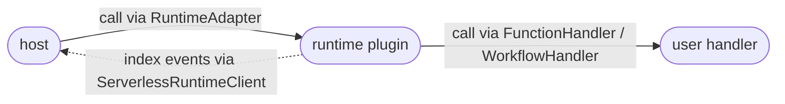
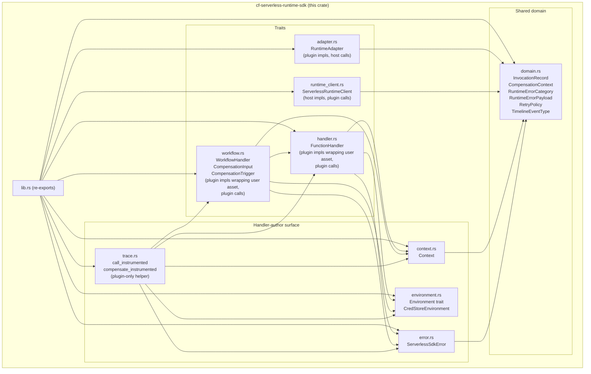
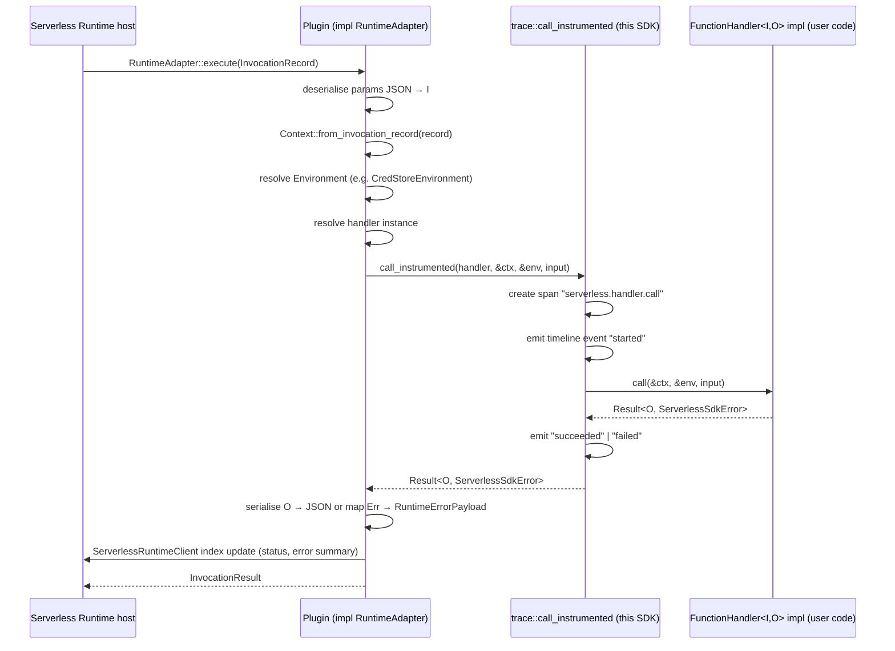
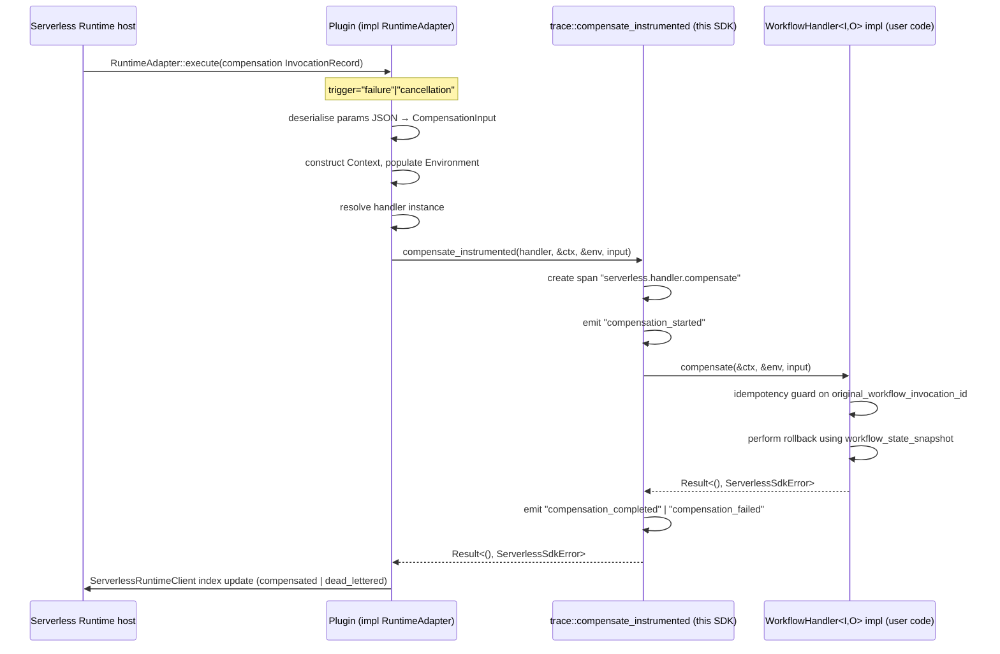

<!--
Created: 2026-03-30 by Constructor Tech
Updated: 2026-03-30 by Constructor Tech
-->

# Technical Design — CyberFabric Serverless Runtime SDK


<!-- toc -->

- [1. Architecture Overview](#1-architecture-overview)
  - [1.1 Architectural Vision](#11-architectural-vision)
  - [1.2 Architecture Drivers](#12-architecture-drivers)
  - [1.3 Architecture Layers](#13-architecture-layers)
- [2. Principles & Constraints](#2-principles--constraints)
  - [2.1 Design Principles](#21-design-principles)
  - [2.2 Constraints](#22-constraints)
- [3. Technical Architecture](#3-technical-architecture)
  - [3.1 Domain Model](#31-domain-model)
  - [3.2 Component Model](#32-component-model)
  - [3.3 API Contracts](#33-api-contracts)
  - [3.4 Internal Dependencies](#34-internal-dependencies)
  - [3.5 External Dependencies](#35-external-dependencies)
  - [3.6 Interactions & Sequences](#36-interactions--sequences)
  - [3.7 Testability Architecture](#37-testability-architecture)
  - [Database schemas & tables](#database-schemas--tables)
  - [3.8 Capacity, Cost, and Deployment Exclusions](#38-capacity-cost-and-deployment-exclusions)
- [4. Additional Context](#4-additional-context)
  - [Relationship to the Serverless Runtime Design](#relationship-to-the-serverless-runtime-design)
  - [Comparison with Similar Solutions](#comparison-with-similar-solutions)
  - [Known Technical Debt](#known-technical-debt)
  - [Crate Naming Convention](#crate-naming-convention)
- [5. Non-Applicable Domains](#5-non-applicable-domains)
- [6. Traceability](#6-traceability)

<!-- /toc -->

<!--
=============================================================================
TECHNICAL DESIGN DOCUMENT
=============================================================================
PURPOSE: Define HOW the system is built — architecture, components, APIs,
data models, and technical decisions that realize the requirements.

DESIGN IS PRIMARY: DESIGN defines the "what" (architecture and behavior).
ADRs record the "why" (rationale and trade-offs) for selected design
decisions; ADRs are not a parallel spec, they are traceability artifacts.

SCOPE:
  ✓ Architecture overview and vision
  ✓ Design principles and constraints
  ✓ Component model and interactions
  ✓ API contracts and interfaces
  ✓ Data models

NOT IN THIS DOCUMENT (see other templates):
  ✗ Requirements → PRD.md
  ✗ Detailed rationale for decisions → ADR/
  ✗ Step-by-step implementation flows → features/

STANDARDS ALIGNMENT:
  - IEEE 1016-2009 (Software Design Description)
  - IEEE 42010 (Architecture Description)
  - ISO/IEC 15288 / 12207 (Architecture & Design Definition processes)

DESIGN LANGUAGE:
  - Be specific and clear; no fluff, bloat, or emoji
  - Reference PRD requirements using `cpt-cf-serverless-runtime-sdk-fr-{slug}` IDs
=============================================================================
-->

- [ ] `p1` - **ID**: `cpt-cf-serverless-runtime-sdk-design-root`
## 1. Architecture Overview

### 1.1 Architectural Vision

`cf-serverless-runtime-sdk` is the engine-agnostic contract crate of the serverless-runtime module. It exposes traits and value types used by the host and by runtime plugins. It has no runtime state, no I/O, and no engine-specific dependencies.

The invocation flow through this crate's types:



**Traits — who implements, who calls:**

| Trait | Implemented by | Called by |
|---|---|---|
| `RuntimeAdapter` | runtime plugin | host |
| `ServerlessRuntimeClient` | host | plugin (to emit index-update events) |
| `FunctionHandler<I, O>` / `WorkflowHandler<I, O>` | runtime plugin (wraps the function author's authoring asset) | plugin |

> **Note on "who implements `FunctionHandler`".** The `impl FunctionHandler<I, O> for …` lives inside the runtime plugin — the plugin provides a Rust type that wraps a **function author's authoring asset** (a Starlark script, a Rust activity fn, a compiled WASM module, a deployed Lambda function, …). Inside `call`, the plugin executes that asset. Function authors never implement SDK traits directly; they author in the plugin's own authoring model and the plugin bridges that into a `FunctionHandler`. A plugin could choose to expose `FunctionHandler` as its own authoring model for power users, but that's a minority case.

**Shared domain** (used across all three parties): `InvocationRecord`, `CompensationContext`, `RuntimeErrorCategory`, `RuntimeErrorPayload`, `RetryPolicy`, `TimelineEventType`.

**Handler-author projections** (ergonomic views of the shared domain that appear in the `FunctionHandler::call` signature): `Context` (from `InvocationRecord`), `CompensationInput` (from `CompensationContext`), `ServerlessSdkError` (maps to `RuntimeErrorCategory`).

**Other modules**: `environment` (`Environment` trait + `CredStoreEnvironment` impl for synchronous config/secret access), `trace` (plugin-only helper that emits `TimelineEventType` events around handler calls).

The `async-trait` crate is used for `RuntimeAdapter`, `FunctionHandler`, and `WorkflowHandler`, making them ergonomic to implement and ensuring the returned `Future` is `+ Send` without callers annotating anything.

For the module-wide decomposition (how host, plugins, and this SDK fit together) see [`modules/serverless-runtime/docs/DESIGN.md`](../../docs/DESIGN.md).

### 1.2 Architecture Drivers

#### Functional Drivers

| Requirement | Design Response |
|-------------|-----------------|
| `cpt-cf-serverless-runtime-sdk-fr-handler-trait` | `FunctionHandler<I, O>` generic async trait in `handler.rs` |
| `cpt-cf-serverless-runtime-sdk-fr-handler-send-sync` | `Handler: Send + Sync + 'static` bound on the trait definition |
| `cpt-cf-serverless-runtime-sdk-fr-workflow-handler-trait` | `WorkflowHandler<I, O>: FunctionHandler<I, O>` supertrait in `workflow.rs` |
| `cpt-cf-serverless-runtime-sdk-fr-compensation-input` | `CompensationInput` struct in `workflow.rs`, `#[non_exhaustive]` |
| `cpt-cf-serverless-runtime-sdk-fr-context` | `Context` struct in `context.rs` with 9 fields from `InvocationRecord` |
| `cpt-cf-serverless-runtime-sdk-fr-deadline-helpers` | `is_deadline_exceeded()` and `remaining_time()` on `Context` |
| `cpt-cf-serverless-runtime-sdk-fr-environment-trait` | Sync `Environment` trait with `CredStoreEnvironment` impl in `environment.rs` |
| `cpt-cf-serverless-runtime-sdk-fr-error-model` | `#[non_exhaustive]` `ServerlessSdkError` with `thiserror` in `error.rs` |
| `cpt-cf-serverless-runtime-sdk-fr-trace-module` | `trace.rs` with `call_instrumented` and `compensate_instrumented` |
| `cpt-cf-serverless-runtime-sdk-fr-no-consumer-tracing` | `tracing` calls contained entirely within `trace.rs` |

#### NFR Allocation

| NFR ID | NFR Summary | Allocated To | Design Response | Verification Approach |
|--------|-------------|--------------|-----------------|----------------------|
| `cpt-cf-serverless-runtime-sdk-nfr-no-engine-deps` | No engine-specific deps | All modules | Dep list restricted to `serde`, `serde_json`, `thiserror`, `async-trait`, `tracing` | `cargo deny` in CI |
| `cpt-cf-serverless-runtime-sdk-nfr-no-unsafe` | Zero `unsafe` blocks | All modules | Workspace `unsafe_code = "forbid"` lint; no pointer manipulation | Lint enforced at compile time |
| `cpt-cf-serverless-runtime-sdk-nfr-low-overhead` | No blocking I/O or extra heap allocs on hot path | `trace.rs`, `handler.rs` | `call_instrumented` introduces one `Box<dyn Future>` (async-trait) and one `tracing` span; no additional heap allocations on the hot path | Code review on PRs touching `trace.rs` or `handler.rs` |
| `cpt-cf-serverless-runtime-sdk-nfr-api-docs` | Zero missing-doc warnings; `#![deny(missing_docs)]` | All public items | All public types, traits, and functions documented with purpose, usage, and invariants | `cargo doc --no-deps` in CI |
| `cpt-cf-serverless-runtime-sdk-nfr-authoring-ergonomics` | Plain `async fn` syntax; no lifetime annotations on handler impls | `handler.rs`, `workflow.rs` | `async-trait` expands `async fn` to `Pin<Box<dyn Future + Send>>` internally, keeping the `impl` surface annotation-free | SDK examples and integration tests compile with `async fn` syntax; CI fails on any explicit `impl Future` or lifetime annotation on method signatures |

#### Key Design Decisions

| Decision | Summary |
|----------|---------|
| `async-trait` over native `async fn` in traits | Rust supports `async fn` in trait definitions natively (RPITIT — Return Position `impl Trait` In Traits), but the returned future does not carry a `Send` bound by default. Multi-threaded async runtimes require `Send` futures. The `async-trait` crate adds the `Send` bound automatically via `Pin<Box<dyn Future + Send>>`. Use `async-trait` until native `async fn` in traits supports `Send`-bounded futures ergonomically on stable Rust. |
| Synchronous `Environment` | Pre-fetch config/secrets from the platform credstore before invocation; handlers access them synchronously via the `Environment` trait |
| Structured `CompensationInput` | Dedicated struct with named fields, not a generic handler input parameter |
| Concrete `Context` struct | Not a trait or generic parameter — keeps construction simple and mapping explicit |
| `#[non_exhaustive]` error enum | `ServerlessSdkError` is an enum (not a trait object) for exhaustive `RuntimeErrorCategory` mapping |
| `WorkflowHandler` supertrait | `WorkflowHandler<I,O>: FunctionHandler<I,O>` — every workflow is a function |

### 1.3 Architecture Layers

The serverless-runtime module has a thin host and fat runtime plugins. This SDK is the single contract crate that sits between them: the host invokes plugins through the `RuntimeAdapter` trait, and plugins invoke user code through the handler traits.

```
╔══════════════════════════════════════════════════════════════╗
║  Host (serverless-runtime crate)                             ║
║  Registry · Tenant Policy · REST · GTS validation · audit    ║
║  plugin dispatch · lightweight invocation index              ║
║  depends on: cf-serverless-runtime-sdk (RuntimeAdapter,      ║
║              InvocationRecord, RuntimeErrorCategory, …)      ║
╚═══════════════════════╤══════════════════════════════════════╝
                        │ dispatches through dyn RuntimeAdapter
╔═══════════════════════▼══════════════════════════════════════╗
║  Runtime Plugin (serverless-runtime/plugins/<backend>-plugin) ║
║  Implements RuntimeAdapter (invocation, control, schedule,    ║
║  event-trigger) using backend-native primitives.              ║
║  Implements/invokes FunctionHandler<I, O> / WorkflowHandler.  ║
║  Applies RetryPolicy using engine-native mechanisms.          ║
║  (Temporal · Starlark · cloud FaaS — plugins out of scope)    ║
╚═══════════════════════╤══════════════════════════════════════╝
                        │ depends on
╔═══════════════════════▼══════════════════════════════════════╗
║  cf-serverless-runtime-sdk  (this crate)                      ║
║                                                               ║
║  Shared domain                                                ║
║  ┌────────────────────────────────────────────────────────┐   ║
║  │  InvocationRecord · CompensationContext                │   ║
║  │  RuntimeErrorCategory · RuntimeErrorPayload            │   ║
║  │  RetryPolicy · TimelineEventType                       │   ║
║  └────────────────────────────────────────────────────────┘   ║
║                                                               ║
║  Traits                                                       ║
║  ┌────────────────────────────────────────────────────────┐   ║
║  │  RuntimeAdapter          (plugin impls, host calls)    │   ║
║  │  ServerlessRuntimeClient (host impls, plugin calls)    │   ║
║  │  FunctionHandler /                                     │   ║
║  │  WorkflowHandler         (plugin impls wrapping user   │   ║
║  │                           authoring asset, plugin      │   ║
║  │                           calls)                       │   ║
║  └────────────────────────────────────────────────────────┘   ║
║                                                               ║
║  Handler-author surface (user-facing modules)                 ║
║  ┌──────────┐ ┌───────────┐ ┌───────┐ ┌──────────┐           ║
║  │ handler  │ │ workflow  │ │ error │ │ context  │           ║
║  └──────────┘ └───────────┘ └───────┘ └──────────┘           ║
║  ┌─────────────────┐ ┌───────────────────────────┐            ║
║  │  environment    │ │  trace  (plugin-only)      │           ║
║  └─────────────────┘ └───────────────────────────┘            ║
╚═══════════════════════════════════════════════════════════════╝
```

| Layer | Responsibility | Technology |
|-------|---------------|------------|
| Host | Registry, tenant policy, REST façade, GTS validation, audit, plugin dispatch, lightweight invocation index | Rust, ModKit, SecureORM |
| Runtime Plugin | Implements `RuntimeAdapter` for one backend; owns invocation, scheduling, event-trigger, retry, compensation using backend-native primitives; invokes user handlers through `FunctionHandler` / `WorkflowHandler` | Rust + `async-trait`, backend SDK |
| SDK (this crate) | Shared domain types; `RuntimeAdapter` (plugins implement, host calls); `ServerlessRuntimeClient` (host implements, plugins call); `FunctionHandler`/`WorkflowHandler` (plugin implements wrapping user authoring asset, plugin calls); handler-author projections (`Context`, `CompensationInput`, `ServerlessSdkError`); plugin-only `trace` instrumentation | Rust stable, `serde`, `thiserror`, `async-trait`, `tracing`, `cf-credstore-sdk` |

---

## 2. Principles & Constraints

### 2.1 Design Principles

#### Implementation-Agnostic Authoring Contract

- [ ] `p1` - **ID**: `cpt-cf-serverless-runtime-sdk-principle-impl-agnostic`

No engine-specific type appears in the public API of this crate. `Context`, `Environment`,
`CompensationInput`, and `ServerlessSdkError` are entirely defined in terms of stable
platform concepts (GTS IDs as `String`, `serde_json::Value` for opaque payloads) without
depending on any adapter. This directly enforces
`cpt-cf-serverless-runtime-principle-impl-agnostic` at the SDK layer.

`Environment` is synchronous because handlers should not perform async I/O for config/secret
resolution. The SDK pre-fetches values from the platform credstore (`CredStoreClientV1`)
before invocation and exposes them through the synchronous `Environment` trait.

#### GTS Identity by Reference

- [ ] `p1` - **ID**: `cpt-cf-serverless-runtime-sdk-principle-gts-by-reference`

GTS type IDs (`function_id`, `error_type_id`, GTS chain strings) are carried as opaque
`String` values throughout the crate. The SDK never interprets, parses, or validates GTS
chains. This prevents coupling to GTS library versions and keeps the crate portable.

#### Minimal Trusted Surface

- [ ] `p1` - **ID**: `cpt-cf-serverless-runtime-sdk-principle-minimal-surface`

The crate exposes exactly the types and traits required for handler authoring and adapter
driving. No utility types, convenience wrappers, or domain-specific helpers are added
unless they directly serve a stated requirement. Every public item must be justifiable
by a PRD requirement ID.

### 2.2 Constraints

#### No Engine Dependencies — Ever

- [ ] `p1` - **ID**: `cpt-cf-serverless-runtime-sdk-constraint-no-engine-deps`

The `[dependencies]` section of `Cargo.toml` must never include engine-specific crates.
This constraint is permanent: adding an engine dependency invalidates the adapter
portability guarantee and breaks the implementation-agnostic principle.

#### SDK Trust Boundary — All Inputs Are Trusted

- [ ] `p1` - **ID**: `cpt-cf-serverless-runtime-sdk-constraint-trust-boundary`

The SDK accepts all inputs it receives as trusted. Specifically:

- `Context` fields (`tenant_id`, `invocation_id`, `correlation_id`, etc.) are populated
  by the adapter from the runtime's `InvocationRecord`; the SDK does not validate them.
- `input: I` is a value the adapter has already deserialised from the runtime's `params`
  JSON; the SDK does not validate the deserialized value's business invariants.
- `env: &dyn Environment` is a pre-populated snapshot provided by the adapter; the SDK
  does not verify secret resolution or access control.

Input validation (schema conformance, injection prevention, privilege constraints) is the
responsibility of the Serverless Runtime API layer and adapter before the handler is called.
Handler implementations are responsible for validating *business* invariants on `input: I`
within their `call` implementation and returning `ServerlessSdkError::InvalidInput` if
those invariants are violated.

#### Stable Rust — No Nightly Features

- [ ] `p1` - **ID**: `cpt-cf-serverless-runtime-sdk-constraint-stable-rust`

The crate must compile on the workspace minimum Rust version without any nightly features,
attributes, or unstable library APIs. Design decisions that require nightly (e.g., RPITIT
with `Send` bounds before stabilisation) must be replaced with stable alternatives.

---

## 3. Technical Architecture

### 3.1 Domain Model

**Technology**: Rust structs and traits
**Location**: [`serverless-runtime-sdk/src/`](../src/)

#### InvocationRecord → Context Field Mapping

`Context` is the SDK's read-only projection of the runtime's `InvocationRecord`.
The SDK constructs `Context` from the record before calling the handler via
`Context::from_invocation_record()` — a deterministic mapping.

| `Context` field | Source in Runtime | Type |
|-----------------|-------------------|------|
| `invocation_id` | `InvocationRecord.invocation_id` | `String` |
| `function_id` | `InvocationRecord.function_id` | `String` (GTS ID) |
| `function_version` | `InvocationRecord.function_version` | `String` — semantic version of the function deployment (`^\d+\.\d+\.\d+$`); distinct from the GTS chain version in `function_id` |
| `tenant_id` | `InvocationRecord.tenant_id` | `String` |
| `attempt_number` | Adapter-tracked retry count | `u32` (1-indexed) |
| `correlation_id` | `InvocationObservability.correlation_id` | `String` |
| `trace_id` | `InvocationObservability.trace_id` | `Option<String>` |
| `span_id` | `InvocationObservability.span_id` | `Option<String>` |
| `deadline` | Computed from `FunctionLimits.timeout_seconds` at invocation start | `Option<std::time::Instant>` |

**Fields omitted from Context** (runtime concerns, not handler concerns):
`status`, `mode`, `params` (typed via `I`), `result`, `error`, `timestamps`,
`metrics`.

#### CompensationContext → CompensationInput Field Mapping

`CompensationInput` is the SDK's projection of the runtime's `CompensationContext`
(`gts.x.core.serverless.compensation_context.v1~`). The adapter deserialises the
runtime's JSON envelope and populates this struct.

| `CompensationInput` field | Source in Runtime's `CompensationContext` | Type |
|--------------------------|-------------------------------------------|------|
| `trigger` | `trigger` (`"failure"` / `"cancellation"`) | `CompensationTrigger` enum |
| `original_workflow_invocation_id` | `original_workflow_invocation_id` | `String` |
| `failed_step_id` | `failed_step_id` | `String` |
| `failed_step_error` | `failed_step_error` | `Option<FailedStepError>` |
| `workflow_state_snapshot` | `workflow_state_snapshot` | `serde_json::Value` |
| `timestamp` | `timestamp` | `String` (ISO 8601) |
| `function_id` | `invocation_metadata.function_id` | `String` (GTS ID) |
| `original_input` | `invocation_metadata.original_input` | `serde_json::Value` |
| `tenant_id` | `invocation_metadata.tenant_id` | `String` |
| `correlation_id` | `invocation_metadata.correlation_id` | `Option<String>` |
| `started_at` | `invocation_metadata.started_at` | `Option<String>` (ISO 8601) |

`FailedStepError` is a typed projection of the runtime's `failed_step_error` object:
`error_type: String`, `message: String`, `error_metadata: Option<serde_json::Value>`.

Field names match the runtime's `CompensationContext` schema exactly. `correlation_id`
and `started_at` are `Option` because the runtime schema marks them as optional within
`invocation_metadata`.

#### ServerlessSdkError → RuntimeErrorCategory Mapping

Adapters use this mapping to produce the correct `RuntimeErrorPayload` from a
`ServerlessSdkError` returned by a handler.

| `ServerlessSdkError` | `RuntimeErrorCategory` | GTS Error Type Hint |
|----------------------|------------------------|---------------------|
| `UserError(msg)` | `NonRetryable` | `gts.x.core.serverless.err.v1~x.core.serverless.err.validation.v1~` |
| `InvalidInput(msg)` | `NonRetryable` | `gts.x.core.serverless.err.v1~x.core.serverless.err.validation.v1~` |
| `Timeout` | `Timeout` | `gts.x.core.serverless.err.v1~x.core.serverless.err.runtime_timeout.v1~` |
| `NotSupported(msg)` | `NonRetryable` | adapter-defined |
| `Internal(msg)` | `Retryable` | adapter-defined |

**Variant semantics for adapter authors** — both `UserError` and `InvalidInput` are `NonRetryable`; the distinction is:
- `InvalidInput` — the request violates a structural or type constraint that the handler checked (e.g., a required field is absent, a value is out of allowed range). Return this *before* any side effects.
- `UserError` — the request is structurally valid but rejected by business logic (e.g., insufficient funds, duplicate resource, forbidden action for the caller's state). Return this after business rules are evaluated.

**Adapter-only categories** (never produced by handler code):

| `RuntimeErrorCategory` | Origin | Notes |
|------------------------|--------|-------|
| `ResourceLimit` | Adapter | Tenant quota or resource limit exceeded; adapter signals before or during invocation |
| `Canceled` | Runtime | External cancellation; runtime applies this status, not the handler |

#### API Stability: `#[non_exhaustive]` Surface Summary

All public types in this crate that may gain fields or variants in future semver-compatible
releases are declared `#[non_exhaustive]`. The table below is the authoritative reference
for which types carry this attribute and what it means for each consumer role.

| Type | `#[non_exhaustive]` | Impact on adapter authors | Construction / match pattern |
|------|---------------------|--------------------------|------------------------------|
| `ServerlessSdkError` | Yes (enum) | `match` must include a `_` catch-all arm | `match` must include a `_` catch-all arm; no compile-time signal exists for new variants — adapter maintainers must consult DESIGN.md §3.1 when updating the SDK dependency |
| `CompensationInput` | Yes (struct) | Field access by name is stable; struct literal construction outside the crate is forbidden | Adapter constructs `CompensationInput` via `CompensationInput::new(trigger, original_workflow_invocation_id, failed_step_id, failed_step_error, workflow_state_snapshot, timestamp, function_id, original_input, tenant_id, correlation_id, started_at)` — a `pub fn new(...)` constructor defined in the crate |
| `FailedStepError` | Yes (struct) | Field access by name is stable; struct literal construction outside the crate is forbidden | Constructed via `FailedStepError::new(error_type, message, error_metadata)` |
| `CompensationTrigger` | Yes (enum) | `match` must include a `_` catch-all arm | `match` must include a `_` catch-all arm |
| `Context` | No | All 9 fields are stable; struct literal construction is used in tests | Constructed via `Context::from_invocation_record()`; test code uses struct literal syntax. Any field addition is a compile break at the mapping site — intentional, to force the `InvocationRecord → Context` mapping to stay in sync. |

**Note on `Context`**: `Context` is not `#[non_exhaustive]` because
`Context::from_invocation_record()` and test code use struct literal form.
Adding or removing a field is a compile-breaking change at the mapping site,
ensuring it stays in sync with `InvocationRecord`.

### 3.2 Component Model



**Dependency direction**: handler-author modules (`context`, `error`, `workflow`) depend on the shared domain where a projection exists (e.g., `Context` projects from `InvocationRecord`; `ServerlessSdkError` maps to `RuntimeErrorCategory`). `RuntimeAdapter` and `ServerlessRuntimeClient` do not depend on handler traits — the host can consume this crate through `RuntimeAdapter` + domain types alone without pulling in `FunctionHandler` definitions it never uses (though in practice `lib.rs` re-exports everything).

#### context.rs — Context

- [ ] `p1` - **ID**: `cpt-cf-serverless-runtime-sdk-component-context`

##### Why this component exists

Handlers need a stable, read-only view of their own invocation identity and execution
constraints. `Context` provides exactly this without exposing the full `InvocationRecord`
or any runtime internals.

##### Responsibility scope

Owns: `Context` struct (9 fields), `is_deadline_exceeded()`, `remaining_time()` helpers.
Derives: `Debug`, `Clone`. `deadline: Option<std::time::Instant>` is `Copy`, so `Context`
is cheaply cloneable for test construction. `is_deadline_exceeded()` and `remaining_time()`
are marked `#[must_use]` — ignoring the return value is a logic error.

##### Responsibility boundaries

Does not own: any mutable invocation state, status transitions, retry tracking, raw `params`
(those come as typed `I` through the handler). Does not parse GTS chains.

---

#### environment.rs — Environment

- [ ] `p1` - **ID**: `cpt-cf-serverless-runtime-sdk-component-environment`

##### Why this component exists

Handlers need access to deployment configuration and secrets without coupling to
async resolution inside handler logic. `Environment` is the minimal abstraction
that satisfies this need synchronously.

##### Responsibility scope

Owns: `Environment` trait with `get_config` and `get_secret`, plus `CredStoreEnvironment`
— the standard implementation backed by `CredStoreClientV1` that plugins instantiate
before each invocation. Custom implementations remain possible for testing or non-standard
secret sources.

##### Responsibility boundaries

Does not own: credstore plugin discovery or credential management (platform concern),
secret caching beyond the per-invocation snapshot. `Environment` is a read-only
snapshot, not a live proxy.

**Design decision**: synchronous interface; SDK pre-fetches from credstore before invocation.

---

#### error.rs — ServerlessSdkError

- [ ] `p1` - **ID**: `cpt-cf-serverless-runtime-sdk-component-error`

##### Why this component exists

Handlers need to express failure semantics (business logic errors, invalid input, timeout,
unsupported operations, internal failures) in a way that unambiguously maps to
`RuntimeErrorCategory` without depending on runtime types.

##### Responsibility scope

Owns: `ServerlessSdkError` enum with 5 `#[non_exhaustive]` variants, each with documented
`RuntimeErrorCategory` mapping. Derives: `Debug`. Implements `Display + std::error::Error`
via `thiserror`. Does **not** derive `Clone` or `PartialEq` — error values are consumed at
the adapter boundary and not compared or cloned in SDK code.

##### Responsibility boundaries

Does not own: `RuntimeErrorPayload` construction (adapter concern), error type GTS ID
assignment (adapter concern), retry logic (runtime concern).

---

#### handler.rs — Handler

- [ ] `p1` - **ID**: `cpt-cf-serverless-runtime-sdk-component-handler`

##### Why this component exists

`FunctionHandler<I, O>` is the base callable contract. Every serverless function — stateless or
durable — is a `FunctionHandler`. This is the SDK expression of
`cpt-cf-serverless-runtime-principle-unified-function` and the GTS `function.v1~` base type.

##### Responsibility scope

Owns: `FunctionHandler<I, O>` async trait with `call` method. Declares `I: DeserializeOwned + Send + 'static`
and `O: Serialize + Send + 'static` bounds. Requires `Self: Send + Sync + 'static`.

The canonical adapter storage pattern is `Arc<dyn FunctionHandler<I, O> + Send + Sync>`: shared
ownership across concurrent invocations on a multi-threaded async runtime. `Box<dyn FunctionHandler<I, O>>`
is valid for single-owner dispatch but insufficient for shared registry storage.

##### Responsibility boundaries

Does not own: span emission (trace module concern). Input deserialisation from raw JSON
and output serialisation are performed by the plugin before/after calling the handler
through `trace::call_instrumented`.

**Design decision**: `async-trait` for stable `Send`-bound futures.

---

#### workflow.rs — WorkflowHandler + CompensationInput

- [ ] `p1` - **ID**: `cpt-cf-serverless-runtime-sdk-component-workflow`

##### Why this component exists

Durable workflows require compensation capability (saga pattern, BR-133). `WorkflowHandler`
extends `FunctionHandler` with `compensate`, and `CompensationInput` provides the structured context
that compensation handlers receive — expressing the function-level compensation layer without
coupling to executor-specific step-level APIs.

##### Responsibility scope

Owns: `WorkflowHandler<I, O>` trait (extends `FunctionHandler<I, O>`) with `compensate` method.
Owns `CompensationInput` struct (11 fields, all `#[non_exhaustive]`), `FailedStepError` struct,
and `CompensationTrigger`
enum (`Failure`, `Cancellation`, `#[non_exhaustive]`).

##### Responsibility boundaries

Does not own: step-level compensation (plugin concern — each plugin uses its backend's
native compensation primitive: Temporal saga patterns, SQS DLQ + compensation queue,
Azure Durable compensation activities, etc.), checkpoint creation (plugin concern —
plugins write checkpoints using backend-native mechanisms; the SDK only reads checkpoint
state during compensation via `CompensationInput.workflow_state_snapshot`), state
machine transitions (`compensating` → `compensated` / `dead_lettered` — host concern,
observed via the lightweight invocation index). Deserialisation of `CompensationInput`
from the runtime's `CompensationContext` JSON is performed by the plugin before
calling `trace::compensate_instrumented`.

**Related**: `cpt-cf-serverless-runtime-sdk-component-handler`

**Design decision**: structured type with named fields, not a generic handler input.

---

#### trace.rs — Instrumentation Utilities

- [ ] `p1` - **ID**: `cpt-cf-serverless-runtime-sdk-component-trace`

##### Why this component exists

The Serverless Runtime emits `InvocationTimelineEvent` records for every invocation.
These must be driven from a consistent, centrally-defined location without SDK consumers
adding any observability code. `trace.rs` is the sole location where `tracing` events
are emitted, and it is intended for adapter use only.

##### Responsibility scope

Owns: `call_instrumented<H, I, O>` and `compensate_instrumented<H, I, O>` free functions.
Each creates a named `tracing::info_span`, records optional `trace_id`/`span_id` fields
lazily, and emits `started`/`succeeded`/`failed` or `compensation_*` lifecycle events
that map to `TimelineEventType` variants.

##### Responsibility boundaries

Does not own: `tracing` subscriber setup (application/adapter concern), span export to
OpenTelemetry (adapter/platform concern), structured log routing, metrics.

##### Access control

`trace.rs` is `pub` but is designated **adapter-only** by convention and documentation.
No Rust visibility modifier prevents adapter authors from calling `call_instrumented` or
`compensate_instrumented` directly; however, doing so would duplicate spans and emit
incorrect lifecycle events (a second `started` event for an already-running invocation).

The enforcement strategy is documentation and code review, not compiler enforcement.
A future option is to gate `trace.rs` behind a `adapter` Cargo feature flag
(disabled by default for function-author-facing builds); this is tracked as a
known limitation and should be evaluated if SDK misuse is observed in practice.

##### Span fields emitted

| Field | Source | Notes |
|-------|--------|-------|
| `invocation_id` | `ctx.invocation_id` | Always present |
| `function_id` | `ctx.function_id` | Always present |
| `function_version` | `ctx.function_version` | `call_instrumented` only |
| `tenant_id` | `ctx.tenant_id` | Always present |
| `attempt_number` | `ctx.attempt_number` | Always present |
| `correlation_id` | `ctx.correlation_id` | Always present |
| `trace_id` | `ctx.trace_id` | Recorded lazily; absent if `None` |
| `span_id` | `ctx.span_id` | Recorded lazily; absent if `None` |
| `original_workflow_invocation_id` | `input.original_workflow_invocation_id` | `compensate_instrumented` only |
| `compensation_trigger` | `input.trigger` | `compensate_instrumented` only |
| `failed_step_id` | `input.failed_step_id` | `compensate_instrumented` only |

### 3.3 API Contracts

#### FunctionHandler<I, O> Trait Contract

- [ ] `p1` - **ID**: `cpt-cf-serverless-runtime-sdk-interface-handler-trait`

- **Type**: Rust async trait (`#[async_trait]`)
- **Technology**: `async-trait` 0.1
- **Stability**: unstable (0.x)

```
FunctionHandler<I, O>
  where I: DeserializeOwned + Send + 'static
        O: Serialize + Send + 'static
  Self: Send + Sync + 'static
  ─────────────────────────────────────────
  async fn call(
      &self,
      ctx: &Context,
      env: &dyn Environment,
      input: I,
  ) -> Result<O, ServerlessSdkError>
```

**Invariants**:
- `ctx` is immutable for the duration of `call`.
- `env` is populated before `call`; no async fetching inside. `get_config` and `get_secret`
  return `Option<&str>` that borrows from `&self` — every `Environment` implementation must
  own the string data (e.g., a `HashMap<String, String>`) and cannot lazily resolve values.
- Returning `Ok(O)` maps to `InvocationStatus::Succeeded`.
- Returning `Err(_)` maps to `InvocationStatus::Failed` (with retry if `Internal`).

#### WorkflowHandler<I, O> Trait Contract

- [ ] `p1` - **ID**: `cpt-cf-serverless-runtime-sdk-interface-workflow-trait`

- **Type**: Rust async trait (`#[async_trait]`), supertrait of `FunctionHandler<I, O>`
- **Stability**: unstable (0.x)

```
WorkflowHandler<I, O>: FunctionHandler<I, O>
  ─────────────────────────────────────────
  async fn compensate(
      &self,
      ctx: &Context,
      env: &dyn Environment,
      input: CompensationInput,
  ) -> Result<(), ServerlessSdkError>
```

**Invariants**:
- `compensate` may be called more than once for the same `original_workflow_invocation_id`;
  implementations must be idempotent.
- Returning `Err(_)` transitions the original invocation to `dead_lettered`.

### 3.4 Internal Dependencies

| Dependency | Interface Used | Purpose |
|------------|----------------|---------|
| `serde` | `DeserializeOwned`, `Serialize` derives | `FunctionHandler` I/O type bounds |
| `serde_json` | `serde_json::Value` | Opaque JSON fields in `CompensationInput` |
| `thiserror` | `#[derive(thiserror::Error)]` | `ServerlessSdkError` `Display + Error` impl |
| `async-trait` | `#[async_trait]` | Stable async fn in `FunctionHandler` and `WorkflowHandler` |
| `tracing` | `info_span!`, `info!`, `error!`, `Instrument` | Timeline event emission in `trace.rs` only |

**Dependency Rules**:
- No circular dependencies (this is a leaf library).
- No cross-module type imports except through `lib.rs` re-exports.
- `trace.rs` may import from all other modules but no other module imports from `trace.rs`.

### 3.5 External Dependencies

This crate has no external system dependencies (no HTTP, no database, no message broker).
All external integration happens through plugin crates that depend on this crate.

**Scope note — in-process runtime helper crate.** In-process runtimes that lack native
durable timers, event signals, or checkpointing (Starlark, a potential WASM backend)
will consume a separate plugin-level helper crate that provides those primitives. That
helper crate is **not** part of this SDK: it is a plugin-side dependency pulled in by
the plugins that need it (and only by those plugins), scoping the complexity to where
it is actually used instead of forcing every plugin to route through a runtime-neutral
substrate. This SDK remains minimal and engine-agnostic; plugins with backend-native
primitives (Temporal, cloud FaaS, Azure Durable) never touch the helper crate.

### 3.6 Interactions & Sequences

#### FunctionHandler Invocation Flow

**ID**: `cpt-cf-serverless-runtime-sdk-seq-handler-call`

**Use cases**: `cpt-cf-serverless-runtime-sdk-usecase-impl-handler`

The host dispatches to a plugin through `RuntimeAdapter::execute`; the plugin is responsible for deserialising `params`, constructing `Context`, populating `Environment`, invoking the user handler via `trace::call_instrumented`, and emitting the result back to the host. Each plugin implements this bridge using its backend's native primitives; this SDK provides only the traits and helpers the plugin uses.



#### Compensation Flow

**ID**: `cpt-cf-serverless-runtime-sdk-seq-compensate`

**Use cases**: `cpt-cf-serverless-runtime-sdk-usecase-impl-compensation`



**Note on uniform semantics**: because each plugin owns its own invocation bridge, this SDK does not centralise a `dispatch_invocation` helper. Uniform user-visible semantics (status transitions, retry contract, compensation triggering, error taxonomy, timeline events) are enforced by the typed contracts in this SDK — trait shapes, `ServerlessSdkError` → `RuntimeErrorCategory` mapping, and the `trace::*_instrumented` event taxonomy — together with per-plugin integration tests that each plugin author runs against their backend. A cross-plugin conformance test harness is not part of this SDK; it may be added later once at least two plugins exist to derive a stable contract from.

### 3.7 Testability Architecture

The trait-based design ensures all components are independently testable without adapter
infrastructure.

**Mock boundaries:**

| Boundary | Test Double | Notes |
|----------|-------------|-------|
| `Environment` trait | Any `HashMap<String, String>`-backed impl for unit tests; `CredStoreEnvironment` for integration tests | Unit tests need no credstore; integration tests use the standard impl |
| `FunctionHandler<I, O>` | Direct invocation: `handler.call(&ctx, &env, input).await` | No adapter, no spawned tasks |
| `WorkflowHandler<I, O>` | Direct invocation: `handler.compensate(&ctx, &env, input).await` | Test idempotency with identical `original_workflow_invocation_id` |
| `Context` | Fully constructible in tests; set `deadline` to a past `Instant` to test expired-deadline paths | No runtime infrastructure |
| `trace.rs` | Any `tracing::Subscriber` (e.g., `tracing-subscriber` with test collector) | No SDK-specific subscriber |

**Test isolation approach:** Each module (`context.rs`, `environment.rs`, `error.rs`,
`handler.rs`, `workflow.rs`, `trace.rs`) is independently testable; no shared mutable
state across invocations. All SDK types are `Send + Sync`, compatible with parallel test runners.

**Testing strategy:**

| Level | Approach | Scope |
|-------|----------|-------|
| Unit | Per-module tests with HashMap-backed `Environment` mock and minimal `Context` | Trait compilation, error variant mapping, deadline helper behavior |
| Integration | Compile-only test: `impl FunctionHandler` + `impl WorkflowHandler` without any adapter crate | Verifies API contract compiles on stable 1.92.0 |
| Performance | Code review: verify `call_instrumented` introduces no blocking I/O or extra heap allocations | Verifies `nfr-low-overhead` threshold (one `Box<dyn Future>` + one span) |

### Database schemas & tables

**Not applicable.** This crate is a pure Rust library with no database, no persistence layer,
and no schema definitions. There are no SQL or NoSQL schemas, no ORM entities, and no
migration files owned by this module. All data structures are in-memory Rust types
defined in §3.1 (Domain Model).

### 3.8 Capacity, Cost, and Deployment Exclusions

The following capacity and cost planning domains are not applicable to this design and are
explicitly excluded:

| Domain | Disposition | Reasoning |
|--------|-------------|-----------|
| Capacity planning | N/A | Pure library crate; no runtime process, no user-facing endpoints, no data storage. Capacity is entirely determined by the consuming adapter and its runtime. |
| Cost estimation / budgeting | N/A | Pure library crate; no infrastructure provisioned, no compute resources allocated by this crate. Cost is an adapter/platform concern. |
| Deployment topology | N/A | Library crate with no deployment artifact; distributed as a Cargo crate, consumed at compile time. |

---

## 4. Additional Context

### Relationship to the Serverless Runtime Design

This crate is the single shared SDK of the serverless-runtime module. It owns both:

- **Shared domain types** (`InvocationRecord`, `CompensationContext`, `RuntimeErrorCategory`,
  `RuntimeErrorPayload`, `RetryPolicy`, `TimelineEventType`): these types live in this SDK
  crate so host and plugins share a single compile-time definition without the host
  depending on any plugin crate. `RetryPolicy` is platform-defined (max attempts, backoff,
  non-retryable error classification) and exported from this crate so every plugin honours
  it consistently; plugins *apply* it using their backend's engine-native retry mechanism.
  See the module-level [DESIGN.md](../../docs/DESIGN.md) for how these types are consumed
  by the host (registry, lightweight invocation index, etc.).
- **Projections used by handler code**:
  - `Context` is a projection of `InvocationRecord`.
  - `CompensationInput` is a projection of `CompensationContext`
    (`gts.x.core.serverless.compensation_context.v1~`).
  - `ServerlessSdkError` variants map to `RuntimeErrorCategory` values (see §3.1).
  - `trace.rs` timeline events correspond to `TimelineEventType` values.

Dependency direction:

```
host crate (serverless-runtime) ──► this SDK
plugin crate (<backend>-plugin)  ──► this SDK
                                       ▲
user handler crate (optional) ─────────┘ (via FunctionHandler / WorkflowHandler traits)
```

Each plugin is responsible for constructing the deterministic field mappings between
its backend-native record types and the shared domain types exported by this SDK.
This crate provides the *target* types and the trait surface; it does not provide a
central dispatch helper — each plugin bridges its backend's invocation primitive to
`FunctionHandler::call` using `trace::call_instrumented` as the single uniform
instrumentation point.

### Comparison with Similar Solutions

| Solution | Handler model | Context model | Error model | Compensation |
|----------|---------------|---------------|-------------|--------------|
| **This crate** | `async trait FunctionHandler<I, O>` + `WorkflowHandler<I, O>: FunctionHandler<I, O>` | Concrete `Context` struct (platform-owned fields) | `#[non_exhaustive]` enum → `RuntimeErrorCategory` | `WorkflowHandler::compensate` (structured `CompensationInput`) |
| AWS Lambda Rust Runtime | `fn handler(event: E, ctx: Context) -> Result<R, E>` free-function or `tower::Service` | Concrete `lambda_runtime::Context` struct | `Box<dyn Error>` — opaque, no retry category | None — compensation is application-level |
| Temporal Rust SDK | `#[workflow]` proc-macro on async fn; activities as `#[activity]` async fn | `workflow::Context` injected via proc-macro | `ApplicationError` with explicit `non_retryable` flag | Step-level rollback via custom activity sequencing; no first-class saga trait |
| Cloudflare Workers (Rust via wasm) | `#[event(fetch)]` on async fn; `Request`/`Response` types | `Env` struct for bindings | `worker::Error` enum | None |
| Apache OpenWhisk Rust | Free function `fn main(args: Value) -> Value`; no trait | No context; caller metadata in args JSON | Return value discrimination (error key in JSON) | None |

**Key differentiators of this crate:**

- **Typed `RuntimeErrorCategory` mapping**: Unlike Lambda's opaque `Box<dyn Error>` or
  OpenWhisk's JSON key convention, `ServerlessSdkError` variants map deterministically to
  retry categories — the platform can make correct retry decisions without runtime inspection.
- **First-class compensation trait**: Unlike Temporal's SDK (which handles saga rollback
  via activity sequencing in the workflow body) or Lambda (no compensation concept),
  `WorkflowHandler::compensate` is a first-class, compiler-enforced obligation on every
  durable workflow.
- **No proc-macros, no code generation**: Unlike Temporal's `#[workflow]` / `#[activity]`
  macros, this crate uses plain traits and `#[async_trait]`. Adapter developers implement
  traits directly; no hidden code generation.
- **Adapter-agnostic by construction**: Unlike Lambda's SDK (AWS-specific) or Workers
  (Cloudflare-specific), this crate has no runtime-specific dependency; the same
  `FunctionHandler` implementation can run on any adapter without modification.

### Known Technical Debt

| Item | Nature | Migration Path |
|------|--------|----------------|
| `async-trait` dependency | One heap allocation (`Box<dyn Future>`) per `call`/`compensate` invocation; extra `#[async_trait]` annotation required on every `impl` block | Remove when native `async fn` in traits (RPITIT — Return Position `impl Trait` In Traits) supports `Send`-bounded futures ergonomically on stable Rust. Migration is backward-compatible at the trait level. |

### Crate Naming Convention

Following the workspace `cf-<name>` convention:

| Artifact | Value |
|----------|-------|
| Directory | `modules/serverless-runtime/serverless-sdk/` (a rename to `serverless-runtime-sdk/` for consistency with the crate/package name is deferred) |
| Package name | `cf-serverless-runtime-sdk` |
| Lib name | `serverless_runtime_sdk` |
| Import | `use serverless_runtime_sdk::...` |

---

## 5. Non-Applicable Domains

The following checklist domains are not applicable to this DESIGN. Absence of content
in these areas is deliberate, not an omission.

| Domain | Checklist Item | Disposition | Reasoning |
|--------|---------------|-------------|-----------|
| SEC — Authentication | SEC-DESIGN-001 | N/A | No user sessions, no HTTP endpoints, no credential management at the SDK layer. |
| SEC — Authorization | SEC-DESIGN-002 | N/A | No permission model; all actors are trusted internal platform developers. |
| SEC — Data Protection | SEC-DESIGN-003 | N/A | SDK passes data as opaque blobs (`I`, `O`, `serde_json::Value`); no PII stored or transmitted. |
| SEC — Security Boundaries | SEC-DESIGN-004 | N/A | Pure library; no network boundary, no process boundary, no trust zone separation required. |
| SEC — Threat Modeling | SEC-DESIGN-005 | N/A | Pure library with no attack surface; no network exposure, no credential management, no data storage. |
| SEC — Audit Logging | SEC-DESIGN-006 | Addressed via §3.2 `component-trace` | Invocation lifecycle tracing events are emitted by `trace.rs`; security audit beyond invocation events is adapter/runtime concern. |
| DATA — Data Stores | DATA-DESIGN-001 | N/A | No data stores; all state is in-memory per invocation. See `Database schemas & tables` in §3. |
| DATA — Data Integrity | DATA-DESIGN-002 | N/A | No persistent data; no referential integrity requirements. Values are passed through as opaque blobs. |
| DATA — Data Governance | DATA-DESIGN-003 | N/A | No data ownership, stewardship, or retention; data classification is the adapter/runtime concern. |
| OPS — Deployment Topology | OPS-DESIGN-001 | N/A | Library crate with no deployment artifact. See §3.8. |
| OPS — IaC | OPS-DESIGN-003 | N/A | No infrastructure provisioned by this crate; no Terraform, K8s, Docker, or CI/CD resources owned here. |
| OPS — SLO Targets | OPS-DESIGN-004 | N/A | Library crate; no uptime SLO. Per-invocation overhead is bounded by `nfr-low-overhead` (§1.2), not an SLO. |
| COMPL — Regulatory Requirements | COMPL-DESIGN-001 | N/A | Internal Rust library; no GDPR, HIPAA, PCI DSS, or other regulatory obligations. |
| COMPL — Privacy by Design | COMPL-DESIGN-002 | N/A | Internal developer tooling; no end-user data collection, no PII flows. |
| UX — User-Facing Architecture | UX-DESIGN-001 | N/A | No end-user UI; developer SDK only. Developer ergonomics addressed via trait design and `nfr-api-docs`. |
| PERF — Performance Architecture | PERF-DESIGN-001–004 | N/A | Pure library with no runtime process, database, or network I/O. Per-invocation overhead bounded by `nfr-low-overhead` (§1.2 NFR Allocation); caching, scalability, and resource pooling are adapter/runtime concerns. |
| REL — Error Handling | REL-DESIGN-002 | Addressed via §3.1, §3.3 | Error classification (`ServerlessSdkError` → `RuntimeErrorCategory` mapping) and dead-letter routing documented in §3.1 error mapping table and §3.3 trait contract invariants. |
| REL — Data Consistency / Saga | REL-DESIGN-003 | Addressed via §3.2, §3.3 | Compensating transaction pattern documented in `component-workflow`; idempotency invariant stated in `WorkflowHandler` contract (§3.3). |
| REL — Fault Tolerance, Recovery, Resilience | REL-DESIGN-001, 004, 005 | N/A | Pure library; no infrastructure to make fault-tolerant or recover. Retry policies, failover, and circuit breakers are runtime/adapter concerns. |
| INT — Integration Architecture | INT-DESIGN-001, 003, 004 | N/A | No external system integrations, event buses, or API gateway. Adapter contract integration documented in §3.3 and §3.5. |
| INT — External System Integration | INT-DESIGN-002 | Addressed via §3.5 | This crate has no external system dependencies; all external integration happens through adapter crates (§3.5). |

---

## 6. Traceability

- **PRD**: [PRD.md](./PRD.md)
- **Source**: [serverless-runtime-sdk/src/](../src/)
- **Serverless Runtime DESIGN**: [modules/serverless-runtime/docs/DESIGN.md](../../docs/DESIGN.md)
- **Serverless Runtime Rust Types**: [modules/serverless-runtime/docs/DESIGN_RUST_TYPES.md](../../docs/DESIGN_RUST_TYPES.md)
