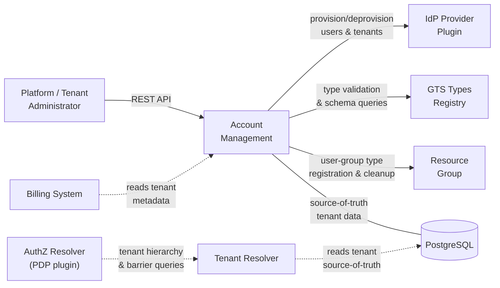
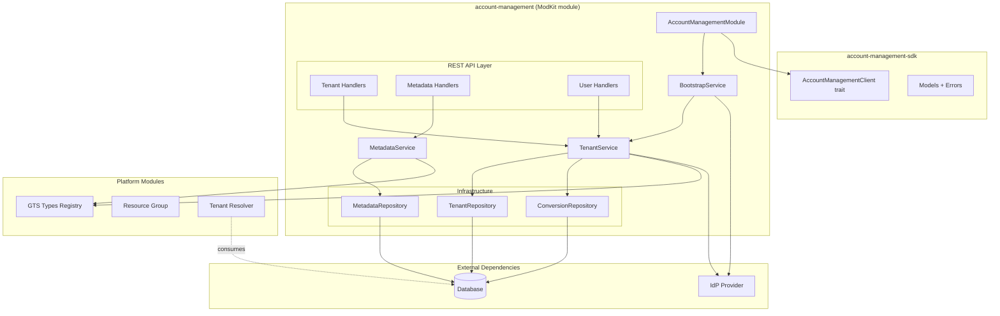
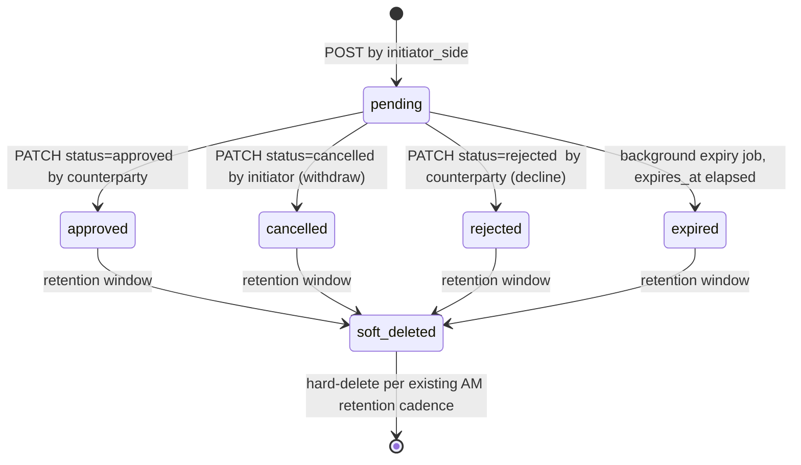
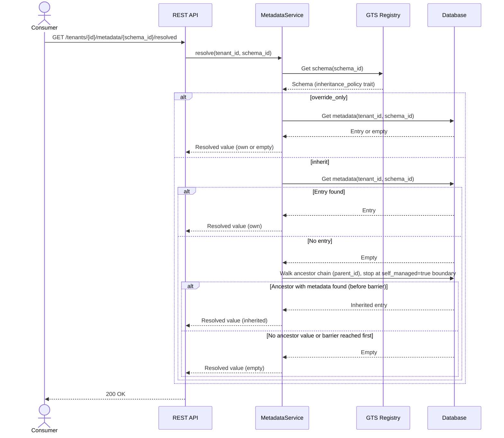
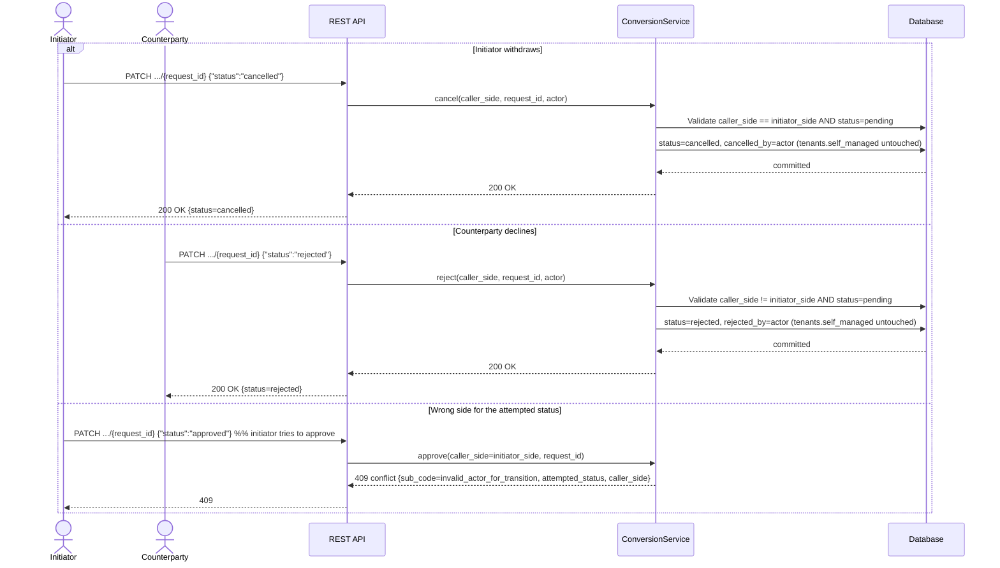
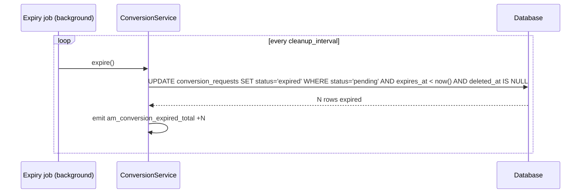

Created:  2026-04-01 by Diffora

# Technical Design — Account Management (AM)

- [ ] `p3` - **ID**: `cpt-cf-account-management-design-am`

<!-- toc -->

- [1. Architecture Overview](#1-architecture-overview)
  - [1.1 Architectural Vision](#11-architectural-vision)
  - [1.2 Architecture Drivers](#12-architecture-drivers)
  - [1.3 Architecture Layers](#13-architecture-layers)
- [2. Principles & Constraints](#2-principles--constraints)
  - [2.1 Design Principles](#21-design-principles)
  - [2.2 Constraints](#22-constraints)
- [3. Technical Architecture](#3-technical-architecture)
  - [3.1 Domain Model](#31-domain-model)
  - [3.2 Component Model](#32-component-model)
  - [3.3 API Contracts](#33-api-contracts)
  - [3.4 Internal Dependencies](#34-internal-dependencies)
  - [3.5 External Dependencies](#35-external-dependencies)
  - [3.6 Interactions & Sequences](#36-interactions--sequences)
  - [3.7 Database schemas & tables](#37-database-schemas--tables)
  - [3.8 Error Codes Reference](#38-error-codes-reference)
- [4. Additional Context](#4-additional-context)
  - [4.1 Applicability and Delegations](#41-applicability-and-delegations)
  - [4.2 Security Architecture](#42-security-architecture)
  - [Threat Modeling](#threat-modeling)
  - [4.3 Reliability and Operations](#43-reliability-and-operations)
  - [Data Governance](#data-governance)
  - [Testing Architecture](#testing-architecture)
  - [Open Questions](#open-questions)
  - [Documentation Strategy](#documentation-strategy)
  - [Known Limitations & Technical Debt](#known-limitations--technical-debt)
- [5. Traceability](#5-traceability)

<!-- /toc -->

> **Abbreviation**: Account Management = **AM**. Used throughout this document.

## 1. Architecture Overview

### 1.1 Architectural Vision

AM is the foundational multi-tenancy source-of-truth module for the Cyber Fabric platform. It owns the tenant hierarchy, tenant type enforcement, barrier metadata, delegated IdP user operations, and extensible tenant metadata. AM follows the standard ModKit module pattern under `modules/system/account-management/`: a planned SDK crate (`account-management-sdk`) exposes transport-agnostic traits and models, and a planned implementation crate (`account-management`) provides the module lifecycle, REST API, domain logic, and infrastructure adapters.

The architecture separates data ownership from enforcement. AM stores and validates the tenant tree structure, barrier flags, and type constraints. It does not evaluate authorization policies, generate SQL predicates, or validate bearer tokens on the per-request path. Tenant Resolver and AuthZ Resolver consume AM source-of-truth data for runtime enforcement. This separation keeps AM focused on administrative correctness while letting specialized resolvers optimize the hot path independently.

IdP integration uses the CyberFabric gateway + plugin pattern, analogous to AuthN Resolver (see `cpt-cf-account-management-adr-idp-contract-separation`). AM defines an `IdpProviderPluginClient` trait for tenant and user administrative operations (tenant provisioning/deprovisioning, user provision/deprovision, tenant-scoped query). The plugin is discovered via GTS types-registry and resolved through `ClientHub`. The platform ships a default provider plugin; vendors substitute their own implementation behind the same trait. The IdP provider plugin is intentionally separate from the AuthN Resolver plugin — the two target different concerns (admin operations vs hot-path token validation) with different performance profiles and protocols. The contract is one-directional: AM calls IdP, IdP does not call AM.

User group management is handled by the [Resource Group](../../resource-group/docs/PRD.md) module. AM registers a dedicated Resource Group type for user groups during module initialization; consumers call `ResourceGroupClient` directly for group lifecycle, membership, and hierarchy operations.

#### System Context



**System actors by PRD ID**

- `cpt-cf-account-management-actor-tenant-resolver` consumes AM source-of-truth tenant hierarchy and barrier state through the tenant data contract.
- `cpt-cf-account-management-actor-authz-resolver` consumes tenant context, barrier inputs, and metadata authorization attributes for access decisions.
- `cpt-cf-account-management-actor-billing` consumes read-only hierarchy and billing-relevant metadata views under platform-authorized barrier-bypass policy.

### 1.2 Architecture Drivers

#### Functional Drivers

| Requirement | Design Response |
|-------------|-----------------|
| `cpt-cf-account-management-fr-root-tenant-creation` | Bootstrap runs as the first action inside the module's `lifecycle(entry = ...)` method, creating the initial root tenant with IdP linking before signalling ready. |
| `cpt-cf-account-management-fr-root-tenant-idp-link` | Bootstrap calls `provision_tenant` for the root tenant (same contract as all tenants), forwarding deployer-configured `root_tenant_metadata` so the IdP provider plugin can establish the tenant-to-IdP binding. Any provider-returned `ProvisionResult` metadata is persisted as tenant metadata. AM does not validate binding sufficiency — binding establishment is the provider's responsibility, whether via returned metadata, external configuration, or convention. |
| `cpt-cf-account-management-fr-bootstrap-idempotency` | Bootstrap checks for existing root tenant before creation; no-op when already present. |
| `cpt-cf-account-management-fr-bootstrap-ordering` | Bootstrap retries IdP availability with configurable backoff and timeout before proceeding. |
| `cpt-cf-account-management-fr-create-child-tenant` | `TenantService::create_child_tenant` validates parent status, GTS type constraints, and depth threshold. |
| `cpt-cf-account-management-fr-hierarchy-depth-limit` | Configurable advisory threshold with optional strict mode; depth computed from parent at creation time. |
| `cpt-cf-account-management-fr-tenant-status-change` | `TenantService::update_status` applies `active` ↔ `suspended` transitions without cascading to children. Transition to `deleted` is rejected — deletion goes through `TenantService::delete_tenant` which enforces child/resource-ownership preconditions. |
| `cpt-cf-account-management-fr-tenant-soft-delete` | `TenantService::delete_tenant` validates the target tenant is non-root, has no non-deleted children, and has no remaining tenant-owned resource associations in the Resource Group ownership graph before soft delete; schedules hard deletion after retention period. |
| `cpt-cf-account-management-fr-children-query` | Paginated direct-children query with status filtering via OData `$filter` on `parent_id` index. |
| `cpt-cf-account-management-fr-tenant-read` | `TenantService::get_tenant` returns tenant details by identifier within the caller's authorized scope. |
| `cpt-cf-account-management-fr-tenant-update` | `TenantService::update_tenant` mutates only `name` and `status` (`active` ↔ `suspended`); immutable hierarchy-defining fields are rejected; `status=deleted` is rejected with `422` — use `DELETE` endpoint. |
| `cpt-cf-account-management-fr-tenant-type-enforcement` | `TenantService` queries `TypesRegistryClient` for type constraints at child creation time. |
| `cpt-cf-account-management-fr-tenant-type-nesting` | Same-type nesting permitted when GTS type definition allows it; acyclicity guaranteed by tree structure. |
| `cpt-cf-account-management-fr-managed-tenant-creation` | Tenant created with `self_managed=false`; no barrier flag set. |
| `cpt-cf-account-management-fr-self-managed-tenant-creation` | Tenant created with `self_managed=true`; barrier flag stored for downstream resolver consumption. |
| `cpt-cf-account-management-fr-mode-conversion-approval` | `ConversionService` owns the dual-consent lifecycle for any post-creation toggle of `tenants.self_managed`. Each side acts from its own authorized scope and root tenants are excluded from the flow. |
| `cpt-cf-account-management-fr-mode-conversion-expiry` | A background expiry task closes unresolved conversion requests after the configured approval window without changing tenant mode. |
| `cpt-cf-account-management-fr-mode-conversion-single-pending` | A partial unique invariant on the conversion store plus service-level conflict handling ensure at most one pending conversion request per tenant. |
| `cpt-cf-account-management-fr-mode-conversion-consistent-apply` | Approval updates both conversion status and tenant barrier state as one consistent transaction outcome. |
| `cpt-cf-account-management-fr-conversion-creation-time-self-managed` | `TenantService::create_tenant` accepts `self_managed=true` directly at creation time and stores the flag without a `ConversionRequest`; the parent's explicit creation call is the consent. Only post-creation toggles are routed through `ConversionService`. |
| `cpt-cf-account-management-fr-child-conversions-query` | `ConversionService::list_inbound_for_parent` joins `conversion_requests` with `tenants` on `parent_id`. Operates within parent tenant AuthZ scope; no barrier bypass required. Exposes only conversion-request metadata (child `id`, child `name`, `initiator_side`, `target_mode`, `status`, timestamps), not full child tenant data. |
| `cpt-cf-account-management-fr-conversion-cancel` | `ConversionService::cancel` transitions a pending `ConversionRequest` to `cancelled` only when `caller_side == initiator_side`. Exposed via `PATCH .../conversions/{r}` (child scope) and `PATCH .../child-conversions/{r}` (parent scope) with body `{"status": "cancelled"}`. Role-check failures return `409 conflict` with sub-code `invalid_actor_for_transition`. |
| `cpt-cf-account-management-fr-conversion-reject` | `ConversionService::reject` transitions a pending `ConversionRequest` to `rejected` only when `caller_side != initiator_side`. Exposed via the same `PATCH` endpoints with body `{"status": "rejected"}`. Role-check failures return `409 conflict` with sub-code `invalid_actor_for_transition`. |
| `cpt-cf-account-management-fr-conversion-retention` | Background job `ConversionService::soft_delete_resolved` stamps `deleted_at` on resolved rows older than `resolved_retention` (default 30d); default queries filter `deleted_at IS NULL`. Hard-delete follows AM's existing retention cadence. |
| `cpt-cf-account-management-fr-idp-tenant-provision` | Tenant creation uses a saga pattern: (1) short TX inserts the tenant with `status=provisioning`, (2) `IdpProviderPluginClient::provision_tenant` is called outside any transaction, (3) a second short TX persists provider-returned metadata and transitions the tenant to `active`. If the IdP call fails, a compensating TX deletes the `provisioning` row — no orphan in either system. If the finalization TX fails, AM does not retry the DB completion step; the tenant remains in `provisioning` state until the background reaper compensates (see Reliability Architecture — Data Consistency). `POST /tenants` remains intentionally non-idempotent. |
| `cpt-cf-account-management-fr-idp-tenant-provision-failure` | The tenant-creation saga distinguishes clean compensation from ambiguous external outcomes and maps both paths into deterministic public failure behavior plus reaper-backed reconciliation. |
| `cpt-cf-account-management-fr-idp-tenant-deprovision` | Background hard-deletion job calls `IdpProviderPluginClient::deprovision_tenant` for every hard-deleted tenant. Provider implementations clean up tenant-scoped IdP resources, guided by tenant type traits such as `idp_provisioning`. Providers **MUST NOT** silently no-op on mutating operations — unsupported deprovisioning **MUST** fail with `idp_unsupported_operation`. Failure retries rather than skips. |
| `cpt-cf-account-management-fr-idp-user-provision` | `IdpProviderPluginClient::create_user` with tenant scope binding and resolved tenant metadata (for IdP context resolution, e.g., effective Keycloak realm). |
| `cpt-cf-account-management-fr-idp-user-deprovision` | `IdpProviderPluginClient::delete_user` with session revocation; an already-absent IdP user is treated as a successful no-op so `DELETE /tenants/{id}/users/{user_id}` remains idempotent. |
| `cpt-cf-account-management-fr-idp-user-query` | `IdpProviderPluginClient::list_users` with tenant filter; supports optional user-ID filter for single-user lookups. |
| `cpt-cf-account-management-fr-user-group-rg-type` | `AccountManagementModule` idempotently registers the user-group Resource Group type `gts.x.core.rg.type.v1~x.core.am.user_group.v1~` during module initialization, with `allowed_memberships` including the platform user resource type (`gts.x.core.am.user.v1~`). |
| `cpt-cf-account-management-fr-user-group-lifecycle` | Consumers call `ResourceGroupClient` directly for group create/update/delete. AM does not proxy these operations. |
| `cpt-cf-account-management-fr-user-group-membership` | Consumers call `ResourceGroupClient` directly for membership add/remove. Callers verify user existence via AM's user-list endpoint; RG treats `resource_id` as opaque. |
| `cpt-cf-account-management-fr-nested-user-groups` | Nested groups via Resource Group parent-child hierarchy; cycle detection enforced by Resource Group forest invariants. No AM involvement at runtime. |
| `cpt-cf-account-management-fr-tenant-metadata-schema` | `MetadataService` validates metadata payloads against the GTS-registered schema identified by `schema_id`, using the schema's `inheritance_policy` trait to drive resolution. |
| `cpt-cf-account-management-fr-tenant-metadata-crud` | `MetadataService` provides CRUD for metadata entries keyed by `(tenant_id, schema_id)` with GTS schema validation. |
| `cpt-cf-account-management-fr-tenant-metadata-api` | `MetadataService::resolve` walks the hierarchy when the schema's `inheritance_policy` trait is `inherit`; returns the tenant's own value (or empty) when `override_only`. |
| `cpt-cf-account-management-fr-tenant-metadata-list` | `MetadataService::list_for_tenant` returns paginated own-entries for a tenant; REST endpoint `GET /api/account-management/v1/tenants/{id}/metadata` is tenant-scope-filtered by the platform layer, so self-managed barriers apply without AM-specific logic. |
| `cpt-cf-account-management-fr-tenant-metadata-permissions` | REST handlers pass `schema_id` into `PolicyEnforcer::enforce` as a resource attribute (`SCHEMA_ID`) on `Metadata.read`, `Metadata.write`, `Metadata.delete`, and `Metadata.list` actions, so external AuthZ policy can express per-`schema_id` grants without AM evaluating policy itself. |
| `cpt-cf-account-management-fr-deterministic-errors` | Unified error mapper translates domain and infrastructure failures to stable public categories; the authoritative HTTP/sub-code mapping is published in the OpenAPI contract. |
| `cpt-cf-account-management-fr-observability-metrics` | OpenTelemetry metrics for domain-internal latencies (IdP calls, GTS validation, metadata resolution, bootstrap), background job throughput, error rates, and security counters. Per-endpoint CRUD counts and children-query latency are captured by platform HTTP middleware; capacity gauges (active tenants) are derivable from DB queries. Projection freshness is a Tenant Resolver concern. |

#### NFR Allocation

| NFR ID | NFR Summary | Allocated To | Design Response | Verification Approach |
|--------|-------------|--------------|-----------------|----------------------|
| `cpt-cf-account-management-nfr-context-validation-latency` | End-to-end tenant-context validation p95 ≤ 5ms | Schema design + indexes on `tenants` table (AM contribution); Tenant Resolver caching (resolver contribution) | Composite indexes on `(parent_id, status)`, `(id, status)`, and `(tenant_type_uuid)`; denormalized `depth` column avoids recursive queries. AM provides the indexed source-of-truth schema; the end-to-end p95 ≤ 5ms target requires Tenant Resolver's caching layer on top. | AM: integration tests verify indexed query baseline with seeded dataset. Platform: pre-GA load test benchmark (end-to-end through Tenant Resolver + caching) against approved deployment profile. |
| `cpt-cf-account-management-nfr-tenant-isolation` | Zero cross-tenant data leaks | SecureConn + PolicyEnforcer on all API endpoints | All database access through `SecureConn` with tenant-scoped queries; `PolicyEnforcer` PEP pattern on every REST handler. | Automated security test suite with cross-tenant access attempts |
| `cpt-cf-account-management-nfr-audit-completeness` | 100% tenant config changes audited | Platform append-only audit infrastructure | AM relies on the platform append-only audit infrastructure as the single audit sink. Request handlers emit audit records via the platform request pipeline; AM-owned non-request flows emit into the same sink with `actor=system` (bootstrap completion, conversion expiry, provisioning-reaper compensation, hard-delete / tenant-deprovision cleanup). Database-level `created_at`/`updated_at` timestamps provide additional chronology but are not the audit system. | Verify platform audit entries exist for state-changing API operations and for AM-owned system-actor lifecycle events in integration tests |
| `cpt-cf-account-management-nfr-barrier-enforcement` | Barrier state sufficient for downstream enforcement; AM-owned barrier-state changes audited | `self_managed` column + tenant hierarchy in `tenants` table | AM exposes `self_managed` flag and parent-child relationships; Tenant Resolver and AuthZ Resolver consume this data for barrier traversal and access decisions. AM commits the flag synchronously within the conversion transaction; enforcement latency depends on how quickly Tenant Resolver's projection reflects the change (sync interval is a Tenant Resolver concern, not an AM guarantee). Platform request audit logging captures all barrier-state-changing operations (mode conversions) per `cpt-cf-account-management-nfr-audit-completeness`; cross-tenant access auditing is a platform AuthZ concern. | Integration tests validating barrier data completeness for resolver consumption; verify platform audit log entries exist for mode conversion operations |
| `cpt-cf-account-management-nfr-tenant-model-versatility` | Both managed and self-managed in same tree | `self_managed` boolean per tenant, independent of siblings | Sibling tenants under the same parent can have different `self_managed` values; mode conversion is a per-tenant operation. | Integration tests with mixed-mode hierarchies |
| `cpt-cf-account-management-nfr-compatibility` | No breaking changes within minor release | Path-based API versioning + stable SDK trait contract | REST API uses `/api/account-management/v1/` prefix; SDK trait changes require new major version with migration path. | Contract tests on SDK trait + API schema regression tests |
| `cpt-cf-account-management-nfr-production-scale` | Approved deployment profile before DESIGN sign-off | Schema design + index strategy | Approved deployment profile: 100K tenants, depth 5 (advisory threshold 10), 300K users (IdP-stored), 30K user groups / 300K memberships (RG-stored), 1K rps peak. All targets within planning envelope. Schema impact assessment confirms existing indexes and B-tree depths are sufficient for that profile; no partitioning is required. | Capacity test against approved profile (100K tenants, 300K users, 1K rps) |
| `cpt-cf-account-management-nfr-data-classification` | Persisted data classes documented; no credentials/profile PII stored by AM | Security architecture + data model boundaries | Tenant hierarchy metadata is classified as commercially sensitive; metadata schema classification is derived per `schema_id`; AM persists IdP-issued UUID identity references only where required for traceability and never stores credentials or IdP profile data outside the platform audit infrastructure. | Design review of persisted fields and audit payloads; integration checks confirm user lifecycle paths do not create local user/profile records |
| `cpt-cf-account-management-nfr-reliability` | Reads stay available during IdP outages; retry contract is explicit | Saga-based tenant creation + degraded-mode reads + reaper compensation | Non-IdP-dependent reads and admin operations continue during IdP outages. Tenant creation uses the three-step provisioning saga; clean step-2 compensation returns `idp_unavailable` and is retryable, while transport failure, timeout, or finalization failure after IdP-side success leave `POST /tenants` in an ambiguous, non-idempotent state that callers must reconcile before retry. | Integration tests for clean compensation, ambiguous finalization failure, provisioning reaper cleanup, and degraded reads during IdP outage |
| `cpt-cf-account-management-nfr-data-lifecycle` | Tenant deprovisioning cascades cleanup | `TenantService::delete_tenant` + background hard-delete job | Soft delete transitions to `deleted` status; background job hard-deletes after retention period; cascade triggers IdP `deprovision_tenant` (with retry on failure), Resource Group cleanup for tenant-scoped user groups (via `ResourceGroupClient`), and metadata entry deletion. | Integration tests verifying cascaded cleanup |
| `cpt-cf-account-management-nfr-authentication-context` | Authenticated requests via platform SecurityContext; MFA for admin ops deferred to platform AuthN policy | `SecurityContext` requirement on all REST handlers via framework middleware | AM does not validate tokens or enforce MFA directly. All REST endpoints require a valid `SecurityContext` provided by the framework AuthN pipeline. MFA enforcement for administrative operations such as tenant creation and mode conversion is a platform AuthN policy concern — AM relies on the framework to reject requests that do not meet the configured authentication strength. | API tests: every endpoint returns 401 without valid `SecurityContext`; E2E: admin operations succeed only with authenticated requests |
| `cpt-cf-account-management-nfr-data-quality` | Transactional commit visibility for Tenant Resolver sync; hierarchy integrity checks | Transactional DB writes + diagnostic integrity query | AM commits hierarchy changes transactionally, making them immediately visible in the `tenants` table for Tenant Resolver consumption. Schema stability per `cpt-cf-account-management-nfr-compatibility` ensures the database-level data contract remains intact. AM provides a hierarchy integrity check (orphaned children, broken parent references, depth mismatches) as a diagnostic capability. The end-to-end 30s freshness SLO is a platform-level target requiring Tenant Resolver's sync mechanism; AM's contribution is transactional commit visibility. | Integration: hierarchy integrity check detects seeded anomalies (orphaned child, depth mismatch); Integration: committed writes are immediately visible via direct table query |
| `cpt-cf-account-management-nfr-data-integrity-diagnostics` | Diagnostic checks for observable hierarchy anomalies | `TenantService::check_hierarchy_integrity()` + observability surface | AM exposes explicit integrity diagnostics for orphaned children, broken parent links, root-count anomalies, and depth mismatches. | Integration tests seed anomalies and verify diagnostic output plus metric surfacing |
| `cpt-cf-account-management-nfr-data-remediation` | Operator-visible remediation path for AM-owned integrity anomalies | Observability + runbook-owned lifecycle handling | Compensation failures and integrity anomalies emit telemetry quickly, remain visible until addressed, and map to runbook-driven triage owned by platform operations. | Alert simulation and operational review |
| `cpt-cf-account-management-nfr-ops-metrics-treatment` | Minimum operational treatment for AM domain metrics | Shared dashboards + alert routing | AM publishes the minimum metric set required for operator treatment: IdP failures, bootstrap not-ready, provisioning reaper activity, integrity violations, and cleanup failures. | Dashboard/alert review plus smoke checks in staging |

#### Key ADRs

The following architecture decisions are adopted in this DESIGN:

| Decision Area | Adopted Approach | ADR |
|---------------|-----------------|-----|
| IdP contract design | Separate IdP provider plugin (`IdpProviderPluginClient`) from AuthN Resolver plugin, both following CyberFabric gateway + plugin pattern with independent GTS schemas. | `cpt-cf-account-management-adr-idp-contract-separation` — [ADR-0001](ADR/0001-cpt-cf-account-management-adr-idp-contract-separation.md) |
| Metadata inheritance | Walk-up resolution at read time via `parent_id` ancestor chain. The walk stops at self-managed barriers and otherwise continues to the root; no write amplification, always consistent. | `cpt-cf-account-management-adr-metadata-inheritance` — [ADR-0002](ADR/0002-cpt-cf-account-management-adr-metadata-inheritance.md) |
| Conversion approval | Stateful `ConversionRequest` entity with a configurable approval window (default 72h), partial unique index for at-most-one pending row per tenant, background expiry and soft-delete retention jobs. Symmetric collection-based REST API (`/conversions` child-scope, `/child-conversions` parent-scope, each with `{request_id}`) lets each side initiate via `POST` and resolve via `PATCH` from its own AuthZ scope. Lifecycle enum is five-valued (`pending`/`approved`/`cancelled`/`rejected`/`expired`) with explicit actor-per-status semantics. | `cpt-cf-account-management-adr-conversion-approval` — [ADR-0003](ADR/0003-cpt-cf-account-management-adr-conversion-approval.md) |
| User identity source of truth | IdP is the single source of truth for user identity data (credentials, profile, authentication state, user existence). AM does not maintain a local user table, projection, or cache. | `cpt-cf-account-management-adr-idp-user-identity-source-of-truth` — [ADR-0005](ADR/0005-cpt-cf-account-management-adr-idp-user-identity-source-of-truth.md) |
| User-tenant binding | IdP stores the user-tenant binding as a tenant identity attribute on the user record. AM coordinates binding via the IdP contract but does not independently store or cache the relationship. | `cpt-cf-account-management-adr-idp-user-tenant-binding` — [ADR-0006](ADR/0006-cpt-cf-account-management-adr-idp-user-tenant-binding.md) |

Rejected prospective direction: `cpt-cf-account-management-adr-resource-group-tenant-hierarchy-source` — [ADR-0004](ADR/0004-cpt-cf-account-management-adr-resource-group-tenant-hierarchy-source.md) considered moving canonical tenant hierarchy storage from the AM `tenants` table to Resource Group, but rejected it because it splits tenant structure and tenant lifecycle ownership across modules. This DESIGN intentionally retains the dedicated `tenants` table as the AM source of truth.

### 1.3 Architecture Layers

- [ ] `p3` - **ID**: `cpt-cf-account-management-tech-modkit-stack`

| Layer | Responsibility | Technology |
|-------|---------------|------------|
| REST API | HTTP endpoints, request/response DTOs, OpenAPI docs | OperationBuilder + Axum handlers |
| SDK | Public client trait, transport-agnostic models, error types | Rust traits + ClientHub registration |
| Domain | Business logic, invariants, tenant lifecycle, metadata resolution | Rust domain services |
| Infrastructure | Database access, IdP adapter, migrations | SeaORM via SecureConn, IdP contract implementations |

## 2. Principles & Constraints

### 2.1 Design Principles

#### Source-of-Truth, Not Enforcer

- [ ] `p2` - **ID**: `cpt-cf-account-management-principle-source-of-truth`

AM owns the canonical tenant hierarchy, barrier state, type constraints, and extensible metadata. It validates structural invariants (tree structure, type compatibility, depth thresholds) on writes. AM does not evaluate authorization decisions, interpret policies, or enforce per-request access control. Tenant Resolver and AuthZ Resolver are the enforcement points that consume AM data.

**Drivers**: `cpt-cf-account-management-fr-tenant-read`, `cpt-cf-account-management-fr-tenant-update`, `cpt-cf-account-management-fr-tenant-soft-delete`, `cpt-cf-account-management-fr-mode-conversion-consistent-apply`, `cpt-cf-account-management-nfr-compatibility`

**ADR Trace**: local ADR not required; principle inherits the platform AuthN/AuthZ separation documented in [docs/arch/authorization/DESIGN.md](../../../../docs/arch/authorization/DESIGN.md) and the rejected data-ownership split recorded in [ADR-0004](ADR/0004-cpt-cf-account-management-adr-resource-group-tenant-hierarchy-source.md).

#### IdP-Agnostic

- [ ] `p2` - **ID**: `cpt-cf-account-management-principle-idp-agnostic`

All user lifecycle operations go through the `IdpProviderPluginClient` trait. AM never hard-codes IdP-specific logic, never stores user credentials, and never caches user-tenant membership locally. If the IdP is unavailable, user operations fail with `idp_unavailable` — AM does not fall back to stale data.

**Drivers**: `cpt-cf-account-management-fr-idp-tenant-provision`, `cpt-cf-account-management-fr-idp-tenant-provision-failure`, `cpt-cf-account-management-fr-idp-user-provision`, `cpt-cf-account-management-fr-idp-user-deprovision`, `cpt-cf-account-management-fr-idp-user-query`, `cpt-cf-account-management-nfr-authentication-context`

**ADR Trace**: `cpt-cf-account-management-adr-idp-contract-separation` — accepted in [ADR-0001](ADR/0001-cpt-cf-account-management-adr-idp-contract-separation.md); `cpt-cf-account-management-adr-idp-user-identity-source-of-truth` — accepted in [ADR-0005](ADR/0005-cpt-cf-account-management-adr-idp-user-identity-source-of-truth.md); `cpt-cf-account-management-adr-idp-user-tenant-binding` — accepted in [ADR-0006](ADR/0006-cpt-cf-account-management-adr-idp-user-tenant-binding.md)

#### Tree Invariant Preservation

- [ ] `p2` - **ID**: `cpt-cf-account-management-principle-tree-invariant`

Every tenant write validates that the resulting hierarchy remains a valid tree: each tenant has at most one parent, no cycles exist, type constraints are satisfied, exactly one root tenant exists, that root has `parent_id = NULL`, and the root tenant is undeletable. The tree structure is enforced at the domain layer, with the single-root invariant additionally backed by a database partial unique index.

**Drivers**: `cpt-cf-account-management-fr-create-child-tenant`, `cpt-cf-account-management-fr-hierarchy-depth-limit`, `cpt-cf-account-management-fr-tenant-soft-delete`, `cpt-cf-account-management-nfr-data-integrity-diagnostics`, `cpt-cf-account-management-nfr-data-quality`

**ADR Trace**: local ADR not required; principle is derived from the platform tenant model in [TENANT_MODEL.md](../../../../docs/arch/authorization/TENANT_MODEL.md) and preserved by the rejected alternative in [ADR-0004](ADR/0004-cpt-cf-account-management-adr-resource-group-tenant-hierarchy-source.md).

#### Barrier as Data

- [ ] `p2` - **ID**: `cpt-cf-account-management-principle-barrier-as-data`

AM does not enforce access-control barriers. It stores the `self_managed` flag, returns it in API responses, and includes it in the source-of-truth dataset consumed by Tenant Resolver. AM domain logic does not filter or restrict API results based on barrier values — barrier enforcement is applied at the platform AuthZ layer: all AM REST API endpoints pass through `PolicyEnforcer` → AuthZ Resolver → Tenant Resolver, which excludes self-managed tenants and their subtrees from the caller's access scope before AM domain logic executes. AM's domain services do read hierarchy data that may include barrier-hidden tenants for two internal purposes: (1) **metadata inheritance boundary** — the ancestor walk stops at self-managed boundaries so that a self-managed tenant never inherits metadata from ancestors above its barrier (see `cpt-cf-account-management-fr-tenant-metadata-api`); (2) **structural invariant validation** — hierarchy-owner operations (parent-child type validation during creation, child-count pre-checks during deletion, child-state validation for the parent-scoped conversion endpoint) require full hierarchy visibility regardless of barrier state. Neither purpose constitutes access-control filtering — the results are used for internal precondition checks and are not exposed to API callers. These reads are performed via unscoped hierarchy lookups on the `tenants` table (see Security Architecture, Data Protection), distinct from the platform's `BarrierMode::Ignore` concept which AM does not use. When a tenant converts to self-managed, AM commits `self_managed=true` synchronously within the conversion transaction. Enforcement takes effect once Tenant Resolver's denormalized projection reflects the updated flag; the propagation interval is owned by Tenant Resolver, not AM.

**Drivers**: `cpt-cf-account-management-fr-self-managed-tenant-creation`, `cpt-cf-account-management-fr-mode-conversion-approval`, `cpt-cf-account-management-fr-mode-conversion-expiry`, `cpt-cf-account-management-fr-child-conversions-query`, `cpt-cf-account-management-nfr-barrier-enforcement`

**ADR Trace**: local ADR not required; principle inherits the barrier-enforcement split from [docs/arch/authorization/DESIGN.md](../../../../docs/arch/authorization/DESIGN.md) and the platform tenant semantics in [TENANT_MODEL.md](../../../../docs/arch/authorization/TENANT_MODEL.md).

#### Delegation to Resource Group

- [ ] `p2` - **ID**: `cpt-cf-account-management-principle-delegation-to-rg`

User group hierarchy, membership storage, cycle detection, and tenant-scoped isolation are handled by the Resource Group module. AM registers the user-group RG type at module initialization and triggers RG cleanup during tenant hard-deletion. Consumers call `ResourceGroupClient` directly for all group and membership operations — AM does not proxy or coordinate these calls. AM's user-list endpoint (`GET /tenants/{id}/users`) provides the valid user set; callers combine it with RG's membership API.

**Drivers**: `cpt-cf-account-management-fr-user-group-rg-type`, `cpt-cf-account-management-fr-user-group-lifecycle`, `cpt-cf-account-management-fr-user-group-membership`, `cpt-cf-account-management-fr-nested-user-groups`

**ADR Trace**: local ADR not required; delegation aligns with [Resource Group PRD](../../resource-group/docs/PRD.md) and the rejected ownership alternative recorded in [ADR-0004](ADR/0004-cpt-cf-account-management-adr-resource-group-tenant-hierarchy-source.md).

**Principle conflict resolution**: No conflicts exist among the current five principles. If future design decisions create tension between principles, conflicts will be resolved through the ADR process. Tree Invariant Preservation and Source-of-Truth Not Enforcer take precedence as the foundational architectural commitments.

### 2.2 Constraints

#### No Direct User Data Storage

- [ ] `p2` - **ID**: `cpt-cf-account-management-constraint-no-user-storage`

AM does not maintain a local user table, user projection, or cached user-tenant membership. User existence and tenant binding are verified against the IdP at operation time. User identifiers appear in AM only as IdP-issued UUID references in the platform audit infrastructure and as arguments passed to Resource Group for group membership. If the IdP is unavailable, user operations fail rather than degrade to cached state.

**ADRs**: `cpt-cf-account-management-adr-idp-user-identity-source-of-truth` — accepted in [ADR-0005](ADR/0005-cpt-cf-account-management-adr-idp-user-identity-source-of-truth.md); `cpt-cf-account-management-adr-idp-user-tenant-binding` — accepted in [ADR-0006](ADR/0006-cpt-cf-account-management-adr-idp-user-tenant-binding.md)

#### SecurityContext Propagation

- [ ] `p2` - **ID**: `cpt-cf-account-management-constraint-security-context`

All AM API endpoints require a valid `SecurityContext` propagated by the Cyber Fabric framework. `PolicyEnforcer` PEP pattern is applied on every REST handler. AM does not construct, validate, or modify `SecurityContext` — it consumes the context provided by the framework.

**ADRs**: None yet — framework convention.

#### GTS Availability for Type Resolution

- [ ] `p2` - **ID**: `cpt-cf-account-management-constraint-gts-availability`

Tenant creation and type validation require the GTS Types Registry to be available. If GTS is unreachable, tenant creation operations that require type validation fail with a deterministic error. AM does not cache type definitions locally — type constraints are evaluated against GTS at write time to ensure consistency with runtime type changes.

**ADRs**: None yet — runtime validation trade-off.

#### No AuthZ Evaluation

- [ ] `p2` - **ID**: `cpt-cf-account-management-constraint-no-authz-eval`

AM does not evaluate allow/deny decisions, interpret authorization policies, validate bearer tokens, or generate SQL predicates for tenant scoping. These responsibilities belong to AuthZ Resolver, Tenant Resolver, and the Cyber Fabric framework respectively.

**ADRs**: None yet — platform architecture boundary.

#### Platform Versioning Policy

- [ ] `p2` - **ID**: `cpt-cf-account-management-constraint-versioning-policy`

Published REST APIs follow path-based versioning (`/api/account-management/v1/`). The SDK trait (`AccountManagementClient`) and IdP contract (`IdpProviderPluginClient`) are stable interfaces — breaking changes require a new major version with a documented migration path for consumers. Within a version, only additive changes are permitted (new optional fields, new endpoints). Deprecated endpoints receive a minimum one-major-version notice period before removal. API lifecycle: v1 remains supported until v2 reaches GA; no concurrent support for more than two major versions.

**ADRs**: None yet — platform policy.

#### Data Handling and Regulatory Compliance

- [ ] `p2` - **ID**: `cpt-cf-account-management-constraint-data-handling`

AM acts as a data processor for identity-linked payloads. Data protection regulations (GDPR processor obligations) are enforced at the platform level. AM minimizes persisted user attributes (no local user table), treats IdP identity payloads as transient data, and delegates data residency to platform infrastructure per PRD Section 6.9. Tenant hierarchy metadata is classified as commercially sensitive; access is governed by `SecureConn` + `PolicyEnforcer` scoping.

**ADRs**: None yet — compliance boundary defined in PRD NFR exclusions.

#### Resource Constraints

Resource constraints (team size, timeline) are not applicable at module level — tracked at project level. Regulatory constraints (GDPR processor obligations) are enforced at the platform level per `cpt-cf-account-management-constraint-data-handling`. Data residency is delegated to platform infrastructure per PRD Section 6.9.

#### Vendor and Licensing

- [ ] `p2` - **ID**: `cpt-cf-account-management-constraint-vendor-licensing`

AM uses only platform-approved open-source dependencies (SeaORM, Axum, OpenTelemetry via ModKit). Vendor lock-in is limited to the IdP provider plugin contract, which is intentionally pluggable — vendors substitute their own implementation. No proprietary or copyleft-licensed dependencies are introduced at the module level.

**ADRs**: None yet — platform dependency policy.

#### Legacy System Integration

- [ ] `p2` - **ID**: `cpt-cf-account-management-constraint-legacy-integration`

Legacy system integration is handled through the pluggable IdP provider contract, which allows AM to integrate with existing organizational directories and identity providers without module-level changes. No additional legacy integration constraints exist for v1.

**ADRs**: None yet — covered by IdP-Agnostic principle.

## 3. Technical Architecture

### 3.1 Domain Model

**Technology**: Rust structs (SeaORM entities for persistence, SDK models for transport)

**Planned location**: `modules/system/account-management/account-management-sdk/src/models.rs` (SDK models), `modules/system/account-management/account-management/src/infra/storage/entity.rs` (persistence entities)

**Core Entities**:

| Entity | Description | Schema |
|--------|-------------|--------|
| Tenant | Core tenant node in the hierarchy tree. Holds identity, parent reference, status, mode, type, and depth. | `account-management-sdk` models |
| TenantMetadata | Extensible metadata entry scoped to a tenant, validated against a GTS-registered schema. | `account-management-sdk` models |
| ConversionRequest | Durable record of a dual-consent mode conversion for a single tenant. Captures `target_mode`, `initiator_side`, the five-valued status (`pending` / `approved` / `cancelled` / `rejected` / `expired`), approval window, resolver identities, and soft-delete tombstone. At most one `pending` row per tenant (partial unique index). | `account-management-sdk` models |

**Relationships**:
- Tenant → Tenant: Self-referential parent-child (via `parent_id`). A tenant has zero or one parent and zero or more children. The root tenant has `parent_id = NULL`.
- Tenant → TenantMetadata: One-to-many. A tenant can have multiple metadata entries, at most one per `schema_id`.
- Tenant → ConversionRequest: One-to-many overall, at most one **pending** request per tenant at any time (enforced by partial unique index). A conversion request references the target tenant; `initiator_side` records which side (`child` or `parent`) issued the `POST`. Resolved rows remain attached to the tenant until the soft-delete retention window elapses and the cleanup job hard-deletes them.
- Tenant → GTS Type: Many-to-one (via internal `tenant_type_uuid`, projected publicly as chained `tenant_type`). Each tenant references a GTS-registered type that defines parent-child constraints.
- Tenant → IdP: Logical relationship via opaque tenant identifier used for IdP linking. No local foreign key — IdP is external.
- Tenant → Resource Group (User Groups): Logical relationship. User groups are Resource Group entities scoped to a tenant. AM registers the RG type at init; consumers call `ResourceGroupClient` directly. `TenantService` triggers RG group cleanup during tenant hard-deletion.

#### Value Objects and Invariants

| Value Object / Invariant | Definition | Enforced By |
|--------------------------|------------|-------------|
| `TenantId` | Stable UUID identifying a tenant within AM and downstream contracts. | Database primary key + SDK model |
| `TenantTypeSchemaId` | Full chained GTS schema identifier exposed through the public API and configuration surface for tenant placement rules and IdP provisioning traits. | GTS validation + domain service |
| `TenantTypeUuid` | Deterministic UUIDv5 derived from `TenantTypeSchemaId`, used as the internal storage/index key on tenant rows. | Domain service + storage constraint |
| `TenantMode` | Binary v1 barrier value represented operationally by `self_managed` and exposed semantically as `managed` / `self_managed`. | Domain service + source table |
| `TenantStatus` | Lifecycle status of a tenant: `provisioning`, `active`, `suspended`, `deleted`. `provisioning` is internal only. | Domain service + storage constraint |
| `HierarchyDepth` | Denormalized depth derived from parent placement. Root depth is 0. | Domain service + storage constraint |
| `MetadataSchemaId` | Full chained GTS schema identifier for metadata validation and per-schema authorization. | GTS validation + metadata service |
| `ConversionRequestStatus` | `pending`, `approved`, `cancelled`, `rejected`, `expired`, plus tombstoned historical state via `deleted_at`. | Conversion service + storage constraint |
| Single root invariant | Exactly one tenant has `parent_id = NULL`; root is undeletable. | Bootstrap + domain validation + partial unique index |
| Tree invariant | Each tenant has at most one parent and no cycles. | Domain service + FK structure |
| Pending conversion invariant | At most one pending conversion request exists per tenant. | Conversion service + partial unique index |
| Metadata uniqueness invariant | At most one direct metadata entry exists per `(tenant_id, schema_id)`. | Metadata service + unique constraint |
| User identity ownership invariant | AM never becomes the system of record for credentials or user profiles. | IdP contract boundary + no local user table |

#### Tenant Types — GTS Schema with Traits

Tenant types are **not a compile-time enum**. They are registered at runtime through the [GTS (Global Type System)](https://github.com/GlobalTypeSystem/gts-spec) types registry, enabling deployments to define their own business hierarchy topology without code changes. The type topology is deployment-specific (see PRD §5.3 for examples: flat, cloud hosting, education, enterprise).

**Base Type Schema:** `gts.x.core.am.tenant_type.v1~` — [tenant_type.v1.schema.json](./schemas/tenant_type.v1.schema.json)

The base type defines behavioral traits via standard [GTS Schema Traits](https://github.com/GlobalTypeSystem/gts-spec?tab=readme-ov-file#97---schema-traits-x-gts-traits-schema--x-gts-traits) (`x-gts-traits-schema`). Derived tenant type schemas resolve trait values via `x-gts-traits`. Traits are not part of the tenant instance data model — they configure system behavior for processing tenants of each type.

**Base type traits** (defined in `x-gts-traits-schema`):

| Trait | Type | Default | Description |
|-------|------|---------|-------------|
| `allowed_parent_types` | string[] | `[]` | GTS instance identifiers of tenant types allowed as parent. Empty array means the type is root-only or leaf-only. The root tenant type has `allowed_parent_types: []` by convention. |
| `idp_provisioning` | boolean | `false` | Whether tenants of this type typically require dedicated IdP-side resources. AM still invokes `provision_tenant` / `deprovision_tenant`; provider implementations may use this trait to decide whether to create dedicated resources or reuse shared ones. Mutating IdP methods **MUST NOT** silently no-op — providers that do not support a required operation **MUST** return `idp_unsupported_operation`. |

Derived type schemas resolve their behavioral traits via `x-gts-traits` (per [GTS spec §9.7](https://github.com/GlobalTypeSystem/gts-spec?tab=readme-ov-file#97---schema-traits-x-gts-traits-schema--x-gts-traits)). Properties not specified fall back to defaults from the base type's `x-gts-traits-schema`.

**Example — Cloud Hosting Deployment:**

| GTS Schema ID (chained, public) | Description | `x-gts-traits` |
|---------------------------------|-------------|----------------|
| `gts.x.core.am.tenant_type.v1~x.core.am.provider.v1~` | Platform operator; root tenant | `allowed_parent_types: []`, `idp_provisioning: true` |
| `gts.x.core.am.tenant_type.v1~x.core.am.reseller.v1~` | Reseller; nestable under provider or other resellers | `allowed_parent_types: [x.core.am.provider.v1~, x.core.am.reseller.v1~]`, `idp_provisioning: true` |
| `gts.x.core.am.tenant_type.v1~x.core.am.customer.v1~` | End customer; leaf tenant | `allowed_parent_types: [x.core.am.provider.v1~, x.core.am.reseller.v1~]` |

**Runtime Registration:** New tenant types are registered via the GTS REST API (`POST /schemas`) or programmatically via `GtsStore.register_schema()`. AM validates the chained schema identifier against the GTS registry at tenant creation time and rejects unregistered types with `invalid_tenant_type` (422).

**Input and storage format:** The API accepts the **full chained `GtsSchemaId`** (e.g., `gts.x.core.am.tenant_type.v1~x.core.am.reseller.v1~`). Short-name aliases are not supported — GTS identifiers can contain multiple chained segments (up to 1024 characters per `GTS_MAX_LENGTH`), making short-name derivation ambiguous. AM validates the chained schema identifier against the GTS registry and derives a deterministic UUIDv5 `tenant_type_uuid` from that GTS identifier using the shared GTS namespace convention. The `tenants` table stores `tenant_type_uuid`; the public chained `tenant_type` is re-hydrated from Types Registry when AM needs to emit tenant projections back through the API or operator-facing diagnostics. The `allowed_parent_types` trait values in `x-gts-traits` use GTS instance identifiers (per GTS spec); AM resolves them to chained schema IDs for comparison against the requested public tenant type before persisting the derived UUID key.

**Trait-driven validation at tenant creation:**

1. Validate `tenant_type` (full chained `GtsSchemaId`) against the GTS registry — reject unregistered identifiers with `invalid_tenant_type` (422)
2. Build effective traits by merging `x-gts-traits` values along the schema chain with defaults from `x-gts-traits-schema`
3. Validate the requested parent-child type relationship against the GTS `allowed_parent_types` rules — reject with `type_not_allowed` (409) if not permitted
4. Call `IdpProviderPluginClient::provision_tenant`; provider implementations create tenant-scoped resources or reuse shared ones based on deployment-specific behavior and tenant traits such as `idp_provisioning`. Providers **MUST NOT** silently no-op — unsupported operations **MUST** fail with `idp_unsupported_operation`

**User-group Resource Group type schema:** AM registers the chained RG type `gts.x.core.rg.type.v1~x.core.am.user_group.v1~` — [user_group.v1.schema.json](./schemas/user_group.v1.schema.json). It lives in the flat AM docs schema list, reuses the RG base contract, and defines no AM-specific `metadata` fields in v1.

**Referenced user resource schema:** The user-group type's `allowed_memberships` points at the platform user resource type `gts.x.core.am.user.v1~` — [user.v1.schema.json](./schemas/user.v1.schema.json).

| Trait | Value | Meaning |
|-------|-------|---------|
| `can_be_root` | `true` | Allows top-level user groups inside a tenant's RG subtree. |
| `allowed_parents` | [`gts.x.core.rg.type.v1~x.core.am.user_group.v1~`] | Allows nested user groups, but only under the same user-group type. |
| `allowed_memberships` | [`gts.x.core.am.user.v1~`] | Restricts direct memberships to platform users. |

Tenant-scoped placement is intentionally **not** encoded as a GTS trait on this schema. Resource Group's ownership-graph profile enforces tenant compatibility and scope isolation at write time, while the schema is responsible only for type topology and membership type constraints.

#### Tenant Metadata — GTS Schema with Traits

Tenant metadata schemas are registered at runtime through the GTS types registry, the same way tenant types are. Each derived schema declares its validation rules (JSON Schema body) and its behavioral traits via `x-gts-traits`; MetadataService resolves those traits from the registered schema with no side configuration.

**Base Type Schema:** `gts.x.core.am.tenant_metadata.v1~` — [tenant_metadata.v1.schema.json](./schemas/tenant_metadata.v1.schema.json)

The base schema defines behavioral traits via `x-gts-traits-schema`. Derived metadata schemas resolve trait values via `x-gts-traits`; properties not specified fall back to the base defaults.

**Base schema traits** (defined in `x-gts-traits-schema`):

| Trait | Type | Enum | Default | Description |
|-------|------|------|---------|-------------|
| `inheritance_policy` | string | `override_only` \| `inherit` | `override_only` | How `MetadataService` resolves values across the tenant hierarchy for this schema. `override_only` returns the tenant's own entry or empty; `inherit` walks ancestors via `parent_id`, stopping at self-managed barriers. Enum (not bool) so future policies — e.g. `merge`, `readonly`, `computed` — can be added without a breaking contract change. |

**Example — Branding Metadata Schema:**

| GTS Schema ID (chained, public) | Description | `x-gts-traits` |
|---------------------------------|-------------|----------------|
| `gts.x.core.am.tenant_metadata.v1~z.cf.metadata.branding.v1~` | Tenant branding payload (logo, colors) inherited by descendants unless overridden | `inheritance_policy: inherit` |

MetadataService resolves the policy from the registered schema's traits via the same GTS traits resolution path tenant-type traits already use for `idp_provisioning` — no side configuration, no service-local policy table.

**Input and storage format:** The API accepts the **full chained `GtsSchemaId`** as the `schema_id` path parameter (e.g. `gts.x.core.am.tenant_metadata.v1~z.cf.metadata.branding.v1~`). AM validates the identifier against the GTS registry and derives a deterministic UUIDv5 `schema_uuid` from that GTS identifier using the shared GTS namespace convention. `tenant_metadata` stores only `schema_uuid`; the public chained `schema_id` is re-hydrated from Types Registry when AM needs to emit it in list/read responses, audit payload enrichment, or diagnostics. All public API responses and policy inputs continue to use the full chained `GtsSchemaId`.

**Trait roadmap (non-v1, informational):**

- **`merge` inheritance policy** — field-level layering of child over parent (useful for feature-flag and notification-preference schemas). Deliberately not in v1 because it requires a deterministic merge algebra (array handling, null semantics, conflict resolution) shared with consumers; `inheritance_policy` is an enum so adding `merge` later is additive.
- **`sensitive` trait** — flag a schema as containing sensitive data for response redaction, encryption-at-rest, and audit handling. **Not a v1 feature**: v1 tenant metadata is explicitly **not** a secret store (see [PRD §1.4 Non-goals](./PRD.md#14-non-goals)); secrets live in the platform secret manager and metadata may only carry opaque references (IDs, URIs) to them. The `sensitive` trait is reserved for a future iteration if and when non-secret-but-PII-adjacent categories (e.g. tax IDs, contact emails under GDPR-strict tenants) require first-class redaction support.
- **`readonly` / `computed` traits** — platform-managed or derived schemas that tenant admins can read but not write directly. Reserved placeholder; no concrete v1 consumer.

These are listed so the trait namespace is understood as intentionally reserved; adding them later is an additive change and does not require renaming or re-typing existing traits.

### 3.2 Component Model



#### AccountManagementModule

- [ ] `p2` - **ID**: `cpt-cf-account-management-component-module`

##### Why this component exists

Entry point for the ModKit lifecycle. Initializes all internal services, registers routes, runs bootstrap, and exposes `AccountManagementClient` via ClientHub.

##### Responsibility scope

Module lifecycle (`init()` for wiring; `lifecycle(entry = ...)` for startup bootstrap and background jobs; `CancellationToken` for graceful shutdown), REST route registration via OperationBuilder, ClientHub registration of `AccountManagementClient` implementation, database migration registration, bootstrap orchestration on first start.

##### Responsibility boundaries

Does not contain business logic. Does not directly access the database. Delegates all domain operations to `TenantService` and `MetadataService`.

##### Related components (by ID)

- `cpt-cf-account-management-component-tenant-service` — owns; creates and wires during initialization
- `cpt-cf-account-management-component-metadata-service` — owns; creates and wires during initialization
- `cpt-cf-account-management-component-bootstrap-service` — owns; invokes at the start of the `lifecycle(entry = ...)` method before signalling ready

#### TenantService

- [ ] `p2` - **ID**: `cpt-cf-account-management-component-tenant-service`

##### Why this component exists

Central domain service for all tenant lifecycle operations. Encapsulates tree invariant validation, type enforcement, status management, mode conversion, IdP tenant provisioning, and IdP user operations.

##### Responsibility scope

TenantService owns tenant lifecycle orchestration, tenant-related IdP operations, and hierarchy integrity rules.

- Tenant CRUD: create child tenant, read tenant, update mutable tenant fields, and soft-delete tenants.
- Tenant creation saga: insert the tenant in `provisioning`, call `IdpProviderPluginClient::provision_tenant` outside the transaction, then persist provider-returned metadata and finalize the tenant as `active`. If provisioning fails, a compensating transaction removes the `provisioning` row so neither system keeps an orphan.
- Provisioning recovery: if finalization fails after the IdP step succeeds, the tenant remains in internal `provisioning` state. A background provisioning reaper always compensates by calling `deprovision_tenant` and deleting the row; it does not retry finalization. `provisioning` tenants are hidden from API queries and rejected for all normal operations.
- Hierarchy and lifecycle rules: validate depth against advisory and strict thresholds, allow only `active` ↔ `suspended` status changes on PATCH, and require the `DELETE` flow for deletion so child and resource-ownership preconditions are enforced.
- Mode conversion delegation: post-creation toggles of `self_managed` are not applied directly by `TenantService`; they are routed to `ConversionService` (see below), which owns the `ConversionRequest` state machine, role-per-transition validation, and the atomic toggle-at-approval step. `TenantService::create_tenant` still accepts `self_managed=true` at creation time without a `ConversionRequest` — the parent's explicit creation call is the consent.
- IdP integration: execute tenant deprovisioning during hard deletion and provide IdP user operations (provision, deprovision, query) through `IdpProviderPluginClient`. Providers **MUST NOT** silently no-op on mutating operations; failures are retried rather than skipped.
- Tenant-facing queries: provide paginated children queries with status filtering. Conversion-request listing endpoints are implemented by `ConversionService` (see below) and do not bypass the self-managed barrier.
- Background cleanup: schedule hard deletion after the retention period, process hard deletes in leaf-first order (`depth DESC`) so the `parent_id` FK is respected, and remove stale `provisioning` tenants after the configurable timeout (default: 5 minutes).
- Cross-cutting behavior: apply deterministic error mapping for failure paths and rely on the platform audit infrastructure to capture all state-changing operations, including AM-emitted `actor=system` lifecycle events.

##### Responsibility boundaries

Does not evaluate authorization policies — relies on `PolicyEnforcer` PEP in the REST handler layer. Does not implement barrier filtering in domain logic — barrier enforcement is handled by `PolicyEnforcer` → AuthZ Resolver → Tenant Resolver before domain logic executes. Does not store user data locally — all user operations pass through the IdP contract.

##### Related components (by ID)

- `cpt-cf-account-management-component-module` — called by; registered during module initialization
- `cpt-cf-account-management-component-metadata-service` — related; metadata entries cascade-deleted via DB `ON DELETE CASCADE` when tenant row is removed; MetadataService used for tenant metadata resolution in user operations

##### Diagnostic Capabilities

**Hierarchy integrity check mechanism**: Exposed as an internal SDK method `TenantService::check_hierarchy_integrity()`. Implementation uses a recursive CTE to detect orphaned children (nodes whose `parent_id` references a non-existent tenant), broken parent references, depth mismatches (where the stored `depth` column disagrees with the computed depth from the root), and root-count anomalies (zero or multiple rows with `parent_id IS NULL`). Results are surfaced as structured diagnostic output and as the `am_hierarchy_integrity_violations` gauge metric.

#### ConversionService

- [ ] `p2` - **ID**: `cpt-cf-account-management-component-conversion-service`

##### Why this component exists

Owns the `ConversionRequest` state machine for post-creation toggles of `tenants.self_managed`. Keeping the state machine, role-per-transition validation, approval window, and soft-delete retention in a dedicated component isolates the mutable conversion lifecycle from the otherwise mostly-declarative `TenantService` and provides a single choke-point for audit and metrics emission.

##### Responsibility scope

The ConversionService owns everything about pending and resolved conversion requests, while `TenantService` continues to own `tenants` CRUD.

- `initiate(caller_side, tenant_id, actor)`: validates preconditions (tenant is non-root, is `active`, caller's side has a valid scope for `tenant_id`, no pending row exists), derives `target_mode = NOT tenants.self_managed`, inserts a `pending` row with `initiator_side = caller_side` and `expires_at = now() + approval_ttl`. Partial unique index `UNIQUE (tenant_id) WHERE status='pending' AND deleted_at IS NULL` guarantees the at-most-one invariant at the DB level; service layer translates the conflict into `409 conflict` with sub-code `pending_exists` and the existing `request_id`.
- `approve(caller_side, request_id, actor)`: valid only when `status = pending` and `caller_side != initiator_side`. In a single transaction: sets `status = approved`, `approved_by = actor`, toggles `tenants.self_managed` to `target_mode`, and writes the audit entry. Atomicity between the status transition and the flag toggle is what removes the "crash between approval and barrier removal" hazard.
- `cancel(caller_side, request_id, actor)`: valid only when `status = pending` and `caller_side == initiator_side`. Sets `status = cancelled`, `cancelled_by = actor`. Does **not** touch `tenants.self_managed`.
- `reject(caller_side, request_id, actor)`: valid only when `status = pending` and `caller_side != initiator_side`. Sets `status = rejected`, `rejected_by = actor`. Does **not** touch `tenants.self_managed`.
- `list_own_for_tenant(tenant_id, status_filter, pagination)`: tenant-scoped list for the child-scope collection. Default `status_filter = pending`; `any` returns all non-soft-deleted rows.
- `list_inbound_for_parent(parent_id, status_filter, pagination)`: joins `conversion_requests` with `tenants` on `parent_id`. Exposes only the metadata fields allowed behind the barrier (`request_id`, `tenant_id`, `child_name`, `initiator_side`, `target_mode`, `status`, timestamps).
- `expire` (background): scans `status = 'pending' AND expires_at < now() AND deleted_at IS NULL`, transitions matching rows to `expired`, emits an audit record with `system` actor and the `am_conversion_expired_total` counter.
- `soft_delete_resolved` (background): scans resolved rows (`status IN ('approved','cancelled','rejected','expired')`) whose `updated_at + resolved_retention < now() AND deleted_at IS NULL`, stamps `deleted_at = now()`, and emits the `am_conversion_soft_deleted_total` counter. Hard deletion follows AM's existing retention cadence on `deleted_at`-tombstoned rows.

Role-per-transition validation (initiator vs. counterparty) lives in the service layer, not in the REST dispatcher and not in AuthZ. The single PEP action on `ConversionRequest` is `write`; the service is what distinguishes legal transitions per caller side, so the rules apply uniformly to both URL collections. Role-check failures surface as `409 conflict` with sub-code `invalid_actor_for_transition` plus `attempted_status` and `caller_side` in the response body; operations on already-resolved rows surface as `409 conflict` with sub-code `already_resolved`.

##### Responsibility boundaries

Does not evaluate authorization policies — the REST handler calls `PolicyEnforcer::enforce` on `ConversionRequest.read` / `ConversionRequest.write` first, then the service runs the role-per-transition check. Does not bypass self-managed barriers — the `list_inbound_for_parent` carve-out is a structural hierarchy-owner read (`parent_id` lookup on AM-owned data), the same pattern AM already uses for deletion pre-checks and child-count validation. Does not manage tenant creation-time `self_managed=true` — that path is handled directly by `TenantService::create_tenant` and never touches `conversion_requests`.

##### Configuration — AM module config

The approval window, resolved-retention window, and cleanup interval are bounded module configuration, not hardcoded and not tenant-type-specific in v1. `AccountManagementModule::init` validates these settings before the module becomes ready and fails fast when the requested operating envelope is incoherent.

Invariants enforced at startup:

- `approval_ttl ∈ [1h, 30d]`. Below 1h the approver-response window becomes unusable; above 30d a pending request would outlive any reasonable soft-delete retention and pollute the partial unique index.
- `resolved_retention ∈ [1d, 365d]`. Below 1d history disappears faster than typical audit reads; above 365d the table grows unbounded without operator intent.
- `resolved_retention <= tenant hard-delete retention period`. `conversion_requests.tenant_id` is `ON DELETE CASCADE`, so resolved-request history cannot outlive the tenant row. `AccountManagementModule::init` cross-validates the conversion window against the tenant deletion-retention configuration and fails fast if the requested history window is unattainable.
- `cleanup_interval ∈ [10s, 10m]`. Matches the bounds already used by AM's existing retention-cleanup job.

v1 does not introduce a per-tenant-type TTL override. The enum-style `inheritance_policy` precedent is applicable in principle, but there is no concrete v1 consumer — keeping the configuration single-valued avoids speculative contract surface.

##### State machine



##### Related components (by ID)

- `cpt-cf-account-management-component-tenant-service` — collaborates; `approve` transaction toggles `tenants.self_managed` alongside the request status update; the conversion service reads `tenants` for precondition validation.
- `cpt-cf-account-management-component-module` — called by; register routes and bind the background expiry/retention jobs during module initialization.

#### MetadataService

- [ ] `p2` - **ID**: `cpt-cf-account-management-component-metadata-service`

##### Why this component exists

Manages extensible tenant metadata with GTS-schema validation and per-schema `inheritance_policy` trait resolution.

##### Responsibility scope

Metadata CRUD (create, read, update, delete), per-tenant listing, and hierarchy-aware resolution for any GTS-registered tenant metadata schema.

**Schema-to-storage mapping:** `schema_id` remains the public key into the GTS types registry, the REST URL, the SDK, and AuthZ resource attributes. For persistence, `MetadataService` derives a deterministic UUIDv5 `schema_uuid` from that GTS identifier and `tenant_metadata` enforces uniqueness on `UNIQUE (tenant_id, schema_uuid)`. The row does not retain `schema_id`; when AM must return the public identifier from stored metadata rows, it reverse-resolves `schema_uuid` through Types Registry (or a bounded local cache populated from it).

**Per-operation flow:**

1. Fetch the schema by `schema_id` from the GTS registry → `404 not_found` with sub-code `metadata_schema_not_registered` if unregistered. Validate the schema body/traits and derive `schema_uuid` deterministically from the same `schema_id`.
2. Resolve the schema's `inheritance_policy` trait (from `x-gts-traits`, falling back to the base schema default `override_only`).
3. On writes, validate the request body against the schema and upsert `(tenant_id, schema_uuid, value)`.
4. On reads of a specific entry, select the tenant's row by `(tenant_id, schema_uuid)`; if none exists (yet the schema is registered), return `404 not_found` with sub-code `metadata_entry_not_found` so clients distinguish unregistered schemas from unset entries.
5. On listing (`list_for_tenant`), return all rows from `tenant_metadata` for `tenant_id`, paginated, and reverse-hydrate each distinct `schema_uuid` to its public chained `schema_id` through Types Registry before building the response payload. `list_for_tenant` does **not** walk the ancestor chain — inherited values are observable only through `/resolved`.
6. On `/resolved`, apply the `inheritance_policy` trait: `override_only` returns the tenant's own value or empty; `inherit` walks the ancestor chain via `parent_id`, querying metadata rows by `schema_uuid` and stopping at self-managed boundaries. Empty resolution is **not** a `not_found` — it is the normal terminal state of the walk. Cascade deletion of all metadata entries happens via `ON DELETE CASCADE` when the tenant row is removed.

##### Responsibility boundaries

Does not define metadata schemas — schemas are registered in GTS. Does not interpret metadata content — treats values as opaque GTS-validated payloads. Does not maintain a local inheritance-policy table — the policy is always resolved from the registered schema's `x-gts-traits`. Reads the `self_managed` flag during inheritance resolution to stop the ancestor walk at self-managed boundaries — a self-managed tenant's resolved value never includes ancestors above its barrier.

##### Related components (by ID)

- `cpt-cf-account-management-component-tenant-service` — related; metadata entries cascade-deleted via DB `ON DELETE CASCADE` when tenant row is removed; MetadataService called by TenantService for tenant metadata resolution in user operations
- `cpt-cf-account-management-component-module` — called by; for route registration

#### BootstrapService

- [ ] `p2` - **ID**: `cpt-cf-account-management-component-bootstrap-service`

##### Why this component exists

Handles one-time platform initialization: creating the initial root tenant and linking it to the IdP.

##### Responsibility scope

Acquires a distributed lock to prevent concurrent bootstrap from parallel service starts. Checks whether the initial root tenant already exists (idempotency). Waits for IdP availability with configurable retry/backoff and timeout. Creates the initial root tenant through the same internal provisioning saga used for API-created tenants: internal `provisioning` state first, then finalization to visible `active` status once bootstrap completes successfully. Calls `provision_tenant` with deployer-configured `root_tenant_metadata` (same contract as all tenants) so the IdP provider plugin can establish the tenant-to-IdP binding. Any provider-returned `ProvisionResult` metadata is persisted as tenant metadata; if the provider returns no metadata, bootstrap proceeds normally. Bootstrap completion emits a platform audit event with `actor=system`. Releases the lock.

##### Responsibility boundaries

Root tenant creation is exclusively handled by BootstrapService — no API endpoint creates root tenants. Does not interpret the `root_tenant_metadata` content — the bootstrap config is a pass-through for the IdP provider plugin. Does not provision the Platform Administrator user — that identity is pre-provisioned in the IdP during infrastructure setup. Runs only at the start of `AccountManagementModule`'s `lifecycle(entry = ...)` method, before the ready signal.

##### Related components (by ID)

- `cpt-cf-account-management-component-tenant-service` — calls; for tenant creation during bootstrap
- `cpt-cf-account-management-component-module` — called by; at the start of the lifecycle entry method

### 3.3 API Contracts

The authoritative machine-readable REST contract is [account-management-v1.yaml](./account-management-v1.yaml). DESIGN owns interface boundaries, consistency guarantees, and dependency expectations; the OpenAPI file owns concrete paths, payloads, status mappings, and examples. JSON schemas under [schemas/](./schemas/) remain the authoritative schema artifacts consumed by metadata validation and provider-returned metadata entries, while [migration.sql](./migration.sql) is the reference DDL and index source for persistence detail.

| Artifact | Authoritative for |
|----------|-------------------|
| [account-management-v1.yaml](./account-management-v1.yaml) | HTTP paths, parameters, request and response bodies, RFC 9457 problem shapes, pagination objects |
| [schemas/tenant_metadata.v1.schema.json](./schemas/tenant_metadata.v1.schema.json) and related JSON schemas | GTS-registered metadata payload schemas and traits referenced by metadata validation |
| [migration.sql](./migration.sql) | Reference DDL, indexes, and storage-level constraints |
| `DESIGN.md` | Interface ownership, lifecycle boundaries, auth expectations, dependency contracts, and storage responsibilities |

#### Tenant Management REST API

- [ ] `p1` - **ID**: `cpt-cf-account-management-interface-tenant-mgmt-rest`

- **Interfaces**: `cpt-cf-account-management-interface-tenant-mgmt-api`
- **Contracts**: `cpt-cf-account-management-contract-tenant-resolver`, `cpt-cf-account-management-contract-authz-resolver`, `cpt-cf-account-management-contract-billing`
- **Technology**: REST / OpenAPI
- **Location**: `modules/system/account-management/account-management/src/api/rest/`

This interface owns tenant CRUD, direct-child discovery, and the public tenant view consumed by downstream readers. The architectural rules are:

- root-tenant creation is excluded from the public API and remains a bootstrap-only responsibility of `cpt-cf-account-management-component-bootstrap-service`
- tenant creation is externally observable only after the provisioning saga finalizes; transient `provisioning` state is internal and hidden from public reads
- generic update operations may change mutable presentation and lifecycle fields only; hierarchy-defining fields and mode changes remain outside the generic update path
- soft delete is the public delete boundary; retention cleanup, IdP deprovision, and RG cleanup remain background responsibilities
- all tenant reads and writes require framework-authenticated `SecurityContext`; token parsing, session renewal, and federation remain platform-owned and are documented in Section 4

#### Mode Conversion Interface

- [ ] `p3` - **ID**: `cpt-cf-account-management-interface-conversions-api`

Mode conversion is modeled as a first-class `ConversionRequest` resource exposed through two scope-specific collections, one owned by the child scope and one owned by the parent scope. The OpenAPI contract defines the concrete endpoints; the architecture-level rules are:

- caller side is derived from the collection being used, not from caller-supplied payload fields
- the only public mutation path for `tenants.self_managed` is approval of a pending `ConversionRequest`
- parent-scope discovery is a narrow structural-read exception that exposes only the minimal child request metadata required for dual-consent workflows
- role-per-transition validation is enforced by `cpt-cf-account-management-component-conversion-service`, while `PolicyEnforcer` governs whether the caller may read or write conversion resources in the selected scope
- resolved requests remain queryable only for their retention window; the OpenAPI and storage artifacts define their concrete projection and tombstone handling

#### User Operations REST API

- [ ] `p2` - **ID**: `cpt-cf-account-management-interface-user-ops-rest`

- **Interfaces**: `cpt-cf-account-management-interface-user-ops-api`
- **Contracts**: `cpt-cf-account-management-contract-idp-provider`, `cpt-cf-account-management-contract-authz-resolver`
- **Technology**: REST / OpenAPI
- **Location**: `modules/system/account-management/account-management/src/api/rest/`

This interface is an orchestration boundary over the IdP contract rather than a local user-management store. The architectural rules are:

- AM does not create or maintain a local user projection; the IdP remains the source of truth for user existence and tenant binding
- user operations require an existing tenant context and use resolved tenant metadata to select the effective provider-side identity context
- user lifecycle errors are surfaced as deterministic public problem categories, but provider-specific request and response shapes remain behind the IdP plugin contract
- group lifecycle and membership remain delegated to Resource Group; AM does not expose user-group storage from this interface

#### Tenant Metadata REST API

- [ ] `p2` - **ID**: `cpt-cf-account-management-interface-metadata-rest`

- **Interfaces**: `cpt-cf-account-management-interface-tenant-metadata-api`
- **Contracts**: `cpt-cf-account-management-contract-gts-registry`, `cpt-cf-account-management-contract-authz-resolver`
- **Technology**: REST / OpenAPI
- **Location**: `modules/system/account-management/account-management/src/api/rest/`

This interface exposes raw and resolved tenant metadata keyed by registered GTS schema identifiers. The architectural rules are:

- `schema_id` remains the stable public identifier in REST, SDK, and AuthZ requests; AM deterministically derives `schema_uuid` from it for storage uniqueness and indexed lookups
- writes are replace-style updates of the value stored for a tenant and schema pair; field-level merge semantics are intentionally out of scope for v1
- `/metadata` lists only values written directly on the tenant, while `/resolved` is the inheritance-aware read boundary
- inheritance evaluation stops at self-managed barriers and never requires AM to perform platform-level barrier bypass
- metadata is explicitly not a secret store; secret material belongs in the platform secret-management plane with metadata carrying only references where needed

#### AccountManagementClient SDK Trait

- [ ] `p2` - **ID**: `cpt-cf-account-management-interface-sdk-client`

- **Technology**: Rust trait + ClientHub
- **Location**: `modules/system/account-management/account-management-sdk/src/api.rs`

`AccountManagementClient` is the transport-agnostic in-process contract for module-to-module reads and administrative calls. It mirrors the public capability groups of the REST surface, but does not supersede the OpenAPI file as the public wire contract. Consumers resolve it through ClientHub so that AM remains replaceable behind a stable capability interface.

#### IdP Provider Plugin

- [ ] `p1` - **ID**: `cpt-cf-account-management-interface-idp-plugin`

- **Contracts**: `cpt-cf-account-management-contract-idp-provider`, `cpt-cf-account-management-contract-gts-registry`
- **Technology**: CyberFabric plugin (Rust trait + GTS discovery + ClientHub registration)
- **Location**: `modules/system/account-management/account-management-sdk/src/idp.rs`
- **ADR**: `cpt-cf-account-management-adr-idp-contract-separation`

`IdpProviderPluginClient` is the deployment-specific outbound identity boundary for tenant provisioning, tenant deprovisioning, and user lifecycle operations. The architecture expects:

- provider implementations to be discoverable and replaceable without changing AM's public API contract
- tenant provisioning and user lifecycle calls to accept AM-owned tenant identifiers plus resolved tenant metadata, with provider-specific interpretation remaining outside AM
- provider-returned metadata to use pre-registered schema identifiers so AM can validate and persist it safely
- outbound identity credentials, federation setup, session semantics, and service authentication to remain owned by the provider implementation and the platform AuthN layer rather than by AM

### 3.4 Internal Dependencies

| Dependency Module | Interface Used | Purpose |
|-------------------|----------------|---------|
| [Resource Group](../../resource-group/docs/PRD.md) | `ResourceGroupClient` (SDK trait via ClientHub) | AM registers a user-group RG type at module initialization, uses RG ownership-graph reads to verify that no tenant-owned resource associations remain before soft deletion, and triggers tenant-scoped group cleanup during hard-deletion. If RG is unavailable during deletion validation, AM fails the operation with `service_unavailable` rather than proceeding. Consumers call `ResourceGroupClient` directly for all group lifecycle, membership, and hierarchy operations. |
| GTS Types Registry | `TypesRegistryClient` (SDK trait via ClientHub) | Runtime tenant type definitions, parent-child constraint validation, metadata schema registration and validation. |

**Dependency Rules** (per project conventions):
- No circular dependencies
- Always use SDK modules for inter-module communication
- No cross-category sideways deps except through contracts
- `SecurityContext` must be propagated across all in-process calls

### 3.5 External Dependencies

#### IdP Provider

- **Contract**: `cpt-cf-account-management-contract-idp-provider`

| Aspect | Detail |
|--------|--------|
| **Type** | External service (pluggable via trait) |
| **Direction** | Outbound (AM → IdP) |
| **Protocol / Driver** | Pluggable: in-process trait or adapter to remote IdP (REST/SCIM/admin API) |
| **Data Format** | Provider-specific; abstracted behind `IdpProviderPluginClient` trait |
| **Compatibility** | Provider implementations are vendor-replaceable. AM tolerates IdP unavailability during bootstrap with retry/backoff. |
| **SLA** | Provider-specific; not prescribed by AM. |
| **Resilience** | Per-call timeouts and retry budgets. At the approved administrative traffic profile (~1K rps peak), circuit breakers and module-level rate limiting are not warranted. |

IdP provider plugin credentials are managed by the plugin implementation and the platform secret management infrastructure; AM does not handle, store, or configure provider credentials.

#### GTS Registry

- **Contract**: `cpt-cf-account-management-contract-gts-registry`

| Aspect | Detail |
|--------|--------|
| **Type** | Platform shared service |
| **Direction** | Outbound read from AM |
| **Protocol / Driver** | `TypesRegistryClient` via ClientHub |
| **Data Format** | GTS type definitions, schema bodies, and traits |
| **Compatibility** | Registered schema identifiers remain the stable external contract key for tenant types and metadata kinds across AM and OpenAPI; tenant rows and metadata rows derive deterministic UUIDv5 storage surrogates from those identifiers for compact indexing without changing the public contract |
| **Availability / Fallback** | GTS-backed writes validate against current registry data. Tenant and metadata projections that must reverse-hydrate chained identifiers from stored UUID keys depend on Types Registry (or a bounded AM cache fed from it) and fail deterministically rather than returning opaque UUIDs. |

#### Tenant Resolver

- **Contract**: `cpt-cf-account-management-contract-tenant-resolver`

| Aspect | Detail |
|--------|--------|
| **Type** | Downstream platform consumer |
| **Direction** | AM provides source-of-truth data |
| **Protocol / Driver** | Database-level data contract over AM-owned tenant tables |
| **Data Format** | Tenant identifiers, parent-child relationships, depth, status, and barrier state |
| **Compatibility** | Schema changes to the AM source tables must remain coordinated with resolver projection logic and rolling-upgrade compatibility constraints |
| **Availability / Fallback** | AM commits source-of-truth state transactionally. Projection freshness, cache policy, and resync behavior are Tenant Resolver responsibilities. |

#### AuthZ Resolver

- **Contract**: `cpt-cf-account-management-contract-authz-resolver`

| Aspect | Detail |
|--------|--------|
| **Type** | Platform shared service |
| **Direction** | Bidirectional integration through framework PEP/PDP flow |
| **Protocol / Driver** | `PolicyEnforcer` plus `SecurityContext` propagation through the framework |
| **Data Format** | Tenant-scoped access requests, `OWNER_TENANT_ID` / `RESOURCE_ID` / `SCHEMA_ID` attributes, and resolver-produced access scopes |
| **Compatibility** | AM resource types and action names are stable design-time contracts defined in Section 4 `Authorization Model`; changes require coordinated updates with AuthZ policies and resolver behavior |
| **Availability / Fallback** | AM does not implement a local authorization fallback. When AuthZ is unavailable, protected operations fail as platform-owned authorization failures. |

#### Billing System

- **Contract**: `cpt-cf-account-management-contract-billing`

| Aspect | Detail |
|--------|--------|
| **Type** | Downstream business consumer |
| **Direction** | AM provides read-only hierarchy and metadata views |
| **Protocol / Driver** | AM public read APIs and/or `AccountManagementClient`, subject to platform policy |
| **Data Format** | Tenant identifiers, hierarchy position, status, mode, and billing-relevant metadata by schema identifier |
| **Compatibility** | Billing integrations consume the stable AM versioned read contract rather than AM storage internals |
| **Availability / Fallback** | Billing must not invent new hierarchy state when AM is unavailable. It may continue on previously synchronized billing snapshots where platform policy allows, but fresh hierarchy-dependent reads wait for AM availability. |

#### Database

| Aspect | Detail |
|--------|--------|
| **Type** | Database |
| **Direction** | Bidirectional |
| **Protocol / Driver** | SeaORM via SecureConn (tenant-scoped database access) |
| **Data Format** | Relational; reference DDL and indexes are defined in [migration.sql](./migration.sql) |
| **Compatibility** | Schema migrations managed via ModKit migration framework. Tenant Resolver consumes source-of-truth tables via database-level data contract. |

### 3.6 Interactions & Sequences

#### Platform Bootstrap

**ID**: `cpt-cf-account-management-seq-bootstrap`

**Use cases**: `cpt-cf-account-management-usecase-root-bootstrap`, `cpt-cf-account-management-usecase-bootstrap-idempotent`, `cpt-cf-account-management-usecase-bootstrap-waits-idp`

**Actors**: `cpt-cf-account-management-actor-platform-admin`, `cpt-cf-account-management-actor-idp`

```mermaid
sequenceDiagram
    participant AM as AccountManagementModule
    participant BS as BootstrapService
    participant TS as TenantService
    participant DB as Database
    participant IDP as IdP Provider
    participant PR as Provisioning Reaper

    AM->>BS: lifecycle entry (bootstrap phase)
    BS->>BS: Acquire distributed lock (bootstrap)
    BS->>DB: Check existing root tenant
    alt Root tenant exists in active status
        DB-->>BS: Found
        BS->>BS: Release lock
        BS-->>AM: Bootstrap skipped (idempotent)
    else No root tenant
        DB-->>BS: Not found
        loop Retry with backoff
            BS->>IDP: Health check
            IDP-->>BS: Available / Unavailable
        end
        BS->>TS: create_root_tenant(bootstrap_config)
        TS->>TS: Resolve root_tenant_type from config
        rect rgb(230, 245, 255)
            Note over TS,DB: Saga step 1 — short TX
            TS->>DB: INSERT tenant (root, type=root_tenant_type, status='provisioning')
            TS->>DB: COMMIT
        end
        Note over TS,IDP: Saga step 2 — IdP call (no open TX)
        TS->>IDP: provision_tenant(root_id, name, root_tenant_type, root_tenant_metadata)
        Note right of IDP: Plugin uses root_tenant_metadata<br/>to establish tenant-to-IdP binding<br/>(e.g. adopt existing realm or create new one)
        IDP-->>TS: ProvisionResult (identity binding metadata)
        alt Finalization succeeds
            rect rgb(230, 245, 255)
                Note over TS,DB: Saga step 3 — finalize (short TX)
                TS->>DB: INSERT tenant_metadata (provider entries, if any)
                TS->>DB: UPDATE tenant SET status = 'active'
                TS->>DB: COMMIT
            end
            TS-->>BS: Root tenant created
            BS->>BS: Release lock
            BS-->>AM: Bootstrap complete
        else Finalization fails
            DB-->>TS: Finalization error
            TS-->>BS: Bootstrap failed; root remains in provisioning
            BS->>BS: Do not create a second root while stale row exists
            BS->>BS: Release lock
            BS-->>AM: Bootstrap not complete
            PR->>DB: Scan stale provisioning tenants
            DB-->>PR: root tenant still provisioning
            PR->>IDP: deprovision_tenant(root_id, ...)
            IDP-->>PR: OK / already absent
            PR->>DB: DELETE tenant WHERE id = root_id AND status = 'provisioning'
            PR->>DB: COMMIT
            Note over BS,PR: After compensation, a later bootstrap attempt can recreate the root
        end
    end
```

**Bootstrap configuration:**

| Parameter | Type | Required | Description |
|-----------|------|----------|-------------|
| `root_tenant_type` | string (chained `GtsSchemaId`) | Yes | Full chained GTS schema identifier for the initial root tenant type. Must be registered in GTS. Deployment-specific — e.g., `gts.x.core.am.tenant_type.v1~x.core.am.provider.v1~` for cloud hosting, `gts.x.core.am.tenant_type.v1~x.core.am.root.v1~` for flat deployments. |
| `root_tenant_name` | string | Yes | Human-readable name for the initial root tenant. |
| `root_tenant_metadata` | object | No (default: `null`) | Provider-specific metadata forwarded as-is to `provision_tenant` during bootstrap. Guides the IdP provider plugin's behavior — e.g., a Keycloak provider may expect `{ "adopt_realm": "master" }` to adopt an existing realm, while omitting it or providing different metadata may trigger fresh resource creation. The choice is entirely provider-specific. AM does not interpret this value; the content contract is between the deployer and the provider plugin. When omitted, `provision_tenant` receives `null` metadata and the provider proceeds with its default behavior. |
| _(deployment prerequisite)_ | — | — | All metadata schemas that the IdP provider may return in `ProvisionResult` entries must be pre-registered in GTS before bootstrap runs. AM validates all persisted metadata against GTS schemas; unregistered `schema_id`s are rejected with `not_found`, causing the saga finalization step to fail and the provisioning reaper to compensate. (`root_tenant_metadata` itself is opaque to AM — it is forwarded as-is to the provider plugin and is not validated against GTS schemas. The prerequisite applies only to provider-produced output that AM persists.) |
| `idp_retry_backoff_initial` | duration | No (default: 2s) | Initial backoff for IdP availability retry. |
| `idp_retry_backoff_max` | duration | No (default: 30s) | Maximum backoff for IdP availability retry. |
| `idp_retry_timeout` | duration | No (default: 5min) | Total timeout for IdP availability wait. Bootstrap fails if exceeded. |

**Description**: On first platform start, AM acquires a distributed lock to prevent concurrent bootstrap from parallel service starts, then creates the initial root tenant using the configured `root_tenant_type` (validated against GTS — must be a registered type). Tenant creation follows the same saga pattern as API-created tenants: (1) a short transaction inserts the tenant with `status=provisioning`; (2) `provision_tenant` is called outside any transaction with the deployer-configured `root_tenant_metadata`; (3) a second short transaction persists any provider-returned metadata and transitions the tenant to visible `active` status. The metadata is opaque to AM — it flows through to the IdP provider plugin, which uses it to determine deployment-specific behavior (e.g., a Keycloak provider receiving `{ "adopt_realm": "master" }` may adopt an existing realm, while other metadata may trigger fresh resource creation). If the provider returns no metadata (binding established through external configuration or convention), bootstrap proceeds normally. On subsequent starts, bootstrap detects the existing root (in `active` status) and is a no-op. A root tenant stuck in `provisioning` status from a prior failed bootstrap attempt is left for provisioning-reaper compensation; bootstrap does not create a second root while that stale row exists. Successful bootstrap emits a platform audit event with `actor=system`. If IdP is unavailable, bootstrap retries with backoff until timeout. The lock ensures that even with multiple replicas starting simultaneously, only one performs the bootstrap sequence. The lock implementation is infrastructure-specific (e.g., database advisory lock, distributed lock service) and not prescribed by this design.

#### Create Child Tenant with Type Validation

**ID**: `cpt-cf-account-management-seq-create-child`

**Use cases**: `cpt-cf-account-management-usecase-create-child-tenant`, `cpt-cf-account-management-usecase-reject-type-not-allowed`, `cpt-cf-account-management-usecase-warn-depth-exceeded`

**Actors**: `cpt-cf-account-management-actor-tenant-admin`, `cpt-cf-account-management-actor-gts-registry`

```mermaid
sequenceDiagram
    actor Admin as Tenant Admin
    participant API as REST API
    participant TS as TenantService
    participant GTS as GTS Registry
    participant DB as Database

    participant IDP as IdP Provider
    participant PR as Provisioning Reaper

    Admin->>API: POST /tenants {parent_id, type, name, self_managed}
    API->>TS: create_child_tenant(request)
    TS->>DB: Get parent tenant
    DB-->>TS: Parent (status, type, depth)
    TS->>TS: Validate parent is active
    TS->>GTS: Get type definition(child_type)
    GTS-->>TS: Type rules (allowed_parent_types, idp_provisioning)
    TS->>TS: Validate parent type in allowed_parent_types
    TS->>TS: Check depth vs advisory threshold
    alt Depth exceeds threshold (advisory mode)
        TS->>TS: Emit advisory warning signal (metric + structured log)
    end

    rect rgb(230, 245, 255)
        Note over TS,DB: Saga step 1 — short TX
        TS->>DB: INSERT tenant (status = 'provisioning')
        TS->>DB: COMMIT
    end

    Note over TS,IDP: Saga step 2 — IdP call (no open TX)
    TS->>IDP: provision_tenant(child_id, name, type, parent_id, metadata)

    alt IdP provisioning fails
        IDP-->>TS: Error
        rect rgb(255, 230, 230)
            Note over TS,DB: Compensate — short TX
            TS->>DB: DELETE tenant WHERE id = child_id AND status = 'provisioning'
            TS->>DB: COMMIT
        end
        TS-->>API: Error: idp_unavailable
        API-->>Admin: 503 Service Unavailable
    else IdP provisioning succeeds
        IDP-->>TS: ProvisionResult (optional metadata entries)
        alt Finalization succeeds
            rect rgb(230, 245, 255)
                Note over TS,DB: Saga step 3 — finalize (short TX)
                opt Provider returned metadata
                    TS->>DB: INSERT tenant_metadata (provider-produced entries)
                end
                TS->>DB: UPDATE tenant SET status = 'active'
                TS->>DB: COMMIT
            end
            TS-->>API: Tenant response
            API-->>Admin: 201 Created
        else Finalization fails
            DB-->>TS: Finalization error
            TS-->>API: Error response
            API-->>Admin: 500 Internal Server Error
            PR->>DB: Scan stale provisioning tenants
            DB-->>PR: child tenant still provisioning
            PR->>IDP: deprovision_tenant(child_id, ...)
            IDP-->>PR: OK / already absent
            PR->>DB: DELETE tenant WHERE id = child_id AND status = 'provisioning'
            PR->>DB: COMMIT
            Note over TS,PR: Step 3 failure always compensates; AM does not retry finalization
        end
    end
```

**Description**: Tenant creation validates parent status, type constraints via GTS, and hierarchy depth. The creation itself follows a three-step saga to avoid holding a DB transaction open during the external IdP call: (1) a short transaction inserts the tenant row with `status=provisioning`; (2) `IdpProviderPluginClient::provision_tenant` is called outside any transaction to set up IdP-side resources (e.g., a Keycloak realm); (3) a second short transaction persists any provider-returned metadata entries (e.g., effective realm name) and transitions the tenant to visible `active` status. If the IdP call fails at step 2, a compensating transaction deletes the `provisioning` row — neither system retains an orphan, and the caller receives `idp_unavailable`. If the finalization transaction at step 3 fails, the tenant remains in `provisioning` status; a background provisioning reaper compensates by calling `deprovision_tenant` (idempotent), emitting a platform audit event with `actor=system`, and deleting the row. AM does not retry the finalization step (see Reliability Architecture). `POST /tenants` is intentionally non-idempotent: only the clean compensated `idp_unavailable` path is retry-safe; transport failure, timeout, or generic `5xx` require reconciliation before retry. If the advisory threshold is exceeded, AM emits the v1 advisory warning signal (metric increment plus structured warning log entry) and creation proceeds. In strict mode, creation is rejected when the hard limit is exceeded.

#### Resolve Inherited Metadata

**ID**: `cpt-cf-account-management-seq-resolve-metadata`

**Use cases**: `cpt-cf-account-management-usecase-resolve-inherited-metadata`, `cpt-cf-account-management-usecase-write-override_only-metadata`

**Actors**: `cpt-cf-account-management-actor-tenant-admin`



**Description**: Metadata resolution applies the schema's `inheritance_policy` trait. For `override_only` schemas, returns the tenant's own value. For `inherit` schemas, walks up the hierarchy to find the nearest ancestor value if the tenant has no entry of its own.

**Query strategy**: The ancestor walk uses a recursive CTE over the tenant's full ancestor chain, stopping only at the first `self_managed` barrier or at the root. It is not bounded by the advisory depth threshold, because deep-but-valid hierarchies must still resolve metadata correctly in non-strict mode. At the approved hierarchy depth (5, advisory 10), this remains a single database round-trip with predictable performance; deeper valid hierarchies remain functionally correct with correspondingly deeper walks.

#### Mode Conversion — Symmetric Dual Consent

**ID**: `cpt-cf-account-management-seq-convert-dual-consent`

**Use cases**: `cpt-cf-account-management-usecase-convert-dual-consent`, `cpt-cf-account-management-usecase-conversion-expires`, `cpt-cf-account-management-usecase-cancel-conversion-by-initiator`, `cpt-cf-account-management-usecase-reject-conversion-by-counterparty`, `cpt-cf-account-management-usecase-invalid-actor-for-transition`

**Actors**: `cpt-cf-account-management-actor-tenant-admin`

**Happy path (counterparty approves)**

```mermaid
sequenceDiagram
    actor I as Initiator (child or parent admin)
    actor C as Counterparty
    participant API as REST API
    participant CS as ConversionService
    participant DB as Database

    I->>API: POST /tenants/{scope}/{conversions|child-conversions} [+ child_tenant_id on parent scope]
    API->>CS: initiate(caller_side, target_tenant_id, actor)
    CS->>DB: Preconditions → INSERT ConversionRequest (status=pending, initiator_side=caller_side, target_mode=NOT tenants.self_managed, expires_at=now()+approval_ttl)
    DB-->>CS: request_id
    CS-->>API: 201 Created
    API-->>I: 201 Created {request_id, target_mode, initiator_side, status=pending, expires_at}

    Note over C: Within approval_ttl...
    C->>API: PATCH /tenants/{scope}/{conversions|child-conversions}/{request_id} {"status":"approved"}
    API->>CS: approve(caller_side, request_id, actor)
    CS->>DB: Transactional: status=approved, approved_by=actor, tenants.self_managed := target_mode
    DB-->>CS: committed
    CS-->>API: 200 OK
    Note over API,C: PATCH responses use the caller-scope projection. Child scope may include actor identity fields; parent scope omits them.
    API-->>C: 200 OK {status=approved, ...scope-specific projection...}
```

**Initiator withdraws (cancel) vs. counterparty declines (reject)**



**Expiry**



**Description**: Any post-creation toggle of `tenants.self_managed` goes through a durable `ConversionRequest` with dual consent. Initiation and resolution are split at the HTTP level between `POST` (create) and `PATCH` (drive the state machine). `caller_side` is derived by the server from the URL collection; `ConversionService` checks role-per-transition rules (initiator-only for `cancelled`, counterparty-only for `approved`/`rejected`) before mutating the row. Approval atomically flips both the request status and the tenant's `self_managed` flag in a single transaction, eliminating the crash window between approval and barrier change. Expiry is a background job; no API caller ever drives a request to `expired`. Neither `cancelled` nor `rejected` touches the tenant's mode.

#### Use-Case Coverage Map

The sequences above are the canonical interaction views. The table below closes the remaining PRD-to-DESIGN use-case references without introducing separate diagrams for every variant.

| PRD Use Case ID | Primary DESIGN coverage | Notes |
|-----------------|-------------------------|-------|
| `cpt-cf-account-management-usecase-create-managed-child` | `cpt-cf-account-management-seq-create-child`, `cpt-cf-account-management-component-tenant-service` | Managed child creation is the default create flow with `self_managed = false`. |
| `cpt-cf-account-management-usecase-create-self-managed-child` | `cpt-cf-account-management-seq-create-child`, `cpt-cf-account-management-component-tenant-service` | Same creation architecture, with the resulting tenant entering the tree with a barrier flag set. |
| `cpt-cf-account-management-usecase-create-user-group` | `cpt-cf-account-management-interface-sdk-client`, Section 3.4 `ResourceGroupClient` dependency | Group creation is delegated to Resource Group; AM only exposes the tenant context and ownership boundary. |
| `cpt-cf-account-management-usecase-manage-group-membership` | `cpt-cf-account-management-interface-sdk-client`, Section 3.4 `ResourceGroupClient` dependency | Membership management is delegated to Resource Group under the caller's tenant scope. |
| `cpt-cf-account-management-usecase-reject-circular-nesting` | Section 3.4 `ResourceGroupClient` dependency | Cycle detection for nested groups is owned by Resource Group, not AM. |
| `cpt-cf-account-management-usecase-provision-user` | `cpt-cf-account-management-interface-user-ops-rest`, `cpt-cf-account-management-interface-idp-plugin` | User provisioning is an AM-to-IdP orchestration flow. |
| `cpt-cf-account-management-usecase-deprovision-user` | `cpt-cf-account-management-interface-user-ops-rest`, `cpt-cf-account-management-interface-idp-plugin` | Deprovisioning remains delegated to the IdP contract, with AM owning tenant context and audit emission. |
| `cpt-cf-account-management-usecase-query-users-by-tenant` | `cpt-cf-account-management-interface-user-ops-rest`, `cpt-cf-account-management-interface-idp-plugin` | User queries are tenant-scoped IdP reads, not local AM projections. |
| `cpt-cf-account-management-usecase-read-tenant` | `cpt-cf-account-management-interface-tenant-mgmt-rest`, `cpt-cf-account-management-component-tenant-service` | Public tenant reads are part of the stable tenant management interface. |
| `cpt-cf-account-management-usecase-update-tenant` | `cpt-cf-account-management-interface-tenant-mgmt-rest`, `cpt-cf-account-management-component-tenant-service` | Generic update is limited to mutable tenant fields and enforced by `TenantService`. |
| `cpt-cf-account-management-usecase-suspend-no-cascade` | `cpt-cf-account-management-interface-tenant-mgmt-rest`, `cpt-cf-account-management-component-tenant-service` | Suspension changes only the targeted tenant and is explicitly non-cascading. |
| `cpt-cf-account-management-usecase-reject-delete-has-children` | `cpt-cf-account-management-interface-tenant-mgmt-rest`, `cpt-cf-account-management-component-tenant-service` | Delete preconditions are enforced against the AM hierarchy before the soft-delete transition. |
| `cpt-cf-account-management-usecase-soft-delete-leaf` | `cpt-cf-account-management-interface-tenant-mgmt-rest`, Section 4.3 Reliability and Operations | Leaf soft delete is the public lifecycle boundary; hard deletion remains a background concern. |
| `cpt-cf-account-management-usecase-reject-delete-root` | `cpt-cf-account-management-interface-tenant-mgmt-rest`, `cpt-cf-account-management-component-bootstrap-service` | The single-root invariant is protected across bootstrap, CRUD, and retention cleanup. |
| `cpt-cf-account-management-usecase-reject-depth-exceeded` | `cpt-cf-account-management-seq-create-child`, `cpt-cf-account-management-component-tenant-service` | Strict-mode depth enforcement is part of the child creation path. |
| `cpt-cf-account-management-usecase-discover-child-conversions` | `cpt-cf-account-management-seq-convert-dual-consent`, `cpt-cf-account-management-interface-conversions-api` | Parent-scope conversion discovery is the only barrier-aware structural-read carve-out exposed directly by AM. |
| `cpt-cf-account-management-usecase-retention-of-resolved-conversion` | `cpt-cf-account-management-component-conversion-service`, Section 4.3 Reliability and Operations | Resolved conversion rows remain queryable only for their configured retention window. |
| `cpt-cf-account-management-usecase-write-tenant-metadata` | `cpt-cf-account-management-interface-metadata-rest`, `cpt-cf-account-management-component-metadata-service` | Metadata writes remain schema-driven and tenant-scoped. |
| `cpt-cf-account-management-usecase-list-tenant-metadata` | `cpt-cf-account-management-interface-metadata-rest`, `cpt-cf-account-management-component-metadata-service` | Listing returns direct entries only; inherited resolution is a separate boundary. |
| `cpt-cf-account-management-usecase-metadata-schema-vs-entry-not-found` | `cpt-cf-account-management-interface-metadata-rest`, Section 3.8 Error Codes Reference | The contract distinguishes unregistered schema identifiers from missing tenant entries. |
| `cpt-cf-account-management-usecase-metadata-permission-denied-per-schema` | `cpt-cf-account-management-interface-metadata-rest`, Section 4 Security Architecture | Authorization on metadata includes `SCHEMA_ID` as a first-class policy attribute. |
| `cpt-cf-account-management-usecase-resolve-metadata-multi-barrier` | `cpt-cf-account-management-seq-resolve-metadata`, `cpt-cf-account-management-component-metadata-service` | Metadata resolution stops at the nearest self-managed barrier and never crosses it. |

### 3.7 Database schemas & tables

- [ ] `p3` - **ID**: `cpt-cf-account-management-db-schema`

The reference DDL and index definitions live in [migration.sql](./migration.sql). This section defines the storage responsibilities and invariants that the physical schema must preserve.

#### Table: tenants

**ID**: `cpt-cf-account-management-dbtable-tenants`

`tenants` is the AM source-of-truth table for hierarchy structure, tenant type assignment, lifecycle state, and the v1 binary barrier flag. Tenant rows store internal `tenant_type_uuid`; the public chained `tenant_type` identifier is re-hydrated from Types Registry when AM projects tenant data through the API. It exists to support:

- direct-child reads and lifecycle mutations without recursive recomputation on every request
- source-table synchronization by `cpt-cf-account-management-contract-tenant-resolver`
- background retention cleanup in leaf-first order
- durable storage of the barrier bit consumed by `cpt-cf-account-management-actor-tenant-resolver` and `cpt-cf-account-management-actor-authz-resolver`

#### Table: tenant_metadata

**ID**: `cpt-cf-account-management-dbtable-tenant-metadata`

`tenant_metadata` stores opaque, schema-validated values keyed internally by `(tenant_id, schema_uuid)`. The public chained `schema_id` is re-hydrated from Types Registry when AM needs to project stored rows back through the public API. It exists to support:

- direct raw reads of tenant-owned metadata
- inheritance-aware resolution through `cpt-cf-account-management-component-metadata-service`
- provider-returned metadata persistence after tenant provisioning finalization
- cascade cleanup when a tenant is hard-deleted

#### Table: conversion_requests

**ID**: `cpt-cf-account-management-dbtable-conversion-requests`

`conversion_requests` stores the durable approval state for post-creation mode changes. It exists to support:

- at-most-one pending conversion per tenant
- atomic approval of the request and the barrier-mode flip
- scoped historical reads for child-side and parent-side conversion discovery
- expiry and retention cleanup without mutating tenant history in place

#### Cross-Table Storage Invariants

The physical schema in [migration.sql](./migration.sql) must preserve these invariants:

- exactly one root tenant row may exist at a time
- tenant depth is derived from the hierarchy and remains consistent with the stored parent relationship
- `provisioning` tenants are durable enough for recovery logic but not part of the public read model
- a tenant may have at most one metadata value per public `schema_id` (enforced physically through the derived `schema_uuid`)
- a tenant may have at most one pending conversion request visible to normal API queries
- resolved conversion rows cannot outlive their owning tenant and are eventually tombstoned and purged
- metadata and conversion rows are lifecycle-bound to the owning tenant so retention cleanup cannot leave AM-owned orphan rows behind

#### Why This Storage Model Supports the Design

- The tenant tree stays normalized enough for integrity and downstream resolver sync, while the stored `depth` value keeps hierarchy-mutating checks and retention ordering cheap at the approved scale.
- Metadata is separated from tenant core fields so schema-extensible payloads do not destabilize the tenant data contract or require schema churn for every new metadata kind.
- Metadata persistence uses fixed-width `schema_uuid` keys for compact indexes and predictable joins while keeping the public API/AuthZ contract anchored on the human-readable chained `schema_id`.
- Conversion lifecycle state is separated from `tenants` so dual-consent history, expiry, and retention can evolve independently of core tenant CRUD.
- The public contract depends on stable resource projections, not on direct storage exposure; downstream readers such as Billing and Tenant Resolver consume versioned views or coordinated source-table contracts rather than ad hoc schema knowledge.

### 3.8 Error Codes Reference

All errors follow the platform RFC 9457 Problem Details format. The authoritative public `sub_code` values are the exact identifiers enumerated in the OpenAPI `Problem` schema.

| Error Code | HTTP Status | Category | Description |
|------------|-------------|----------|-------------|
| `invalid_tenant_type` | 422 | `validation` | Tenant type not registered in GTS registry |
| `type_not_allowed` | 409 | `conflict` | Child tenant type is not allowed under the selected parent type |
| `tenant_depth_exceeded` | 409 | `conflict` | Hierarchy depth exceeds the configured hard limit (strict mode) |
| `tenant_has_children` | 409 | `conflict` | Cannot delete tenant with non-deleted child tenants |
| `tenant_has_resources` | 409 | `conflict` | Cannot delete tenant with remaining resource ownership links in the Resource Group ownership graph |
| `root_tenant_cannot_delete` | 422 | `validation` | Attempt to delete the root tenant |
| `cross_tenant_denied` | 403 | `cross_tenant_denied` | Barrier violation or unauthorized cross-tenant access |
| `pending_exists` | 409 | `conflict` | A pending conversion request already exists for this tenant; response body carries the existing `request_id` |
| `invalid_actor_for_transition` | 409 | `conflict` | Caller's side is not authorized to drive the attempted `status` transition on the request; response body carries `attempted_status` and `caller_side` |
| `already_resolved` | 409 | `conflict` | Conversion request is no longer pending (any non-`pending` status) |
| `root_tenant_cannot_convert` | 422 | `validation` | Attempt to initiate a mode conversion on a root tenant |
| `idp_unavailable` | 503 | `idp_unavailable` | IdP contract call failed or timed out |
| `idp_unsupported_operation` | 501 | `idp_unsupported_operation` | IdP implementation does not support the requested operation |
| `not_found` | 404 | `not_found` | Tenant, group, user, or metadata schema/entry not found; stable sub-codes distinguish metadata-schema and metadata-entry cases |
| `validation` | 422 | `validation` | Invalid input, missing required fields, or schema validation failure |
| `service_unavailable` | 503 | `service_unavailable` | Service is temporarily unavailable |
| `internal` | 500 | `internal` | Unexpected internal error |

## 4. Additional Context

### 4.1 Applicability and Delegations

| Concern | Disposition | Owning artifact / system | AM-specific note |
|---------|-------------|--------------------------|------------------|
| End-user UX and portal workflows | Out of scope | Portal/UI products | AM exposes REST and SDK contracts only. |
| Token validation, federation, session renewal, MFA | Inherited | [docs/arch/authorization/AUTHN_JWT_OIDC_PLUGIN.md](../../../../docs/arch/authorization/AUTHN_JWT_OIDC_PLUGIN.md), [docs/arch/authorization/DESIGN.md](../../../../docs/arch/authorization/DESIGN.md) | AM trusts the normalized `SecurityContext`; it never validates bearer tokens itself. |
| Compliance program, privacy orchestration, DSAR, legal hold | Inherited with module contribution | [docs/security/SECURITY.md](../../../../docs/security/SECURITY.md) | AM contributes data-minimization, audit hooks, and explicit ownership boundaries, but is not the legal or policy control plane. |
| API gateway rate limiting and request shaping | Inherited | [docs/modkit_unified_system/README.md](../../../../docs/modkit_unified_system/README.md) | AM relies on shared gateway and framework controls rather than module-specific throttling. |
| Deployment topology and load balancing | Inherited with AM coordination notes below | Platform runtime and SRE practice | AM only defines bootstrap and recurring-job coordination requirements. |
| Event bus and tenant lifecycle CloudEvents | Deferred | Future EVT module | v1 remains synchronous and request-driven. |
| Consumer-facing publication flow for contracts | Explicitly handled here | Documentation Strategy section below | OpenAPI, JSON schemas, migration reference, PRD, and DESIGN have separate owners and sync rules. |

### 4.2 Security Architecture

AM is a control-plane authority for tenant data, not an authentication or authorization engine. It depends on the platform security boundary and exposes a narrow set of tenant-scoped administrative capabilities within that boundary.

#### Authentication Boundary

| Caller / path | Trust boundary at AM | Session / federation owner | Outbound auth expectation |
|---------------|----------------------|----------------------------|---------------------------|
| Human administrators using REST APIs | AM receives an already-authenticated `SecurityContext` from the platform AuthN pipeline | Platform AuthN per [AUTHN_JWT_OIDC_PLUGIN.md](../../../../docs/arch/authorization/AUTHN_JWT_OIDC_PLUGIN.md) | None; AM does not mint, refresh, or validate user tokens |
| Bootstrap and background jobs | AM treats these as trusted runtime-owned flows and emits `actor=system` where required | Platform runtime and deployment controls | None beyond internal service startup and lifecycle wiring |
| AM -> IdP provider | AM calls the provider contract; the provider authenticates to its IdP using deployment-managed credentials | Provider implementation and platform secret management | AM must never persist or log raw IdP credentials |
| AM -> GTS / Resource Group / other platform services | In-process ClientHub or platform-managed service auth | Platform runtime and authorization framework | `SecurityContext` is propagated where the downstream contract requires caller identity; AM does not invent service identities ad hoc |

The authentication split follows [docs/arch/authorization/ADR/0002-split-authn-authz-resolvers.md](../../../../docs/arch/authorization/ADR/0002-split-authn-authz-resolvers.md): AuthN owns credentials and validated identity, while AM consumes identity context for administrative decisions only.

#### Authorization Model

AM uses `PolicyEnforcer` as the PEP boundary. AuthZ decisions are delegated to the platform resolver, while AM contributes stable resource types, stable actions, and structural precondition checks that happen after authorization. This section is the authoritative AM vocabulary for resource types, actions, and PEP properties.

| Resource Type | GTS Schema ID | PEP Properties |
|--------------|---------------|----------------|
| Tenant | `gts.x.core.am.tenant.v1~` | `OWNER_TENANT_ID`, `RESOURCE_ID` |
| User (IdP proxy) | `gts.x.core.am.user.v1~` | `OWNER_TENANT_ID` |
| Metadata | `gts.x.core.am.metadata.v1~` | `OWNER_TENANT_ID`, `RESOURCE_ID`, `SCHEMA_ID` |
| ConversionRequest | `gts.x.core.am.conversion_request.v1~` | `OWNER_TENANT_ID`, `RESOURCE_ID` |

| Action | Resource Type | Purpose |
|--------|---------------|---------|
| `create`, `read`, `update`, `delete`, `list_children` | Tenant | Tenant lifecycle and direct-child discovery |
| `read`, `write` | ConversionRequest | Create, discover, and resolve dual-consent conversion requests |
| `create`, `delete`, `list` | User | IdP-backed user lifecycle operations exposed through the AM user proxy surface |
| `read`, `write`, `delete`, `list` | Metadata | Schema-scoped metadata CRUD and listing |

`Tenant.list_children` remains separate from `Tenant.read` because hierarchy enumeration exposes collection-level structure and barrier-sensitive topology, not just one tenant object.

AM performs unscoped hierarchy reads only for structural validation that cannot be expressed through a single tenant access scope, such as parent-status checks, root invariants, child-count validation, and metadata inheritance stopping at barriers. Those reads do not bypass policy for data disclosure and do not replace AuthZ.

#### Least-Privilege Guidance

The following bundles are design guidance for policy authors. They are not hardcoded AM roles, but they define the separation-of-duty expectations needed for least privilege.

| Policy bundle | Intended holder | Allowed actions | Explicit exclusions |
|---------------|-----------------|-----------------|---------------------|
| Tenant lifecycle admin | Tenant administrator in a scoped subtree | `Tenant.create`, `Tenant.read`, `Tenant.update`, `Tenant.delete`, `Tenant.list_children` | No user lifecycle, no metadata beyond separately granted schemas, no barrier bypass outside normal scope |
| Child-side conversion initiator | Administrator of the tenant whose mode is changing | `ConversionRequest.read`, `ConversionRequest.write` on child-scope collection | No parent-scope discovery of other tenants, no implicit approval right on self-initiated requests |
| Parent oversight admin | Administrator of the parent tenant | `ConversionRequest.read`, `ConversionRequest.write` on parent-scope collection | No raw reads through self-managed barriers beyond the minimal conversion metadata projection |
| User administrator | Tenant admin or delegated identity operator | `User.create`, `User.delete`, `User.list` | No tenant-topology mutation, no metadata write unless separately granted |
| Metadata steward | Tenant admin or delegated schema owner | `Metadata.read`, `Metadata.write`, `Metadata.delete`, `Metadata.list` for allowed `SCHEMA_ID` values | No implicit access to all metadata schemas; per-schema grants remain explicit |
| Billing / reporting reader | Platform-operated downstream consumer | Read-only AM views through `cpt-cf-account-management-contract-billing` | No AM write actions, no dependence on internal storage tables |

#### Audit, Privacy, and Inherited Controls

| Control area | Owner | AM contribution |
|--------------|-------|-----------------|
| Credential handling, federation, session policy | Platform AuthN docs above | AM stores no credentials, no session state, and no user-profile cache |
| Audit retention, tamper evidence, immutable storage | [docs/security/SECURITY.md](../../../../docs/security/SECURITY.md) and platform audit sink | AM emits request-driven and `actor=system` lifecycle audit records with tenant and resource context |
| Encryption in transit and at rest, secret management | [docs/security/SECURITY.md](../../../../docs/security/SECURITY.md) | AM relies on shared TLS, DB protection, and provider-managed credentials rather than custom module crypto |
| Security monitoring and alert routing | Platform SRE / security monitoring | AM exports domain metrics and traces so platform monitoring can detect IdP failures, integrity anomalies, and cleanup failures |
| Privacy / legal process handling | Platform compliance program | AM minimizes persisted identity data, keeps audit user identities UUID-based, and does not store DSAR-heavy profile data locally |

### Threat Modeling

AM is the foundational multi-tenancy module handling tenant hierarchy, barrier state, and IdP integration. The following threat catalog identifies key threats and maps them to existing mitigations.

#### Threat Catalog

| Threat | Attack Vector | Mitigation | Status |
|--------|--------------|------------|--------|
| Tenant isolation bypass | Crafted API request targeting another tenant's resources | SecureConn enforces tenant-scoped queries via `AccessScope` from PolicyEnforcer | Mitigated |
| Unauthorized root tenant creation | A misconfigured deployment attempts bootstrap unexpectedly | Root tenant creation is exclusively a bootstrap operation — no API endpoint creates root tenants; bootstrap is a trusted startup path guarded by deployment control, distributed locking, and idempotent root detection | Mitigated |
| IdP plugin trust boundary violation | Malicious IdP plugin returns fabricated metadata | IdP plugins are trusted in-process code discovered via GTS; plugin registration is a platform-level operation | Accepted risk (trust boundary) |
| Conversion request manipulation | Tampered approval of mode conversion | Dual-scope authorization: either side may initiate from its own scope, only the counterparty may approve, and conversion requests expire after 72h | Mitigated |
| Metadata inheritance poisoning | Injecting malicious metadata values via inherited chain | GTS schema validation at write time; barrier-aware walk-up resolution stops at self-managed boundaries | Mitigated |
| Orphaned IdP resource exploitation | Exploiting IdP resources left after saga finalization failure | Bounded risk; background provisioning reaper compensates via `deprovision_tenant` within configurable timeout (default: 5 min); `am_provisioning_reaper_cleaned_total` metric for detection | Mitigated (reaper) |

#### Security Assumptions

- SecurityContext provided by the platform AuthN pipeline is unforgeable by the time it reaches AM
- SecureConn correctly enforces tenant-scoped SQL predicates
- IdP provider plugins are trusted code running in-process, discovered via GTS types-registry
- GTS types-registry integrity is maintained by the platform — AM trusts registered schemas and types
- PolicyEnforcer correctly evaluates authorization policies before AM handlers execute

### 4.3 Reliability and Operations

#### Fault Domains and Redundancy

| Fault domain | Redundancy / owner | AM behavior | Operator signal |
|--------------|--------------------|-------------|-----------------|
| AM database | Platform-managed HA / backups | Core writes and source-of-truth reads stop when DB is unavailable; AM cannot degrade around loss of its own authority store | Readiness failure, DB errors, missed cleanup cycles |
| GTS registry | Platform shared service | Existing reads continue, but type-validating writes and metadata writes that require fresh schema lookup fail deterministically | GTS call latency and error metrics |
| IdP provider path | Deployment-specific external dependency | Tenant creation, user ops, and bootstrap fail or retry by contract; AM-owned tenant and metadata reads continue | IdP failure-rate and latency metrics |
| AuthZ / PEP path | Platform shared service | Protected operations fail closed; AM does not provide a local authorization fallback | Authorization error rate and platform auth alerts |
| Resource Group dependency for delete prechecks and cleanup | Platform module | Tenant deletion waits until RG ownership checks and cleanup steps succeed; AM does not guess missing ownership state | Delete failure metrics and background cleanup failures |
| Background-job coordination | Platform runtime plus AM idempotent jobs | Missed or duplicated schedules may delay cleanup, but jobs must remain idempotent and safe to rerun | Cleanup lag, expired-row backlog, integrity diagnostics |

#### Replica and Background-Job Coordination

- AM HTTP handlers are stateless across replicas. Any replica may serve a request once the module has reached ready state.
- Bootstrap is a singleton workflow. Exactly one replica must hold the bootstrap lease at a time; other replicas wait or observe the completed result.
- Recurring jobs such as provisioning reaper, conversion expiry, integrity diagnostics, and retention cleanup require single-run coordination per cycle. The implementation may use a database-backed lease or platform scheduler, but the design requires idempotent work units rather than a specific primitive.
- A repeated or delayed job execution may slow cleanup, but it must not corrupt tenant state, duplicate mode changes, or create additional roots.

#### Reliability and Concurrency Model

- Tenant creation uses a durable intermediate `provisioning` state plus compensation, because AM must coordinate its own store with an external IdP without long-lived distributed transactions.
- The only blindly retry-safe create failure is the clean path where the external provisioning step failed before any tenant became visible. Ambiguous failures after external success require reconciliation rather than automatic retries.
- State changes on AM-owned entities occur in short transactions and re-evaluate committed state before mutation. For overlapping writes, AM relies on storage-backed single-writer coordination and uniqueness guarantees rather than optimistic HTTP versioning in v1.
- Conversion approval changes both the request status and barrier mode together as one logical state change. Cancellation, rejection, expiry, and retention cleanup never mutate tenant mode.
- Hard deletion runs in leaf-first order so the hierarchy cannot be torn down out of referential order.

#### Recovery Architecture

- Backup, PITR, and replica recovery are inherited from the platform database layer.
- After database restore, AM is authoritative again immediately, and downstream consumers such as Tenant Resolver must resynchronize from AM-owned state.
- IdP-side resources created after the restore point may require manual reconciliation because AM does not yet implement automated reverse-discovery of provider state.
- Platform RPO / RTO targets apply to AM. No AM-specific disaster-recovery topology is required beyond the platform baseline.

#### Performance, Cost, and Error Budget

| Concern | Guidance |
|---------|----------|
| Connection pools | AM inherits platform pool defaults. Background jobs must use bounded batches so they do not monopolize request-serving connections. |
| Paging and batching | Public list APIs remain bounded and paginated. Background sweeps process ordered, bounded windows rather than full-table scans in one unit of work. |
| Query shapes | Request-path reads should remain index-friendly: direct children by parent/status, metadata by `(tenant_id, schema_uuid)` after one GTS lookup from the public `schema_id`, conversions by tenant/status/time window. Unbounded full-tree scans are not part of the public request path. |
| N+1 avoidance | AM resolves tenant preconditions, metadata, and dependency checks once per work unit where possible rather than per row in a page. |
| Hot-path performance boundaries | AM is an administrative service. Request-path tenant-context caching and high-frequency subtree evaluation are delegated to `cpt-cf-account-management-actor-tenant-resolver` and `cpt-cf-account-management-actor-authz-resolver`. |

The approved planning envelope remains 100K tenants, 300K users, and 1K peak administrative requests per second. Within that envelope, AM expects:

- no partitioning or dedicated storage tier for AM-owned tables
- no module-specific rate limiter or custom caching layer for correctness
- IdP calls, not local storage, to be the dominant variable cost for user-heavy administrative workloads

Cost and architecture review is mandatory when any of the following occurs:

- AM-owned storage exceeds roughly 1 GB or grows faster than retention cleanup can control
- sustained administrative traffic exceeds the approved 1K rps envelope or background work consumes more than a minor share of the request-serving DB pool
- IdP-backed admin operations become the dominant latency or cost source for normal tenant administration

Error-budget interpretation:

- At 25% burn of the monthly reliability budget for AM-owned operations, the team opens an investigation and pauses non-essential operational tuning changes.
- At 50% burn, the team prioritizes dependency mitigation and background-job stabilization over new contract-surface expansion.
- Missed cleanup or integrity-remediation windows are treated as operational incidents even when customer-facing APIs remain up, because AM is a source-of-truth module.

### Data Governance

| Data set | System of record | Consumer boundary |
|----------|------------------|-------------------|
| Tenant hierarchy, tenant type, status, barrier mode | AM | Tenant Resolver, AuthZ Resolver, Billing, and AM public/API consumers |
| Tenant metadata | AM | AM metadata APIs, IdP provider context resolution, Billing schema-driven reads |
| Conversion requests | AM | Child-side and parent-side conversion workflows |
| User identity and tenant binding | IdP | AM orchestrates lifecycle calls but does not become the canonical store |
| Group hierarchy and group membership | Resource Group | AM delegates user-group lifecycle through RG contracts |

AM-owned data quality expectations:

- integrity diagnostics cover anomalies AM can observe directly: orphaned parent references, root-count violations, and depth inconsistencies
- AM-owned anomalies and compensation failures must become operator-visible within 15 minutes of detection and have a documented remediation path triaged within one business day
- cross-module inconsistencies that AM cannot safely repair, such as orphaned RG memberships or post-restore IdP drift, remain explicit telemetry and debt items rather than silent fixes

Data classification and privacy posture:

- tenant hierarchy and tenant metadata are business-sensitive control-plane data
- AM persists no credentials and no local user profiles
- audit records emitted by AM use platform actor identifiers and tenant/resource context; when a human user is referenced, AM uses the IdP-issued UUID rather than a provider-specific opaque token

### Testing Architecture

DESIGN defines verification ownership, not exhaustive test cases. Detailed test matrices belong in implementation-facing artifacts later in the SDLC.

| Layer | Primary proof responsibility |
|-------|------------------------------|
| Unit / domain tests | State-machine rules, invariants, and deterministic error mapping inside `TenantService`, `MetadataService`, and `ConversionService` |
| Integration / persistence tests | SQL constraints, lifecycle persistence, tenant scoping, retention ordering, and recovery semantics against a real database |
| API / contract tests | OpenAPI conformance, RFC 9457 problem mapping, authorization wiring, and tenant-scoped HTTP behavior |
| End-to-end tests | Bootstrap, IdP integration, cross-module cleanup, and mixed-mode hierarchy flows in a production-like stack |

Non-mockable architectural boundaries:

- hierarchy integrity and single-root enforcement in the real database
- tenant-scoped data access produced by the framework and `SecureConn`
- at-most-one pending conversion invariant
- metadata lifecycle cleanup tied to tenant deletion

Risk-to-test ownership:

- source-of-truth correctness and retention behavior are proven at integration level
- public contract and authorization boundary behavior are proven at API and E2E levels
- IdP and RG dependency behavior are proven through integration stubs plus production-like E2E runs where the deployment stack allows it

### Open Questions

- **Do we need managed-tenant impersonation in v1?** The current review-ready baseline excludes impersonation from the stable REST surface, auth vocabulary, and IdP plugin expectations. If v1 requires it, PRD, DESIGN, OpenAPI, auth vocabulary, IdP contract, threat model, and E2E scope must be updated together as one coordinated contract change.

### Documentation Strategy

| Artifact | Owner | Update when | Validation expectation |
|----------|-------|-------------|------------------------|
| [PRD.md](./PRD.md) | Product / module owner | Externally observable behavior, scope, actors, or NFR commitments change | `cpt validate --artifact` and TOC regeneration |
| [DESIGN.md](./DESIGN.md) | Architecture owner | Boundaries, invariants, dependency model, or review-level operational guidance change | `cpt validate --artifact` and TOC regeneration |
| [account-management-v1.yaml](./account-management-v1.yaml) | API contract owner | Public REST paths, request/response schemas, or public error mappings change | OpenAPI linting plus Cypilot artifact validation |
| [migration.sql](./migration.sql) | Persistence owner | Reference schema, indexes, or physical invariants change | Manual review plus consistency with DESIGN storage responsibilities |
| [schemas/](./schemas/) JSON schema artifacts | Schema owner | GTS-registered metadata or related schema artifacts change | Schema validation and cross-reference review |
| [ADR/](./ADR/) | Architecture owner | A design decision changes, is superseded, or gains a new tradeoff outcome | ADR checklist validation |

Sync rules:

- behavioral API changes update OpenAPI in the same change set; PRD changes are needed only when externally observable behavior or promises change
- storage-detail changes update `migration.sql` in the same change set; `DESIGN.md` changes only when the storage responsibility or invariant changes
- new GTS schema usage updates the relevant JSON schemas and the OpenAPI references; DESIGN changes only when the new schema kind introduces a new architectural boundary or invariant
- every changed Markdown artifact in this module must keep its generated TOC in sync and pass Cypilot validation before review

### Known Limitations & Technical Debt

| Item | Category | Owner | Revisit trigger | Target milestone | Exit condition | Status |
|------|----------|-------|-----------------|------------------|----------------|--------|
| Stale `provisioning` recovery beyond the normal reaper path | Reliability | AM maintainers | Repeated compensation failures or persistent stale rows in production | First post-v1 reliability hardening cycle | Automated or operator-assisted recovery path exists for provider cleanup failures | Deferred |
| Extended barrier types beyond binary `self_managed` | Extensibility | AM + AuthZ architecture owners | First product need for barrier semantics beyond managed/self-managed | Major-version planning for AM / Tenant Resolver / AuthZ Resolver | Versioned contract and resolver support exist across all three components | Deferred |
| Hierarchy reparenting | Feature | AM maintainers | First product requirement to move tenant subtrees | Post-v1 capability planning | Safe subtree move semantics and cross-module consistency model are specified | Deferred |
| Automated IdP reconciliation after restore | Recovery | Platform ops + AM maintainers | Restore exercises reveal recurring manual reconciliation effort | Recovery hardening milestone | Automated diff and repair flow exists for AM versus provider state | Deferred |
| Group-membership orphan cleanup after user deprovision | Cross-module consistency | AM + Resource Group owners | User-deprovision workflows require automatic cleanup guarantees | Cross-module lifecycle follow-up | RG and AM expose a coordinated cleanup contract or background repair path | Deferred |

Hierarchy reparenting remains intentionally out of scope for the review-ready v1 baseline because it is a subtree operation with cross-cutting invariants, not a generic `PATCH` of `parent_id`. The expected future implementation shape is an explicit `TenantService::move_subtree(subtree_root_id, new_parent_id, actor)` workflow that:

- rejects moves of the root tenant and any tenant not in `active` status, and rejects targets that are not `active`
- validates that `new_parent_id` is outside the moved subtree so the result remains a tree with no cycles
- re-runs the same GTS `allowed_parent_types` compatibility checks used at create time against the new parent
- recomputes `depth` for the moved root and all descendants in one transaction so stored hierarchy depth remains consistent with the new ancestry
- serializes against concurrent create, delete, and conversion flows on the affected branch by taking a subtree-aware lock before applying the move
- emits a dedicated audit event carrying `subtree_root_id`, `old_parent_id`, `new_parent_id`, and the affected subtree size / depth delta

The main design pitfalls are:

- pending `ConversionRequest` rows become ambiguous after a move because the counterparty side is derived from the current parent-child relationship; the conservative first rule should therefore reject subtree moves while any tenant in the moved subtree has a pending conversion request, rather than silently re-binding review rights
- moves that would cross an effective IdP provisioning boundary are unsafe until the IdP contract defines tenant rebind / migration semantics; the first supported version should reject moves when source and target imply different dedicated provider-side tenant contexts
- direct tenant metadata rows remain valid, but any schema with `inheritance_policy=inherit` may resolve differently after the move because the ancestor chain changes; this is an intended consequence that must be reflected immediately in AM reads and downstream resolver sync
- self-managed barrier effects may change for the moved subtree because ancestor visibility and inherited metadata resolution are evaluated along the new hierarchy
- Tenant Resolver, AuthZ Resolver, and Billing must observe the move as one coherent hierarchy change for the whole subtree; the future contract therefore needs an explicit downstream resync / invalidation model rather than relying on ad hoc polling behavior

## 5. Traceability

- **PRD**: [PRD.md](./PRD.md)
- **Authoritative REST contract**: [account-management-v1.yaml](./account-management-v1.yaml)
- **Reference storage contract**: [migration.sql](./migration.sql)
- **Schema artifacts**: [schemas/](./schemas/)
- **ADRs**: [ADR/](./ADR/)
- **Accepted residual gap**: `DECOMPOSITION.md` and FEATURE artifacts are intentionally not part of this review-readiness pass. Full downstream `PRD -> DESIGN -> DECOMPOSITION -> FEATURE -> CODE` traceability remains an acknowledged follow-up item rather than a claim of completion.
