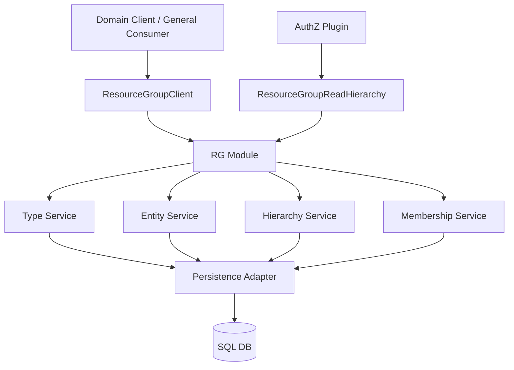
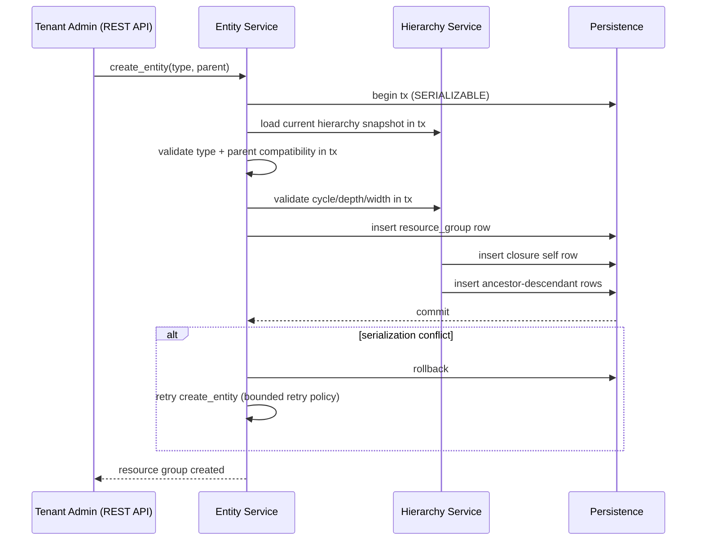
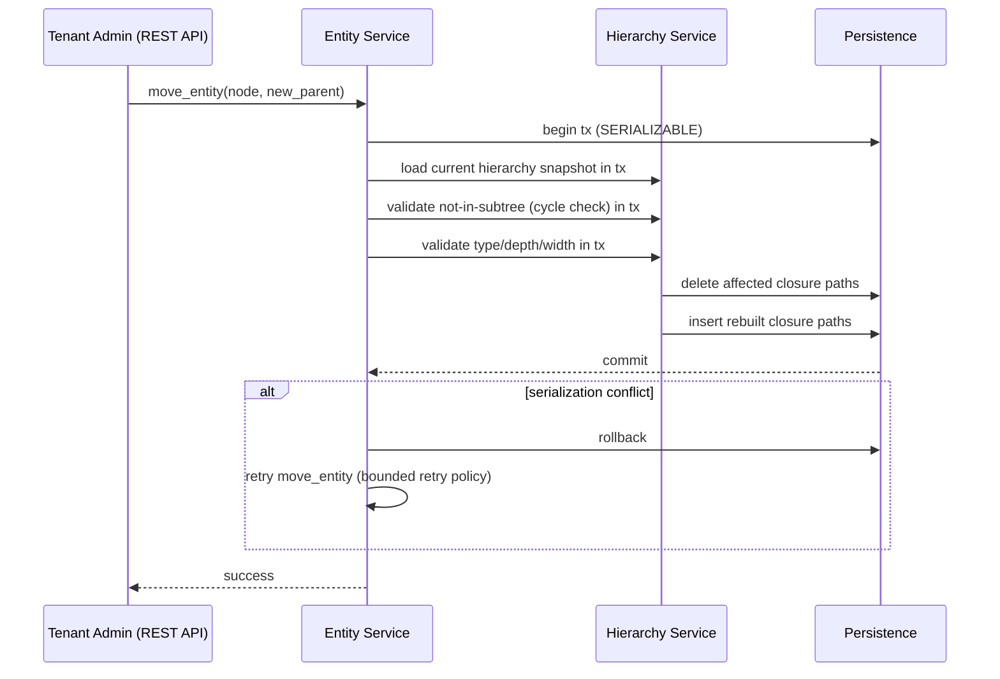
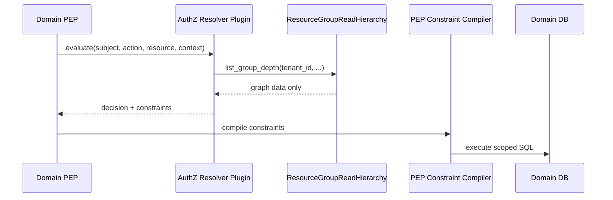
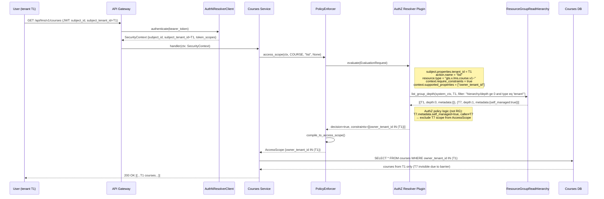
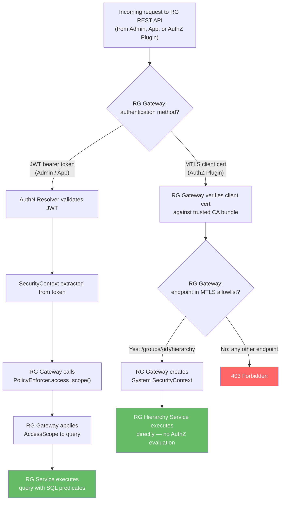
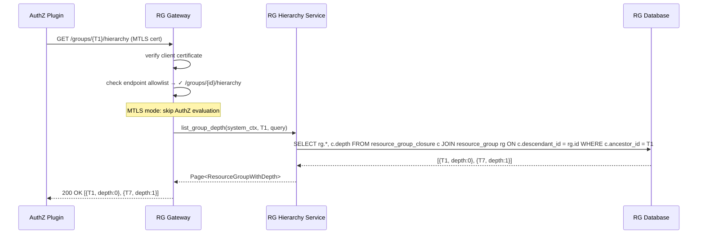
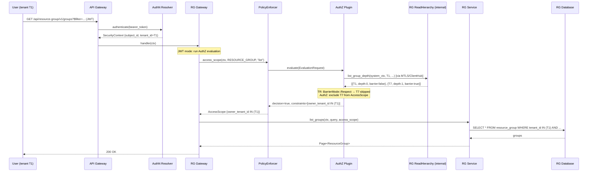

<!-- Created: 2026-03-06 by Constructor Tech -->
<!-- Updated: 2026-04-20 by Constructor Tech -->

# Technical Design - Resource Group (RG)


<!-- toc -->

- [1. Architecture Overview](#1-architecture-overview)
  - [1.1 Architectural Vision](#11-architectural-vision)
  - [1.2 Architecture Drivers](#12-architecture-drivers)
  - [1.3 Architecture Layers](#13-architecture-layers)
- [2. Principles & Constraints](#2-principles--constraints)
  - [2.1 Design Principles](#21-design-principles)
  - [2.2 Constraints](#22-constraints)
- [3. Technical Architecture](#3-technical-architecture)
  - [3.1 Domain Model](#31-domain-model)
  - [3.2 Component Model](#32-component-model)
  - [3.3 API Contracts](#33-api-contracts)
  - [3.4 Internal Dependencies](#34-internal-dependencies)
  - [3.5 External Dependencies](#35-external-dependencies)
  - [3.6 Interactions & Sequences](#36-interactions--sequences)
  - [3.7 Database schemas & tables](#37-database-schemas--tables)
  - [3.8 Query Profile Enforcement](#38-query-profile-enforcement)
  - [3.9 Error Mapping](#39-error-mapping)
- [4. Additional Context](#4-additional-context)
  - [Non-Applicable Design Domains](#non-applicable-design-domains)
  - [Performance Architecture](#performance-architecture)
  - [Security Architecture](#security-architecture)
  - [Reliability Architecture](#reliability-architecture)
  - [Data Governance](#data-governance)
  - [API Versioning](#api-versioning)
  - [Observability](#observability)
  - [Architecture Evolution: RG as Persistent Storage for Types Registry](#architecture-evolution-rg-as-persistent-storage-for-types-registry)
  - [Known Technical Debt](#known-technical-debt)
  - [Open Questions](#open-questions)
  - [4.1 Database Size Analysis & Production Projections](#41-database-size-analysis--production-projections)
  - [4.2 Testing Architecture](#42-testing-architecture)
- [5. Traceability](#5-traceability)

<!-- /toc -->

> **Abbreviation**: Resource Group = **RG**. Used throughout this document.

## 1. Architecture Overview

### 1.1 Architectural Vision

RG is a generic hierarchy and membership module.

It provides:

- dynamic type model
- strict forest entity topology
- closure-table hierarchy read model
- membership links between groups and resources
- read interfaces consumable by external modules/plugins

RG is intentionally policy-agnostic:

- no AuthZ policy evaluation
- no decision semantics
- no SQL filter generation

The architecture consists of:

- **RG Resolver SDK** — read and write trait contracts (`ResourceGroupClient`, `ResourceGroupReadHierarchy`)
- **RG Module (Gateway)** — routes requests to built-in or vendor-specific provider
- **RG Plugin** — full service with database, REST API, seeding, and domain logic

Deployments use either: (RG Plugin + RG Service) or (Vendor RG Plugin + Vendor RG Service) — both behind the same SDK contracts.

AuthZ can operate without RG. RG is an optional PIP data source for AuthZ plugin logic.

For AuthZ-facing deployments aligned with current platform architecture, `ownership-graph` is the required profile; provider selection (built-in provider or vendor-specific backend) is deployment-specific.

### 1.2 Architecture Drivers

#### Functional Drivers


| Requirement                                                   | Design Response                                                                                                                       |
| ------------------------------------------------------------- | ------------------------------------------------------------------------------------------------------------------------------------- |
| `cpt-cf-resource-group-fr-rest-api`                           | REST API layer with OperationBuilder and OData query support.                                                                         |
| `cpt-cf-resource-group-fr-odata-query`                        | OData `$filter` and cursor-based pagination (`cursor`, `limit`) on all list endpoints. Ordering is undefined but consistent. No `$orderby`. |
| `cpt-cf-resource-group-fr-list-groups-depth`                  | Dedicated depth endpoint (`/{group_id}/hierarchy`) returns hierarchy with relative depth and depth-based filtering.                       |
| `cpt-cf-resource-group-fr-manage-types`                       | Type service with validated lifecycle API and uniqueness guarantees.                                                                  |
| `cpt-cf-resource-group-fr-validate-type-code`                 | Type service enforces code format, length, and case-insensitive normalization before persistence.                                     |
| `cpt-cf-resource-group-fr-reject-duplicate-type`              | Unique `schema_id` persistence constraint and deterministic conflict mapping prevent duplicate type creation.                         |
| `cpt-cf-resource-group-fr-seed-types`                         | Any RG plugin MUST perform schema migration. Type data seeding is optional and deployment-specific (plugin data migration, manual DB admin, or RG API). AuthZ config determines required types. Types have no interdependencies and SHOULD be seeded in parallel (`JoinSet`) for throughput. |
| `cpt-cf-resource-group-fr-seed-groups`                        | Group data seeding is optional and deployment-specific (plugin data migration, manual DB admin, or RG API). Validates parent-child links and type compatibility when performed. Groups MUST be seeded sequentially (parents before children) due to hierarchy dependencies. |
| `cpt-cf-resource-group-fr-seed-memberships`                   | Membership data seeding is optional and deployment-specific (plugin data migration, manual DB admin, or RG API). Validates group existence and tenant compatibility when performed. Memberships have no interdependencies and SHOULD be seeded in parallel. |
| `cpt-cf-resource-group-fr-validate-type-update-hierarchy`     | Type update validates removed `allowed_parents` and `can_be_root` changes against existing groups; rejects with `AllowedParentsViolation` when hierarchy would become inconsistent. |
| `cpt-cf-resource-group-fr-delete-type-only-if-empty`          | Type deletion flow checks for existing entities and rejects delete when references remain.                                            |
| `cpt-cf-resource-group-fr-manage-entities`                    | Entity service with create/get/update/move/delete operations.                                                                         |
| `cpt-cf-resource-group-fr-enforce-forest-hierarchy`           | Domain invariants + cycle checks before writes.                                                                                       |
| `cpt-cf-resource-group-fr-validate-parent-type`               | Entity create/move validates parent-child compatibility against runtime type parent rules.                                            |
| `cpt-cf-resource-group-fr-delete-entity-no-active-references` | Delete orchestration applies reference-policy checks before entity removal and closure mutation.                                      |
| `cpt-cf-resource-group-fr-tenant-scope-ownership-graph`       | Ownership-graph profile enforces tenant-hierarchy-compatible parent-child and membership writes, with tenant-scoped AuthZ query path. |
| `cpt-cf-resource-group-fr-manage-membership`                  | Membership service provides deterministic add/remove lifecycle operations.                                                            |
| `cpt-cf-resource-group-fr-query-membership-relations`         | Membership read API supports indexed lookups by group and by resource.                                                                |
| `cpt-cf-resource-group-fr-closure-table`                      | Hierarchy service backed by `resource_group_closure`.                                                                                 |
| `cpt-cf-resource-group-fr-query-group-hierarchy`              | Hierarchy read paths return ancestors/descendants ordered by depth.                                                          |
| `cpt-cf-resource-group-fr-subtree-operations`                 | Subtree move/delete executes closure recalculation inside one transaction boundary.                                                   |
| `cpt-cf-resource-group-fr-query-profile`                      | Optional profile guard checks for depth/width on writes and query paths; limits can be disabled.                                      |
| `cpt-cf-resource-group-fr-profile-change-no-rewrite`          | Profile updates are treated as guardrails only and never rewrite historical hierarchy rows.                                           |
| `cpt-cf-resource-group-fr-reduced-constraints-behavior`       | Tightened profiles allow full reads but reject writes that create/increase depth or width violations.                                 |
| `cpt-cf-resource-group-fr-integration-read-port`              | Read-only consumer contract for hierarchy/membership access.                                                                          |
| `cpt-cf-resource-group-fr-no-authz-and-sql-logic`             | Hard separation: RG returns data only; AuthZ/PEP own constraints/SQL.                                                                 |
| `cpt-cf-resource-group-fr-deterministic-errors`               | Unified error mapper translates domain/infrastructure failures to stable public categories.                                           |
| `cpt-cf-resource-group-fr-force-delete`                       | Delete orchestration supports optional `force` parameter for cascade deletion of subtree and memberships.                             |
| `cpt-cf-resource-group-fr-dual-auth-modes`                    | RG Gateway supports JWT (all endpoints, AuthZ-evaluated) and MTLS (hierarchy-only, AuthZ-bypassed) authentication paths.             |


#### NFR Allocation


| NFR ID                                                | NFR Summary                     | Allocated To                                | Design Response                                | Verification      |
| ----------------------------------------------------- | ------------------------------- | ------------------------------------------- | ---------------------------------------------- | ----------------- |
| `cpt-cf-resource-group-nfr-hierarchy-query-latency`   | hierarchy reads p95 < 250ms     | hierarchy read paths + closure indexes      | indexed ancestor/descendant lookups            | benchmark suite   |
| `cpt-cf-resource-group-nfr-membership-query-latency`  | low-latency membership reads    | membership service + indexes                | direct lookup by group/resource keys           | benchmark suite   |
| `cpt-cf-resource-group-nfr-transactional-consistency` | transactional write consistency | transaction boundary in persistence adapter | canonical + closure updates commit together    | integration tests |
| `cpt-cf-resource-group-nfr-deterministic-errors`      | stable failures                 | unified error mapper                        | all domain/infra failures mapped to SDK errors | unit tests        |
| `cpt-cf-resource-group-nfr-production-scale`          | projected production volumes    | schema design + index strategy              | composite indexes, partitioning candidate for membership table (~455M rows, ~110 GB) | capacity planning |
| `cpt-cf-resource-group-nfr-compatibility`             | API and SDK compatibility       | SDK trait contracts + REST versioning       | path-based API versioning, trait backward compat | integration tests |
| `cpt-cf-resource-group-nfr-data-lifecycle`            | data lifecycle on deprovisioning | force delete cascade + tenant scope        | cascade-delete memberships/groups via force delete on tenant removal | integration tests |


#### Architecture Decision Records

| ADR ID | Title |
| --- | --- |
| `cpt-cf-resource-group-adr-p1-gts-type-system` | [GTS Type System for Resource Group](ADR/ADR-001-gts-type-system.md) — GTS chained type paths, SMALLINT surrogate keys, junction tables, barrier semantics |

#### Key Compatibility Anchors


| Document                                          | Constraint                                                                                                  |
| ------------------------------------------------- | ----------------------------------------------------------------------------------------------------------- |
| `docs/arch/authorization/DESIGN.md`               | AuthZ plugin can consume RG data as PIP input; PEP compiles constraints to SQL.                             |
| `docs/arch/authorization/RESOURCE_GROUP_MODEL.md` | AuthZ usage expects tenant-scoped groups with tenant-hierarchy-aware validation for graph/membership links. |
| `modules/system/authz-resolver/docs/PRD.md`       | AuthZ resolver contract unchanged; extension through plugin behavior only.                                  |
| `modules/system/authn-resolver/docs/PRD.md`       | no AuthN/AuthZ responsibility mixing.                                                                       |


### 1.3 Architecture Layers


| Layer                  | Responsibility                                    | Technology                    |
| ---------------------- | ------------------------------------------------- | ----------------------------- |
| REST API Layer         | HTTP endpoints with OData query support           | OperationBuilder + REST handlers |
| SDK API Layer          | expose type/entity/membership + read contracts    | Rust SDK traits + ClientHub   |
| Domain Layer           | validate type compatibility and forest invariants | domain services               |
| Hierarchy Engine       | closure-table updates/queries and profile checks  | domain service + repositories |
| Integration Read Layer | read-only hierarchy queries for AuthZ plugin      | `ResourceGroupReadHierarchy`  |
| Persistence Layer      | transactional storage and indexing                | SQL + SeaORM repositories     |


## 2. Principles & Constraints

### 2.1 Design Principles

#### Policy-Agnostic Core

- [x] `p1` - **ID**: `cpt-cf-resource-group-principle-policy-agnostic`

RG handles graph/membership data only.

#### Strict Forest Integrity

- [x] `p1` - **ID**: `cpt-cf-resource-group-principle-strict-forest`

Hierarchy guarantees single parent and cycle prevention for all writes.

#### Dynamic Type Governance

- [x] `p1` - **ID**: `cpt-cf-resource-group-principle-dynamic-types`

Type rules are runtime-configurable through API/seed data with deterministic validation.

**ADRs**: `cpt-cf-resource-group-adr-p1-gts-type-system`

**Derived type fields — metadata object, JSONB storage (v1)**: Derived type fields (e.g. `barrier`, `custom_domain`, `category`) are nested inside a `metadata` object in API requests and responses. In the database, they are stored in a `metadata` JSONB column on `resource_group`. For chained types (e.g., `gts.x.core.rg.type.v1~y.core.tn.tenant.v1~`), the chained GTS schema defines `properties.metadata` with `additionalProperties: false` for field isolation. `metadata_schema` on the RG type definition is null for chained types — instance metadata is validated against the GTS schema. The `metadata_schema` field is reserved for optional RG-level schema overrides. Advanced validation (e.g., Starlark-based cross-field rules) is out of scope for v1.

#### Query Profile as Guardrail

- [x] `p1` - **ID**: `cpt-cf-resource-group-principle-query-profile-guardrail`

`(max_depth, max_width)` is a service profile controlling write admissibility and SLO classification.

#### Tenant Scope for Ownership Graph

- [x] `p1` - **ID**: `cpt-cf-resource-group-principle-tenant-scope-ownership-graph`

In ownership-graph usage, groups are tenant-scoped and links must be tenant-hierarchy-compatible (same-tenant or allowed related-tenant link per tenant hierarchy rules).

#### Barrier as Data (Not Enforcement)

- [x] `p1` - **ID**: `cpt-cf-resource-group-principle-barrier-as-data`

`barrier` is not a dedicated database column. For GTS types that support barrier semantics (e.g. tenant types), `barrier` is stored inside the `metadata` JSONB field as `metadata.self_managed` (boolean). **ADRs**: `cpt-cf-resource-group-adr-p1-gts-type-system`. **RG stores and returns it without enforcement** — RG does not filter, restrict, or alter query results based on the barrier value. RG stores it in `metadata` and returns it in API responses within the `metadata` object, nothing more.

Barrier enforcement is a **joint responsibility of Tenant Resolver and AuthZ**:

- **RG does not enforce barriers**: all RG queries (hierarchy, groups, memberships) return data regardless of barrier values. If a caller has an `AccessScope` that includes `tenant_id = T7`, RG will return T7's data even if T7 has `metadata.self_managed = true`.
- **Tenant Resolver enforces barriers in hierarchy traversal**: TR SDK defines `BarrierMode` (`Respect` / `Ignore`). The static-tr-plugin's `collect_descendants` skips barrier tenants (`self_managed = true`) and their entire subtrees. `collect_ancestors` from a barrier tenant returns empty. RG's `metadata.self_managed` maps to TR's `TenantInfo.self_managed`.
- **AuthZ integrates barriers into SQL constraints**: the `in_tenant_subtree` predicate supports `barrier_mode: "all"` (default, reads `metadata->>'barrier'` from the closure query) or `"none"` (ignores barriers for billing, provisioning).
- **Each layer is vendor-replaceable**: vendors can implement custom TR plugins and AuthZ plugins with different barrier semantics. RG remains policy-agnostic.

This aligns with the core constraint "No AuthZ Decision Logic" — RG is a data source, TR + AuthZ are the policy engines.

**Actual barrier behavior** (Tenant Resolver `BarrierMode::Respect`, default):
- Barrier tenant and its subtree are **completely invisible** to parent — skipped in `collect_descendants`.
- Barrier tenant cannot see parent chain — `collect_ancestors` returns empty.
- Barrier tenant sees its own subtree normally via its own scope.
- Nested barriers are allowed (partner with barrier → customer with barrier).
- `BarrierMode::Ignore` bypasses barriers (platform-admin, billing, provisioning).

### 2.2 Constraints

#### No AuthZ Decision Logic

- [x] `p1` - **ID**: `cpt-cf-resource-group-constraint-no-authz-decision`

RG cannot return allow/deny decisions.

#### No SQL/ORM Filter Generation

- [x] `p1` - **ID**: `cpt-cf-resource-group-constraint-no-sql-filter-generation`

RG cannot generate SQL fragments or access-scope objects.

#### Database-Agnostic Persistence

- [x] `p1` - **ID**: `cpt-cf-resource-group-constraint-db-agnostic`

RG persistence layer uses SeaORM abstractions and standard SQL. The module **MUST NOT** depend on vendor-specific SQL extensions or features of a particular RDBMS. Any SQL-compatible database supported by SeaORM can be used as the storage backend.

**Implementation note**: the reference DDL (`migration.sql`) uses a PostgreSQL-specific `CREATE DOMAIN gts_type_path` with regex validation. The SeaORM migration code must provide a database-agnostic equivalent — GTS type path format validation (`^gts\.[a-z_]...~$`) is enforced at the application layer (service/domain code) as fallback for non-PostgreSQL backends. The `DOMAIN` in the reference DDL serves as defense-in-depth for PostgreSQL deployments only.

#### Surrogate IDs Are Internal Only

- [x] `p1` - **ID**: `cpt-cf-resource-group-constraint-surrogate-ids-internal`

SMALLINT surrogate IDs (`gts_type.id`, `gts_type_id` FK columns) are a **DB-internal optimization**. They MUST NOT appear in any API response, SDK type, REST contract, or OpenAPI schema. All external interfaces (REST API, SDK traits, gRPC) use GTS type paths (strings) exclusively. The server resolves GTS paths to/from SMALLINT IDs at the persistence layer boundary.

**Strict type existence validation**: every GTS type path used in any API operation **MUST** reference an already-registered type in `gts_type`. This applies to:
- `type` in group create/update requests (`POST /groups`, `PUT /groups/{id}`)
- `allowed_parents` in type create/update requests
- `allowed_memberships` in type create/update requests
- `resource_type` in membership operations (`POST /memberships/...`)

If a referenced type does not exist, the operation **MUST** return a validation error. Each chained type (e.g., `gts.x.system.rg.type.v1~y.system.tn.tenant.v1~`) is a distinct type that must be registered separately — chaining does not auto-create constituent types. Registration order matters: base/resource types first, then chained RG types that reference them. Base types (including `gts.x.system.rg.type.v1~`) must be created before use — via seeding, API calls, or manual DB administration.

**RG type prefix requirement (`gts.x.system.rg.type.v1~`)**:
- **`type` in group operations**: `POST /groups`, `PUT /groups/{id}` — **MUST** have `gts.x.system.rg.type.v1~` prefix. Rejected without it.
- **`allowed_parents`**: **MUST** have `gts.x.system.rg.type.v1~` prefix — parent groups are always RG types.
- **`allowed_memberships`**: **NO prefix requirement** — membership resource types are external domain types (e.g., `gts.z.system.idp.user.v1~`, `gts.z.system.lms.course.v1~`) that do not need to be RG types.

This ensures the hierarchy is always governed by the RG type contract (`can_be_root`, `allowed_parents`, `allowed_memberships`), while membership resources can be any registered GTS type.

**ADRs**: `cpt-cf-resource-group-adr-p1-gts-type-system`

#### Profile Change Safety

- [x] `p1` - **ID**: `cpt-cf-resource-group-constraint-profile-change-safety`

Reducing enabled `max_depth`/`max_width` cannot rewrite existing rows. Writes that worsen violation are rejected until external migration runs. Limits may also be disabled.

#### Non-Applicable Constraint Categories

- **Regulatory constraints**: Not applicable at module level — RG does not handle PII directly. Regulatory requirements are platform-level (see PRD section 6.6).
- **Vendor/licensing constraints**: SeaORM is Apache-2.0 licensed. No vendor lock-in — database is pluggable via `cpt-cf-resource-group-constraint-db-agnostic`.
- **Data residency constraints**: Not applicable at module level — data residency is a deployment-specific concern handled by infrastructure (database placement, region selection).
- **Resource constraints**: Not applicable — resource constraints (budget, team, timeline) are project-level and tracked in project management tools.

## 3. Technical Architecture

### 3.1 Domain Model

**Planned locations**:

- `modules/system/resource-group/resource-group-sdk/src/models.rs` — SDK models and DTOs
- `modules/system/resource-group/resource-group-sdk/src/api.rs` — SDK trait contracts
- `modules/system/resource-group/resource-group-sdk/src/error.rs` — SDK error types
- `modules/system/resource-group/resource-group/src/domain/` — domain services and invariants
- `modules/system/resource-group/resource-group/src/api/` — REST API handlers

**Core entities**:


| Entity                    | Description                                                         |
| ------------------------- | ------------------------------------------------------------------- |
| `ResourceGroupType`       | type code and allowed parent types                                  |
| `ResourceGroupEntity`     | group node with optional parent, stored in `resource_group` table   |
| `ResourceGroupMembership` | resource-to-group many-to-many link, qualified by `resource_type`   |
| `ResourceGroupClosure`    | ancestor-descendant-depth projection                                |
| `ResourceGroupError`      | deterministic public error taxonomy                                 |

**Entity relationships**:

- `ResourceGroupType` * ←→ * `ResourceGroupType` via `gts_type_allowed_parent` (M:N self-referential: which types can be parents of which)
- `ResourceGroupType` * ←→ * `ResourceGroupType` via `gts_type_allowed_membership` (M:N: which resource types can be members of groups of which type)
- `ResourceGroupEntity` * → 1 `ResourceGroupType` (each group has one type)
- `ResourceGroupEntity` * → 0..1 `ResourceGroupEntity` (optional parent — forest root has no parent)
- `ResourceGroupEntity` 1 ←→ * `ResourceGroupMembership` (group has many members)
- `ResourceGroupEntity` 1 ←→ * `ResourceGroupClosure` (as ancestor and as descendant)

**Value objects**: `GtsTypePath` (validated type code string), `ListQuery` (OData filter + pagination params), `PageInfo` (cursor pagination metadata), `Page<T>` (paginated response wrapper).

### 3.2 Component Model



AuthZ plugin depends only on the narrow `ResourceGroupReadHierarchy` trait (hierarchy-only). All other consumers (domain clients, general consumers) use `ResourceGroupClient` (full CRUD including reads).


#### RG Module (Gateway)

- [x] `p1` - **ID**: `cpt-cf-resource-group-component-module`

Responsibilities:

- wire services and repositories
- register public clients in ClientHub
- expose REST API endpoints under `/api/resource-group/v1/` (groups, memberships) and `/api/types-registry/v1/` (types)
- load query profile config
- route `ResourceGroupReadHierarchy` calls to built-in data path or configured vendor-specific plugin path

Boundaries:

- no business rule implementation
- no authz decision logic

#### Type Service

- [x] `p1` - **ID**: `cpt-cf-resource-group-component-type-service`

Responsibilities:

- manage type lifecycle
- validate code format and uniqueness
- enforce delete-if-unused

#### Entity Service

- [x] `p1` - **ID**: `cpt-cf-resource-group-component-entity-service`

Responsibilities:

- create/get/update/move/delete entities
- validate parent type compatibility (on create, move, and type change)
- on `type` change: validate that the new type's `allowed_parents` permits the current parent's type, AND that all children's types include the new type in their `allowed_parents` — reject with `InvalidParentType` if any child would become invalid
- orchestrate subtree operations

#### Hierarchy Service

- [x] `p1` - **ID**: `cpt-cf-resource-group-component-hierarchy-service`

Responsibilities:

- maintain closure table rows
- serve ancestor/descendant queries ordered by depth
- enforce depth/width rules on writes

#### Membership Service

- [x] `p1` - **ID**: `cpt-cf-resource-group-component-membership-service`

Responsibilities:

- add/remove/list membership links
- guard deletion with active-reference checks

#### Integration Read Service

- [x] `p1` - **ID**: `cpt-cf-resource-group-component-integration-read-service`

Responsibilities:

- expose read-only graph/membership queries for external consumers
- remain protocol-neutral and authz-agnostic

#### Persistence Adapter

- [x] `p1` - **ID**: `cpt-cf-resource-group-component-persistence-adapter`

Responsibilities:

- transactional persistence
- index-aware query execution
- consistent canonical + closure updates
- support canonical persistence strategy

Each repository MUST be defined as a trait first (e.g., `TypeRepositoryTrait`, `GroupRepositoryTrait`, `MembershipRepositoryTrait`, `ClosureRepositoryTrait`) and injected into domain services as `Arc<dyn Trait>`. This enables:
- unit testing via in-memory trait implementations (`InMemoryTypeRepository`, etc.) without database
- swappable storage backends without touching domain layer
- clear contract boundary between domain and infrastructure

Boundaries:

- no domain decisions
- no API semantics

### 3.3 API Contracts

**Core API** (`ResourceGroupClient`, stable):


| Method | Returns | Description |
| ------ | ------- | ----------- |
| `create_type` / `update_type` | `ResourceGroupType` | type lifecycle |
| `get_type` | `ResourceGroupType` | get type by code |
| `list_types` | `Page<ResourceGroupType>` | list types with OData query |
| `delete_type` | `()` | delete type |
| `create_group` / `update_group` | `ResourceGroup` | group lifecycle |
| `get_group` | `ResourceGroup` | get group by ID |
| `list_groups` | `Page<ResourceGroup>` | list groups with OData query |
| `delete_group` | `()` | delete group (non-cascade; cascade only via REST) |
| `list_group_depth` | `Page<ResourceGroupWithDepth>` | traverse hierarchy from reference group with relative depth |
| `add_membership` | `ResourceGroupMembership` | add membership |
| `remove_membership` | `()` | remove membership |
| `list_memberships` | `Page<ResourceGroupMembership>` | list memberships with OData query |


SDK models are defined in `resource-group-sdk/src/models.rs` and are aligned with REST API schemas. Key SDK types:

| SDK Type | REST Schema | Description |
| -------- | ----------- | ----------- |
| `ResourceGroupType` | `Type` | `schema_id`, `allowed_parents`, `allowed_memberships`, `metadata_schema`. `can_be_root` resolved from `x-gts-traits`. |
| `ResourceGroup` | `Group` | group identity (`id`, `type`, `name`), `hierarchy` context, `metadata` (type-specific fields) |
| `ResourceGroupWithDepth` | `GroupWithDepth` | same as `ResourceGroup` plus `hierarchy.depth` (relative distance) |
| `ResourceGroupMembership` | `Membership` | `group_id`, `resource_type`, `resource_id` |
| `Page<T>` / `PageInfo` | `*Page` | cursor-based pagination wrapper |

Core API trait (`ResourceGroupClient`) is defined in `resource-group-sdk/src/api.rs`. All methods accept `SecurityContext` as the first argument for tenant-scoped authorization.

Core API usage pattern: resolve `dyn ResourceGroupClient` from `ClientHub`, build `SecurityContext` with `subject_id` + `subject_tenant_id`, then call trait methods with the appropriate request structs. All operations accept `SecurityContext` as the first argument for tenant-scoped authorization.

Membership write semantics for AuthZ-facing profile:

- membership operations are keyed by `(group_id, resource_type, resource_id)`
- in `ownership-graph` mode, add/remove validates tenant scope via caller `SecurityContext` effective scope and target group tenant
- membership tenant scope is derived from the target group's `tenant_id` via `group_id` (JOIN, not stored on membership row)
- tenant-incompatible membership writes fail deterministically (`TenantIncompatibility` error mapping)
- no policy decision fields are produced by RG for these operations

Platform-admin provisioning exception:

- privileged platform-admin calls that create/manage tenant hierarchies through `ResourceGroupClient` may run without caller tenant scoping
- this exception applies to provisioning/management operations only, not AuthZ query path
- data invariants remain strict: parent-child and membership links must satisfy tenant hierarchy compatibility rules

#### REST API Endpoints

Base path: `/api/resource-group/v1` (groups, memberships), `/api/types-registry/v1` (types)

| Method | Base | Path | Operation | Description |
| ------ | ---- | ---- | --------- | ----------- |
| GET | types-registry | `/types` | `listTypes` | List types with OData query |
| POST | types-registry | `/types` | `createType` | Create type |
| GET | types-registry | `/types/{code}` | `getType` | Get type by code |
| PUT | types-registry | `/types/{code}` | `updateType` | Update type |
| DELETE | types-registry | `/types/{code}` | `deleteType` | Delete type |
| GET | resource-group | `/groups` | `listGroups` | List groups with OData query |
| POST | resource-group | `/groups` | `createGroup` | Create group (`tenant_id` derived from `SecurityContext` effective tenant scope) |
| GET | resource-group | `/groups/{group_id}` | `getGroup` | Get group by ID |
| PUT | resource-group | `/groups/{group_id}` | `updateGroup` | Full replace of group (including parent move) |
| DELETE | resource-group | `/groups/{group_id}` | `deleteGroup` | Delete group (optional `?force=true`) |
| GET | resource-group | `/groups/{group_id}/hierarchy` | `listGroupHierarchy` | Traverse hierarchy from reference group with relative depth |
| GET | resource-group | `/memberships` | `listMemberships` | List memberships with OData query |
| POST | resource-group | `/memberships/{group_id}/{resource_type}/{resource_id}` | `addMembership` | Add membership |
| DELETE | resource-group | `/memberships/{group_id}/{resource_type}/{resource_id}` | `deleteMembership` | Remove membership |

Query support on all list endpoints:

- `$filter` — OData field-specific operators (eq, ne, in)
- `limit` — page size (1..200, default 25)
- `cursor` — opaque token from previous response for next/previous page
- Ordering is undefined but consistent — no `$orderby`

Group list (`listGroups`) `$filter` fields: `type` (eq, ne, in), `hierarchy/parent_id` (eq, ne, in — direct parent only, depth=1; for ancestor traversal use `listGroupHierarchy`), `id` (eq, ne, in), `name` (eq, ne, in).

Group depth (`listGroupHierarchy`) `$filter` fields: `hierarchy/depth` (eq, ne, gt, ge, lt, le), `type` (eq, ne, in).

Membership list `$filter` fields: `resource_id` (eq, ne, in), `resource_type` (eq, ne, in), `group_id` (eq, ne, in).

REST API field projection notes:

- Group responses (`Group` schema) do not include `created_at`/`updated_at` timestamps. These fields exist in the database for audit purposes but are not exposed in API responses.
- Membership list responses (`Membership` schema) do not include `tenant_id`. Memberships are always scoped to a single tenant; tenant scope is derived from the group's `tenant_id` via `group_id` JOIN and is not stored on the membership row itself.

Type list `$filter` fields: `code` (eq, ne, in).

**Integration read API** (stable, two-tier trait hierarchy):

`ResourceGroupReadHierarchy` is a narrow hierarchy-only read contract used exclusively by AuthZ plugin. All other consumers use `ResourceGroupClient` which includes the same read operations plus full CRUD.

| Trait | Method | Description |
| ----- | ------ | ----------- |
| `ResourceGroupReadHierarchy` | `list_group_depth(ctx, group_id, query)` | hierarchy traversal with relative `depth`; matches REST `GET /groups/{group_id}/hierarchy` — supports OData `$filter` (depth, type), cursor-based pagination (`cursor`, `limit`) |

Integration read models reuse the same SDK structs defined above:

- `list_group_depth` returns `Page<ResourceGroupWithDepth>` (matches REST `GroupWithDepthPage`)
- `list_memberships` (on `ResourceGroupClient`) returns `Page<ResourceGroupMembership>` (matches REST `MembershipPage` — no `tenant_id`; tenant scope is available from group data the caller already has via `list_group_depth`)

Integration read trait hierarchy (defined in `resource-group-sdk/src/api.rs`):

| Trait | Extends | Methods | Used by |
| ----- | ------- | ------- | ------- |
| `ResourceGroupReadHierarchy` | — | `list_group_depth` | AuthZ plugin (hierarchy-only read) |
| `ResourceGroupReadPluginClient` | `ResourceGroupReadHierarchy` | `list_memberships` | Vendor-specific plugin gateway |
| `ResourceGroupClient` | — | full CRUD (types, groups, memberships, hierarchy) | General consumers |

ClientHub registration: single implementation (`RgService`), registered as both `dyn ResourceGroupClient` and `dyn ResourceGroupReadHierarchy`. AuthZ plugin resolves `dyn ResourceGroupReadHierarchy`, general consumers resolve `dyn ResourceGroupClient`.

Plugin gateway routing notes:

- `ResourceGroupClient` is the full read+write contract for type/entity/membership lifecycle and hierarchy queries (used by domain clients and general consumers)
- `ResourceGroupReadHierarchy` is the narrow read-only contract for AuthZ plugin (hierarchy only)
- both are registered in ClientHub backed by the same implementation
- module service resolves configured provider:
  - built-in provider: serve reads from local RG persistence path
  - vendor-specific provider: resolve plugin instance by configured vendor and delegate to `ResourceGroupReadPluginClient`
- plugin registration is scoped (GTS instance ID), same pattern as tenant-resolver/authz-resolver gateways
- `SecurityContext` is forwarded without policy interpretation in gateway layer (including plugin path)

Returned models are generic graph/membership objects. They do not encode AuthZ decisions or SQL semantics.

Tenant projection rule for integration reads:

- hierarchy reads (`list_group_depth`) return `ResourceGroupWithDepth` which includes `tenant_id` per group — callers use this to validate tenant scope
- membership reads (`list_memberships`) return `ResourceGroupMembership` without `tenant_id` — callers derive tenant scope from group data already obtained via hierarchy reads
- rows from hierarchy reads can legitimately contain different `tenant_id` values when caller effective scope spans tenant hierarchy levels
- this keeps RG policy-agnostic while allowing external PDP logic to validate tenant ownership before producing group-based constraints

Caller identity propagation rule (aligned with Tenant Resolver pattern):

- integration read methods accept caller `SecurityContext` (`ctx`) as the first argument
- RG gateway preserves `ctx` across provider routing (for plugin path, `ctx` is passed through to selected plugin unchanged) without converting it into policy decisions
- plugin implementations decide how/if `ctx` affects read access semantics (for example tenant-scoped visibility or auditing)
- this keeps RG data-only while preserving caller identity required by AuthZ plugin/PDP flows
- for AuthZ query path, reads are tenant-scoped by effective scope derived from caller `SecurityContext.subject_tenant_id`; non-tenant-scoped provisioning exception does not apply

#### Integration Read Schemas (AuthZ-facing)

The integration read contract returns **data rows only** (no policy/decision fields). Schemas match REST API models exactly.

`list_group_depth(ctx, group_id, query)` returns `Page<ResourceGroupWithDepth>` (matches REST `GET /groups/{group_id}/hierarchy` → `GroupWithDepthPage`):


| Field         | Type        | Required | Description                                                                  |
| ------------- | ----------- | -------- | ---------------------------------------------------------------------------- |
| `id`          | UUID        | Yes      | Group identifier                                                             |
| `type`        | string      | Yes      | GTS chained type path                                                        |
| `name`        | string      | Yes      | Display name                                                                 |
| `metadata`     | object | No   | Type-specific fields nested in `metadata` object (e.g. `metadata.self_managed`, `metadata.category`). Stored in DB `metadata` JSONB. Schema defined by chained GTS type. |
| `hierarchy`   | object      | Yes      | RG hierarchy context                                                         |
| `hierarchy.parent_id` | UUID / null | No | Parent group (null for root groups)                                    |
| `hierarchy.tenant_id` | UUID  | Yes    | Tenant scope (can differ per row under tenant hierarchy scope)               |
| `hierarchy.depth` | INT     | Yes      | Relative distance from reference group (`0` = self, positive = descendants, negative = ancestors) |

OData filters for `list_group_depth`: `hierarchy/depth` (eq, ne, gt, ge, lt, le), `type` (eq, ne, in). Pagination: `cursor`, `limit`. Uses OData nested path syntax (e.g., `$filter=hierarchy/depth ge 0 and type eq '...'`).

`list_memberships(ctx, query)` returns `Page<ResourceGroupMembership>` (matches REST `GET /memberships` → `MembershipPage`):


| Field           | Type   | Required | Description                           |
| --------------- | ------ | -------- | ------------------------------------- |
| `group_id`      | UUID   | Yes      | Group identifier                      |
| `resource_type` | string | Yes      | Resource type classification          |
| `resource_id`   | string | Yes      | Resource identifier                   |

OData filters for `list_memberships`: `group_id` (eq, ne, in), `resource_type` (eq, ne, in), `resource_id` (eq, ne, in). Pagination: `cursor`, `limit`.

Membership rows do not include `tenant_id`. Callers derive tenant scope from group data obtained via `list_group_depth`.

Tenant consistency behavior for integration reads:

- hierarchy rows include `tenant_id` per group — callers validate row scope against effective tenant scope before generating AuthZ group constraints
- membership rows are keyed by `group_id` — callers map `group_id → tenant_id` from hierarchy data
- in AuthZ query path, mixed-tenant rows are valid when each row tenant is inside effective tenant scope resolved from `ctx`

#### Integration Read Examples

Examples below assume caller effective tenant scope includes:

- `11111111-1111-1111-1111-111111111111` (tenant `T1`, subject tenant)
- `77777777-7777-7777-7777-777777777777` (tenant `T7`, related tenant in hierarchy scope)

Data shape used by all examples (same tenant/group/resource IDs as below):

```text
tenant T1 (11111111-1111-1111-1111-111111111111)
├── department D2 (22222222-2222-2222-2222-222222222222)
│   ├── branch B3 (33333333-3333-3333-3333-333333333333)
│   │   └── resource R4
│   └── resource R5
├── resource R4
├── resource R6
└── tenant T7 (77777777-7777-7777-7777-777777777777)
    └── resource R8
tenant T9 (99999999-9999-9999-9999-999999999999)
└── resource R0
```

Client initialization: AuthZ plugin resolves `dyn ResourceGroupReadHierarchy` from ClientHub (hierarchy only); general consumers resolve `dyn ResourceGroupClient` (full CRUD). Both build `SecurityContext` with `subject_id` + `subject_tenant_id` for tenant-scoped operations.

**Integration read examples** — see [openapi.yaml](./openapi.yaml) for full request/response examples with realistic data.

- `list_group_depth(ctx, D2, filter="hierarchy/depth ge 0")` — returns descendants: D2 at depth 0, B3 at depth 1.
- `list_group_depth(ctx, B3, filter="hierarchy/depth ge -10 and hierarchy/depth le 0")` — returns ancestor chain: T1 at depth -2, D2 at depth -1, B3 at depth 0.
- `list_memberships(ctx, filter="group_id in (...)")` — returns membership links `(group_id, resource_type, resource_id)` for requested groups.

### 3.4 Internal Dependencies


| Dependency           | Purpose                                     |
| -------------------- | ------------------------------------------- |
| `resource-group-sdk` | contracts/models/errors                     |
| `modkit/client_hub`  | inter-module client registration and lookup |


### 3.5 External Dependencies


| Dependency                            | Interface                       | Purpose                                                       |
| ------------------------------------- | ------------------------------- | ------------------------------------------------------------- |
| SQL database                          | SeaORM repositories             | durable canonical + closure storage                           |
| AuthZ Resolver SDK                    | `PolicyEnforcer` / `AuthZResolverClient` | AuthZ evaluation for JWT-authenticated RG API requests (write + read) |
| Vendor-specific RG backend (optional) | `ResourceGroupReadPluginClient` | alternative hierarchy/membership source for integration reads |
| AuthZ plugin consumer (optional)      | `ResourceGroupReadHierarchy`    | read hierarchy context in PDP logic (narrow, hierarchy-only, MTLS/in-process) |
| General consumers (optional)          | `ResourceGroupClient`           | full read+write access to types/entities/memberships/hierarchy |


### 3.6 Interactions & Sequences

#### Create Resource Group With Parent

**ID**: `cpt-cf-resource-group-seq-create-entity-with-parent`

Tenant Administrator creates a child resource group (e.g. department, branch) under an existing parent group via REST API `POST /groups`. Other callers — Instance Administrator (REST API) and Apps (`ResourceGroupClient` SDK) — follow the same internal flow.




#### Move Resource Group Subtree

**ID**: `cpt-cf-resource-group-seq-move-subtree`

Tenant Administrator moves a resource group (and its entire subtree) to a new parent within the same tenant via REST API `PUT /groups/{group_id}`. Other callers — Instance Administrator (REST API) and Apps (`ResourceGroupClient` SDK) — follow the same internal flow.




Write-concurrency rule for hierarchy mutations (`create/move/delete`):

- authoritative invariant checks MUST run inside the same write transaction that applies closure/entity mutations
- write transactions MUST use `SERIALIZABLE` isolation to prevent phantom reads between cycle-check and closure/entity insert under concurrent hierarchy mutations; `SERIALIZABLE` is the recommended default
- serialization conflicts are handled by bounded retry with deterministic error mapping when retries are exhausted

#### AuthZ + RG + SQL Responsibility Split

**ID**: `cpt-cf-resource-group-seq-authz-rg-sql-split`




This is the fixed boundary:

- RG returns graph data only.
- AuthZ plugin creates constraints.
- PEP/compiler creates SQL.

#### Module Initialization Order

**ID**: `cpt-cf-resource-group-seq-init-order`

RG Management API depends on AuthZ SDK; AuthZ plugin depends on RG Access API SDK. This circular dependency is resolved by phased initialization:

```
Phase 1 (SystemCapability):
  1. RG Module init
     → registers ResourceGroupClient in ClientHub
     → registers ResourceGroupReadHierarchy in ClientHub
     → REST/gRPC endpoints NOT yet accepting traffic

  2. AuthZ Resolver init (deps: [types-registry])
     → registers AuthZResolverClient in ClientHub
     → plugin discovery is lazy (first evaluate() call)

Phase 2 (ready):
  3. RG Module starts accepting REST/gRPC traffic
     → write operations call PolicyEnforcer → AuthZResolverClient (available since step 2)
     → seed operations run as pre-deployment step with system SecurityContext (bypass AuthZ)

  4. AuthZ plugin on first evaluate() call
     → lazy-discovers RG plugin via types-registry
     → calls ResourceGroupReadHierarchy (available since step 1)
```

There is no deadlock: RG registers its read clients before AuthZ initializes, and AuthZ registers its client before RG starts accepting write traffic. Seed operations run as a pre-deployment step with a system-level `SecurityContext` and bypass the AuthZ evaluation path.

#### End-to-End Authorization Flow (Example)

**ID**: `cpt-cf-resource-group-seq-e2e-authz-flow`

Concrete example: a user of tenant `T1` requests a list of courses. The tenant hierarchy grants access to courses in `T1` and its child tenant `T7`.

```text
Tenant hierarchy:
  tenant T1 (11111111-...)
  └── tenant T7 (77777777-...)
  tenant T9 (99999999-...)
```



Step-by-step:

1. **AuthN** — API Gateway extracts JWT bearer token, calls `AuthNResolverClient.authenticate()`. The authn plugin validates the token and returns a `SecurityContext` with `subject_id`, `subject_tenant_id = T1`, and `token_scopes`. Gateway injects `SecurityContext` into request extensions.

2. **Domain service** — Courses handler receives the request with `SecurityContext`. Before querying the database, it calls `PolicyEnforcer.access_scope(&ctx, &COURSE_RESOURCE, "list", None)` to obtain row-level access constraints.

3. **AuthZ evaluation** — `PolicyEnforcer` builds an `EvaluationRequest` (subject with `tenant_id = T1`, action `"list"`, resource type `"gts.x.lms.course.v1~"`, `require_constraints = true`, `supported_properties = ["owner_tenant_id"]`) and calls `AuthZResolverClient.evaluate()`.

4. **Hierarchy resolution** — The AuthZ plugin calls `ResourceGroupReadHierarchy.list_group_depth()` with `tenant_id = T1` and a depth filter to resolve the tenant hierarchy. RG returns `[T1 (depth 0), T7 (depth 1)]` — the accessible tenant subtree. The plugin does NOT see `T9` because it is outside `T1`'s hierarchy.

5. **Barrier filtering (TR + AuthZ, not RG)** — The AuthZ plugin calls Tenant Resolver `get_descendants(T1, BarrierMode::Respect)`. TR skips T7 entirely (`self_managed = true`) and returns `[T1]`. Alternatively, AuthZ queries `tenant_closure` with `AND barrier = 0` — same result. RG played no role in this filtering.

6. **Constraint generation** — After barrier filtering, the AuthZ plugin produces constraints: `owner_tenant_id IN (T1)` (T7 and its subtree excluded). This is returned in `EvaluationResponse` with `decision = true`.

7. **Constraint compilation** — `PolicyEnforcer` calls `compile_to_access_scope()` which converts the PDP constraints into an `AccessScope` with `ScopeFilter::in("owner_tenant_id", [T1])`.

8. **SQL execution** — Courses service applies the `AccessScope` via SecureORM, which appends `WHERE owner_tenant_id IN ('T1')` to the query. The user sees courses from T1 only. T7's courses, groups, and memberships are invisible.

Key separation of concerns:

| Component | Knows about | Does NOT know about |
| --------- | ----------- | ------------------- |
| Courses service | course domain, SQL schema | tenant hierarchy, access policies |
| AuthZ plugin | access policies, tenant hierarchy (via RG) | courses, SQL schema |
| RG | hierarchy data, group membership | courses, access policies, SQL |

#### RG Authentication Modes: JWT vs MTLS

**ID**: `cpt-cf-resource-group-seq-auth-modes`

RG Module exposes its REST/gRPC API with **two authentication modes**. The mode determines whether the request passes through AuthZ evaluation.

##### Mode 1: JWT (public API — all endpoints)

Standard user/service requests authenticated via JWT bearer token. **All** RG REST API endpoints are available. Every request goes through AuthZ evaluation via `PolicyEnforcer`, same as any other domain service (e.g. courses). JWT token lifecycle (expiry, refresh, revocation) is managed by the AuthN Resolver and API Gateway — RG delegates token validation entirely to the platform authentication layer and does not implement its own session timeout or token renewal logic.

Applies to:
- `GET /api/types-registry/v1/types` — list/get types
- `POST/PUT/DELETE /api/types-registry/v1/types/{code}` — type lifecycle
- `GET /api/resource-group/v1/groups` — list/get groups
- `POST/PUT/DELETE /api/resource-group/v1/groups/{group_id}` — group lifecycle
- `GET /api/resource-group/v1/groups/{group_id}/hierarchy` — hierarchy traversal
- `GET /api/resource-group/v1/memberships` — list memberships
- `POST/DELETE /api/resource-group/v1/memberships/{...}` — membership lifecycle

##### Mode 2: MTLS (private API — hierarchy endpoint only)

Service-to-service requests authenticated via mutual TLS client certificate. Used exclusively by AuthZ plugin to read tenant hierarchy. **Only one endpoint** is available in MTLS mode:

- `GET /api/resource-group/v1/groups/{group_id}/hierarchy` — hierarchy traversal

All other endpoints return `403 Forbidden` in MTLS mode. This is enforced by RG gateway-level allowlist, not by AuthZ evaluation.

MTLS requests **bypass AuthZ evaluation entirely** — no `PolicyEnforcer` call, no `access_evaluation_request`. This is critical because:
1. AuthZ plugin **is the caller** — it cannot evaluate itself (circular dependency)
2. MTLS certificate identity is a trusted system principal — access is granted by transport-level authentication
3. The single allowed endpoint returns read-only hierarchy data — minimal attack surface

##### Authentication Decision Flow

RG Gateway receives requests from two types of callers and routes them through different authentication paths:

- **JWT path** — Admin (Instance/Tenant) or App sends a request with a bearer token. RG Gateway delegates authentication to AuthN Resolver, then runs AuthZ evaluation via `PolicyEnforcer` before executing the query.
- **MTLS path** — AuthZ Plugin (in microservice deployment) sends a request with a client certificate. RG Gateway verifies the certificate against a trusted CA bundle, checks the endpoint allowlist, and executes directly without AuthZ evaluation.



##### Sequence: MTLS request from AuthZ plugin

**ID**: `cpt-cf-resource-group-seq-mtls-authz-read`



##### Sequence: JWT request from user to RG (same AuthZ flow as any domain service)

**ID**: `cpt-cf-resource-group-seq-jwt-rg-request`



Note: when a user calls RG REST API with JWT, the AuthZ flow is **identical** to any other domain service (courses, users, etc.):
1. API Gateway authenticates JWT → `SecurityContext`
2. RG gateway calls `PolicyEnforcer.access_scope()` → AuthZ evaluates → constraints returned
3. RG applies `AccessScope` to its own query via SecureORM (SecureORM maps AuthZ property `owner_tenant_id` to actual column `tenant_id` in `resource_group` table)
4. AuthZ plugin internally reads hierarchy via `ResourceGroupReadHierarchy` (MTLS or in-process ClientHub) — this internal read bypasses AuthZ

The key insight: RG is simultaneously a **consumer** of AuthZ (for its own JWT-authenticated endpoints) and a **data provider** for AuthZ (via MTLS/ClientHub hierarchy reads). The MTLS bypass prevents the circular call.

##### MTLS Configuration and Certificate Verification

MTLS authentication is configured at the RG gateway level and includes two parts: certificate trust and endpoint allowlist.

**Certificate verification process** (performed by RG Gateway on every MTLS request):

1. RG Gateway extracts the client certificate from the TLS handshake.
2. Certificate is validated against the trusted CA bundle (`ca_cert`): signature chain, expiration, revocation status.
3. Client identity (certificate `CN` / `SAN`) is matched against `allowed_clients` list. If the client is not in the list, the request is rejected with `403 Forbidden`.
4. Only after identity verification, the endpoint is checked against `allowed_endpoints`. If the endpoint is not in the allowlist, `403 Forbidden` is returned.

```yaml
modules:
  resource_group:
    mtls:
      enabled: true
      # Trusted CA bundle for verifying client certificates.
      # In production: internal PKI CA that issues service certificates.
      ca_cert: /etc/ssl/certs/internal-ca.pem
      # Clients allowed to connect via MTLS (matched by certificate CN).
      allowed_clients:
        - cn: authz-resolver-plugin
      # Endpoints reachable via MTLS. All other endpoints return 403.
      allowed_endpoints:
        - method: GET
          path: /api/resource-group/v1/groups/{group_id}/hierarchy
```

Only explicitly listed method+path combinations are reachable via MTLS. Any request to an unlisted endpoint returns `403 Forbidden` regardless of certificate validity. Similarly, a valid certificate from a client not in `allowed_clients` is rejected.

##### In-Process vs Out-of-Process

| Deployment | AuthZ → RG hierarchy read | Auth mechanism |
| ---------- | ------------------------- | -------------- |
| Monolith (single process) | `hub.get::<dyn ResourceGroupReadHierarchy>()` — direct in-process call via ClientHub | No network auth needed — trusted in-process call, system `SecurityContext` |
| Microservices (separate processes) | gRPC/REST call to RG service | MTLS client certificate — only `/groups/{id}/hierarchy` endpoint allowed |

In both cases, the AuthZ plugin uses `ResourceGroupReadHierarchy` trait. The trait implementation is either a direct local call (monolith) or an MTLS-authenticated remote call (microservices). The RG gateway applies the same allowlist logic in both cases — but in monolith mode, the in-process ClientHub path skips the gateway entirely (no HTTP, no MTLS, no allowlist check needed — the type system enforces that only `list_group_depth` is callable via `dyn ResourceGroupReadHierarchy`).

### 3.7 Database schemas & tables

#### Table: `gts_type`


| Column     | Type        | Description               |
| ---------- | ----------- | ------------------------- |
| `id`       | SMALLINT    | surrogate PK (auto-generated identity) |
| `schema_id` | gts_type_path | GTS chained type path (UNIQUE, TEXT with regex validation) |
| `metadata_schema` | JSONB NULL  | JSON Schema for the `metadata` object of instances of this type |
| `created_at`  | TIMESTAMPTZ | creation time             |
| `updated_at` | TIMESTAMPTZ | update time (nullable)    |


Constraints:

- PK on `id` (SMALLINT GENERATED ALWAYS AS IDENTITY)
- UNIQUE on `schema_id`
- `can_be_root` is resolved at runtime from `x-gts-traits` in the registered GTS schema (not a DB column)
- Placement invariant (`can_be_root` OR at least one allowed parent) is enforced at the application layer.

#### Table: `gts_type_allowed_parent`

Junction table storing which parent types are allowed for a given type.

| Column           | Type     | Description                                      |
| ---------------- | -------- | ------------------------------------------------ |
| `type_id`        | SMALLINT | child type (FK to `gts_type.id`)                 |
| `parent_type_id` | SMALLINT | allowed parent type (FK to `gts_type.id`)        |

Constraints:

- PK on `(type_id, parent_type_id)`
- FK `type_id` → `gts_type(id)` ON DELETE CASCADE
- FK `parent_type_id` → `gts_type(id)` ON DELETE CASCADE

#### Table: `gts_type_allowed_membership`

Junction table storing which membership types are allowed for a given type.

| Column               | Type     | Description                                      |
| -------------------- | -------- | ------------------------------------------------ |
| `type_id`            | SMALLINT | group type (FK to `gts_type.id`)                 |
| `membership_type_id` | SMALLINT | allowed membership type (FK to `gts_type.id`)    |

Constraints:

- PK on `(type_id, membership_type_id)`
- FK `type_id` → `gts_type(id)` ON DELETE CASCADE
- FK `membership_type_id` → `gts_type(id)` ON DELETE CASCADE

#### Table: `resource_group`


| Column        | Type        | Description                                       |
| ------------- | ----------- | ------------------------------------------------- |
| `id`          | UUID        | entity ID (PK, default `gen_random_uuid()`)       |
| `parent_id`   | UUID NULL   | parent entity (FK to `resource_group.id`)         |
| `gts_type_id` | SMALLINT    | type reference (FK to `gts_type.id`)              |
| `name`        | TEXT        | display name                                      |
| `metadata`    | JSONB NULL  | type-specific fields for group instance, validated against the chained GTS type schema. For types supporting barrier semantics, includes `metadata.self_managed` (boolean). |
| `tenant_id`   | UUID        | tenant scope                                      |
| `created_at`     | TIMESTAMPTZ | creation time                                     |
| `updated_at`    | TIMESTAMPTZ | update time (nullable)                            |


Constraints:

- FK `gts_type_id` → `gts_type(id)` ON DELETE RESTRICT
- FK `parent_id` → `resource_group(id)` ON UPDATE CASCADE ON DELETE RESTRICT

Indexes:

- `(parent_id)`
- `(name)`
- `(gts_type_id, id)` — composite for type-scoped queries
- `(tenant_id)` — SecureORM tenant scope filtering

#### Table: `resource_group_membership`


| Column          | Type        | Description                                |
| --------------- | ----------- | ------------------------------------------ |
| `group_id`      | UUID        | group entity ID (FK to `resource_group.id`)|
| `gts_type_id`   | SMALLINT    | resource type reference (FK to `gts_type.id`) |
| `resource_id`   | TEXT        | caller-defined resource identifier         |
| `created_at`       | TIMESTAMPTZ | creation time                              |

Tenant scope is not stored on membership rows. It is derived from `resource_group.tenant_id` via JOIN on `group_id`.

Constraints/indexes:

- UNIQUE `(group_id, gts_type_id, resource_id)`
- FK `group_id` → `resource_group(id)` ON UPDATE CASCADE ON DELETE RESTRICT
- FK `gts_type_id` → `gts_type(id)` ON DELETE RESTRICT
- index `(gts_type_id, resource_id)` — for reverse lookups by resource
- in ownership-graph usage, tenant scope is validated against operation context for tenant-scoped callers via the referenced group's `tenant_id`

#### Table: `resource_group_closure`


| Column          | Type    | Description                |
| --------------- | ------- | -------------------------- |
| `ancestor_id`   | UUID    | ancestor (parent on path), FK to `resource_group(id)` |
| `descendant_id` | UUID    | descendant (child on path), FK to `resource_group(id)` |
| `depth`         | INTEGER | distance, 0 for self       |


Constraints/indexes:

- PRIMARY KEY `(ancestor_id, descendant_id)`
- FK `ancestor_id` → `resource_group(id)` ON UPDATE CASCADE ON DELETE RESTRICT
- FK `descendant_id` → `resource_group(id)` ON UPDATE CASCADE ON DELETE RESTRICT
- index `(descendant_id)` — for ancestor lookups
- index `(ancestor_id, depth)` — for descendant queries with depth filtering
- self-row required for each entity (`ancestor_id = descendant_id`, `depth = 0`)

Compatibility note:

- AuthZ predicates require only `ancestor_id/descendant_id`.
- `depth` is additional metadata for ordered hierarchy reads.

### 3.8 Query Profile Enforcement

Config:

- `max_depth`: optional positive integer, default `10` (recommended for default performance profile), configurable without hard upper bound; `null`/absent disables depth limit
- `max_width`: optional positive integer; `null`/absent disables width limit

Enforcement rules:

- reads are not truncated when stored data already violates tightened profile
- writes are rejected when they create/increase violation for enabled limits:
  - `DepthLimitExceeded`
  - `WidthLimitExceeded`

Profile reduction for enabled limits requires external operator migration to restore compliance.

Ownership-graph tenant enforcement:

- parent-child edges must be tenant-hierarchy-compatible (same-tenant or allowed related-tenant link)
- membership tenant scope is derived from the target group's `tenant_id`; tenant-scoped callers must stay within effective tenant scope from `subject_tenant_id`
- platform-admin provisioning calls may bypass caller-tenant scope checks, but cannot create tenant-incompatible links
- violations return deterministic conflict/validation errors

### 3.9 Error Mapping


| Failure                     | Public Error               |
| --------------------------- | -------------------------- |
| invalid input               | `Validation`               |
| missing type/entity         | `NotFound`                 |
| duplicate type              | `TypeAlreadyExists`        |
| invalid parent type         | `InvalidParentType`        |
| type update violates existing hierarchy | `AllowedParentsViolation` |
| cycle attempt               | `CycleDetected`            |
| active references on delete | `ConflictActiveReferences` (response body MUST include list of blocking entities — children and/or memberships — so the caller can display what prevents deletion) |
| depth/width violation       | `LimitViolation`           |
| tenant-incompatible parent/child/membership write | `TenantIncompatibility` |
| infra timeout/unavailable   | `ServiceUnavailable`       |
| unexpected failure          | `Internal`                 |


## 4. Additional Context

### Non-Applicable Design Domains

- **Usability (UX)**: Not applicable — RG is a backend infrastructure module; no frontend architecture or user-facing UI.
- **Compliance (COMPL)**: Not applicable — compliance controls are platform-level; RG does not own regulated data directly. Consuming modules and AuthZ are responsible for compliance architecture.
- **Operations (OPS)**: RG follows standard CyberFabric deployment, logging, and monitoring patterns. No RG-specific deployment topology, observability, or SLO architecture beyond platform defaults.
- **Event Architecture (INT-003)**: Not applicable in v1 — RG does not publish domain events. Consumers read current state via SDK traits. Domain events (group lifecycle, membership changes) are a candidate for future versions if consumer demand arises.

### Performance Architecture

RG relies on database-level performance rather than application-level caching:

- **No application-level cache**: hierarchy and membership reads go directly to PostgreSQL. Performance is ensured by indexed closure table lookups (btree indexes on `ancestor_id`, `descendant_id`, `depth`). The closure table pattern eliminates N+1 queries by design — a single SQL query returns the complete ancestor/descendant set.
- **Connection pooling**: handled by platform database infrastructure (connection pool configuration is deployment-specific).
- **Scalability approach**: vertical scaling of the database instance is the primary strategy. Horizontal read replicas can be added for read-heavy AuthZ query paths. `resource_group_membership` partitioning is a candidate optimization for production scale (see PRD Open Questions).
- **Application-tier horizontal scaling**: RG is a stateless service with no in-process caches, sessions, or local state. Multiple RG instances can run behind the platform load balancer without session affinity. Scaling the application tier is a simple matter of increasing replica count — the platform orchestration layer handles load distribution. All coordination is delegated to PostgreSQL (SERIALIZABLE transactions for write consistency, connection pool for concurrency control).
- **Query cost protection**: all list endpoints enforce `limit` (max 200 per page). Unbounded hierarchy traversals are bounded by `max_depth` query profile. Database-level query timeout (statement_timeout) is configured at the connection pool level per platform defaults. API-layer rate limiting is handled by the API gateway — RG does not implement its own throttling.
- **Closure write amplification bounds**: subtree move operations update `O(N × D)` closure rows where N = subtree size and D = depth. With `max_depth = 10` and typical organizational hierarchies (width >> depth), expected subtree sizes for move operations are under 10K nodes. For larger subtrees, SERIALIZABLE isolation + bounded retry (max 3) prevents runaway transactions. No hard cap on subtree size is enforced — `max_depth` and `max_width` provide indirect bounds.
- **Optimistic concurrency**: v1 uses last-write-wins semantics for `PUT /groups/{id}`. ETag-based optimistic concurrency control is a candidate for future versions if concurrent update conflicts become a production concern.
- **Latency budget** (target p95 < 250 ms for hierarchy queries, default profile `max_depth = 10`):

| Layer | Budget | Notes |
| ----- | ------ | ----- |
| SQL execution | ≤ 150 ms | Indexed closure table query; measured < 0.5 ms for 100K groups in test env |
| Domain logic | ≤ 20 ms | Validation, mapping, profile checks |
| REST serialization | ≤ 50 ms | JSON encoding, OData parsing |
| Overhead | ≤ 30 ms | Connection pool, middleware, network |

### Security Architecture

- **Data protection**: encryption at rest and in transit is handled at platform infrastructure level (database encryption, TLS termination at API gateway). RG does not implement its own encryption.
- **Data classification**: RG stores organizational hierarchy structure and opaque resource identifiers. Resource IDs may reference PII-containing entities in consuming modules, but RG treats them as opaque strings. See PRD section 6.6.
- **Threat model**:

| Threat | Attack Vector | Impact | Mitigation |
| ------ | ------------- | ------ | ---------- |
| Cycle injection | Concurrent move operations creating circular parent-child | Data corruption, infinite traversals | SERIALIZABLE isolation + cycle detection in same tx |
| Tenant boundary escape | Cross-tenant membership or parent-child link | Unauthorized data access via hierarchy traversal | Tenant compatibility validation on all writes |
| Privilege escalation via membership | Adding resource to higher-privilege group | Unauthorized access to resources | AuthZ evaluation via `PolicyEnforcer` on all JWT endpoints |
| Hierarchy DoS | Creating extremely deep/wide trees | Query latency degradation, resource exhaustion | `max_depth`/`max_width` query profile enforcement |
| Unauthorized subtree access | Accessing hierarchy outside caller tenant scope | Information disclosure | SecureORM `WHERE tenant_id IN (...)` on all reads |
| Unauthorized type manipulation | Modifying type rules to weaken hierarchy constraints | Weakened access control boundaries | Type update validates against existing hierarchy; AuthZ on type endpoints |
- **Audit logging**: RG delegates to platform-level request audit logging. No RG-specific audit trail beyond standard CyberFabric access logs and database-level `created_at`/`updated_at` timestamps. See PRD section 6.7.
- **Authorization permissions**: RG REST API endpoints are protected by `PolicyEnforcer` (standard CyberFabric AuthZ flow). Permission mapping for RG operations is configured in the AuthZ policy, not hardcoded in RG. RG does not define its own permission matrix — it relies on the platform AuthZ policy configuration. The table below lists expected permissions (`resource.type` + `action.name` as per AuthZ PDP request model — see [AuthZ DESIGN §Scope Determination](../../../docs/arch/authorization/DESIGN.md)) and the REST operations where `PolicyEnforcer` is invoked:

| Resource (`resource.type`) | Action (`action.name`) | REST Operation | Method | Path | Auth Mode |
| -------------------------- | ---------------------- | -------------- | ------ | ---- | --------- |
| `gts.x.core.rg.type.v1~` | `list` | `listTypes` | GET | `/api/types-registry/v1/types` | JWT |
| `gts.x.core.rg.type.v1~` | `create` | `createType` | POST | `/api/types-registry/v1/types` | JWT |
| `gts.x.core.rg.type.v1~` | `read` | `getType` | GET | `/api/types-registry/v1/types/{code}` | JWT |
| `gts.x.core.rg.type.v1~` | `update` | `updateType` | PUT | `/api/types-registry/v1/types/{code}` | JWT |
| `gts.x.core.rg.type.v1~` | `delete` | `deleteType` | DELETE | `/api/types-registry/v1/types/{code}` | JWT |
| `gts.x.core.rg.group.v1~` | `list` | `listGroups` | GET | `/groups` | JWT |
| `gts.x.core.rg.group.v1~` | `create` | `createGroup` | POST | `/groups` | JWT |
| `gts.x.core.rg.group.v1~` | `read` | `getGroup` | GET | `/groups/{group_id}` | JWT |
| `gts.x.core.rg.group.v1~` | `update` | `updateGroup` | PUT | `/groups/{group_id}` | JWT |
| `gts.x.core.rg.group.v1~` | `delete` | `deleteGroup` | DELETE | `/groups/{group_id}` | JWT |
| `gts.x.core.rg.group.v1~` | `read` | `listGroupHierarchy` | GET | `/groups/{group_id}/hierarchy` | JWT |
| _(AuthZ bypassed)_ | — | `listGroupHierarchy` | GET | `/groups/{group_id}/hierarchy` | MTLS |
| `gts.x.core.rg.group_membership.v1~` | `list` | `listMemberships` | GET | `/memberships` | JWT |
| `gts.x.core.rg.group_membership.v1~` | `create` | `addMembership` | POST | `/memberships/{group_id}/{resource_type}/{resource_id}` | JWT |
| `gts.x.core.rg.group_membership.v1~` | `delete` | `deleteMembership` | DELETE | `/memberships/{group_id}/{resource_type}/{resource_id}` | JWT |

Notes:
  - `resource.type` and `action.name` are illustrative names following CyberFabric AuthZ conventions. Actual GTS type paths and action names are configured in the AuthZ policy.
  - Standard action vocabulary: `list` (collection), `read` (single resource), `create`, `update`, `delete` — aligned with [AuthZ usage scenarios](../../../docs/arch/authorization/AUTHZ_USAGE_SCENARIOS.md).
  - MTLS-authenticated requests (AuthZ plugin only) bypass `PolicyEnforcer` entirely — see [RG Authentication Modes](#rg-authentication-modes-jwt-vs-mtls).
  - `listGroupHierarchy` shares `resource_group` + `read` permission with `getGroup` — both are group read operations; the AuthZ policy may differentiate them if needed.

### Reliability Architecture

RG is a stateless service layer backed by a PostgreSQL database:

- **Fault tolerance**: HA, failover, and backup are handled at the platform database infrastructure level. RG does not implement its own circuit breakers or redundancy beyond transaction retry for serialization conflicts (see Concurrency Testing section).
- **AuthZ dependency resilience**: Circuit breaking for the AuthZ Resolver dependency (PolicyEnforcer calls on JWT path) is handled at the platform PolicyEnforcer/SDK level. If the AuthZ Resolver becomes unavailable, JWT-authenticated RG requests will fail with **503 Service Unavailable** errors. RG does not implement its own circuit breaker for this dependency.
- **Recovery**: RPO/RTO follow platform defaults for stateful services with PostgreSQL persistence. No module-specific recovery architecture.

### Data Governance

- **Data ownership**: RG module owns all data in `gts_type`, `gts_type_allowed_parent`, `gts_type_allowed_membership`, `resource_group`, `resource_group_membership`, and `resource_group_closure` tables.
- **Data lineage**: RG data is produced by RG API consumers (Instance/Tenant Admins, Apps) and consumed by AuthZ plugin via `ResourceGroupReadHierarchy` for tenant hierarchy resolution.
- **Data dictionary**: field definitions are documented in Database Schemas section (3.7).

### API Versioning

REST API uses path-based versioning (`/api/resource-group/v1/`). SDK trait contracts (`ResourceGroupClient`, `ResourceGroupReadHierarchy`) are stable interfaces — breaking changes require a new trait version and a migration path for consumers. Breaking change policy follows platform conventions.

### Observability

RG follows standard CyberFabric observability patterns:

- **Logging**: structured request/response logging via platform middleware (request ID, tenant ID, operation, latency). Domain-level events (type created, group moved, membership added) logged at INFO level. Error paths logged at WARN/ERROR with deterministic error category.
- **Metrics**: standard HTTP endpoint metrics (request count, latency histogram, error rate) exposed via platform metrics infrastructure. No RG-specific custom metrics in v1.
- **Alerting**: follows platform alerting defaults for error rate and latency thresholds. No RG-specific alert rules in v1.
- **Health checks**: RG delegates health check and readiness/liveness probe endpoints to the platform infrastructure layer (`modkit` runtime). The platform exposes standard health endpoints (e.g., `GET /health`, `GET /ready`) that include database connectivity checks. RG does not implement its own health check endpoint.
- **Distributed tracing**: RG participates in platform distributed tracing via OpenTelemetry trace propagation injected by platform middleware. Request spans include `request_id`, `tenant_id`, and operation context. All API handlers MUST use `#[tracing::instrument]` and enrich spans with business context fields (e.g., `type_code`, `group_id`, `app_id`) via `tracing::Span::current().record()` to enable effective production debugging and request correlation.

### Architecture Evolution: RG as Persistent Storage for Types Registry

**Phase 1 (current, pre-this-commit)**: Types Registry uses in-memory storage (`gts-rust`). RG types endpoints are served under `/api/resource-group/v1/types*` — types managed exclusively within the RG module with its own DB persistence (`gts_type` + junction tables). Types Registry and RG operate independently with no shared storage.

**Phase 2 (this commit)**: Types endpoints move to `/api/types-registry/v1/types*` URL namespace. RG module implements the types CRUD with DB persistence, but the URL aligns with Types Registry as the conceptual owner of GTS type operations. This is a URL-only change — no storage or runtime integration between modules yet.

**Phase 3 (planned)**: GTS types migrate to their own persistent storage within the Types Registry module. Types Registry becomes the **single source of truth** for all GTS type definitions with its own DB-backed store, replacing the current in-memory `gts-rust` engine. RG and Types Registry coordinate via a **saga pattern**: type registration flows through Types Registry (schema validation, GTS catalog) and RG (hierarchy rules, junction tables for `allowed_parents`/`allowed_memberships`). Each module owns its domain-specific slice of the type data, and the saga ensures cross-module consistency.

Rationale:
- Phase 2 aligns the URL namespace early to avoid breaking changes for API consumers when storage migration occurs in Phase 3
- Phase 3 separates concerns: Types Registry owns GTS schema catalog and validation, RG owns hierarchy topology rules — neither duplicates the other's domain
- Saga between TR and RG enables each module to evolve its storage independently while maintaining cross-module referential integrity

### Known Technical Debt

| Item | Trigger for Resolution | Priority |
| ---- | ---------------------- | -------- |
| ETag-based optimistic concurrency for `PUT /groups/{id}` | Concurrent update conflicts observed in production | Low |
| `resource_group_membership` partitioning (455M rows projected) | Table size >50 GB or query latency degradation | Medium |
| Domain events for group/membership lifecycle | Consumer demand for real-time notifications or cache invalidation | Medium |
| GTS validation for `resource_type` in membership operations | Cross-module type reuse creates governance need | Low |
| Parallel seeding for types and memberships via `JoinSet` | Large seed configurations with many independent items | Low |

### Open Questions

See [PRD §13 Open Questions](./PRD.md#13-open-questions) for active design questions including:

- Delete behavior modes (`leaf-only` vs `subtree-cascade`) — resolve before DECOMPOSITION
- `resource_group_membership` partitioning strategy — resolve before production
- GTS validation for type `code` and `resource_type` — deferred; `resource_type` validation is the stronger candidate

- AuthN/AuthZ module contracts remain unchanged.
- AuthZ can operate without RG — RG is an optional data source.
- AuthZ extensibility is implemented through plugin behavior that consumes RG read contracts.
- RG provider is swappable by configuration (built-in module or vendor-specific provider) without changing consumer contracts.
- SQL conversion remains in existing PEP flow (`PolicyEnforcer` + compiler), consistent with approved architecture.

### 4.1 Database Size Analysis & Production Projections

#### Test Environment Baseline

Benchmark environment used PostgreSQL 17 (Docker). PostgreSQL is not a required dependency — any SQL-compatible database supported by SeaORM can be used (see `cpt-cf-resource-group-constraint-db-agnostic`). Row sizes and storage projections are representative for typical RDBMS engines.

Test dataset: 100K groups, 200K memberships, 359K closure rows:

| Table | Rows | Data | Indexes+TOAST | Total | Avg Row |
|---|---|---|---|---|---|
| `resource_group` | 100,000 | 10 MB | 20 MB | **30 MB** | 101 B |
| `resource_group_closure` | 359,400 | 23 MB | 36 MB | **60 MB** | 68 B |
| `resource_group_membership` | 200,000 | 14 MB | 30 MB | **44 MB** | 73 B |
| `gts_type` | 20 | 4 KB | 16 KB | **20 KB** | 80 B |
| `gts_type_allowed_parent` | ~40 | <1 KB | <1 KB | **<1 KB** | 4 B |
| `gts_type_allowed_membership` | ~40 | <1 KB | <1 KB | **<1 KB** | 4 B |
| **Total** | — | **48 MB** | **86 MB** | **135 MB** | — |

#### Column Widths (avg bytes, measured via pg_stats in test environment)

**resource_group** (~100 B/row): `id` 16 B (UUID), `parent_id` 16 B (UUID nullable), `gts_type_id` 2 B (SMALLINT), `name` 14 B (TEXT avg), `metadata` variable (JSONB nullable, typically 20–60 B when present; includes `barrier` for applicable types), `tenant_id` 16 B (UUID), `created_at`/`updated_at` 8 B each, row overhead ~20 B. Note: `barrier` is not a separate column — it is stored inside `metadata` JSONB as `metadata.self_managed` (see `cpt-cf-resource-group-principle-barrier-as-data`).

**resource_group_closure** (68 B/row): `ancestor_id` 16 B, `descendant_id` 16 B, `depth` 4 B, row overhead ~32 B.

**resource_group_membership** (73 B/row): `group_id` 16 B, `resource_type` 6 B, `resource_id` 10 B, `created_at` 8 B, row overhead ~33 B.

#### Production Extrapolation

Assumptions: **1.5M tenants**, **303.5M users** (1–2 memberships each → ~455M), **~5M total groups**, average hierarchy depth ~3 → ~18M closure rows (ratio 3.59× from test dataset).

| Table | Rows | Data | Indexes | Total | % |
|---|---|---|---|---|---|
| `resource_group_membership` | 455M | 33.2 GB | 68.3 GB | **101.5 GB** | 95.3% |
| `resource_group_closure` | 18M | 1.15 GB | 1.80 GB | **2.95 GB** | 2.8% |
| `resource_group` | 5M | 560 MB | 1.0 GB | **1.6 GB** | 1.5% |
| `gts_type` | ~50 | ~4 KB | ~16 KB | **~20 KB** | ~0% |
| `gts_type_allowed_parent` | ~100 | <1 KB | <1 KB | **<1 KB** | ~0% |
| `gts_type_allowed_membership` | ~100 | <1 KB | <1 KB | **<1 KB** | ~0% |
| **Total** | — | **~35 GB** | **~71.1 GB** | **~106.1 GB** | — |

Index-to-data ratio: **2.03×** (reasonable for btree-only indexes with UUID keys; higher ratio reflects compact data rows relative to multi-column index entries).

#### Key Observations

1. **Membership table dominates** — 455M rows, ~101.5 GB (95.5% of total). Any optimization here has the biggest impact.
2. **Closure table is manageable** — ~3 GB total. Indexes turned 50–121 ms queries into <0.5 ms.
3. **Memory requirements** — minimum 24 GB RAM (shared_buffers 6 GB), recommended 48 GB RAM (shared_buffers 12 GB) to keep hot indexes in memory.
4. **Partitioning candidate** — `resource_group_membership`: 455M rows, ~101.5 GB. Tenant scope is derived via `group_id` FK (not stored directly), so tenant-based partitioning would require adding a denormalized `tenant_id` column or using hash partitioning by `group_id`. Strategy needs evaluation (see PRD open questions).

### 4.2 Testing Architecture

#### Testing Levels

| Level | Database | Network | What is real | What is mocked |
|---|---|---|---|---|
| **Unit** | No DB — in-memory trait mocks | No network | Domain services, invariant logic, error mapping | All repositories (trait-based `InMemory*` impls) |
| **Integration** | SQLite in-memory (`:memory:`, per-test schema) | No network — direct repo calls | Repositories, closure table SQL, SecureORM tenant scoping, constraints | PostgreSQL-dialect SQL, SERIALIZABLE semantics, `gts_type_path` DOMAIN (covered by E2E) |
| **API** | SQLite in-memory | No real network — `Router::oneshot()` (in-process HTTP simulation) | REST handlers, OData parsing, domain services, DB | `PolicyEnforcer` / `AuthZResolverClient` (mock Allow/Deny) |
| **E2E** | Real PostgreSQL (Docker or hosted) | Real HTTP via `httpx` to running `hyperspot-server` | Everything: AuthZ, DB, network, auth modes | Nothing — full production-like stack |

#### Level 1: Unit Tests (Domain Layer)

Unit tests verify domain invariants and service logic in isolation from the database. All repository dependencies are mocked via trait implementations.

**Infrastructure**: none (in-process only).

**Test support module** (`src/domain/test_support.rs`), following the pattern established by `oagw` and `credstore`:

| Mock | Purpose | Pattern |
|------|---------|---------|
| `InMemoryTypeRepository` | HashMap-backed store keyed by `code` | returns / rejects on demand |
| `InMemoryEntityRepository` | HashMap-backed store keyed by `id` | seed via `with_entities(vec![...])` |
| `InMemoryClosureRepository` | Vec-backed closure rows | seed via `with_closure(vec![...])` |
| `InMemoryMembershipRepository` | Vec-backed membership links | seed via `with_memberships(vec![...])` |

Test builder: `RgTestHarness::unit()` with fluent API — `.with_types(...)`, `.with_entities(...)`, `.with_closure(...)`, `.with_query_profile(max_depth, max_width)` → `.build()` returns `(TypeService, EntityService, HierarchyService, MembershipService)`. See `src/domain/test_support.rs`.

| What to test | What is mocked | Verification target |
|---|---|---|
| Type code validation (length, whitespace, case) | `InMemoryTypeRepository` | `Validation` error returned for invalid codes |
| Type uniqueness on create | `InMemoryTypeRepository` pre-seeded with existing code | `TypeAlreadyExists` error returned |
| `allowed_parents` update vs existing hierarchy | `InMemoryTypeRepository` + `InMemoryEntityRepository` | `AllowedParentsViolation` when groups would break new rules |
| `can_be_root` removal vs existing root groups | `InMemoryTypeRepository` + `InMemoryEntityRepository` | `AllowedParentsViolation` when root groups exist |
| Type delete-if-unused guard | `InMemoryTypeRepository` + `InMemoryEntityRepository` with matching type | `ConflictActiveReferences` when entities exist |
| Cycle detection in entity create/move | `InMemoryClosureRepository` with ancestor chain | `CycleDetected` when target is descendant |
| Self-parent rejection | `InMemoryEntityRepository` | `CycleDetected` for `parent_id == id` |
| Parent type compatibility | `InMemoryTypeRepository` + `InMemoryEntityRepository` | `InvalidParentType` when parent type not in `allowed_parents` |
| Depth limit enforcement | `InMemoryClosureRepository` + profile `max_depth=3` | `LimitViolation` at depth 4 |
| Width limit enforcement | `InMemoryClosureRepository` + profile `max_width=N` | `LimitViolation` when exceeding |
| Membership add — group does not exist | `InMemoryEntityRepository` empty | `NotFound` |
| Membership add — duplicate composite key | `InMemoryMembershipRepository` pre-seeded | `Conflict` |
| Delete entity — active children | `InMemoryClosureRepository` with descendants | `ConflictActiveReferences` |
| Delete entity — active memberships | `InMemoryMembershipRepository` with links | `ConflictActiveReferences` |
| Error mapper — all domain→SDK error variants | No mocks | Direct `From` impl test per variant, 100% coverage |
| Reduced constraints — tightened profile, stored data exceeds | `InMemoryClosureRepository` with deep tree | Reads return full data; violating writes rejected |

#### Level 2: Integration Tests (Persistence Layer)

Integration tests verify SQL correctness, closure table integrity, transactional behavior, and SecureORM tenant isolation against a real database.

**Infrastructure**: SQLite in-memory (`:memory:`). Each test creates a fresh in-memory DB and applies migrations via `run_migrations_for_testing(db, migrations)` from `modkit-db`. This gives sub-millisecond setup, no Docker dependency, and deterministic isolation without transaction rollback overhead.

**Rationale for SQLite**: functional domain logic (closure table operations, seeding idempotency, tenant scoping, OData filtering) is identical across SQL dialects. PostgreSQL-specific behaviors — FK enforcement order, SERIALIZABLE isolation semantics, `gts_type_path` DOMAIN validation, `gen_random_uuid()` — are covered by Level 4 E2E tests that run against real PostgreSQL.

**Schema setup**: module migrations are applied against the in-memory SQLite DB. Migrations are defined in `src/infra/storage/migrations/mod.rs` using the `SQLITE_UP` constants; the `POSTGRES_UP` variants are used at Level 4.

**Isolation strategy**: each test function creates its own `:memory:` DB instance. No shared state across tests; no transaction rollback needed.

| What to test | Setup | Verification target |
|---|---|---|
| Type CRUD — insert, read, update, delete | Empty DB | Rows persisted and retrievable; `schema_id` uniqueness enforced at DB level |
| Placement invariant — `can_be_root` OR at least one allowed parent | Empty DB | Application layer rejects type definitions that have no valid placement |
| Entity CRUD — insert with parent, read, update mutable fields | Seed types | Entity rows persisted with correct FK relations |
| Closure table correctness — create root | Empty DB + seed types | Self-row `(id, id, 0)` created |
| Closure table correctness — create child | Seed parent entity | Self-row + parent row `(parent, child, 1)` + transitive ancestor rows |
| Closure table correctness — create 5-level deep tree | Seed types | Verify `(N*(N+1))/2` closure rows with correct depths |
| Subtree move — closure rebuild | Seed tree `A→B→C`, move `B` under `D` | Old closure paths removed, new paths via `D` created, `C` ancestors updated |
| Subtree delete — cascade closure removal | Seed tree with subtree | All closure rows for removed nodes deleted |
| Cycle detection at DB level — concurrent moves | Seed `A→B→C`, concurrent move `A` under `C` + move `C` under `A` | At least one fails with serialization error or `CycleDetected` _(SERIALIZABLE semantics verified at E2E only — SQLite does not support SERIALIZABLE isolation)_ |
| SERIALIZABLE retry — concurrent entity create under same parent | Two parallel create operations | Both succeed (via retry) or one gets deterministic error _(SERIALIZABLE semantics verified at E2E only — see Level 4)_ |
| Membership CRUD — add, remove, query by group, query by resource | Seed entities | Composite key `(group_id, resource_type, resource_id)` enforced |
| Membership — duplicate rejection at DB level | Pre-seed membership | `UNIQUE` constraint violation mapped to `Conflict` |
| Tenant isolation — SecureORM | Seed data for tenant A, query with `SecurityContext` of tenant B | Empty result set |
| Tenant isolation — cross-tenant parent rejected | Seed entity in tenant A, create child with `tenant_id = B` | Tenant incompatibility error |
| OData `$filter` — types, groups, memberships | Seed diverse dataset | Filtered results match expected subset |
| Cursor pagination — traverse all pages | Seed 75 entities, `limit=25` | Three pages, no duplicates, no gaps, stable order |
| Cursor pagination — empty result set | Empty DB | Single empty page with no cursors |
| Query profile — depth limit on write, no truncation on read | Seed tree exceeding new limit | Reads return full data; new writes at violating depth rejected |
| Seeding idempotency — types, groups, memberships | Run seed twice | Second run produces no changes; DB state identical |
| Force delete — cascade subtree + memberships | Seed tree with memberships, delete root with `force=true` | All descendants and their memberships removed |

**Closure integrity checker** (test utility):

A helper function `verify_closure_integrity(tx)` that validates:
- every entity has a self-row `(id, id, 0)`
- for every `parent_id` edge, a closure row `(parent, child, 1)` exists
- closure is transitively complete (if `(A, B, d1)` and `(B, C, d2)` exist, then `(A, C, d1+d2)` exists)
- no orphan closure rows (both `ancestor_id` and `descendant_id` reference existing entities)

This function is called at the end of every integration test that mutates hierarchy data.

#### Level 3: API Tests (REST Layer)

API tests verify HTTP-level behavior: request/response shapes, status codes, OData query parsing, authentication mode routing, and RFC 9457 error format.

**Infrastructure**: `Router::oneshot()` (axum test pattern per `10_checklists_and_templates.md`) with SQLite in-memory database + real domain services. `PolicyEnforcer` is mocked to isolate RG REST layer from AuthZ.

**Mock boundaries**:

| Dependency | Mock | Why |
|---|---|---|
| `PolicyEnforcer` / `AuthZResolverClient` | `MockAuthZResolverClient` (always Allow) or `DenyingAuthZResolverClient` | Isolate from AuthZ; test RG's own auth mode logic |
| Database | SQLite in-memory | REST tests need real query execution for OData/pagination; PostgreSQL-dialect behavior covered by E2E |
| Domain services | Real (not mocked) | REST layer delegates to real services |

**Schema setup**: same pattern as Integration — SQLite `:memory:` + `run_migrations_for_testing()`. Test builder (`RgTestHarness::api()`) encapsulates all initialization: DB, migrations, domain services, routes, AuthZ mocks. Builder provides `.with_types(...)`, `.with_authz_client(...)`, `.build().await` → returns harness with `.router()` accessor.

| What to test | Method | Verification target |
|---|---|---|
| Create type — happy path | `POST /types` | 201 Created, response body matches `ResourceGroupType` schema |
| Create type — duplicate | `POST /types` (same code) | 409 Conflict, Problem JSON with `TypeAlreadyExists` |
| Create type — invalid code | `POST /types` (whitespace in code) | 400 Bad Request, Problem JSON with validation details |
| List types — OData filter | `GET /types?$filter=code eq 'tenant'` | 200 OK, filtered result set |
| Create group — with parent | `POST /groups` | 201 Created, closure rows created |
| Create group — invalid parent type | `POST /groups` | 400/409, Problem JSON with `InvalidParentType` |
| Move group — cycle | `PUT /groups/{id}` (parent = descendant) | 409, `CycleDetected` |
| Delete group — has children, no force | `DELETE /groups/{id}` | 409, `ConflictActiveReferences` |
| Delete group — force cascade | `DELETE /groups/{id}?force=true` | 204 No Content, subtree + memberships removed |
| List group hierarchy — depth filter | `GET /groups/{id}/hierarchy?$filter=hierarchy/depth ge 0` | 200 OK, descendants with `depth` field |
| List group hierarchy — ancestors | `GET /groups/{id}/hierarchy?$filter=hierarchy/depth le 0` | 200 OK, ancestors with negative `depth` |
| Add membership | `POST /memberships/{gid}/{rtype}/{rid}` | 201 Created |
| Add membership — duplicate | `POST /memberships/{gid}/{rtype}/{rid}` again | 409 Conflict |
| Remove membership | `DELETE /memberships/{gid}/{rtype}/{rid}` | 204 No Content |
| List memberships — by group | `GET /memberships?$filter=group_id eq '...'` | 200 OK, filtered result |
| Cursor pagination — all list endpoints | `GET /types?limit=2`, follow `next_cursor` | All items eventually returned |
| Invalid OData filter | `GET /groups?$filter=invalid` | 400 Bad Request |
| JWT auth — standard request | Request with bearer token | `PolicyEnforcer` called, response scoped by tenant |
| JWT auth — AuthZ denies | Request + `DenyingAuthZResolverClient` | 403 Forbidden |
| MTLS auth — hierarchy endpoint allowed | Simulated MTLS context, `GET /groups/{id}/hierarchy` | 200 OK, no PolicyEnforcer call |
| MTLS auth — non-hierarchy endpoint rejected | Simulated MTLS context, `POST /groups` | 403 Forbidden |
| All error categories — RFC 9457 format | Trigger each error category | Response has `type`, `title`, `status`, `detail` fields |

#### Level 4: E2E Tests (Python / pytest)

E2E tests verify the full stack running as `hyperspot-server` with real AuthZ, real DB, and real network requests.

**Infrastructure**: running hyperspot-server (Docker or local), `pytest` + `httpx`.

**Location**: `testing/e2e/modules/resource_group/`

```
testing/e2e/modules/resource_group/
├── conftest.py       # fixtures: base_url, tenant_id, seed data
├── helpers.py        # create_type(), create_group(), add_membership(), etc.
├── test_types.py     # type CRUD, validation, idempotent seed
├── test_groups.py    # group CRUD, hierarchy, move, delete
├── test_memberships.py  # membership add/remove/query
└── test_hierarchy.py    # depth traversal, ancestor/descendant queries
```

Fixtures (following `oagw` e2e pattern): session-scoped `rg_base_url` (from env `E2E_BASE_URL`), `tenant_id`, seed data fixtures. See `testing/e2e/modules/resource_group/conftest.py`.

| What to test | Marker | Verification target |
|---|---|---|
| Type CRUD happy path | `@pytest.mark.smoke` | Create → list → get → update → delete type |
| Group hierarchy — create tree, query descendants | `@pytest.mark.smoke` | Descendants returned with correct `depth` values |
| Membership — add, query by group, query by resource, remove | `@pytest.mark.smoke` | Membership links appear/disappear as expected |
| Tenant isolation — two tenants, no cross-visibility | — | Tenant A data invisible to tenant B |
| Error scenarios — duplicate type, cycle, invalid parent | — | Correct HTTP status codes (400, 409) |
| OData filter — eq, ne, in across all list endpoints | — | Filtered results match expected |
| Pagination — large dataset traversal | — | All items returned across pages |

#### What Must NOT Be Mocked

| Component | Level | Why |
|---|---|---|
| Closure table logic (SQL correctness) | Integration (Level 2) | Correctness depends on real SQL execution — SQLite verifies functional behavior |
| Forest invariants | Integration (Level 2) | DB-level constraint enforcement tested on SQLite; PG-dialect FK order tested at E2E |
| SecureORM tenant scoping | Integration (Level 2) | Must verify real `WHERE tenant_id IN (...)` generation |
| PostgreSQL FK enforcement order | E2E (Level 4) | `ON DELETE RESTRICT` enforcement order differs from SQLite — only testable against real PG |
| SERIALIZABLE transaction semantics | E2E (Level 4) | Retry-under-concurrent-writes behavior is PostgreSQL-specific |
| `gts_type_path` DOMAIN validation | E2E (Level 4) | PostgreSQL DOMAIN-level regex enforcement not present in SQLite |

#### Concurrency Testing

Hierarchy mutations (`create/move/delete`) use `SERIALIZABLE` isolation with bounded retry. Concurrency tests verify correctness under parallel access.

**Serialization retry policy**:

- max retries: 3 (configurable)
- backoff: none (immediate retry — serialization conflicts resolve within microseconds)
- on exhaustion: return `ServiceUnavailable` with retry-after hint
- transaction timeout: 5s (configurable)

**Concurrency test pattern** (E2E test level — requires real PostgreSQL for SERIALIZABLE isolation):

Test pattern: seed hierarchy (e.g. `A → B → C → D`, `E → F`), spawn N concurrent tasks performing conflicting moves (move B under E, move F under A, etc.), synchronize start via barrier, then verify: `verify_closure_integrity(tx)`, no cycles in canonical `parent_id` chain, all moves either succeeded or returned deterministic error.

#### NFR Verification Mapping

| NFR | Test level | How verified |
|---|---|---|
| `cpt-cf-resource-group-nfr-hierarchy-query-latency` (p95 < 250ms) | Integration | Timed queries on seeded dataset (100K+ groups); assert < 250ms |
| `cpt-cf-resource-group-nfr-membership-query-latency` (p95 < 30ms) | Integration | Timed queries on seeded dataset (200K+ memberships); assert < 30ms |
| `cpt-cf-resource-group-nfr-transactional-consistency` | E2E | Concurrent writes on real PostgreSQL + `verify_closure_integrity()` after each |
| `cpt-cf-resource-group-nfr-deterministic-errors` | Unit | Test every `From<DomainError>` mapping; verify 100% variant coverage |
| `cpt-cf-resource-group-nfr-production-scale` | Deferred | Capacity planning validated via database size analysis (section 4.1) |

## 5. Traceability

- **PRD**: [PRD.md](./PRD.md)
- **Auth Architecture Context**: [docs/arch/authorization/DESIGN.md](../../../../docs/arch/authorization/DESIGN.md)
- **RG Model Context**: [docs/arch/authorization/RESOURCE_GROUP_MODEL.md](../../../../docs/arch/authorization/RESOURCE_GROUP_MODEL.md)
